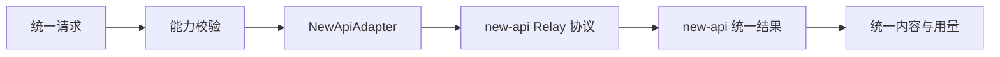

## 供应商与模型

> 设计状态：D-02 已校准。供应商、账号、API Key、端点、渠道模型映射和渠道价格归 new-api；LeetModel 只维护业务逻辑模型、能力档案、执行配置版本和 new-api 模型名绑定。本文其余渠道资源池内容作为历史分析保留，不再作为 LeetModel 实现依据。

### 当前职责

AI 网关将业务能力、逻辑模型能力和 new-api 协议分离。新增供应商和渠道只修改 new-api；LeetModel 只有在新增业务逻辑模型或能力约束时才更新绑定和能力档案。

### 供应商范围归属

供应商地域、网络、账号和渠道准入由 new-api 管理员配置负责。LeetModel 不因协议兼容性自行启用国内或国外渠道，只调用 Relay Token 白名单允许的模型名。

当前供应商接入遵循以下范围：

- 只考虑国内大模型供应商以及能够从国内服务器直接、稳定访问的官方服务。
- 不通过网络代理接入国外大模型供应商，当前也不设计代理节点、代理切换、代理健康检查和代理故障恢复。
- 不通过非官方中转站绕过国外供应商的网络访问条件。
- 协议层仍然保持供应商无关。支持 `openai-completions`、`openai-responses` 或 `anthropic-messages` 等协议，只表示能够适配相应请求结构，不表示当前要接入 OpenAI、Anthropic 等国外供应商。
- 如果以后确实需要接入国外供应商，应重新建立独立设计任务，评估网络、合规、数据安全、稳定性和运维成本后再调整当前范围。

### 0-1 当前取舍

- 供应商账号、API Key、端点、渠道协议和渠道价格只在 new-api 维护。
- LeetModel 通过静态配置维护逻辑模型、能力档案和 new-api 模型名绑定，后续再按版本契约演进。
- 正式调用使用业务任务已经锁定的精确模型，不根据成本、健康度或限流自动换模型。
- LeetModel 不建设多账号资源池或账号切换；对应能力由 new-api 提供。

### 领域对象

| 对象 | 表达的事实 |
|------|--------------|
| 供应商 | 一个外部 AI 服务平台及其协议、地域和账单边界 |
| 接入端点 | 供应商下可独立限流、鉴权和结算的调用入口 |
| 模型 | 供应商公布的精确模型标识和版本 |
| 能力档案 | 模型支持的输入、输出、上下文、工具和结构化约束 |
| 模型执行配置 | 工作流步骤绑定的精确模型、参数和版本快照 |
| 账号资源池 | 能够调用同一模型的一组账号与端点及其独立配额 |

供应商、账号、端点和模型是不同层次。同一供应商可以拥有多个独立鉴权、配额和账单边界的账号；这些账号可以共同提供同一精确模型的执行容量。同一模型被不同平台转售时，价格、限流、地域、模型版本真实性和返回用量可能不同，不能未经验证就视为可互换执行通道。

### 能力模型

能力使用可组合的能力项表达，不使用文本模型、视觉模型等互斥类型。一个模型可以同时具备多项能力。

| 能力组 | 能力项示例 |
|--------|------------|
| 输入模态 | 文本、图像、音频、视频、文件 |
| 输出模态 | 文本、图像、音频 |
| 生成方式 | 同步、流式、异步批处理 |
| 推理能力 | 普通生成、可选思考、强制思考 |
| 交互能力 | 工具调用、Json 输出、结构化输出、前缀续写 |
| 计费能力 | 输入、输出、缓存、推理、多模态和按次计费分项 |

能力项只表示是否支持。上下文长度、最大输出、图像数量、文件大小和支持格式属于能力限制。业务任务锁定精确模型后，网关检查该模型是否满足能力和限制；检查失败时返回明确错误，不选择另一模型代替。

模型维护不能只保存模型 ID。基础档案至少包含显示名称、启用状态、支持协议、输入与输出模态、JSON 输出、思考模式、工具调用、上下文长度、最大输出及模态限制。供应商官方模型目录不返回的能力不得默认为支持，应由维护者根据官方资料补充并保留核对依据和时间。

上下文窗口与文件限制是不同约束。上下文按输入加预留输出 Token 判断；文件和图片另行校验媒体类型、数量、单项大小和总体积。DeepSeek V4 官方服务当前采用 1M 上下文，网关模型档案按 `1,000,000` Token 配置；实验 Vision 模型仍需以其专属文档和真实调用确认图像折算及请求体限制。

### 统一契约与 new-api 适配

AI 网关内部使用统一请求和统一结果。当前只保留 `NewApiAdapter`，由它将统一契约映射到 new-api Relay 协议；供应商协议、鉴权和品牌差异由 new-api 处理。

统一协议保留输入内容的模态和顺序，支持文本、图像、音频、文件引用和工具结果等内容块。当模型不支持某项必需能力时，请求在调用前失败，不丢弃图像或自动改写业务输入。

不同模型的同名参数不一定同义。统一参数只保留温度、最大输出、停止条件、思考模式和结构化输出等稳定交集。供应商特有参数只能放在网关内部的受控扩展配置中，不进入 `common-ai` 公共契约。

### 历史资源池方案中的设计模式

> 本节仅保留早期自建供应商治理时的分析。路由、价格、渠道重试、限流和熔断现已归 new-api，不应在 LeetModel 内按此表重复实现。

| 模式 | 用途 |
|------|------|
| 策略模式 | 分离路由、价格评估、重试和降级策略 |
| 适配器模式 | 将统一协议转换为供应商协议 |
| 抽象工厂 | 按供应商创建调用、流式解析、用量解析和错误映射组件 |
| 模板方法 | 固定校验、记录、调用、解析和结算的主流程 |
| 规格模式 | 组合场景对模态、上下文、输出和合规的要求 |
| 责任链 | 按顺序执行参数校验、额度、限流、熔断和调用前保护 |

设计模式服务于变化点，不为每个类型建立一层空抽象。

### 历史配置与密钥设计

- 本节原供应商配置方案已被 new-api 取代。LeetModel 数据库只保存业务逻辑模型、能力、版本绑定和必要调用快照。
- Nacos 发布可动态刷新的运行快照和密钥引用，不作为历史事实源。
- 真实密钥通过运行环境或专用密钥服务注入，不进入数据库、Nacos 明文、代码仓库和日志。
- 每次业务任务或实验运行锁定一份不可变模型执行配置快照，动态刷新只影响后续新任务。
- 同一模型的多账号、多端点、配额和健康状态由 new-api 维护和调度；LeetModel 只派发已锁定的 new-api 模型名。

### new-api 账号与 API Key 运维边界

> 以下是 new-api 渠道运维的原则，不是 LeetModel AI 网关的账号池实现要求。

理想情况下，一个账号配置给 LeetModel 的 API Key 只由本项目使用，不与其他项目、临时脚本或人工调试共享。独占密钥可以降低归因和容量计算的不确定性，但仍不能默认供应商一定按单个 API Key 独立限流。

供应商可能按账号、组织、项目、模型、接入端点或多个维度的组合计算总配额。同一账号下的另一个 API Key，甚至供应商控制台中的测试请求，都可能占用与本项目相同的并发、RPM、TPM 或费用额度。

new-api 只能准确统计经它发出的请求，无法观察同一供应商配额主体在其他位置的实时消耗。因此，渠道并发数没有超过配置上限，不代表供应商一定接受请求。供应商返回的限流响应是实际可用容量的最终事实。

设计上遵循以下原则：

- API Key 和账号最好由本项目独占，并在配置说明中明确禁止混用。
- 本地上限使用保守值并预留安全余量，不把供应商公布的理论上限全部分配给本项目。
- 无法独占账号时，配置中标明配额可能被外部共享，并允许人工设置本项目可使用的保留比例或硬上限。
- 遇到供应商限流时，即使本地计数未超限，也按真实限流处理，降低当前账号的可用容量并执行退避。
- 监控同时展示本地在途量与供应商限流次数，避免将外部共享消耗误判成本项目并发控制失效。
- 供应商后续恢复容量时应缓慢放量，不在一次成功后立即恢复到理论上限。

供应商通用字段和固定协议集合见 [11-供应商协议.md](11-供应商协议.md)。供应商品牌与 API 协议必须分离，不能继续用一个供应商枚举隐含端点结构。

### 关键取舍

| 决策 | 结论与原因 |
|------|--------------|
| 能力组合优于继承树 | 多模态、思考、工具和流式能力会交叉组合，单继承树无法稳定表达 |
| 统一稳定交集 | 避免将一个供应商的特有字段变成全项目契约 |
| 不自动降质输入 | 丢弃模态会改变业务语义，必须由业务工作流明确选择降级方案 |
| 当前只接入国内供应商 | 国内部署环境接入国外供应商需要网络代理，当前先围绕国内官方服务完善完整治理能力，不引入代理运行复杂度 |
