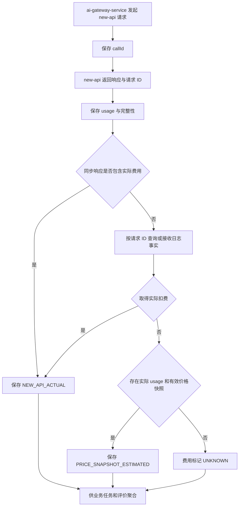

## 价格与计量

> 设计状态：D-02 已重划。new-api 拥有渠道价格、quota、实际扣费、余额和渠道账单事实；LeetModel 只保存可关联业务任务的调用用量、费用快照、来源和完整性。旧版由 LeetModel 维护每个供应商静态定价、汇率和渠道尝试的方案已被取代。

### 设计目标

让 LeetModel 能回答某个业务任务、评价实验或逻辑 AI 调用消耗了多少 Token、时间和费用，同时不复制 new-api 的渠道计费系统。

### 数据所有权

| 事实 | 所有者 | LeetModel 是否保存 |
|------|--------|--------------------|
| 渠道价格和计费规则 | new-api | 不保存为渠道配置 |
| 渠道账号余额与额度 | new-api | 不保存 |
| 渠道尝试及其 quota | new-api | 只通过请求 ID 关联必要结果 |
| 业务调用上下文 | `ai-gateway-service` | 保存 |
| 调用 usage | `ai-gateway-service` | 保存 new-api 返回的快照 |
| 调用费用 | `ai-gateway-service` | 保存实际或估算快照及来源 |
| 业务任务汇总 | 对应业务服务或评价服务 | 通过关联调用聚合 |

### 用量字段

LeetModel 的统一用量允许表达：

- 输入 Token。
- 输出 Token。
- 推理 Token。
- 缓存命中和缓存创建 Token。
- 总 Token。
- 完整、部分和未知状态。

当前 `AiUsage` 契约分别保存 `inputTokens`、`outputTokens`、`reasoningTokens`、`cacheHitTokens`、`cacheCreationTokens`、`cacheMissTokens` 和 `totalTokens`。不同上游只返回其真实支持的分项：例如缓存创建不能写入缓存未命中字段。`AiMetricCompleteness` 使用 `COMPLETE`、`PARTIAL`、`UNKNOWN`，显式零仍是已知事实，不能与 null 互换。

同步归一化只复制响应实际提供的字段。核心输入、输出和总 Token 均存在时为 COMPLETE；至少一个字段存在但核心字段不全时为 PARTIAL；usage 整体缺失或所有字段缺失时为 UNKNOWN。缓存未命中不会用“输入减缓存命中”补算，避免把协议假设伪装成上游事实。

字段缺失与明确返回零是不同语义。LeetModel 不根据字符数反推官方 Token，也不把未知写成零。供应商分项语义由 new-api 归一化后再进入 LeetModel 契约。

### 费用来源

| 来源 | 含义 | 优先级 |
|------|------|--------|
| `NEW_API_ACTUAL` | 通过 new-api 请求 ID 关联到实际 quota 或扣费 | 最高 |
| `PRICE_SNAPSHOT_ESTIMATED` | 实际扣费不可得，使用实际 usage 与已确认价格快照估算 | 次级 |
| `UNKNOWN` | 无法取得实际扣费，也没有足够信息估算 | 最低 |

实际扣费和估算费用必须分别标记，不能用估算值覆盖后续补全的实际值。金额使用十进制类型并保存币种；跨币种比较只有在评价口径明确提供可复算的汇率快照时才进行。

公共契约使用 `AiCost(BigDecimal amount, ISO-4217 currency, source, priceSnapshotVersion, completeness)`。`PRICE_SNAPSHOT_ESTIMATED` 必须携带不可变快照版本；`UNKNOWN` 必须保持金额、币种和快照为空，不能写零金额。同步 Chat 响应没有费用事实时允许 cost 为空，审计层会将其规范化为 UNKNOWN。

价格快照用于 LeetModel 的业务分析，不成为 new-api 渠道配置。快照来源、核对时间、计价单位和适用模型必须可追溯。

### 完整性

| 状态 | 含义 |
|------|------|
| `COMPLETE` | 费用或用量的必需字段完整 |
| `PARTIAL` | 只取得部分分项或已知费用小计 |
| `UNKNOWN` | 没有足够事实形成数值 |

用量完整性与费用完整性分开记录。new-api 可能返回完整扣费但缺少分项 Token，也可能返回 Token 而实际扣费需要异步补全。

### 处理流程

费用补全必须幂等。重复查询同一 new-api 请求 ID 不得重复累计；new-api 日志不可用不能改变已经成功的业务调用结果。

### S2 补全方案决策

S1 黑盒核验确认 Chat response body `id` 与 Token 日志 `request_id` 不是同一标识，当前版本也没有核验到可稳定回传日志请求 ID 的响应字段。因此 S2 不通过时间、模型、Token 数或用户名模糊匹配日志，避免错配实际费用；`NEW_API_ACTUAL` 保留为未来取得可靠关联键后的最高优先级来源。

当前实现选择本地不可变价格快照估算：

1. 新成功调用以 `PENDING/UNKNOWN` 入库，业务响应不等待费用。
2. 定时补全器只读取 COMPLETE usage 和精确模型对应的已发布快照。
3. 输入、输出、缓存命中和缓存创建分别按每百万 Token Decimal 单价计算；任何实际出现的分项缺少价格时不估算。
4. 条件更新只允许把 `cost_source=UNKNOWN` 改为 `PRICE_SNAPSHOT_ESTIMATED`，写绝对金额而非累计金额；重复执行不能重复计费，也不能覆盖未来实际费用。
5. 缺 usage、缺快照或快照不完整时按配置有界重试，达到上限后标为 `FINAL_UNKNOWN`。新增快照后如需重开历史补全，必须走显式运维动作，不由定时任务无限扫描。
6. 补全批次或数据库失败只记录低敏错误类型，不能改变已经成功的模型业务结果。

默认不内置未经核验的模型价格，因此 `snapshots` 为空。配置快照时必须包含稳定版本、ISO 货币、输入/输出价格；调用实际存在缓存命中或创建 Token 时还必须配置对应价格。该快照只服务 LeetModel 业务估算，不成为 new-api 渠道定价主数据。

### 重试与费用

new-api 内部渠道重试可能产生多次渠道消耗，这些尝试由 new-api 汇总和记录。LeetModel 不重建渠道尝试表，只保存一次 new-api 请求对应的最终实际扣费或明确的不完整状态。

`ai-gateway-service` 不对结果未知的请求透明重试。业务服务确需再次执行时创建新的逻辑调用和 `callId`，两次调用分别计量，避免把重复费用隐藏在同一记录中。

### 查询与展示

管理查询至少支持按 `callId`、业务任务、评价任务、功能、操作、模型执行配置、状态和时间范围筛选，并展示：

- usage 分项及完整性。
- 实际或估算费用、币种和来源。
- 排队、执行和总耗时。
- LeetModel `callId` 与 new-api 请求 ID。

`admin-service` 只转发和聚合，不保存计量事实。渠道余额、渠道价格和渠道健康使用 new-api 管理能力，不在 LeetModel 管理端复制。

S2 已在原有 `/internal/ai/calls`、`/internal/ai/calls/stats` 及对应管理员代理上增加上述过滤条件，没有新建重复接口。明细 DTO 返回业务上下文、两类请求 ID、usage、费用和分段耗时；统计接口复用同一过滤条件，分别统计实际、估算和未知费用数量。只有筛选结果中的已知费用币种唯一时才返回金额合计，否则金额与币种为空，禁止跨币种直接相加。管理员代理继续使用原有角色鉴权。

### 异常规则

- new-api 请求 ID 缺失时保留调用事实，费用标记未知。
- usage 缺失不影响内容调用成功，但必须记录完整性。
- 费用补全失败按上限重试，最终未知，不阻塞业务。
- 读取超时时保留结果未知和重复计费风险，不用本地估算冒充实际扣费。
- 审计写入失败不得让调用方自动重放已经成功的模型请求。
- 日志、指标和管理查询不得包含 Prompt、回答、论文、知识片段、Relay Token 或供应商密钥。

### 明确不做

- 不维护供应商渠道价格发布、余额、资源包、优惠和账单对账。
- 不从 new-api 同步整套渠道配置成为 LeetModel 主数据。
- 不用费用值替代质量、正确性或版本选择指数。
- 不因费用缺失把未知视为零。
