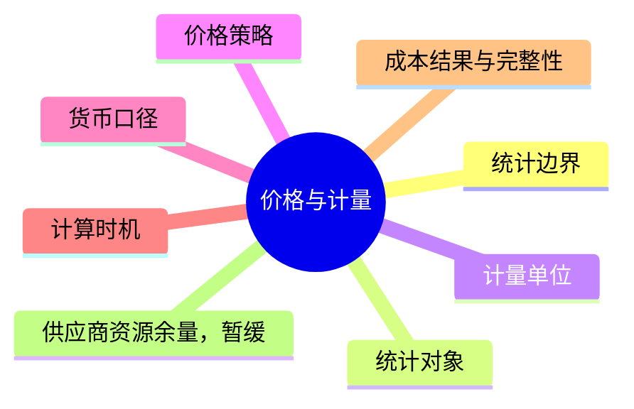

## 价格与计量

> 设计状态：0-1 保留运行时计量。每个供应商必须维护静态定价，供应商接口直接返回本次实际花费时以接口返回为准。默认使用人民币汇总，美元按固定汇率换算。不做账单对账、优惠折扣和项目侧成本上限。余额与 Token 余量查询的设计继续保留，但暂缓实现。

### 一、总体概览

价格与计量不是简单记录一个 Token 总数。总体上需要先考虑统计边界、统计对象、计量单位、价格策略、货币口径、计算时机、结果完整性和供应商资源余量，再分别确定每个方面的处理方式。



各方面的当前结论如下：

| 考虑方面 | 当前结论 |
|----------|----------|
| 统计边界 | 只做运行时计量，不追踪供应商最终实扣账单 |
| 最小统计对象 | 一次供应商尝试，而不是只记录最终成功的逻辑调用 |
| 计量单位 | 按供应商实际返回的输入、缓存、输出、推理、多模态和按次用量分项记录 |
| 定价策略 | 每个供应商必须维护自己的完整静态定价策略，当前不考虑运行时更新 |
| 默认货币 | 默认按人民币汇总；美元使用固定美元兑人民币汇率换算 |
| 调用前 | 可以根据本地输入 Token 数计算预计输入成本，只作参考 |
| 调用后 | 接口直接返回实际金额时以接口为准；否则按实际用量和静态定价计算 |
| 成本来源 | 明确区分供应商直接返回、根据实际用量计算和调用前估算 |
| 重试与切换账号 | 每次尝试单独计量，最后汇总为逻辑调用成本 |
| 数据缺失 | 区分 `COMPLETE`、`INCOMPLETE` 和 `UNKNOWN`，不能把未知记成零 |
| 成本控制 | 当前不设置成本预算和上限，计量结果不阻断调用 |
| 供应商资源余量 | 设计保留但暂缓实现；未来支持时允许为空，不参与单次调用成本计算 |

### 二、统计对象与层次

价格与计量分成三个层次：

| 层次 | 表达的事实 | 计算方式 |
|------|------------|----------|
| 计量分项 | 一类具体用量，例如标准输入 Token | 供应商未返回金额时，分项用量乘以对应分项单价 |
| 供应商尝试 | 一次真正发送给外部 AI 供应商的请求 | 接口金额优先，否则汇总按实际用量计算的分项成本 |
| 逻辑 AI 调用 | 业务工作流发起的一次原子 AI 调用 | 汇总该调用下的全部供应商尝试 |

一次逻辑调用可能只产生一次供应商尝试，也可能因为同模型重试或切换账号产生多次尝试。失败和超时的尝试也可能已经被供应商计量，因此不能只记录最终成功请求的成本。

业务工作流中的“大任务”不直接作为网关价格计算单位。大任务的总成本由业务服务根据其关联的多个逻辑 AI 调用进一步汇总。

### 三、计量单位

不同供应商和模型的计费方式并不完全相同，系统使用可扩展的计量分项表达用量：

| 计量分项 | 常用单位 | 说明 |
|----------|----------|------|
| 标准输入 | Token | 未被供应商归入其他输入分项的普通输入 |
| 缓存命中输入 | Token | 供应商明确报告的缓存命中输入 |
| 缓存创建输入 | Token | 供应商明确报告的缓存写入或创建用量 |
| 标准输出 | Token | 普通模型输出；是否包含推理由供应商返回语义决定 |
| 推理输出 | Token | 供应商单独报告的推理或思考用量 |
| 多模态用量 | 供应商定义单位 | 图像、音频、视频等可能按 Token、秒、张或其他单位计量 |
| 按次用量 | 次 | 搜索、图像生成等按调用次数收费的能力 |

用量处理遵循以下规则：

- 供应商响应用量是调用后计量的主要事实来源。
- 供应商没有返回某分项，与明确返回该分项为零是不同语义。
- 供应商把推理 Token 包含在输出 Token 中时，只记录标准输出，不再次累加推理输出。
- 只有供应商将推理 Token 单独列出并单独计价时，才作为独立分项计算。
- 本地 Tokenizer 只用于调用前估算、上下文长度校验、Token 速率控制和异常检测，不修改供应商返回的最终用量。

### 四、货币与汇率

#### 默认统计货币

系统默认使用人民币 `CNY` 进行查询、汇总和展示，同时保留供应商定价及成本的原始币种。每次供应商尝试至少保留：

- 原币币种。
- 原币成本及其来源。
- 换算后的人民币成本。
- 本次换算使用的固定汇率快照。

这样既能统一统计，又能在出现计算问题时回到供应商原币复算。

#### 人民币与美元换算

当前只考虑人民币和美元两种价格：

```text
供应商价格为人民币：人民币成本 = 原币成本
供应商价格为美元：人民币成本 = 美元成本 × 固定美元兑人民币汇率
```

美元兑人民币汇率由系统人工配置为一个固定值，不接入实时外汇行情，也不追踪银行结售汇价格。汇率配置包含数值、生效时间和配置说明。

每次供应商尝试开始时锁定汇率快照。以后调整固定汇率，只影响调整后开始的新尝试，不改写历史成本。供应商直接返回美元花费时，也使用本次锁定的固定汇率换算成人民币。当前出现人民币和美元以外的价格币种时，不自动猜测换算关系，应阻止该供应商配置启用或将人民币成本标记为 `UNKNOWN`。

### 五、供应商静态定价策略

#### 每个供应商都必须维护

所有接入 AI 网关的供应商都必须维护自己的定价策略，这是供应商能够被启用的必要配置。即使供应商接口可以直接返回每次调用的实际花费，也不能省略定价策略，因为它仍然用于：

- 调用前估算预计输入成本。
- 向使用者解释输入、缓存、输出等不同用量如何定价。
- 在供应商没有返回实际金额时，根据实际用量计算运行时成本。
- 在供应商返回实际金额时，提供一个可比较的参考计算值，帮助发现明显异常。

供应商定价策略必须覆盖该供应商已启用模型可能产生的全部计量分项。缺少必要定价的供应商、模型或能力不能进入可用状态，不能等到真实调用后才发现无法计算。

#### 当前使用静态定价

当前不设计定价策略的新增版本、生效区间、定时切换、管理端修改或运行时热更新。每个供应商使用一份随当前系统配置发布的静态定价策略。

如果供应商以后调整官方价格，需要作为一次明确的配置修改重新确认；具体更新机制留到未来单独设计。当前调用记录仍保存实际使用的静态单价快照，避免只能依赖后来可能已经变化的外部页面复算。

一条静态价格配置至少包含：

- 供应商和接入端点。
- 精确模型标识。
- 计量分项。
- 单价和计价单位数量，例如每 `1,000,000` Token 的价格。
- 原始币种，当前支持 `CNY` 或 `USD`。
- 价格来源和人工核对时间，用来说明静态配置依据。

常见价格策略如下：

| 用量情况 | 应使用的价格 |
|----------|--------------|
| 普通输入 Token | 标准输入单价 |
| 缓存命中输入 Token | 供应商公开的缓存命中单价 |
| 缓存创建输入 Token | 供应商公开的缓存创建单价 |
| 普通输出 Token | 标准输出单价 |
| 单独计价的推理 Token | 推理输出单价 |
| 图像、音频、视频 | 对应模态及单位的标准单价 |
| 搜索、图像生成等按次能力 | 每次调用的标准单价 |

缓存命中价格如果是供应商公开列出的独立计费分项，就属于基础价格结构，不视为本系统额外处理的优惠或折扣。

同一供应商端点、同一精确模型和同一计量分项必须且只能存在一个启用的静态价格。调用开始时把本次所需静态单价复制到价格快照中，后续计算只读取快照。

### 六、成本计算口径

成本值必须同时记录“数值”和“来源”。当前使用三个来源：

| 成本来源 | 含义 | 是否作为本次运行时花费 |
|----------|------|------------------------|
| `PRICE_ESTIMATED` | 调用前根据本地预计用量和静态定价得到的参考值 | 否 |
| `PROVIDER_REPORTED` | 供应商接口明确返回本次调用的金额和币种 | 是，优先级最高 |
| `USAGE_CALCULATED` | 供应商没有返回金额，根据其实际用量和静态定价计算 | 是，作为无直接金额时的运行时花费 |

这里的“供应商直接返回实际花费”必须是接口明确返回了可识别的金额、币种和本次调用归属。接口只返回输入 Token、输出 Token 等用量，不属于直接返回花费。

#### 调用前的预计输入成本

业务请求到达 AI 网关后，可以使用本地 Tokenizer 得到预计输入 Token 数，并按照已经锁定的价格快照计算预计输入成本：

```text
预计输入成本 = 本地预计输入 Token 数 ÷ 计价单位数量 × 输入单价
```

调用前通常还不知道供应商最终认定的缓存命中量，因此默认按标准输入单价估算。只有在调用前能够可靠确定缓存分项用量时，才分别使用标准输入和缓存命中价格计算。

预计输入成本的来源标记为 `PRICE_ESTIMATED`，只用于界面提示、运行观察和后续比较，不是供应商实际用量，也不是最终运行时花费。当前不使用它做成本准入、成本封顶或模型切换。

由于实际输出长度在调用前未知，当前不计算“预计总成本”。如果使用最大输出 Token 计算，只能得到理论上限，容易被误解为实际预计花费，因此暂不纳入首版口径。

#### 接口直接返回实际花费

如果供应商接口直接返回本次调用的实际金额和币种，本次供应商尝试的运行时花费以接口返回值为准，成本来源记录为 `PROVIDER_REPORTED`：

```text
尝试原币成本 = 供应商接口返回的实际金额
尝试人民币成本 = 尝试原币成本 × 本次固定汇率快照
```

此时，静态定价策略计算出的金额只是参考值，不能覆盖供应商返回值。系统可以同时保留“静态价格参考成本”和“供应商返回实际花费”，但不把两者差异扩展为账单对账功能。

#### 接口只返回实际用量

多数供应商接口返回输入 Token、输出 Token、缓存 Token 等实际用量，而不直接返回人民币或美元金额。此时 AI 网关根据供应商实际用量和本次尝试锁定的静态价格快照计算运行时花费，成本来源记录为 `USAGE_CALCULATED`：

```text
分项原币成本 = 供应商返回的分项用量 ÷ 计价单位数量 × 分项单价
尝试原币成本 = 所有分项原币成本之和
尝试人民币成本 = 尝试原币成本 × 本次固定汇率快照
逻辑调用人民币成本 = 该逻辑调用下所有尝试人民币成本之和
```

当价格本身是人民币时，固定汇率按 `1` 处理。所有金额使用十进制精确计算，分项计算过程不提前舍入，在单次供应商尝试合计时按统一精度舍入。

具体取值优先级固定为：

1. 供应商接口直接返回实际花费时，以接口返回值为准。
2. 接口没有返回实际花费、但返回了实际用量时，按实际用量和静态定价计算。
3. 两者都没有时，运行时花费为 `UNKNOWN`，不能使用调用前预计输入成本冒充实际花费。

### 七、完整处理流程

> 0-1 取舍：首版一次逻辑调用只执行一次非流式供应商尝试。图中的流式计量、同模型重试、账号切换和多次尝试汇总属于保留的复杂版本流程，不进入首版实现。

```mermaid
flowchart TD
    subgraph enable["供应商启用前：强制维护静态定价"]
        supplierConfig["配置供应商、模型和计量能力"] --> pricingComplete{"静态定价是否覆盖全部计量分项"}
        pricingComplete -->|"否"| rejectEnable["配置不完整，禁止启用"]
        pricingComplete -->|"是"| enableSupplier["供应商进入可用资源池"]
    end

    subgraph before["调用前：计算参考花费"]
        enableSupplier --> businessCall["业务服务发起逻辑 AI 调用"]
        businessCall --> logicalRecord["创建逻辑调用记录"]
        logicalRecord --> attemptRecord["创建供应商尝试记录"]
        attemptRecord --> startTime["记录尝试开始时间"]
        startTime --> lockSnapshot["锁定静态价格与固定汇率快照"]
        lockSnapshot --> estimateInput["使用本地 Token 数计算预计输入成本"]
    end

    subgraph during["调用中：采集供应商事实"]
        estimateInput --> providerCall["向外部供应商发送请求"]
        providerCall --> responseType{"调用结果类型"}
        responseType -->|"非流式完成"| finalFacts["读取最终用量和实际花费字段"]
        responseType -->|"流式调用"| waitFinal["等待最终计量帧"]
        responseType -->|"失败或超时"| failureFacts{"供应商是否返回计量事实"}
        waitFinal --> hasFinal{"是否收到最终计量帧"}
        hasFinal -->|"是"| finalFacts
        hasFinal -->|"否"| noFacts["没有完整计量事实"]
        failureFacts -->|"是"| finalFacts
        failureFacts -->|"否"| noFacts
    end

    subgraph after["调用后：确定单次尝试实际花费"]
        finalFacts --> rawFacts["保存供应商原始用量和金额"]
        rawFacts --> hasReportedCost{"接口是否直接返回有效金额和币种"}
        hasReportedCost -->|"是"| reportedCost["以接口金额为准，来源为 PROVIDER_REPORTED"]
        reportedCost --> reportedCny["按固定汇率快照换算人民币"]
        reportedCny --> completeCost["尝试成本状态为 COMPLETE"]
        hasReportedCost -->|"否"| hasUsage{"接口是否返回实际用量"}
        hasUsage -->|"是"| normalizeUsage["归一化为各计量分项"]
        hasUsage -->|"否"| unknownCost["尝试成本标记为 UNKNOWN"]
        normalizeUsage --> itemPrice{"实际用量分项是否都有静态价格"}
        itemPrice -->|"是"| calculateItems["逐分项计算原币成本"]
        calculateItems --> convertCny["按固定汇率快照换算人民币"]
        convertCny --> calculatedCost["成本来源为 USAGE_CALCULATED"]
        calculatedCost --> completeCost
        itemPrice -->|"否"| incompleteCost["保留已知小计并标记 INCOMPLETE"]
        noFacts --> unknownCost
        completeCost --> saveAttempt["保存本次尝试计量事实"]
        incompleteCost --> saveAttempt
        unknownCost --> saveAttempt
    end

    subgraph summary["调用结束：汇总全部尝试"]
        saveAttempt --> retryDecision{"是否同模型重试或切换账号"}
        retryDecision -->|"是"| attemptRecord
        retryDecision -->|"否"| aggregateCall["汇总逻辑调用下的全部尝试"]
        aggregateCall --> anyUnknown{"是否存在不完整或未知成本"}
        anyUnknown -->|"否"| completeTotal["得到完整逻辑调用成本"]
        anyUnknown -->|"是"| incompleteTotal["返回已知成本并标记汇总不完整"]
        completeTotal --> statistics["用于查询、统计和分析"]
        incompleteTotal --> statistics
        statistics --> noControl["不参与成本封顶、调用中断或跨模型路由"]
    end
```



这个流程中有三个不同的时间点：

1. **供应商启用前维护定价。** 定价策略是供应商的强制配置，缺少已启用计量分项的价格时不能进入可用资源池。
2. **供应商尝试开始时计算参考花费。** 在发送请求前锁定静态价格和固定汇率快照，根据本地输入 Token 数计算预计输入成本。
3. **供应商尝试结束后确定实际花费。** 接口直接返回金额时以返回值为准；没有返回金额时，才根据接口实际用量和静态定价计算。

同模型重试或切换账号会创建新的供应商尝试。新尝试重新记录开始时间，使用自己的价格和汇率快照，最后再与之前的失败或超时尝试一起汇总。

### 八、完整性状态

| 状态 | 含义 | 示例 |
|------|------|------|
| `COMPLETE` | 接口返回了有效实际金额，或者实际用量可以通过完整静态定价计算 | 接口直接返回美元金额和币种，成功换算成人民币 |
| `INCOMPLETE` | 没有接口实际金额，实际用量只能计算出部分花费 | 供应商意外返回了静态定价未覆盖的新计量分项 |
| `UNKNOWN` | 既没有有效实际金额，也没有足够用量完成计算 | 流式连接中断且没有最终计量帧 |

一个逻辑调用只要包含 `INCOMPLETE` 或 `UNKNOWN` 的供应商尝试，就可以展示已知人民币成本小计，但必须同时标明汇总不完整，不能把缺失部分当成零。

用量完整性和成本完整性应分别记录。供应商可能直接返回完整金额但不返回详细 Token 分项，此时成本可以是 `COMPLETE`，用量仍然可以是 `UNKNOWN`。

### 九、异常与特殊场景

- **失败尝试：**接口返回实际金额时以金额为准；否则只要返回了实际用量，就按静态定价计算。
- **读取超时：**供应商可能已经完成生成；没有实际金额和最终用量时标记未知，不能根据已收到字符数反推官方 Token。
- **流式调用：**只使用供应商最终计量帧，中间内容帧不重复累加。
- **账号切换：**不同账号或端点可能使用不同价格币种，每次尝试分别换算成人民币后再汇总。
- **调用期间修改汇率：**继续使用尝试开始时锁定的固定汇率快照。
- **供应商直接返回金额：**将返回金额和币种作为本次实际花费，静态定价结果只作参考。
- **供应商只返回 Token：**Token 是实际用量而不是直接花费，必须通过该供应商的静态定价换算。

当前只监控计量链路是否可靠：

- 供应商未返回预期用量。
- 用量解析失败或长期异常为零。
- 供应商启用时静态定价不完整或同一分项配置多条价格。
- 静态价格快照与实际计量分项不匹配。
- 供应商实际金额字段缺少币种或无法确认调用归属。
- 美元价格缺少有效固定汇率。
- 运行时成本为 `INCOMPLETE`、`UNKNOWN` 或逻辑调用汇总不完整。

### 十、供应商资源余量查询

> 0-1 取舍：本节设计暂缓实现，详细内容继续保留，不进入首版开发清单。

供应商余额、Token 余量和其他剩余资源属于账号当前资源状态，不是某一次模型调用产生的运行时成本。AI 网关可以在供应商提供查询接口时支持该能力，但不能假设所有供应商都能返回相同数据。

统一查询结果中的余额、币种、Token 余量和其他供应商特有余量字段必须允许为空。设计时需要区分供应商不支持查询、查询请求失败、当前密钥无权限以及供应商成功响应但没有返回某个字段，不能统一使用数值零表示。

资源余量查询不进入每次模型调用的必经链路。查询失败不能直接阻断正常调用，也不能因为余额或 Token 余量为空就认定账号不可用。当前查询结果只用于管理观察，不用于成本封顶、余额控制或账单对账。

具体的能力声明、归一化结果、缓存和管理查询方式留在 [17-供应商资源余量.md](17-供应商资源余量.md) 中逐项设计。

### 十一、明确不做

当前阶段不设计和实现以下能力：

- 导入供应商账单并逐笔或聚合对账。
- 供应商月度账单、最终财务结算，以及把余额查询扩展为本项目财务账本。
- 优惠、折扣、资源包、免费额度、赠送余额、税费和账单舍入。
- 定价策略版本、生效区间、定时切换、管理端修改和运行时热更新。
- 实时外汇行情、银行结售汇价格和财务汇兑损益。
- 成本预算、成本上限、余额控制和超支阻断。

如果未来确实需要财务核算或成本控制，应作为独立设计任务重新分析，不能在当前运行时计量模型中逐步夹带实现。

### 十二、关键取舍

| 决策 | 结论与原因 |
|------|------------|
| 每个供应商强制维护静态定价 | 定价是接入完整性的一部分，同时支撑预估和无直接金额时的计算 |
| 当前不更新定价策略 | 先完成静态计量闭环，不引入版本发布和热更新复杂度 |
| 供应商实际金额优先 | 接口明确返回本次金额和币种时，它比静态价格计算结果更接近实际花费 |
| 实际用量作为第二计算来源 | 接口不返回金额时，使用供应商实际用量乘以该供应商静态定价 |
| 区分预计花费与运行时花费 | 调用前估算只用于参考，不能覆盖供应商返回或实际用量计算结果 |
| 默认使用人民币汇总 | 便于项目统一展示和跨供应商比较，同时保留供应商原币事实 |
| 美元使用固定汇率 | 避免引入实时外汇系统复杂度，并通过汇率快照保证历史可复算 |
| 静态定价只使用标准价格 | 不处理优惠和折扣，计算规则简单且可解释 |
| 每次供应商尝试独立计量 | 失败、超时、重试和账号切换都可能产生实际用量 |
| 未知不能记为零 | 防止用量、价格或汇率缺失被误认为没有产生费用 |
| 暂不设置成本上限 | 当前成本只用于观察和分析，不参与准入、路由或中断决策 |
| 资源余量允许为空 | 并非所有供应商都提供余额或 Token 余量接口，空值不能被伪装成零，也不能直接认定账号不可用 |
