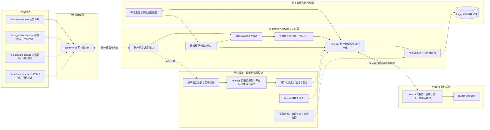

# AI 网关服务

> AI 网关是业务服务访问 new-api 和外部 AI 能力的唯一内部出口。

> D-02 已确认两层网关边界：本服务保留内部契约、业务上下文、逻辑模型绑定、业务调度、统一错误和业务调用审计；new-api 唯一负责供应商密钥、渠道模型映射、渠道选择、渠道重试、额度和渠道健康。S1 已把默认文本与多模态路由切换为 new-api，并删除旧官方直连。完整边界见 [`new-api第三方网关集成.md`](../../02-架构设计/new-api第三方网关集成.md)，本地协议证据见 [`new-api黑盒核验.md`](new-api黑盒核验.md)。

`ai-gateway-service` 是 AI 能力的统一内部调用入口。默认链路通过 new-api 的 OpenAI 兼容接口调用已批准模型，业务服务与本服务都不选择供应商渠道。

> 分层定位：AI 调用治理层。当前职责边界是后续逐项梳理的起点；已实现能力与目标能力需要分别核对，尚未确认的细节不得直接视为最终设计。

> 供应商范围、地域、账号和实际渠道由 new-api 管理。LeetModel 只使用管理员在 new-api 中批准并映射的模型名，不自行接入或治理供应商渠道。

> 当前实施原则：先完成 new-api 同步调用和最小业务审计，再实现 LeetModel 业务优先级调度。当前代码没有旧文档所称的单实例并发保护。

## 整体结构与工作流程

下图先展示 0-1 首版的实际主链路，再使用虚线保留未来复杂版本的扩展方向。它只表达宏观职责与主要关系，不展开接口字段、算法和表结构。



宏观调用关系如下：

1. AI 业务服务拥有 Prompt、工作流和业务结果，通过进程内的 `common-ai` 客户端向 AI 网关发送统一请求。
2. AI 网关根据业务任务已经锁定的精确模型和参数校验模型能力，不在运行时重新选择模型。
3. AI 网关按照逻辑模型绑定调用 new-api，不选择实际供应商渠道。
4. new-api 持有 Relay Token 对应的模型白名单，并独占供应商密钥、渠道选择和渠道级重试。
5. AI 网关归一化结果与错误，关联 LeetModel `callId` 和 new-api 请求 ID，并保存业务调用事实。

图中实线表示 0-1 首版主链路，虚线表示已经保留但暂缓实施的复杂版本。业务服务仍然可以异步消费自己的业务大任务，但 AI 网关首版不再建立第二层原子任务队列。`common-ai` 是调用方进程内的公共 Jar，不是独立微服务。

## 0-1 首版范围

### 首版保留

- new-api OpenAI 兼容接口的统一同步调用。
- 业务任务锁定精确模型和参数，网关执行能力校验且不跨模型切换。
- LeetModel 逻辑模型到 new-api 模型名的固定绑定与能力校验。
- new-api 连接超时和读取超时，以及清晰的结果未知表达。
- 当前评审需要的文本和图片输入。PDF 解析和页面处理仍由 `ai-review-service` 负责。
- new-api 响应、用量和常见错误的统一适配。
- 最小调用记录，包括业务关联标识、供应商、模型、状态、Token、耗时、错误和运行时花费。
- 实际扣费优先、价格快照估算次之的费用来源与完整性表达。
- Relay Token 通过环境变量注入，普通日志不记录密钥、Prompt 和完整模型输出。
- 覆盖同步调用主链和主要错误的必要测试。

### 暂缓但保留设计

以下能力不进入 0-1 首版开发。对应编号文档和已有分析全部保留，未来只有在出现真实需求、单实例容量不足或用户重新确认后才恢复设计与实现：

- AI 网关原子调用任务、持久化任务队列、优先级和公平调度。
- 多实例业务调度、复杂租约和崩溃接管。
- 流式调用，以及音频、视频、完整 PDF 和通用文件输入。
- Prometheus AI 专项指标、告警、完整 Trace 和聚合统计。
- new-api 渠道详情、余额和 Token 余量的重复管理页面。
- 管理查询、在线配置、Nacos 动态刷新、密钥在线轮换和管理端操作审计。
- 为上述复杂能力建立的任务、尝试、资源池、健康历史和统计聚合数据表。

暂缓不等于否定。恢复某项能力时，应先阅读其保留文档，结合当时的真实瓶颈重新确认范围，不直接把旧占位内容当成最终实现方案。

## 职责边界

### 负责

- 统一接入 new-api 并屏蔽外部协议差异。
- 维护内部逻辑模型、能力档案和 new-api 模型名绑定。
- 安全读取 Relay Token，防止其进入业务服务和日志。
- 执行业务优先级、公平调度、deadline 和背压。
- 记录单次模型调用、Token、静态价格快照、成本来源、花费、耗时和失败原因。
- 向业务服务返回统一内容、用量和错误。
- 透传并校验统一工具协议，将工具定义、工具调用和工具结果映射到已支持的供应商协议。

### 不负责

- 不定义论文评审、稳定性实验、改进建议或题目推荐的业务 Prompt。
- 不编排业务工作流，不解释业务结果。
- 不判断 AI 业务结果是否正确，不定义质量指标。
- 不保存论文、评审结果、对话或其他完整业务内容。
- 不注册或执行业务工具，不理解工具参数和工具结果语义。
- 不保存供应商 API Key，不选择或管理供应商渠道、账号和端点。
- 不复制 new-api 的渠道重试、渠道限流、额度、熔断、健康和渠道计费。

## 数据与协作边界

AI 网关独占 `lm_ai` 数据库，只持久化业务调用追溯、调度和计量所需的事实。供应商、账号、渠道、端点和供应商密钥属于 new-api。业务服务通过 `common-ai` 传递已锁定的模型执行配置、业务上下文、Prompt 和必要追踪信息。

每次业务任务或实验运行必须提前锁定工作流步骤使用的逻辑模型与参数。AI 网关验证绑定并映射到 new-api 模型名；new-api 在不改变该模型名语义的前提下选择实际渠道。

`common-ai` 只是调用方进程内的公共客户端 Jar；ai-gateway-service 是独立运行并访问 new-api 的服务。两者的详细对比见 [common-ai README](../common/common-ai/README.md)。

## 功能清单

| 功能 | 0-1 处理方式 | 阶段 |
|------|--------------|------|
| 逻辑模型与能力 | 维护逻辑模型、能力档案和 new-api 模型名绑定 | 目标设计 |
| 模型绑定执行 | 执行业务任务锁定的精确模型与参数，不跨模型切换 | 首版保留 |
| 统一 AI 调用 | 只实现供应商无关的同步请求与响应 | 首版保留 |
| 工具协议透传 | 校验模型工具能力并映射 new-api OpenAI 兼容工具字段 | S11-01 已实现 |
| 输入能力 | 只支持文本和当前评审需要的图片输入 | 首版简化 |
| 渠道治理 | 供应商账号、密钥、端点、重试、额度和健康统一交给 new-api | 外部基础设施 |
| 业务调度 | 业务优先级、公平调度、deadline 和背压 | S5 待实现 |
| 稳定性 | 归一化 new-api 超时和错误，不复制渠道重试与熔断 | 目标设计 |
| 调用记录 | 保存运行追溯和计量所需的最小字段 | 首版简化 |
| 价格与成本 | new-api 实际扣费优先，价格快照估算次之，未知不记零 | S2 待实现 |
| 配置与密钥 | 静态逻辑绑定加环境变量注入 Relay Token | S1 已实现 |
| 原子任务与队列 | 网关内部任务、优先级、公平调度和故障接管 | 暂缓 |
| 多账号资源池 | 由 new-api 提供，LeetModel 不重复建设 | 已重划 |
| 分布式业务调度 | 多实例任务领取、租约和崩溃恢复 | 暂缓 |
| 流式与通用多模态 | 流式、音频、视频、完整 PDF 和通用文件 | 暂缓 |
| 资源与管理能力 | 余额、Token 余量、管理查询、统计和告警 | 暂缓 |
| 动态运行配置 | Nacos 动态刷新、在线配置和密钥轮换 | 暂缓 |

## 文档索引

编号按照宏观执行流程组织。先阅读调用总览，再从请求入口依次进入模型校验、任务调度、资源治理、供应商执行、结果记录和管理观察；跨流程的配置、安全、数据模型和验证文档放在主链路之后。

本目录的复杂设计文档仍然保留。标记为“暂缓”的文档不进入 0-1 开发清单，只用于保存思路和未来恢复设计；标记为“首版简化”的文档只设计和实现其中明确列出的最小部分。

### 调用总览与入口

| 编号 | 文档 | 内容摘要 | 当前状态 |
|------|------|----------|----------|
| 01 | [统一调用与路由](01-统一调用与路由.md) | 固定模型前提下的调用主流程和职责衔接 | 0-1 主流程，复杂路由保留待后续 |
| 02 | [统一调用契约](02-统一调用契约.md) | 业务服务与网关之间的请求、响应、工具和错误契约 | Chat 与工具扩展已实现 |
| 03 | [供应商与模型](03-供应商与模型.md) | 逻辑模型、能力档案和 new-api 模型绑定 | new-api 边界已确认 |
| 04 | [模型执行配置与能力校验](04-模型执行配置与能力校验.md) | 工作流步骤模型绑定、不可变快照和能力验证 | 0-1 保留固定模型与必要校验 |

### 原子任务与资源调度

| 编号 | 文档 | 内容摘要 | 当前状态 |
|------|------|----------|----------|
| 05 | [原子调用任务](05-原子调用任务.md) | 业务大任务与网关原子调用任务的分层 | 暂缓，文档保留 |
| 06 | [任务队列与调度](06-任务队列与调度.md) | 优先级、公平调度、背压和任务消费 | 暂缓，文档保留 |
| 07 | [账号与端点资源池](07-账号与端点资源池.md) | 历史渠道资源池分析 | 已由 new-api 取代 |
| 08 | [限流与容量治理](08-限流与容量治理.md) | LeetModel 业务容量、背压和 new-api 反馈 | S5 待实现 |
| 09 | [熔断与健康评估](09-熔断与健康评估.md) | new-api 可达性与渠道健康边界 | 渠道治理由 new-api 负责 |
| 10 | [幂等、重试与故障恢复](10-幂等重试与故障恢复.md) | 逻辑调用幂等、结果未知和恢复 | 渠道级重试由 new-api 负责 |

### 供应商执行与结果治理

| 编号 | 文档 | 内容摘要 | 当前状态 |
|------|------|----------|----------|
| 11 | [供应商协议](11-供应商协议.md) | new-api OpenAI 兼容协议边界 | S1 已实现 Chat |
| 12 | [流式调用](12-流式调用.md) | 流式事件、连接控制、取消传播和最终计量 | 暂缓，文档保留 |
| 13 | [多模态输入](13-多模态输入.md) | 文本、图像、PDF 和文件输入的传递与校验 | 0-1 仅保留文本和图片 |
| 14 | [调用记录与状态](14-调用记录与状态.md) | 逻辑调用、供应商尝试和调用状态机 | 0-1 只保存最小调用记录 |
| 15 | [价格与计量](15-价格与计量.md) | new-api 实际扣费、估算和完整性 | S2 待实现 |
| 16 | [调用追踪与可观测性](16-调用追踪与可观测性.md) | 追踪链、日志、低基数指标和告警 | 暂缓，首版只保留必要日志 |

### 管理、运行支撑与落地

| 编号 | 文档 | 内容摘要 | 当前状态 |
|------|------|----------|----------|
| 17 | [供应商资源余量](17-供应商资源余量.md) | new-api 渠道资源边界 | LeetModel 不重复建设 |
| 18 | [管理查询](18-管理查询.md) | 调用、计量、健康和资源状态查询 | 暂缓，文档保留 |
| 19 | [配置与密钥](19-配置与密钥.md) | 逻辑绑定、Relay Token 和渠道密钥边界 | S1 已实现 |
| 20 | [安全与数据保护](20-安全与数据保护.md) | 内部身份、敏感数据、日志和出站访问保护 | 0-1 保留必要安全边界 |
| 21 | [数据模型](21-数据模型.md) | 拟议表、字段、约束、索引、关系和生命周期 | 0-1 只设计最小调用事实 |
| 22 | [测试与验收](22-测试与验收.md) | 契约、调度、稳定性、计量和故障场景验证 | 0-1 缩减为同步主链验收 |
| 23 | [参考项目横向对比](23-参考项目横向对比.md) | 可借鉴设计、不可照搬实现与演进边界 | 参考材料，不属于 0-1 功能 |
| 24 | [业务调用上下文](24-业务调用上下文.md) | 输入模态、业务来源编码与兼容迁移 | S2 落地 |

## 本地运行与密钥

目标链路开启真实 AI 调用时，`ai-gateway-service` 的运行环境必须提供 new-api Relay Token，业务服务的 AI 客户端也必须启用。Relay Token 的本地存储和加载方式不由项目文档约定。

```bash
export NEW_API_BASE_URL=http://127.0.0.1:3000/v1
export COMMON_AI_CLIENT_ENABLED=true
java -jar ai-gateway-service/target/ai-gateway-service-0.0.1-SNAPSHOT.jar
```

- 业务服务和 `ai-gateway-service` 均不持有供应商密钥；Relay Token 只由 AI 网关运行环境提供。
- `COMMON_AI_CLIENT_ENABLED=true` 覆盖 `application.yml` 中 `common.ai-client.enabled: false` 的默认值。
- 若未配置 Relay Token 或客户端未启用，评审/建议/客服/质量评价会明确返回不可用状态，属于预期边界。
- 建议任务生成较慢，`common-ai` 客户端默认读取超时已放宽到 5 分钟（可通过 `common.ai-client.read-timeout` 调整）。
