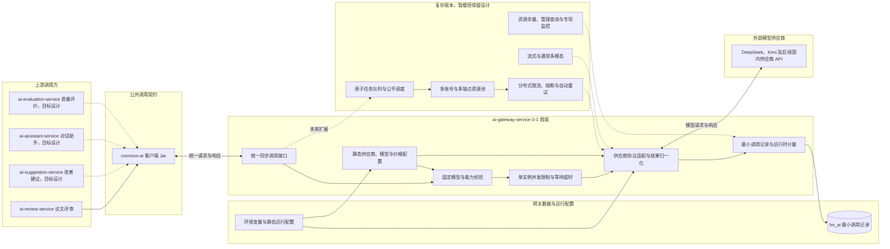

# AI 网关服务

> AI 网关是业务服务访问外部模型供应商的唯一出口。

`ai-gateway-service` 是 AI 能力的统一调用入口。当前代码模块已接入 DeepSeek 和 Kimi 官方 Chat Completions 接口以及模型列表接口。

> 分层定位：AI 调用治理层。当前职责边界是后续逐项梳理的起点；已实现能力与目标能力需要分别核对，尚未确认的细节不得直接视为最终设计。

> 当前供应商范围：服务器确定部署在国内，当前只接入国内大模型供应商的官方服务，不接入需要网络代理才能稳定访问的国外大模型供应商，也不设计网络代理和国外供应商运行治理。该限制属于当前阶段范围，不代表统一协议永久排斥国外模型。

> 当前实施原则：先完成单实例、同步调用、单账号和最小运行治理的 0-1 闭环。复杂能力继续保留设计文档，但明确标记为暂缓，不进入首版开发范围。

## 整体结构与工作流程

下图先展示 0-1 首版的实际主链路，再使用虚线保留未来复杂版本的扩展方向。它只表达宏观职责与主要关系，不展开接口字段、算法和表结构。



宏观调用关系如下：

1. AI 业务服务拥有 Prompt、工作流和业务结果，通过进程内的 `common-ai` 客户端向 AI 网关发送统一请求。
2. AI 网关根据业务任务已经锁定的精确模型和参数校验模型能力，不在运行时重新选择模型。
3. 首版在单个网关实例内使用简单并发限制保护供应商。达到上限时只允许有界等待，超时后返回系统繁忙。
4. 首版每个供应商只使用一个账号、一个 API Key 和一个官方端点，不自动重试或切换账号。
5. 供应商适配器完成同步调用后，网关归一化结果、用量和错误，并保存最小调用记录与运行时花费。

图中实线表示 0-1 首版主链路，虚线表示已经保留但暂缓实施的复杂版本。业务服务仍然可以异步消费自己的业务大任务，但 AI 网关首版不再建立第二层原子任务队列。`common-ai` 是调用方进程内的公共 Jar，不是独立微服务。

## 0-1 首版范围

### 首版保留

- 国内大模型供应商官方 API 的统一同步调用。
- 业务任务锁定精确模型和参数，网关执行能力校验且不跨模型切换。
- 每个供应商只配置一个账号、一个 API Key 和一个官方端点。
- 单实例本地并发限制、有界等待、连接超时和读取超时。
- 当前评审需要的文本和图片输入。PDF 解析和页面处理仍由 `ai-review-service` 负责。
- 供应商请求、响应、用量和常见错误的统一适配。
- 最小调用记录，包括业务关联标识、供应商、模型、状态、Token、耗时、错误和运行时花费。
- 每个供应商维护静态定价。供应商返回金额时以接口金额为准，否则按实际用量计算。
- API Key 通过环境变量注入，普通日志不记录密钥、Prompt 和完整模型输出。
- 覆盖同步调用主链和主要错误的必要测试。

### 暂缓但保留设计

以下能力不进入 0-1 首版开发。对应编号文档和已有分析全部保留，未来只有在出现真实需求、单实例容量不足或用户重新确认后才恢复设计与实现：

- AI 网关原子调用任务、持久化任务队列、优先级和公平调度。
- 多账号、多 API Key 和多端点资源池，以及同模型自动切换账号。
- 多实例共享并发、RPM、TPM、动态容量收缩和恢复。
- 主动健康探测、自动熔断、网关自动重试、复杂幂等和崩溃接管。
- 流式调用，以及音频、视频、完整 PDF 和通用文件输入。
- Prometheus AI 专项指标、告警、完整 Trace 和聚合统计。
- 供应商余额与 Token 余量查询。
- 管理查询、在线配置、Nacos 动态刷新、密钥在线轮换和管理端操作审计。
- 为上述复杂能力建立的任务、尝试、资源池、健康历史和统计聚合数据表。

暂缓不等于否定。恢复某项能力时，应先阅读其保留文档，结合当时的真实瓶颈重新确认范围，不直接把旧占位内容当成最终实现方案。

## 职责边界

### 负责

- 统一接入模型供应商并屏蔽供应商协议差异。
- 通过静态配置维护首版供应商、单账号、官方端点、模型、能力和价格。
- 安全读取和使用模型密钥，防止密钥进入业务服务和日志。
- 执行单实例并发限制、有界等待、连接超时和读取超时。
- 记录单次模型调用、Token、静态价格快照、成本来源、花费、耗时和失败原因。
- 向业务服务返回统一内容、用量和错误。

### 不负责

- 不定义论文评审、AI 裁判、改进建议或题目推荐的业务 Prompt。
- 不编排业务工作流，不解释业务结果。
- 不判断 AI 业务结果是否正确，不定义质量指标。
- 不保存论文、评审结果、对话或其他完整业务内容。
- 首版不负责 AI 网关内部任务排队、公平调度、多账号切换和分布式流量治理。
- 首版不提供资源余量、管理统计和动态配置能力。

## 数据与协作边界

AI 网关独占 `lm_ai` 数据库。首版只持久化完成运行时追溯和计量所需的最小调用事实；供应商、账号、端点、模型能力和静态价格先使用静态配置，不建设完整配置管理数据模型。业务服务通过 `common-ai` 调用 AI 网关，传递已锁定的模型、参数、场景、业务标识、Prompt 和必要追踪信息。

每次业务任务或实验运行必须提前锁定工作流步骤使用的精确模型与参数。AI 网关负责验证该绑定，并使用静态配置的单账号和官方端点执行；它不根据实时成本、健康度或限流情况改用另一模型。

`common-ai` 只是运行在调用方进程内的公共客户端 Jar；ai-gateway-service 才是独立运行并实际访问模型供应商的服务。两者的详细对比见 [common-ai README](../common/common-ai/README.md)。

## 功能清单

| 功能 | 0-1 处理方式 | 阶段 |
|------|--------------|------|
| 供应商与模型 | 国内官方供应商，使用静态配置维护模型、能力和价格 | 首版保留 |
| 模型绑定执行 | 执行业务任务锁定的精确模型与参数，不跨模型切换 | 首版保留 |
| 统一 AI 调用 | 只实现供应商无关的同步请求与响应 | 首版保留 |
| 输入能力 | 只支持文本和当前评审需要的图片输入 | 首版简化 |
| 账号与端点 | 每个供应商一个账号、一个 API Key 和一个官方端点 | 首版简化 |
| 流量保护 | 单实例本地并发限制与有界等待 | 首版简化 |
| 稳定性 | 只处理超时和统一错误，不自动重试和熔断 | 首版简化 |
| 调用记录 | 保存运行追溯和计量所需的最小字段 | 首版简化 |
| 价格与成本 | 静态定价，接口金额优先，否则按实际用量计算 | 首版保留 |
| 配置与密钥 | 静态配置加环境变量注入 API Key | 首版简化 |
| 原子任务与队列 | 网关内部任务、优先级、公平调度和故障接管 | 暂缓 |
| 多账号资源池 | 多账号容量聚合与同模型账号自动切换 | 暂缓 |
| 分布式稳定性 | 多实例限流、RPM、TPM、熔断、自动重试和动态恢复 | 暂缓 |
| 流式与通用多模态 | 流式、音频、视频、完整 PDF 和通用文件 | 暂缓 |
| 资源与管理能力 | 余额、Token 余量、管理查询、统计和告警 | 暂缓 |
| 动态运行配置 | Nacos 动态刷新、在线配置和密钥轮换 | 暂缓 |

## 文档索引

编号按照宏观执行流程组织。先阅读调用总览，再从请求入口依次进入模型校验、任务调度、资源治理、供应商执行、结果记录和管理观察；跨流程的配置、安全、数据模型和验证文档放在主链路之后。

本目录的复杂设计文档仍然保留。标记为“暂缓”的文档不进入 0-1 开发清单，只用于保存思路和未来恢复设计；标记为“首版简化”的文档只设计和实现其中明确列出的最小部分。

### 调用总览与入口

| 编号 | 文档 | 内容摘要 | 当前状态 |
|------|------|----------|----------|
| 01 | [统一调用与路由](01-统一调用与路由.md) | 固定模型前提下的调用主流程和职责衔接 | 0-1 主流程，复杂路由保留待后续 |
| 02 | [统一调用契约](02-统一调用契约.md) | 业务服务与网关之间的请求、响应和错误契约 | 0-1 保留，待设计最小契约 |
| 03 | [供应商与模型](03-供应商与模型.md) | 供应商、账号、端点、模型和能力档案 | 0-1 简化为国内供应商和单账号 |
| 04 | [模型执行配置与能力校验](04-模型执行配置与能力校验.md) | 工作流步骤模型绑定、不可变快照和能力验证 | 0-1 保留固定模型与必要校验 |

### 原子任务与资源调度

| 编号 | 文档 | 内容摘要 | 当前状态 |
|------|------|----------|----------|
| 05 | [原子调用任务](05-原子调用任务.md) | 业务大任务与网关原子调用任务的分层 | 暂缓，文档保留 |
| 06 | [任务队列与调度](06-任务队列与调度.md) | 优先级、公平调度、背压和任务消费 | 暂缓，文档保留 |
| 07 | [账号与端点资源池](07-账号与端点资源池.md) | 同模型多账号和多端点的执行通道选择 | 暂缓，首版使用单账号 |
| 08 | [限流与容量治理](08-限流与容量治理.md) | 并发、RPM、TPM、容量收缩和分布式准入 | 0-1 仅实现单实例并发限制 |
| 09 | [熔断与健康评估](09-熔断与健康评估.md) | 主动探测、真实流量、熔断和恢复 | 暂缓，文档保留 |
| 10 | [幂等、重试与故障恢复](10-幂等重试与故障恢复.md) | 重复请求、有界重试、结果未知和崩溃恢复 | 暂缓，首版失败直接返回 |

### 供应商执行与结果治理

| 编号 | 文档 | 内容摘要 | 当前状态 |
|------|------|----------|----------|
| 11 | [供应商协议](11-供应商协议.md) | 通用供应商结构和协议适配边界 | 0-1 保留同步协议适配 |
| 12 | [流式调用](12-流式调用.md) | 流式事件、连接控制、取消传播和最终计量 | 暂缓，文档保留 |
| 13 | [多模态输入](13-多模态输入.md) | 文本、图像、PDF 和文件输入的传递与校验 | 0-1 仅保留文本和图片 |
| 14 | [调用记录与状态](14-调用记录与状态.md) | 逻辑调用、供应商尝试和调用状态机 | 0-1 只保存最小调用记录 |
| 15 | [价格与计量](15-价格与计量.md) | 静态定价、预计花费、实际花费和用量计量 | 0-1 保留运行时计量 |
| 16 | [调用追踪与可观测性](16-调用追踪与可观测性.md) | 追踪链、日志、低基数指标和告警 | 暂缓，首版只保留必要日志 |

### 管理、运行支撑与落地

| 编号 | 文档 | 内容摘要 | 当前状态 |
|------|------|----------|----------|
| 17 | [供应商资源余量](17-供应商资源余量.md) | 可选的余额、Token 余量和其他剩余资源查询 | 暂缓，文档保留 |
| 18 | [管理查询](18-管理查询.md) | 调用、计量、健康和资源状态查询 | 暂缓，文档保留 |
| 19 | [配置与密钥](19-配置与密钥.md) | 配置发布、运行快照、密钥引用和轮换 | 0-1 仅使用静态配置和环境变量 |
| 20 | [安全与数据保护](20-安全与数据保护.md) | 内部身份、敏感数据、日志和出站访问保护 | 0-1 保留必要安全边界 |
| 21 | [数据模型](21-数据模型.md) | 拟议表、字段、约束、索引、关系和生命周期 | 0-1 只设计最小调用事实 |
| 22 | [测试与验收](22-测试与验收.md) | 契约、调度、稳定性、计量和故障场景验证 | 0-1 缩减为同步主链验收 |
| 23 | [参考项目横向对比](23-参考项目横向对比.md) | 可借鉴设计、不可照搬实现与演进边界 | 参考材料，不属于 0-1 功能 |

## 本地运行与密钥

开启真实 AI 调用需要为 `ai-gateway-service` 注入供应商密钥，并启用 AI 客户端：

```bash
export DEEPSEEK_API_KEY=<你的DeepSeek密钥>
export COMMON_AI_CLIENT_ENABLED=true
java -jar ai-gateway-service/target/ai-gateway-service-0.0.1-SNAPSHOT.jar
```

- 密钥只通过运行环境变量注入，不写入仓库、配置文件或提交记录。
- `COMMON_AI_CLIENT_ENABLED=true` 覆盖 `application.yml` 中 `common.ai-client.enabled: false` 的默认值。
- 若未配置密钥或客户端未启用，评审/建议/客服/质量评价会明确返回“AI 供应商未配置/请稍后重试”，属于预期边界。
- 建议任务生成较慢，`common-ai` 客户端默认读取超时已放宽到 5 分钟（可通过 `common.ai-client.read-timeout` 调整）。
