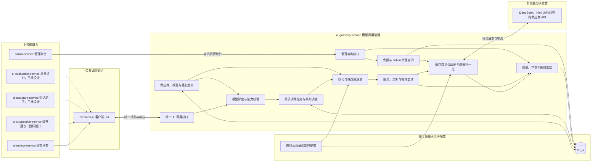

# AI 网关服务

> AI 网关是业务服务访问外部模型供应商的唯一出口。

`ai-gateway-service` 是 AI 能力的统一调用入口。当前代码模块已接入 DeepSeek 和 Kimi 官方 Chat Completions 接口以及模型列表接口。

> 分层定位：AI 调用治理层。当前职责边界是后续逐项梳理的起点；已实现能力与目标能力需要分别核对，尚未确认的细节不得直接视为最终设计。

> 当前供应商范围：服务器确定部署在国内，当前只接入国内大模型供应商的官方服务，不接入需要网络代理才能稳定访问的国外大模型供应商，也不设计网络代理和国外供应商运行治理。该限制属于当前阶段范围，不代表统一协议永久排斥国外模型。

## 整体结构与工作流程

下图先从项目整体视角说明谁会使用 AI 网关、请求进入网关后经过哪些核心模块，以及网关依赖哪些数据、配置和外部服务。它只表达宏观职责与主要方向，不展开具体路由算法、重试条件、价格公式和表结构。

宏观调用关系如下：

1. AI 业务服务拥有 Prompt、工作流和业务结果，通过进程内的 `common-ai` 客户端向 AI 网关发送统一请求。
2. AI 网关先校验任务锁定的模型和能力，再将一次外部 AI 对话包装为原子调用任务，进入队列等待调度。
3. 调度器根据任务等级和可用容量安排执行时机，并从同一模型的账号与端点资源池中选择执行通道。
4. 稳定性模块负责供应商级限流、熔断、有界重试和同模型账号切换，协议适配模块负责真正访问外部模型。
5. 调用完成后，网关统一记录用量、花费、耗时、状态和追踪关系，并向业务服务返回供应商无关的结果。
6. `admin-service` 通过管理查询接口读取调用统计、稳定性和供应商资源余量，不经过 `common-ai`，也不直接访问 `lm_ai`。余额和 Token 余量只在供应商支持时查询，允许为空，不进入模型调用的必经链路。

图中实线表示当前已经确认的主要协作，虚线表示目标设计中尚未形成运行模块的业务服务调用。`common-ai` 是被业务服务引入的公共 Jar，不是独立微服务。AI 网关内部模块是职责分区，不代表必须拆成可独立部署的子服务。

## 职责边界

### 负责

- 统一接入模型供应商并屏蔽供应商协议差异。
- 维护供应商、账号与端点、模型、模型绑定、价格和非敏感配置。
- 安全读取和使用模型密钥，防止密钥进入业务服务和日志。
- 执行超时、有界重试、账号级限流、熔断和同模型账号切换。
- 将单次外部 AI 对话包装为原子调用任务，并执行排队、调度和流量准入。
- 记录单次模型调用、Token、静态价格快照、成本来源、花费、耗时和失败原因。
- 在供应商支持时查询账号余额、Token 余量或其他剩余资源，并允许不支持的字段为空。
- 向管理后台提供用量、成本和稳定性统计能力。

### 不负责

- 不定义论文评审、AI 裁判、改进建议或题目推荐的业务 Prompt。
- 不编排业务工作流，不解释业务结果。
- 不判断 AI 业务结果是否正确，不定义质量指标。
- 不保存论文、评审结果、对话或其他完整业务内容。

## 数据与协作边界

AI 网关独占 `lm_ai` 数据库，拥有供应商、账号与端点、模型目录、模型绑定、价格规则和调用记录。业务服务通过 `common-ai` 调用 AI 网关，传递已锁定的模型绑定快照、场景、业务标识、Prompt 和必要追踪信息。管理后台通过内部接口查询统计，不直连 `lm_ai`。

每次业务任务或实验运行必须提前锁定工作流步骤使用的精确模型与参数。AI 网关负责验证该绑定，并在能够调用同一模型的账号或端点之间选择执行通道；它不根据实时成本、健康度或限流情况改用另一模型。

`common-ai` 只是运行在调用方进程内的公共客户端 Jar；ai-gateway-service 才是独立运行并实际访问模型供应商的服务。两者的详细对比见 [common-ai README](../common/common-ai/README.md)。

## 功能清单

| 功能 | 功能说明 |
|------|----------|
| 供应商管理 | 维护可用模型供应商和必要配置 |
| 模型管理 | 维护模型能力、状态和可用场景 |
| 模型绑定执行 | 执行任务已锁定的精确模型与参数，不跨模型自动切换 |
| 原子调用任务 | 将一次外部 AI 对话包装为统一任务并维护调用生命周期 |
| 任务队列与调度 | 根据优先级、实时性和同模型资源容量安排任务消费 |
| 账号资源池 | 在同一模型的多个供应商账号或端点之间分配并发与配额 |
| 统一 AI 调用 | 屏蔽不同供应商协议差异并返回统一结果 |
| 文本与多模态输入 | 向业务服务提供文本、图像和 PDF 等模型输入能力 |
| 稳定性治理 | 处理超时、有界重试、限流、熔断和同模型账号切换 |
| 调用记录 | 记录调用场景、模型、状态、Token、耗时和失败信息 |
| 价格与成本 | 维护供应商静态定价，记录接口实际花费或根据实际用量计算 |
| 调用追踪 | 将业务任务、工作流程步骤和单次模型调用关联 |
| 供应商资源余量 | 在供应商支持时查询余额、Token 余量或其他剩余资源，允许结果为空 |
| 用量与稳定性统计 | 按模型、场景和时间聚合用量、成本、耗时和成功率 |

## 文档索引

编号按照宏观执行流程组织。先阅读调用总览，再从请求入口依次进入模型校验、任务调度、资源治理、供应商执行、结果记录和管理观察；跨流程的配置、安全、数据模型和验证文档放在主链路之后。

本目录的占位文档是本轮详细系统设计的讨论入口。它们只记录设计目标、已确认边界和待确认问题，不表示对应设计已经完成，也不得把待确认清单直接作为后续实现依据。

### 调用总览与入口

| 编号 | 文档 | 内容摘要 | 当前状态 |
|------|------|----------|----------|
| 01 | [统一调用与路由](01-统一调用与路由.md) | 固定模型前提下的完整调用主流程和职责衔接 | 已形成初步设计，仍有未决项 |
| 02 | [统一调用契约](02-统一调用契约.md) | 业务服务与网关之间的请求、响应和错误契约 | 占位，待逐项设计 |
| 03 | [供应商与模型](03-供应商与模型.md) | 供应商、账号、端点、模型和能力档案 | 已形成初步设计，仍有未决项 |
| 04 | [模型执行配置与能力校验](04-模型执行配置与能力校验.md) | 工作流步骤模型绑定、不可变快照和能力验证 | 占位，待逐项设计 |

### 原子任务与资源调度

| 编号 | 文档 | 内容摘要 | 当前状态 |
|------|------|----------|----------|
| 05 | [原子调用任务](05-原子调用任务.md) | 业务大任务与网关原子调用任务的分层 | 占位，待逐项设计 |
| 06 | [任务队列与调度](06-任务队列与调度.md) | 优先级、公平调度、背压和任务消费 | 占位，待逐项设计 |
| 07 | [账号与端点资源池](07-账号与端点资源池.md) | 同模型多账号和多端点的执行通道选择 | 占位，待逐项设计 |
| 08 | [限流与容量治理](08-限流与容量治理.md) | 并发、RPM、TPM、容量收缩和分布式准入 | 占位，待逐项设计 |
| 09 | [熔断与健康评估](09-熔断与健康评估.md) | 主动探测、真实流量、熔断和恢复 | 占位，待逐项设计 |
| 10 | [幂等、重试与故障恢复](10-幂等重试与故障恢复.md) | 重复请求、有界重试、结果未知和崩溃恢复 | 占位，待逐项设计 |

### 供应商执行与结果治理

| 编号 | 文档 | 内容摘要 | 当前状态 |
|------|------|----------|----------|
| 11 | [供应商协议](11-供应商协议.md) | 通用供应商结构和协议适配边界 | 已形成初步设计，仍有未决项 |
| 12 | [流式调用](12-流式调用.md) | 流式事件、连接控制、取消传播和最终计量 | 占位，待逐项设计 |
| 13 | [多模态输入](13-多模态输入.md) | 文本、图像、PDF 和文件输入的传递与校验 | 占位，待逐项设计 |
| 14 | [调用记录与状态](14-调用记录与状态.md) | 逻辑调用、供应商尝试和调用状态机 | 占位，待逐项设计 |
| 15 | [价格与计量](15-价格与计量.md) | 静态定价、预计花费、实际花费和用量计量 | 已形成较详细设计 |
| 16 | [调用追踪与可观测性](16-调用追踪与可观测性.md) | 追踪链、日志、低基数指标和告警 | 占位，待逐项设计 |

### 管理、运行支撑与落地

| 编号 | 文档 | 内容摘要 | 当前状态 |
|------|------|----------|----------|
| 17 | [供应商资源余量](17-供应商资源余量.md) | 可选的余额、Token 余量和其他剩余资源查询 | 占位，待逐项设计 |
| 18 | [管理查询](18-管理查询.md) | 调用、计量、健康和资源状态查询 | 占位，待逐项设计 |
| 19 | [配置与密钥](19-配置与密钥.md) | 配置发布、运行快照、密钥引用和轮换 | 占位，待逐项设计 |
| 20 | [安全与数据保护](20-安全与数据保护.md) | 内部身份、敏感数据、日志和出站访问保护 | 占位，待逐项设计 |
| 21 | [数据模型](21-数据模型.md) | 拟议表、字段、约束、索引、关系和生命周期 | 占位，待逐项设计 |
| 22 | [测试与验收](22-测试与验收.md) | 契约、调度、稳定性、计量和故障场景验证 | 占位，待逐项设计 |
| 23 | [参考项目横向对比](23-参考项目横向对比.md) | 可借鉴设计、不可照搬实现与演进边界 | 已完成阶段性参考分析 |
