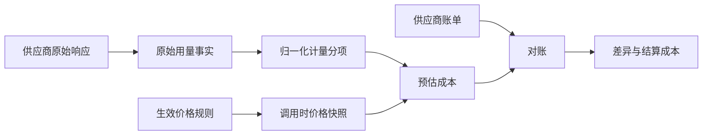

## 价格与计量

### 设计目标

计量系统同时回答三个不同问题：

- 供应商声明本次调用使用了多少计费单位。
- 按调用当时的公开价格预计应该花费多少。
- 供应商最终账单实际扣费多少。

三者分开保存，不用一个成本数字覆盖用量、估算和结算。

### 事实层次

#### 原始用量

保留供应商返回的用量语义和供应商请求标识。原始响应只保留计量和排障必需的脱敏片段，不完整保存 Prompt 和生成内容。

#### 归一化用量

归一化层使用可扩展计量分项，不只保存输入 Token 和输出 Token。首版支持以下分项：

| 分项 | 说明 |
|------|------|
| 标准输入 | 未享受缓存折扣的输入 Token |
| 缓存命中输入 | 供应商明确返回的缓存命中 Token |
| 缓存创建输入 | 显式缓存创建所消耗的 Token |
| 标准输出 | 可见回答和供应商合并返回的输出 Token |
| 推理输出 | 供应商单独报告的思考 Token |
| 模态用量 | 文本、图像、音频和视频的供应商计量单位 |
| 按次用量 | 搜索、图像生成和其他按次计费能力 |

不存在的分项与数值为零是不同语义。供应商没有返回某分项时，记录为未知，不自动记为零。

### 价格规则

价格是带生效时间的规则集，不是模型属性。一份规则可以同时按以下维度匹配：

- 供应商、端点、精确模型版本和服务地域
- 实时、批处理和其他服务层级
- 计量分项和模态
- 单次输入长度阶梯
- 时区、星期和峰谷时段
- 币种、含税口径和单位缩放
- 生效起止时间和规则优先级

规则发布前必须检查时间和匹配范围的重叠。命中零条或多条同优先级规则都是配置错误。价格未知不应阻断已授权的核心调用，但必须将成本状态标记为待核算并告警。

### 成本口径

预估成本使用实际尝试开始时刻、供应商返回用量和当时生效的价格快照计算。时段判定使用价格规则明确的时区，不使用服务器默认时区。

所有金额使用十进制精确计算和明确舍入规则。中间分项不提前舍入，在单次尝试合计时舍入到系统记账精度。保留供应商原币币种。跨币种报表使用独立汇率快照，不改写原始成本。

业务调用成本是其全部尝试成本之和，包括失败、超时和主备切换中可能被供应商计费的尝试。

### 稳定性保证

- 供应商响应用量是单次调用的主要事实源，本地 Tokenizer 只用于调用前预算和异常检测。
- 流式调用以最终结算帧为准，中间帧不重复累加。
- 价格规则只追加新版本并关闭旧版本生效区间，不改写历史快照。
- 适配器升级时使用固定原始响应样本做契约测试，防止供应商字段变化造成静默少计。
- 计量无法确定时显式使用未知状态，不以零值伪装完整数据。

### 账单对账

只依靠 API 响应无法保证财务级准确。供应商可能有免费额度、资源包、赠送余额、优惠活动、税费、舍入口径和账单延迟。因此系统定期导入供应商账单或用量导出，执行对账。

对账优先使用供应商请求标识和账单明细标识匹配。供应商只提供时间聚合账单时，按账号、模型、地域、计量分项和结算时间窗口聚合比较，并保留无法精确归因的说明。

差异分为用量差异、单价差异、优惠差异、舍入差异和无法匹配。结算成本不覆盖调用时预估成本，两者用于分析价格配置和实际扣费的偏差。

### 告警

- 用量缺失或用量分项恒为零
- 价格规则未命中或命中冲突
- 单次调用成本超过场景预算
- 日级成本、Token 或对账差异异常增长
- 已超过账单延迟窗口仍无法对账

### 关键取舍

| 决策 | 结论与原因 |
|------|--------------|
| API 用量作为运行主口径 | 供应商完成真正分词，比本地字符估算稳定 |
| 账单作为财务最终口径 | API 用量无法表达所有优惠、税费和结算调整 |
| 预估与结算并存 | 保留调用当时决策依据，同时获得真实财务成本 |
| 价格规则版本化 | 供应商调价不改变历史成本和实验结论 |
