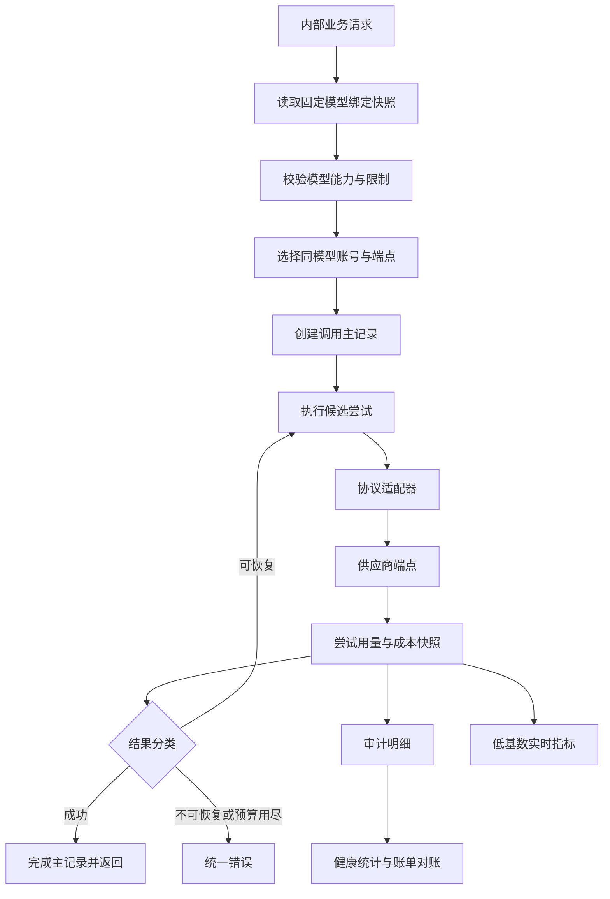

## AI 网关参考项目横向对比

> 本文选择性分析本地开源项目 `/home/dorian/repo/yu-ai-router` 的 AI 网关设计，用于帮助 LeetModel 后续完善供应商管理、固定模型执行、稳定性和可观测性。它是设计参考，不是复制清单或开发计划。LeetModel 已确认每次调用锁定精确模型，不采纳跨模型 Fallback。

### 阅读范围与证据级别

本次只阅读与 AI 网关直接相关的入口，没有通读充值、用户、插件、前端及 Go/Python 重写版：

- 根 README 中的架构和功能边界。
- `ModelProvider`、`Model`、`RequestLog` 实体和对应 SQL。
- `ModelAdapter`、`ModelAdapterFactory` 及具体适配器入口。
- `RoutingStrategyInterface` 及 fixed、auto、cost-first、latency-first 策略。
- `ChatServiceImpl` 中的选路、Fallback、日志和计费主流程。
- `HealthCheckServiceImpl`、`HealthCheckTask` 和 `AIMetricsCollector`。

文档宣称的功能只视为“设计意图”；只有在上述源码或表结构中找到的内容，才视为“已实现证据”。本次不评估该项目的完整度和生产可用性。

### 两个项目的产品边界

| 维度 | yu-ai-router | LeetModel |
|------|--------------|-----------|
| 网关定位 | 面向终端用户和开发者的通用 AI API 平台 | 面向内部业务服务的模型治理服务 |
| 调用方 | Web、用户 API Key、SDK | ai-review-service 等受信任微服务 |
| 主要价值 | 通用调用、用户计费、BYOK、对话体验 | 固定模型执行、实验可重现、同模型账号调度与供应商成本治理 |
| 业务内容 | 网关同时承担对话、插件和计费业务 | Prompt、PDF 处理、评审流程和结果必须留在评审服务 |
| 路由目标 | 成本、速度和通用可用性 | 先满足能力与评审质量门槛，再考虑成本、延迟和稳定性 |

因此，LeetModel 不应引入用户余额、充值、外部 API Key 发放、BYOK 或通用插件平台。这些功能虽然与 AI 调用有关，但不属于当前产品闭环。

### 值得借鉴的设计

#### 一、将可变的选路算法放到策略边界后

yu-ai-router 用统一策略接口表达“选择主模型”和“获取备选模型”，由路由服务根据策略标识查找实现。这个分层将稳定的调用流程和可变的排序算法分开，适合 LeetModel 保留。

LeetModel 需要增加一个更严格的前置边界：

1. 先根据场景、输入模态、上下文、JSON、思考模式、合规和质量门槛得到“合格候选集”。
2. 再在合格候选集上执行 fixed、priority、cost-first 或 latency-first。
3. 策略产生有序候选计划，不直接发起外部调用。

这样可以避免“便宜但不支持图像的模型”被选中，也能让路由结果保持可解释。

#### 二、适配器注册表优于在主流程中分支判断

yu-ai-router 由工厂遍历适配器的 `supports` 结果，LeetModel 当前也已使用供应商注册表。共同优点是新增适配器不需要修改调用主流程。

LeetModel 还应进一步按“API 协议”而不是“供应商品牌”复用适配器：

- `openai-completions`、`openai-responses`、`anthropic-messages` 是协议适配边界。
- DeepSeek、Kimi 和第三方代理站是供应商或接入端点。
- 供应商特例只覆盖错误、用量和个别参数差异，不重写整个协议。

#### 三、把模型绑定与执行通道选择分开

yu-ai-router 显式先获取主模型和备选列表，再执行有上限的 Fallback。LeetModel 只借鉴“先锁定计划，再执行尝试”的分层，不采用跨模型备选列表。

LeetModel 的执行计划应至少固定：

- 场景、工作流步骤和模型绑定快照。
- 不可变的精确模型、Prompt 版本与参数。
- 同一模型下可使用的账号与端点池。
- 最大尝试次数、总时间预算和允许切换账号的错误类型。

执行计划在一次业务调用开始后应保持不变，避免配置刷新导致同一任务前后不可重现。单个账号故障时可以切换同模型账号，不能切换成另一模型。

#### 四、同时保留请求事实和实时指标

yu-ai-router 同时使用 `RequestLog` 和 Micrometer：数据库日志用于历史追溯与聚合，指标用于实时监控。这是正确的两层模型，不应用 Prometheus 替代可审计数据，也不应每次制作报表都扫描明细表。

LeetModel 应把“一次业务调用”和“一次供应商尝试”分表记录。后者保留实际供应商、账号引用、端点、固定模型、请求标识、延迟、用量、价格快照、成本、错误类别和结果未知状态。同模型账号切换时的失败尝试与成功尝试是两条计费事实，不能被一条“最终成功”日志覆盖。

实时指标首版只使用低基数标签：场景、供应商、模型、协议、状态和统一错误类别。`userId`、`callId`、业务任务 ID 和原始错误文本不能用作指标标签。

#### 五、将主动探测与真实流量统计结合

yu-ai-router 定时检查供应商，同时从请求日志聚合模型延迟和成功率。这提示 LeetModel 不要用单一布尔值表示健康，而应区分：

- 配置状态：管理员是否允许调用。
- 探测状态：认证、网络和基础端点是否可达。
- 模型运行状态：近期真实调用的成功率、限流率和延迟。
- 熔断状态：当前是否允许真实流量进入。

主动探测应调用一个明确、低成本、可验证的端点。仅能验证网络连通的探测不得标记为“供应商可用”。

### 不能直接照搬的实现

| 参考项目做法 | 风险 | LeetModel 结论 |
|----------------|------|-----------------|
| 在 `model_provider.apiKey` 保存密钥 | 数据库泄漏、备份和日志都可暴露长期凭据 | 只保存密钥引用和脱敏指纹，真实值由环境或密钥服务注入 |
| 适配器未命中时默认选 OpenAI 适配器 | 配置错误可能在运行时才变成难解释的上游报错 | 供应商必须显式绑定协议；未支持协议在保存或发布配置时失败 |
| 成本优先按 `inputPrice + outputPrice` 排序 | 忽略预估输入/输出比例、缓存、模态和时段价格 | 用本次请求的预算用量和当时价格规则计算预估成本 |
| 健康检查把 HTTP `401` 也视为健康 | 只能证明端点存在，不能证明密钥可用 | `401/403` 必须归类为认证失败并触发告警，不得进入可用候选集 |
| 允许 `unknown` 健康模型自动参与路由 | 刚新增或长期未探测的模型可直接承载真实任务 | 首次发布前必须连接测试；`unknown` 只能在显式固定路由中受控使用 |
| 在 Micrometer 中按 `userId` 创建 Counter | 用户数增长导致高基数、内存和 Prometheus 存储压力 | 用户和任务维度只写审计日志，不做指标标签 |
| Fallback 根据所有可用 chat 模型排序 | 切换模型破坏工作流和模型对比的可重现性 | 不建立跨模型备选；只在固定模型的账号资源池内选择执行通道 |
| 所有异常都进入 Fallback | 参数错误、内容安全拒绝也可能被重复调用 | 只对限流、临时故障等明确可恢复错误执行同模型重试或账号切换 |
| 使用单条请求日志表同时表达调用和尝试 | 无法完整表达一次调用内的多次计费尝试 | LeetModel 使用调用主表与尝试表两层事实 |

### 对 LeetModel 现状的横向对比

| 能力 | yu-ai-router 源码表现 | LeetModel 当前状态 | 可借鉴方向 |
|------|---------------------|----------------------|--------------|
| 统一调用 | 通过 `ChatService` 封装选路、调用和计量 | 已有 `common-ai` 契约和 `/internal/ai/chat` | 保持业务无关的统一契约 |
| 供应商适配 | 供应商适配器工厂 | 已有注册表和 DeepSeek/Kimi 适配器 | 转向协议适配与供应商特例分层 |
| 模型能力 | 类型、上下文、思考和 JSON 标签 | 已校验模态、JSON、思考、上下文、输出和图像限制 | 保持“能力项 + 限制”，不退化为单一模型类型 |
| 动态路由 | fixed/auto/cost/latency 策略 | 当前为场景到单一模型的显式配置 | 改为任务锁定模型绑定，网关只调度同模型账号资源池 |
| Fallback | 最多尝试固定数量的备选模型 | 不采纳跨模型 Fallback | 增加同模型账号计划和按错误分类的有界尝试 |
| 请求日志 | 单表记录状态、Token、耗时、Fallback | 当前主要是应用日志和 `callId` | 建立调用/尝试两层事实与脱敏保留策略 |
| 实时指标 | Micrometer + Prometheus + Grafana | 尚未形成 AI 专项指标 | 使用低基数的次数、Token、延迟和错误指标 |
| 健康评估 | 定时探测 + 请求日志聚合 + 综合分 | 尚未实现 | 分离探测、真实流量、熔断和配置状态 |
| 价格与成本 | 模型上保存输入/输出单价 | 已设计独立价格规则、快照与对账 | 保留 LeetModel 现有更严谨的时态价格设计 |
| 密钥 | 供应商表明文字段 | 当前使用环境变量 | 管理端维护密钥引用，永不回显明文 |

### 适合 LeetModel 的目标模型

该模型延续 LeetModel 已确定的职责边界：网关负责模型治理和调用事实，评审服务负责 Prompt、PDF 处理、多任务编排与评审结果。路由不得越过业务服务擅自改写输入或改变评审版本的语义。

### 后续设计时的检查问题

1. 当前修改的是供应商、账号、接入端点、协议、模型、能力还是模型执行配置？
2. 候选模型是否在排序前通过所有硬约束？
3. 主调用失败后，当前错误是否真的允许重试或切换？
4. 一次业务调用内的每次外部尝试是否都可独立追溯和计费？
5. 动态配置是否在调用开始时锁定快照？
6. 健康状态是来自真实流量、主动探测还是管理员配置，它们是否被错误合并？
7. 监控标签是否保持低基数，明细查询是否回到审计数据？
8. 密钥、Prompt、PDF 和模型原始输出是否被误写入数据库、日志或指标？
9. 路由优化使用的成本、延迟和质量数据是否有足够样本，是否能解释选择结果？

### 结论

yu-ai-router 最有价值的参考不是它的功能数量，而是将适配、执行计划、调用尝试、请求日志、实时指标和健康统计拆成可独立理解的边界。LeetModel 吸收这种分层思路，但坚持固定模型绑定、只在同模型账号池内调度，并保留能力硬校验、协议与品牌分离、密钥引用、价格时态化、调用与尝试事实等设计。
