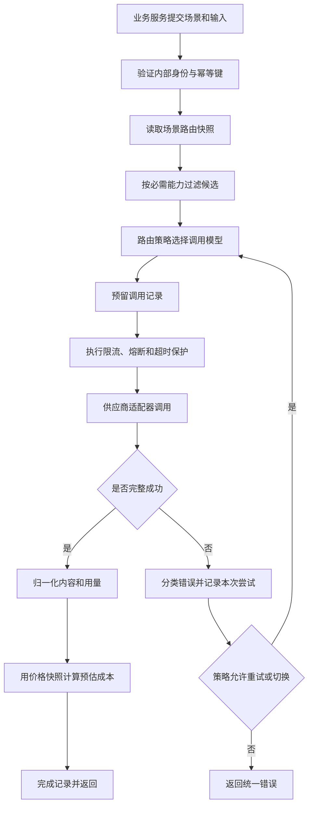

## 统一调用与路由

### 完整流程

触发者是受信任的业务服务。前置条件是场景已启用、输入满足基本契约、至少存在一个满足必需能力的候选模型。最终结果是一次统一调用响应，或一个可由业务工作流解释的统一错误。

### 路由三阶段

#### 资格过滤

根据场景、启用状态、输入模态、上下文限制、结构化输出、数据地域和合规要求排除不合格模型。此阶段是硬约束，不参与权重打分。

#### 策略选择

首版使用显式主备顺序，保证行为可解释。系统有真实调用数据后，再支持按质量门槛、成本上限、延迟目标和当前健康度组合选择。价格不能越过质量门槛单独决定路由。

峰谷价格作为调用时刻的成本信号。只有可延迟的批处理任务才能为等待低价时段改变执行时间。交互式请求只在同时满足质量和延迟目标的候选中比较当前价格。

#### 快照锁定

调用开始前锁定路由版本、模型版本、参数、能力档案和价格版本。一次调用的可重现性优先于实时跟随配置变化。

### 调用与尝试

一个业务调用可包含多个供应商尝试。调用是幂等、路由和对业务返回结果的边界。尝试是真正向某一供应商发出请求的计费和故障边界。

每一次尝试都必须独立记录用量和成本。主模型超时后切换备用模型，可能两次都产生费用。统计不得只保留最终成功的尝试。

### 幂等和重试

- 业务幂等键在场景范围内唯一，已成功请求直接返回原结果引用。
- 处理中的相同请求不并发调用供应商。
- 只对明确可恢复且未收到有效输出的失败执行有界重试。
- 连接超时与读取超时必须分开。读取超时时供应商可能已完成生成，自动重试有重复计费风险。
- 供应商不支持幂等键时，网关只能防止自身的并发重复，不宣称端到端恰好一次。

### 流式调用

流式内容已对业务可见后，不自动重试，不切换模型，不拼接两个模型的输出。结算用量只信任供应商最终结算帧。中断且无结算帧时，记录用量未知并进入后续对账，不使用已接收字符数替代官方 Token。

### 错误分类

| 类别 | 路由行为 |
|------|----------|
| 请求不合法 | 立即失败，不重试 |
| 能力不匹配 | 不调用供应商，返回可解释错误 |
| 内容安全拒绝 | 默认不换供应商规避拒绝 |
| 额度或鉴权失败 | 禁用当前端点并告警，可切换已配置备用 |
| 限流或暂时故障 | 遵循退避和熔断策略，可进入下一候选 |
| 超时或结果未知 | 标记重复计费风险，只按场景策略处理 |

### 首版范围

首版实现显式主备路由、能力硬过滤、超时、有界重试、限流、熔断和调用快照。自适应权重、自动成本优化和智能排队暂不引入，避免在缺少基线数据时制造不可解释行为。
