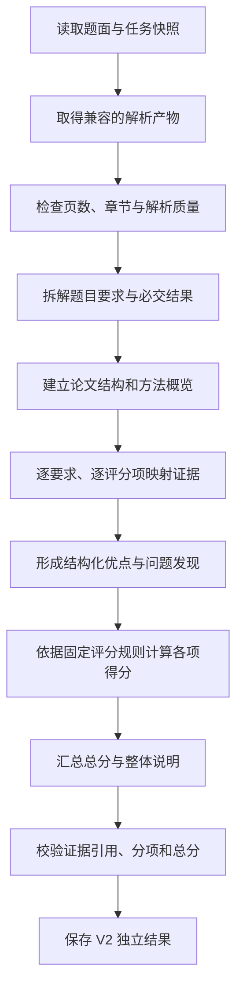

## 执行流程

V2 使用“先建立证据，再作评分”的两阶段工作流，避免模型先给分后补理由。

### 阶段一：要求与证据分析

工作流先从题面提取稳定的要求编号、任务描述、期望交付物和关键约束，再读取解析产物的章节、段落、公式、表格和图形说明，建立论文概览。

随后逐项判断题目要求是否被回答，并从论文中提取支持优点或问题的证据。阶段一只产生要求、证据和发现，不产生最终总分。模型输出必须是合法结构化 JSON，服务端校验页码和解析块引用。

### 阶段二：评分与说明

评分步骤只消费锁定的题目要求、评分规则和已经校验的证据与发现。每个评分项先列得分理由和扣分理由，再给出该项分数；总分由服务端按评分规则确定性汇总，模型不能返回一个与分项无关的自由总分。

如果某个判断缺少论文证据，应降低证据充分性并说明限制，不能根据常识补造论文内容。

### 结果校验

服务端至少校验：

1. 题目要求编号唯一且覆盖题面提取结果。
2. 论文页码和解析块全部存在。
3. 每项评分都有理由并关联至少一个发现或明确的证据不足项。
4. 发现引用的证据和评分项存在。
5. 分项得分位于各自范围，总分等于分项确定性汇总。
6. 结果没有引用任务之外的论文、题目或解析产物。
