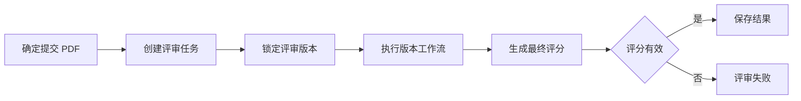

## 执行流程

```mermaid
flowchart LR
    A[确定提交 PDF] --> B[创建评审任务]
    B --> C[锁定评审版本]
    C --> D[执行版本工作流]
    D --> E[生成最终评分]
    E --> F{评分有效}
    F -->|是| G[保存结果]
    F -->|否| H[评审失败]
```

公共流程只约束输入、版本锁定、最终评分校验和结果保存。是否解析 PDF、调用 AI 的次数、评分过程及中间产物由具体版本自行定义。
