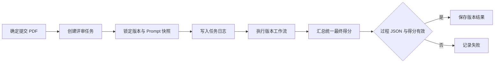

## 执行流程

```mermaid
flowchart LR
    A[确定提交 PDF] --> B[创建评审任务]
    B --> C[锁定版本与 Prompt 快照]
    C --> D[写入任务日志]
    D --> E[执行版本工作流]
    E --> F[汇总统一最终得分]
    F --> G{过程 JSON 与得分有效}
    G -->|是| H[保存版本结果]
    G -->|否| I[记录失败]
```

公共流程约束输入、版本与 Prompt 快照、任务状态、执行日志和最终得分。是否解析 PDF、调用 AI 的次数、是否拆分小任务、是否进行多轮对话、过程 JSON 结构及中间产物都由具体版本自行定义，但最终必须收敛为统一的 `score`。
