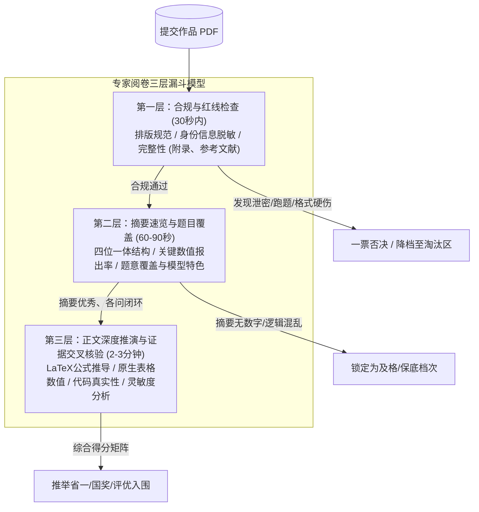
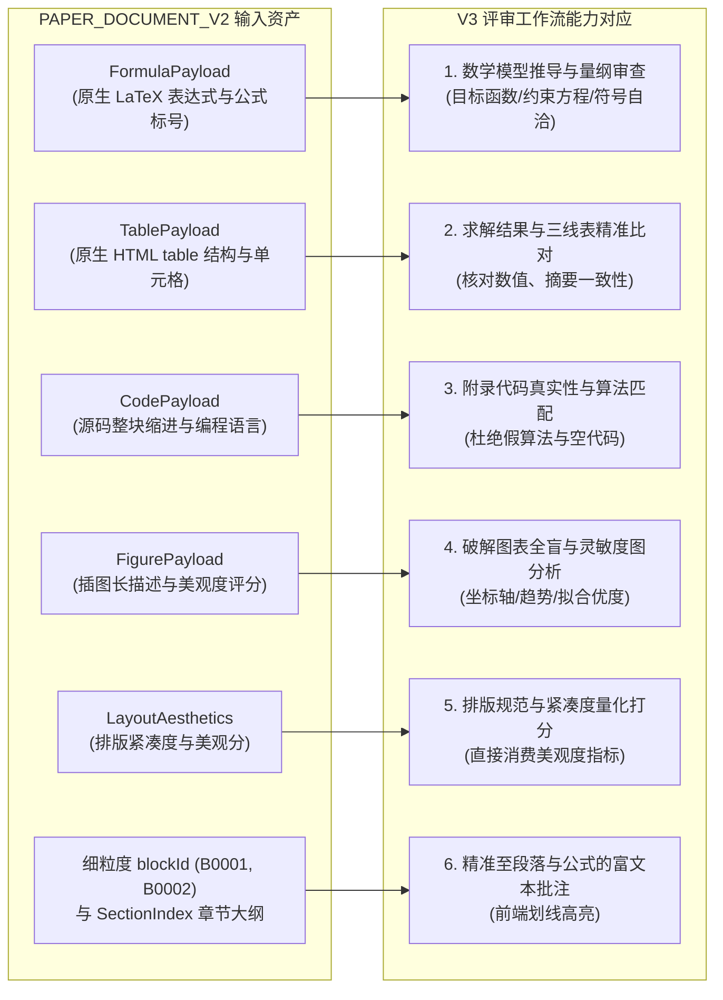

## 数模论文评审特征与业务场景全景

### 一、调研背景与现实挑战

全国大学生数学建模竞赛（CUMCM）、美国大学生数学建模竞赛（MCM/ICM）以及中国研究生数学建模竞赛（CPMCS）等主流数模赛事，其论文评阅不同于普通的文科论文或通用期刊审稿，具有极其独特的**“工程性、极限压迫性与科学严密性”**。

在真实竞赛中，评卷专家在短时间内（通常单篇初筛仅 90 秒至 3 分钟）面对数千份参赛论文，形成了一套行之有效、高度符号化且逻辑清晰的“漏斗式”阅卷心智模型。

以往的 AI 评审系统（如 V1、V2）容易将数模评阅退化为“长文本摘要与泛泛而谈”，无法对公式推导、数据真实性、图表走势、代码复现与赛题覆盖做出专业纵深判定。

本文通过深度调研官方评阅标准、专家阅卷心理学及真实评审细则，系统性梳理数学建模论文的核心特征，并分析如何通过 `PDF解析V2`（`PAPER_DOCUMENT_V2`）高保真结构化资产，为第三代评审工作流（V3）提供坚实的领域特征支撑。

---

### 二、专家阅卷心智模型与“三层漏斗”评阅流程

真实评阅专家的评审路径通常遵循严格的“快速淘汰 -> 维度筛查 -> 深度核验”三层漏斗模型：

1. **第一层：合规与红线初查（30 秒内）**：
   - 检查论文是否违规泄露参赛学校、队伍编号、个人姓名等敏感信息（一旦发现，一票否决判零分）；
   - 检查论文结构完整性：是否包含题目回顾、问题分析、模型假设、符号说明、正文各问、模型评价、参考文献及代码附录。
2. **第二层：摘要速审与题目覆盖（60~90 秒，80% 的初筛分流点）**：
   - 业内公认**“摘要定生死”**。评委重点阅读首页摘要，判断针对赛题的每一个子问题是否都有对应的模型方法与**明确的定量数值结论**；
   - 摘要中没有具体数字（只写“计算得出了结果”而未给出具体指标数值）直接被归入中下档次。
3. **第三层：正文深度核验与交叉比对（2~3 分钟）**：
   - 针对进入优良梯队的论文，专家深入核验正文：核查数学公式是否合理自洽、数据清洗是否科学、表格数据是否与摘要一致、代码附录是否真实支持该算法、是否进行了深入的灵敏度或误差分析。

---

### 三、数学建模论文的七大核心评阅特征剖析

结合官方四大基本原则（**假设的合理性、建模的创造性、结果的正确性、表述的清晰性**），数模论文评审聚焦于以下七大维度特征：

#### 1. 摘要页（Abstract / Summary Sheet）的绝对决定性
*   **四位一体黄金结构**：优秀的摘要必须形成“问题定义 -> 机理分析与模型构建 -> 算法与求解技术 -> 具体量化结论”的闭环。
*   **关键数值报出率（Quantitative Reporting）**：
    *   数模严禁“空话套话”。若题面问“最优价格是多少”，摘要必须清晰给出“问题一的最优定价为 32.4 元，预期总利润为 12.8 万元”；
    *   若题面要求预测未来走势，摘要必须给出预测值、误差指标（如 $R^2 = 0.92$、$MAPE = 4.3\%$）或置信区间。
*   **摘要正文自洽性（Abstract-Body Consistency）**：
    *   摘要中报出的数值、采用的模型名称，必须与正文第三问、第四问的表格数据及结论完全一致，严禁摘要写一套、正文算另一套。

#### 2. 模型假设与符号说明的合理性
*   **假设的切题性与适度性**：
    *   假设是连接现实问题与抽象数学模型的桥梁，合理的假设应当简化非关键矛盾，同时保留现实的核心物理/经济机理；
    *   严禁为了强行套用初等模型而做出脱离常识的荒谬假设（例如“假设交通网络中车辆互不相撞且速度无限”、“假设菜品需求量与售价无关”）。
*   **符号说明表（Nomenclature）的自洽性**：
    *   数学公式中出现的每个核心变量，都应在符号说明表中定义清晰，且包含物理意义与国际标准量纲（单位）；
    *   严禁通篇公式中随机出现未定义的变量字母，或同一字母在前后章节代表不同物理量。

#### 3. 数学建模与公式推导的科学性（“真建模” vs “伪建模”）
*   **数学形式化表达（Formal Mathematical Formulation）**：
    *   数模的核心是数学。真正的数模必须写出严谨的：决策变量、目标函数（$\min / \max$）、约束条件集（不等式/等式）、状态转移方程或微分方程系统；
    *   **伪建模识别**：通篇只有纯文字罗列，或者写完问题后直接贴出“我们调用了 Python 的 `sklearn.RandomForestRegressor`”，完全没有数学模型表达，这是专家最深恶痛绝的“调包侠/伪建模”，会被断崖式扣分。
*   **LaTeX 公式规范与推导连续性**：
    *   核心公式必须有规范的数学公式编号（如 $(1), (2)$），前后推导要有数学逻辑连贯性，而非随意拼凑孤立公式。

#### 4. 求解算法与附录代码的真实可复现性
*   **算法与模型复杂度的适配**：
    *   针对 NP-hard 优化问题，是否合理解释了选择遗传算法（GA）、模拟退火（SA）或粒子群（PSO）的超参数设置与收敛准则；
    *   针对凸优化问题，是否采用了科学严密的求解器（如 Cplex、Gurobi、Lingo、Scipy）。
*   **附录源码的“真伪与匹配核验”**：
    *   正文声称使用了混合整数线性规划（MILP），附录中必须有对应的求解代码；
    *   若附录代码只有十行简单的爬虫或画图脚本，或者代码与正文算法完全脱节，将被判定为“结果缺乏复现证据”乃至“伪造计算”。

#### 5. 数据处理与求解结果的现实合理性
*   **数据清洗与特征工程**：
    *   对于包含大数据的赛题，必须考察参赛者对缺失值、异常值、时间序列周期性（工作日 vs 周末、季节性）的处理逻辑，拒绝直接拿原始带噪数据无脑拟合。
*   **结果的现实物理常识校验（Common Sense Validation）**：
    *   求解出来的关键数值是否符合物理与经济常识。例如：预测概率不能小于 0 或大于 1、优化得出的配送时间不能为负数、人体温度不能算出 80 摄氏度。
*   **原生表格（三线表）表达**：
    *   数模标准排版要求使用专业三线表，表格表头、数据列对齐、单位标示必须清晰整洁。

#### 6. 模型检验、灵敏度分析与优缺点自评
*   **灵敏度分析（Sensitivity Analysis）的深度**：
    *   数模不仅要给出一个解，更要验证“当环境参数变动时，解是否依然稳定”；
    *   优秀的论文会对关键参数施加 $\pm 5\% \sim \pm 20\%$ 的扰动，观察目标函数值的波动幅度，并绘制清晰的灵敏度扰动折线图或热力图，据此给出管理学/工程学建议；
    *   严禁“形式主义灵敏度”：只写一句“经检验模型灵敏度良好”，却没有任何参数扰动数据或图表。
*   **模型优缺点自评（Strengths & Weaknesses）**：
    *   客观评价模型的适应边界、计算复杂度瓶颈与未来可改进方向，展现学术诚信。

#### 7. 论文排版美观度与竞赛红线
*   **一票否决红线（Fatal Disqualification Rules）**：
    *   正文中出现学校、指导老师、队员姓名、队号等任何身份标识；
    *   严重雷同抄袭（利用代码查重与文本查重）；
    *   严重跑题、未回答赛题核心任务。
*   **排版美观度与学术规范**：
    *   图表清晰度、坐标轴标签（Label）、量纲（Unit）、图例（Legend）齐备；
    *   公式居中、编号右对齐；页面紧凑连贯，无突兀的大面积空白（Bad Page Break）。

---

### 四、扣分点、加分项与致命软硬伤清单

为了让 V3 评审工作流具备工业级的判准能力，将数模专家阅卷关注点矩阵化归纳如下：

| 类别 | 严重程度 | 具体表现形式 | 评审判定标准与影响 |
|:---|:---:|:---|:---|
| **致命硬伤 (Fatal)** | 一票否决 | 1. 论文泄露学校/姓名信息 2. 严重跑题，完全答非所问 3. 全文无任何数学建模（纯文字描述） 4. 结果严重违反物理/现实常识（如负数时间） | 直接判定为不合格（FAIL），终止后续评审，总分归零或置于保底淘汰档位 |
| **严重扣分项 (High)** | 扣 10~25分 | 1. 遗漏赛题核心子问（漏做第 3 问） 2. 摘要无具体数值指标报出（全篇定性空谈） 3. 摘要数值与正文表格数据前后矛盾 4. 正文写了复杂算法但附录全无代码支撑 | 对应维度分扣减 50% 以上，取消一等奖/国奖参评资格 |
| **中度扣分项 (Medium)** | 扣 5~10分 | 1. 核心数学符号未在符号表中定义 2. 公式编号跳号、引用断链 3. 缺乏灵敏度分析或仅一句话敷衍无数据 4. 数据分析未做异常值/缺失值清洗说明 | 扣除模型推导或验证维度的关键分值 |
| **轻微瑕疵 (Low)** | 扣 1~3分 | 1. 表格未采用规范三线表 2. 插图缺乏坐标轴单位或图例模糊 3. 参考文献格式不统一 4. 排版存在不必要的跨页断裂 | 扣除规范性与可读性基础分 |
| **核心加分项 (Bonus)** | 奖励 5~15分 | 1. 机理推导深入，非黑盒套用成熟算法 2. 针对问题提出创造性假设并严格论证 3. 多算法横向对比与误差收敛分析 4. 专业的参数扰动灵敏度分析并指导实际决策 5. 排版精美大气，图表达到顶级期刊水准 | 突破基准分，进入优秀/卓越档位 |

---

### 五、V3 对接 `PDF解析V2`（`PAPER_DOCUMENT_V2`）的输入赋能分析

以往评审之所以无法深度落地上述规则，根本原因在于**输入解析能力的贫瘠**。V3 深度对接 `PAPER_DOCUMENT_V2`，使上述每一项数模专业特征都能找到确凿的结构化数据依据：

1. **原生 LaTeX 公式（`FormulaPayload`）彻底赋能数学模型深度推导**：
   - 不再是 PDFBox 混乱丢失的乱码，大模型直接阅读规范的 LaTeX 目标函数与约束，能精准检查变量是否缺失角标、方程物理量纲是否两边一致。
2. **原生 HTML 表格（`TablePayload`）彻底赋能数据与结论核验**：
   - 原样保留表格的行、列与单元格数值，V3 可以像人类专家一样核查表内的最优解、均方根误差（RMSE）数值是否合理，并与摘要陈述逐一校对。
3. **整块代码保真（`CodePayload`）彻底赋能可复现性核查**：
   - 源码缩进、注释与算法实现原样保留，V3 能比对正文提到的“遗传算法”是否真的在附录中编写了染色体交叉与变异函数。
4. **插图长描述与美观评分（`FigurePayload`）彻底破除视觉全盲**：
   - 借助解析层生成的长描述，大模型无需处理高昂图片也能知晓“图 3 展示了参数在 0.1 到 0.9 波动时的成本曲线，在 0.45 处达到最低点”，从而准确判断灵敏度分析是否真实成立。
5. **细粒度 `blockId` 赋能交互级批注体验**：
   - 从原先一整页一个的粗暴 `P1-B1`，升级到具体的段落块 `B0012`、公式块 `B0015`。大模型输出的 Finding 能精确高亮在具体公式行上，为后续“AI 提建议”提供高精度靶点。

---

### 六、对 V3 评审系统架构设计的核心启示

基于上述全景调研，AI 评审 V3 在系统架构与工作流设计上必须确立以下四大原则：

1. **弃用单次 Monolithic Prompt，重构为“多阶段漏斗式流水线（Multi-stage Pipeline）”**：
   - 必须拆分为独立的四个逻辑阶段：
     * **阶段一（合规与摘要初筛）**：敏感词脱敏检查、完整性初审、摘要四要素与数字报出率专项审计；
     * **阶段二（分问题模型推导与算法核验）**：逐题核对数学建模严密性、LaTeX 公式合理性、附录代码匹配度；
     * **阶段三（数值求解与灵敏度真伪鉴定）**：核验表格数值常识、插图长描述支撑力、灵敏度参数扰动充分性；
     * **阶段四（细粒度量表裁决与服务端确定性汇总）**：基于前面提取的扣分项与加分项，按规则汇总总分。
2. **引入“赛题参考基准（Benchmark Snapshot）”对比机制**：
   - 改变过去“大模型仅看题面自己瞎猜”的现状，支持从题目端拉取各题的标准求解范围或核心方法要点，使模型拥有客观评判基准。
3. **从“主观拍脑袋”走向“细粒度扣分项（Deduction Rubric）”**：
   - 各维度不再由模型感性输出分数，而是由“基准分 + 增扣分证据项”精确演算得出，让分数的产生具有无可辩驳的证据链。
4. **建立一票否决安全熔断门（Safety Fail-Closed Gate）**：
   - 当触发违规泄露、空卷跑题或严重物理荒谬时，前置直接判定不合格并输出熔断说明，避免模型继续给出荒谬的高分。
