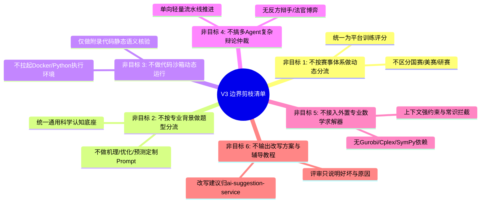

## 核心假设与简化边界

### 一、背景与减法原则

在上一篇《01-数模论文评审特征与业务场景全景》中，我们系统性调研了真实数学建模竞赛评阅的复杂性与多维特征。然而在真实工程落地中，**“面面俱到往往意味着全盘平庸，甚至由于复杂度失控而导致项目无法交付”**。

数学建模论文评审受多重现实变量交叉影响：
- **赛事类型各异**：全国大学生国赛（CUMCM）、美国大学生美赛（MCM/ICM）、中国研究生数模（CPMCS）、各省省赛与校赛等，评判风格、奖项偏好截然不同；
- **题型与数学工具庞杂**：机理物理分析、连续微分方程系统、离散组合优化、网络图论流、现代统计与时序预测、深度学习数据挖掘等；
- **专业应用背景广泛**：工程制造、航天动力、宏观经济、生物医疗、生态环境、交通物流等。

若试图在 V3 评审系统中为上述每一种组合编写专有的 Prompt 分支、动态路由或规则引擎，系统将陷入“规则维护爆炸、测试集无法收敛、调用链极其脆弱”的深渊。

因此，本篇正式确立 **AI评审V3 的核心简化原则：主动做减法，剥离次要干扰项，收敛核心矛盾，在通用的数模科学评阅底座上实现高保真、可落地、高确定性的最小闭环。**

---

### 二、六大明确剪枝项（Non-Goals / 暂不做的能力）

V3 评审工作流在设计与开发阶段明确排除以下复杂能力，将其列为非目标：

#### 1. 不按赛事体系做规则分流（No Tournament Branching）
*   **决策**：系统不针对国赛、美赛或研究生赛设立不同的工作流分支，不迎合特定赛事的特殊赛制偏好（如美赛特定的备忘录格式、研赛的多问复杂结构）。
*   **归宿**：统一采用平台标准化的**“平台训练评分（`PLATFORM_TRAINING_SCORE`）”**与**“通用数模学术规范”**，评分以帮助学生发现论文在学术规范与建模逻辑上的缺陷为核心目标。

#### 2. 不按专业背景与数学分类做题型分流（No Problem-Type Routing）
*   **决策**：不设置“机理分析题 Prompt / 运筹优化题 Prompt / 机器学习题 Prompt”等动态提示词分流网络。
*   **归宿**：抽象出全题型通用的科学建模逻辑底座：
    $$\text{题意对齐} \longrightarrow \text{假设适度} \longrightarrow \text{形式化建模} \longrightarrow \text{算法求解} \longrightarrow \text{结果图表} \longrightarrow \text{灵敏度检验}$$
    任何数模题无论何种专业背景，只要遵循该通用逻辑链即可获得客观评估，大幅降低系统的维护成本。

#### 3. 不对附录代码进行沙箱动态执行（No Dynamic Code Execution）
*   **决策**：虽然输入端 `PAPER_DOCUMENT_V2` 完整提取了附录中的代码块（`CodePayload`），但 V3 **绝不在后台启动 Docker 容器或代码执行环境去真正跑代码、重新算数据或画图**。
*   **权衡说明**：数模代码依赖五花八门的科学计算库（PyTorch、Gurobi、MATLAB、Lingo 等），动态执行会导致构建极度昂贵、安全隔离风险高、且长达数十分钟的超长时延。
*   **归宿**：定位为**“静态语义与真实性审查”**——利用大模型核对附录代码语言、核心算法函数名是否在正文中被提及、代码变量与公式符号是否自洽、附录是否为空白或假代码。

#### 4. 不采用多 Agent 循环辩论与仲裁博弈（No Multi-Agent Debate Loops）
*   **决策**：坚决不引入“正方评委提出批评、反方辩手进行申诉、主审法官最后裁决”等多 Agent 循环交互模式。
*   **权衡说明**：多 Agent 辩论在长文本论文下不仅会导致 Token 消耗成倍翻倍、单次评审耗时飙升至 3~5 分钟以上，而且状态机极易出现死循环或偶发性超时断裂。
*   **归宿**：采用**“单向推进、确定性有界”**的轻量阶段化流水线（Pipeline Architecture）。

#### 5. 不接入外置重型数学求解器验真（No External Solver Integration）
*   **决策**：不调用外部求解器（如 Z3、Gurobi、SymPy）去计算全局理论最优解。
*   **归宿**：依托大模型在完整赛题上下文、原生 LaTeX 公式和 HTML 表格约束下的科学逻辑辨别力，由服务端预设通用物理常识边界（如概率在 $[0,1]$、时间非负、非空约束）进行防呆拦截。

#### 6. 严禁越界输出教学辅导与改写方案（No Instructional Content）
*   **决策**：评审结果严格限定在“论文现状事实陈述、缺陷与优势归纳、分数影响与分块引用”。坚决不在评审结果中写“第一步怎么改、模型应该如何重新编程”等长篇改写方案。
*   **归宿**：严格恪守微服务职责边界，改写方案与深度启发完全留给下游 `ai-suggestion-service` 消费。

---

### 三、三大不可妥协的核心骨架（Must-Haves / 聚焦范围）

在激进剪枝后，V3 的系统设计将全力攻克以下三大核心矛盾：

#### 1. 深度消费 `PAPER_DOCUMENT_V2` 高保真结构化资产（破解输入失真）
彻底告别 V1/V2 时代的纯文本与单页粗粒度模式，精准消费第二代解析产物：
*   **消费 `FormulaPayload`**：直面原生 LaTeX 表达式，审查目标函数、约束方程、角标与物理量纲；
*   **消费 `TablePayload`**：直面原生 HTML `<table>`，逐单元格核对对比实验结果、最优解，并反向检验摘要数值一致性；
*   **消费 `CodePayload`**：静态核对算法真实性，杜绝正文吹嘘算法但附录无代码的“伪算法”；
*   **消费 `FigurePayload`**：读取插图长描述与美观度分，破解视觉全盲，验证灵敏度参数扰动走势；
*   **消费细粒度 `blockId`（如 `B0012`）**：使 Finding 能够精准锚定在具体的段落或公式行上，提供高精度批注坐标。

#### 2. 重构为“轻量多阶段漏斗式流水线”（破解长上下文注意力涣散）
告别“单次大 Prompt 塞入 18 万字大文本”的一锅炖模式，拆解为职责单一、阶段隔离的轻量流水线：
*   **阶段一：合规与摘要速审（Triage & Summary Phase）**：
    *   前置排查个人/高校信息泄露（一票否决红线）；
    *   独立评审摘要：核验“问题-模型-算法-数值结论”四位一体闭环，计算题面要求的**具体数字报出率**。
*   **阶段二：正文推演与证据提取（Formulation & Evidence Phase）**：
    *   结合题面与各章节 Blocks，逐小问核查数学公式与算法求解；
    *   生成结构化 Findings（优点/问题），并强制绑定细粒度 `blockId` 与页码。
*   **阶段三：细粒度扣分汇总与服务端算术裁决（Deduction & Scoring Phase）**：
    *   各维度得分基于提取到的客观 Findings 进行细项增扣分结算，服务端强制校验总分算术和。

#### 3. 继承并升级确定性防幻觉护城河（绝对的数据自洽）
*   **引用闭环强校验**：引用的 `blockId`、`physicalPage` 必须真实存在于 `PAPER_DOCUMENT_V2` 资产中，严禁凭空伪造；
*   **算术绝对一致**：总分必须严格等于分项之和（`output.score == sum(dimensions.score)`），禁止大模型给出自由浮动的感性总分；
*   **一票否决熔断门**：一旦触碰泄密、跑题或全篇伪建模等致命硬伤，立即触发 Fail-closed 熔断，终止后续重度打分，直接定性输出。

---

### 四、工程决策与权衡分析（Trade-offs）

| 架构决策点 | 采纳方案 | 放弃的备选方案 | 核心权衡理由 |
|:---|:---|:---|:---|
| **代码审查机制** | 静态语义与匹配度审查 | 动态 Docker 代码沙箱执行 | 动态沙箱部署维护重、依赖环境易挂、安全隔离难度大，静态审查足以识别 95% 的“无代码/假代码”问题。 |
| **提示词编排架构** | 轻量两至三阶段流水线 | 单次 Monolithic 大 Prompt / 复杂多 Agent 辩论 | 单次调用注意力涣散且容易 Output 截断；多 Agent 耗时过长且成本失控。2~3 个确定性阶段在效果、时延与可维护性上达到最优平衡。 |
| **数模题型支持** | 全题型通用科学认知底座 | 针对优化/机理/统计分别定制 Prompt 路由 | 分类路由会导致维护爆炸，且很多赛题是混合题型；通用科学底座具备最强的泛化能力和最低的认知维护成本。 |
| **分值计算方式** | 基于 Finding 的细分增扣分阶梯 | 大模型端到端直接猜测维度分 | 杜绝大模型拍脑袋给分的伪客观性，让每一分扣减都有据可查，提升用户信服力。 |
