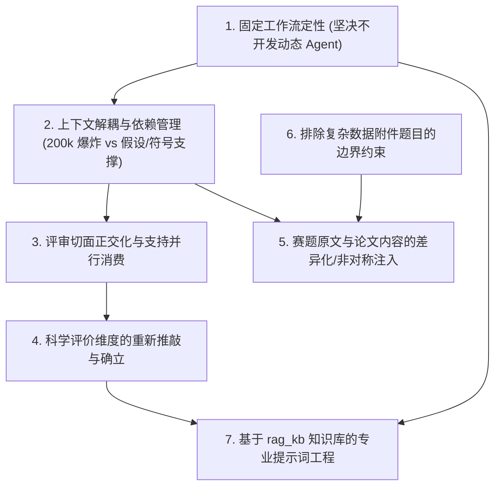
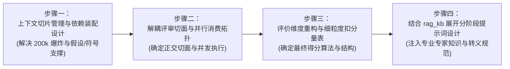

## 问题清单与架构挑战

### 一、背景与问题梳理定位

在确立了 V3 版本的核心特征全景与剪枝非目标之后，我们进入核心技术方案设计阶段。

构建一套既能深刻理解数模科学内涵、又具备工业级确定性与高并发吞吐的 AI 论文评审系统，面临着一系列严峻的技术权衡与架构挑战：
既不能为了图省事直接将 200k Tokens 的整篇论文单次暴力塞入，也不能简单粗暴地将章节切得粉碎而割裂了数学上下文依赖；既要保持固定工作流的确定性，又要释放各个评审切面并行消费的并发潜力。

本文正式梳理归纳 V3 必须解决的 **七大核心问题与架构矛盾**，理清它们之间的内在依赖拓扑，为后续由开发者主导逐一展开落地设计提供清晰的问题靶向。

---

### 二、核心问题与技术挑战清单

#### 1. 工作流形态定性：坚决采用固定工作流，不开发自主规划 Agent
*   **问题痛点**：
    *   当前行业常有滥用 Auto-Agent（自主思考规划 Agent）的倾向。让 LLM 自行决定先看哪里、后看哪里、何时调用工具。但在高并发的生产级微服务中，动态 Agent 的调用链路不可预测、时延极度离散（常因无意义的反思循环陷入数分钟卡顿）、偶发死循环率高，且无法做确定性的单元测试与全链路追踪。
*   **架构要求**：
    *   V3 明确采用**强类型、有向无环（DAG）、状态机可控的固定工作流（Workflow）**；
    *   流转拓扑在代码中静态固化，任务步骤、输入输出 schema、重试边界与落库终态完全由 Java 控制层主导，大模型仅作为单点步骤内的结构化推理算子，确保绝对的工程确定性。

#### 2. 上下文解耦与依赖管理：超长窗口质量劣化 vs 数学依赖割裂（核心矛盾！）
*   **问题痛点（超长上下文带来的质量灾难）**：
    *   一篇包含公式、表格与代码的数模论文转换为结构化 Token 后，上下文占用通常达到 **150k ~ 200k Tokens**；
    *   若一次性整篇塞入单个 Prompt，现代大模型不仅极易出现“迷失在中间（Lost in the middle）”、对正文关键推导视而不见，而且极易触发 8k Output Token 耗尽导致的 JSON 尾部截断崩溃，单次调用的失败成本高达数十万 Token。
*   **架构挑战（颗粒度拆分的“断裂陷阱”）**：
    *   解耦颗粒度**绝不能机械地按章节一刀切碎**！
    *   数学建模论文具有极强的“逻辑依赖链条”：
        *   正文各问的“数学建模与方程推导”，**必须以前置的“模型假设（Assumptions）”和“符号定义（Nomenclature）”为绝对前提**。如果只把“第二问”那两页纸切出来喂给大模型，模型在看不到符号含义与假设边界的情况下，根本无法推理公式对错；
        *   “求解算法核验”强依赖前面的“决策变量与目标函数”；
        *   “灵敏度分析”强依赖前面的“最优解数值与基准参数设定”。
*   **待解课题**：
    *   **如何设计科学的“上下文投影与依赖装配机制（Context Slicing & Dependency Assembly）”？**
    *   既要将每次调用的 Token 压缩至安全、高专注度的预算内（如 20k~40k），又要确保模型在评审某个问题时，能自动吸附并携带它所依赖的前置假设与符号切片。

#### 3. 评审切面正交化：将评审各部分拆解，支持并行消费与并发推理
*   **问题痛点**：
    *   如果各个拆分步骤依然是串行推进（先评第一问，再评第二问，再评第三问...），总耗时将是多次大模型调用的简单线性累加（$15s \times 6 = 90s+$），严重破坏交互体验与系统并发承载力。
*   **架构要求**：
    *   必须理清哪些评审方面是**无强前后依赖、语义正交的**；
    *   将这些正交的评审切面（Review Units / Aspects）解耦为独立执行单元，**在架构上全力支持并行并发消费（Parallel Consumption）**；
    *   多个切面同时调用大模型，最后由聚合器汇总，大幅将整体时延压缩到“最慢单个调用耗时”的水准。

#### 4. 评价维度的科学重构：推敲真正客观自洽的终态指标
*   **问题痛点**：
    *   V1 的 4 维度（假设、模型、结果、表述）过于粗糙；V2 的 6 维度固定量表虽然形式上做了算术闭环，但分项之间存在交叉重叠，打分依据仍不够客观。
*   **架构要求**：
    *   结合第 2 点与第 3 点拆分出来的解耦切面，重新推敲设计一套**科学、正交、能与具体 Findings 无缝映射的评价维度体系**；
    *   让每一个维度的得分都建立在确凿的子项证据上，而非主观赋分。

#### 5. 赛题原文与论文输入的非对称差异化注入
*   **问题痛点**：
    *   过去的评审要么不给题面（如 V1），要么把 4 万字题面一股脑全塞进所有请求（如 V2）。
*   **架构要求**：
    *   明确区分不同切面的输入需求：
        *   **强对照切面**（如问题重述、问题分析、题目覆盖度、约束响应）：**必须把题面原文（甚至赛题特定子问）作为基准（Ground Truth）精准输入**，否则模型无从判断参赛者是否理解透彻；
        *   **内生自洽切面**（如代码真实性核验、符号表格式完整性、三线表排版规范）：侧重于论文内部的自洽与规范，对题面全文依赖较弱，无需注入庞大题面消耗无谓 Token。

#### 6. 排除复杂数据附件题目的边界约束（继续严谨减法）
*   **问题痛点**：
    *   数模竞赛中有相当一部分题目（尤其是统计预测、大数据挖掘类题）自带庞大的数据附件（数百 MB 的 CSV、Excel、图像集）；
    *   若要深度评判这类题目，评审系统理论上需要先分析原始附件数据的分布、缺失情况才能评价学生洗数据洗得好不好。
*   **架构要求**：
    *   V3 明确在此划定剪枝红线：**暂不考虑对题目所携带的原始大型数据附件做深度分析与探索**；
    *   评审聚焦于学生在论文报告中展示的数据预处理逻辑、特征工程描述与结果三线表，不越界引入外部重型数据分析管道。

#### 7. 基于 `rag_kb/` 知识库的提示词工程研究（明确前序依赖）
*   **核心认知**：
    *   项目本地 `rag_kb/` 知识库中蕴含了大量数模专家阅卷经验与评阅要点，是构建专业高质量 Prompt 的无价知识宝库；
    *   但**“工作流架构是骨骼，提示词是血肉”**。在工作流阶段拆分、上下文依赖装配规则和输出数据契约尚未彻底锁定之前，盲目手写 Prompt 只会事倍功半。
*   **推进原则**：
    *   明确将**提示词深度设计**作为后续专题推进，其前置条件是：**必须先彻底确立并锁定 V3 的执行工作流与上下文装配机制**。

---

### 三、解决路线图与后续推进节奏

为避免信息过载，遵照开发者的指导节奏，后续将按以下顺序分步攻关、逐项突破：

通过以上自底向上、步步为营的推进顺序，确保每一个技术复杂点都在开发者的说明与主导下清晰拆解、彻底落地。
