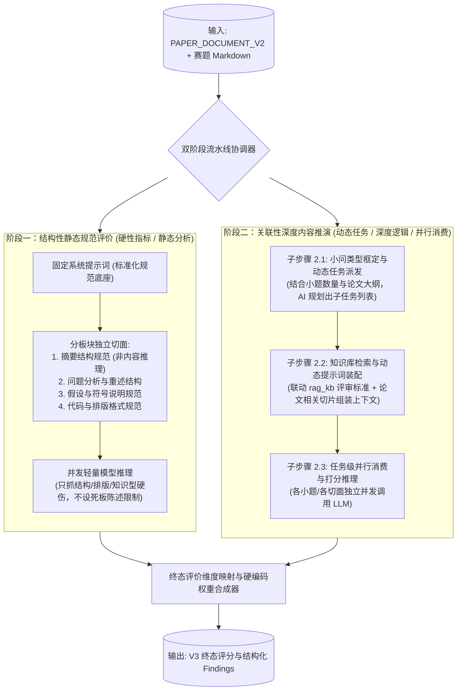
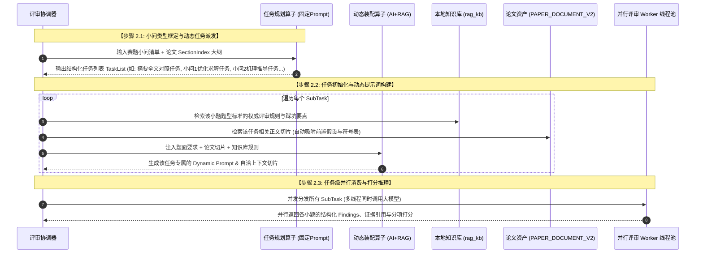

## 双阶段流水线与动态提示词架构设计

### 一、架构总览与核心哲学

针对数学建模论文“200k 超长上下文质量劣化、章节耦合但推理各异、大题下小问题型多变”的复杂现实，V3 确立了**“固定工作流骨架驱动 + 动态提示词自适应装配 + 双阶段解耦评审”**的核心架构。

#### 核心设计哲学
1. **固定工作流而非自主 Agent**：
   整体调度是确定性的 DAG 状态机，由 Java 领域服务严格控制推进，无死循环、无不可预测的动态游走。
2. **双阶段解耦融合**：
   将宏观评分拆分为“死板的规范评价（阶段一）”与“灵活的内容推演（阶段二）”，前者看骨架结构，后者看数学推理，分工极度明确。
3. **小题框定题型，不搞过度发散**：
   不以整个大题定性，而是将题目拆细到**“具体小问”**级别并框定题型（如优化、机理、统计），暂不考虑过于开放的“言之有理即可”，保证评价的客观锚定。

---

### 二、阶段一：结构性静态规范评价（硬性指标 / 静态规范）

#### 1. 定位与边界
*   **核心目标**：评估论文在学术规范、结构完整性与形式逻辑上的硬性质量。
*   **免推理原则**：不对论文的复杂数学推导进行深层验真，不做各章节之间的跨域关联推理，专注检查：
    - 结构是否完备（题目回顾、假设、符号表、正文、模型评价、参考文献、代码附录是否齐全）；
    - 符号说明是否包含变量名称、物理含义及量纲单位；
    - 是否存在明显的知识型错误或格式缺漏（如无任何公式标号、无图表说明）。

#### 2. 提示词设计原则：固定 Prompt 且“禁止死板陈述教条”
*   **固定提示词**：因为规范层面的评阅标准是全题型、全赛事统一的，因此阶段一全部采用**静态固定的系统提示词**，无动态生成开销。
*   **防千篇一律准则（极其关键！）**：
    *   提示词中**坚决不能规定死板的陈述顺序**（严禁出现“必须先讲 A、再讲 B、最后必须讲 C”）；
    *   数模表达具有高度灵活性，优秀论文的叙述方式各具特色。评价标准应聚焦于**“完整性、自洽性、连贯性与专业度”**，给作者的叙事逻辑留出充分自由度，避免造成评审引导下的“八股化趋同”。

---

### 三、阶段二：关联性深度内容推演（动态任务 / 深度逻辑 / 并行消费）

阶段二是解决“200k 超长上下文、内容理解、深层数学自洽与小题解答质量”的真正核心引擎，拆解为清晰的三步推进流水线：

#### 步骤 2.1：小问类型框定与动态任务派发（Task Planning）
*   **小题级类型框定**：
    *   题目通常包含 3~5 个小问，各小问类型往往不同（例如：小问 1 为时序预测，小问 2 为整数线性规划，小问 3 为多目标博弈，小问 4 为灵敏度分析）；
    *   预先定义清晰有限的**小问题型枚举（Sub-problem Categories）**，将每个小题划定类型，明确对应的解法考察偏好。
*   **动态任务清单生成**：
    *   由一个输入极为轻量的**固定提示词 AI 规划算子**，接收“赛题小问定义”与“论文目录大纲（`SectionIndex`）”；
    *   输出一份离散的子任务列表。例如：
        1.  `Task-Abstract-Consistency`：结合全文结论核验摘要真实性（防吹嘘）；
        2.  `Task-Question-1`：核查小问 1 的模型构建与求解结果，是否直接回答了问题；
        3.  `Task-Question-2`：核查小问 2 的机理推导与算法实现；
        4.  `Task-Sensitivity`：核查各问综合灵敏度分析与鲁棒性检验。

#### 步骤 2.2：知识库联动与动态提示词装配（Context & Prompt Assembly）
*   每个动态子任务在生成之初是“空白任务”，必须经过装配才能执行：
    1.  **检索 `rag_kb` 知识库**：提取该题型对应的专家评审要点、常见扣分陷阱与良好实践；
    2.  **提取 `PAPER_DOCUMENT_V2` 相关切片（解决依赖断裂的核心关键！）**：
        *   评价小问 2 时，**绝不能只切小问 2 的正文**；
        *   装配逻辑自动将前置的**“模型基本假设”**与**“符号说明表”**作为公共底座，与小问 2 的公式块、表格块与代码块组装到一起；
    3.  **动态生成专用 Prompt**：
        *   利用轻量 AI 算子完成相关性融合，输出该任务专属的系统提示词与输入上下文，既包含了题面要求与权威标准，又包含了完整自洽的数学前提。

#### 步骤 2.3：任务级并行消费与高效推理（Parallel Scalability）
*   装配完成后的各个子任务彼此正交、上下文独立，**完全支持并行消费**；
*   系统将所有任务投入 Worker 线程池并发调用底层模型，将数百页长论文的深度分析从原先串行等待数分钟，压缩到数十秒级别，实现极高的系统吞吐与弹性。

---

### 四、终态评价维度与硬编码权重合成

1.  **评价维度的预先固化**：
    *   虽然阶段二的任务划分是动态的，但**最终向用户与榜单交付的评价维度必须预先全局统一定义**；
    *   防止因论文结构微小差异导致每次输出的评价维度名称漂移、不可比较。
2.  **硬编码权重确定性结算**：
    *   阶段一（规范性得分）与阶段二（各小题内容推演得分），按照预设的**硬编码固定权重**进行最终合成；
    *   现阶段不引入复杂的动态自适应权重算法，保持可读、可测与可预期，由服务端代码进行纯数学求和，牢牢守住总分权威。

---

### 五、后续待细化攻坚模块清单（逐一展开路线）

按照开发者的说明与指导节奏，后续将按以下顺序逐个模块攻克与详细设计：

| 序号 | 攻坚模块 | 待解决的核心细节与产出 |
|:---:|:---|:---|
| **模块 1** | **小问题型枚举与分类标准定义** | 梳理主流数模小题的有限分类枚举（优化、机理、预测、评价等）及判定标准 |
| **模块 2** | **阶段一固定规范性评审切面定义** | 确立摘要、分析、符号、排版等静态切面的固定 Prompt 与非限制性准则 |
| **模块 3** | **阶段二动态任务派发契约设计** | 确立子任务列表的生成 Prompt、JSON Schema 与映射规则 |
| **模块 4** | **上下文切片装配与 `rag_kb` 联动机制** | 确立前置依赖（假设/符号）吸附算法、论文 Block 抽取与知识库注入协议 |
| **模块 5** | **终态评价维度清单与硬编码权重表** | 正式锁定最终交付的标准化评价维度及各阶段分值权重分布 |
