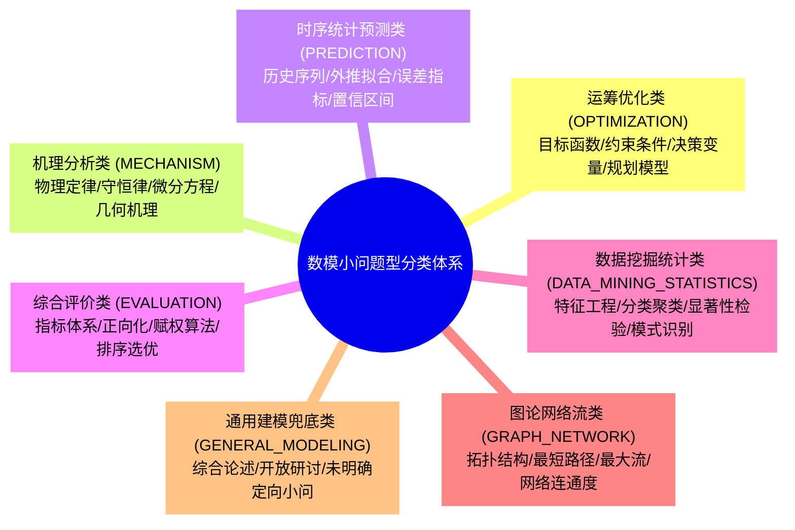
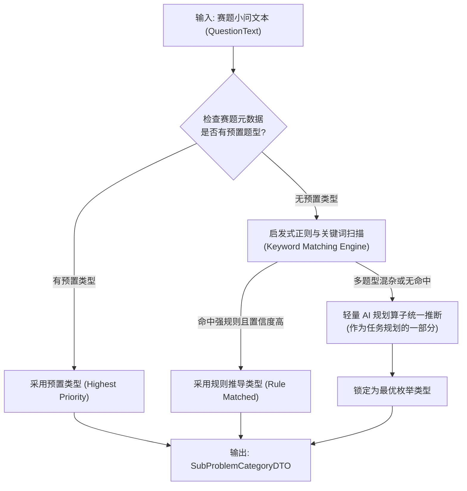

## 小问题型分类与判定标准


### 一、背景与设计定位

在数学建模竞赛中，赛题大题通常由 3~5 个递进或正交的“具体小问”构成。以往评审系统（如 V1、V2）以整篇大题为单位进行粗放评审，常常出现“小问 1 是预测、小问 2 是整数规划、小问 3 是灵敏度分析，但系统用同一套泛化标准混为一谈”的失真问题。

为了让大模型在后续的**动态任务派发**与**知识库精准检索（`rag_kb`）**中具备确定性指导，本规范确立**“以具体小问为粒度框定题型”**的核心机制。

本设计结合 `rag_kb/数学建模/题型方法/` 中的官方分类与评阅专家规律，制定数模小题有限分类枚举、判定规则、特征字段，并定义向下游阶段传递的统一契约 `SubProblemCategoryDTO`。


---


### 二、小问题型有限分类枚举定义

系统定义 6 大核心专业题型加 1 个通用兜底类型，共 7 种枚举类型（`SubProblemType`）：



| 题型代码 (`categoryCode`) | 中文名称 | 典型问题形态（关键词） | 典型数学模型族 | 核心解题偏好与评分抓手 |
|:---|:---|:---|:---|:---|
| `OPTIMIZATION` | 运筹优化类 | 最优、最省、最大收益、调度、排班、选址、资源分配、下料、路线规划、极值 | 线性规划 (LP)、整数/0-1规划 (ILP/MIP)、非线性规划 (NLP)、多目标规划、启发式算法 (GA/SA/PSO) | 决策变量、目标函数、约束条件三要素是否清晰；是否写出标准数学模型形式；求解器/算法收敛性；灵敏度与稳定性分析。 |
| `MECHANISM` | 机理分析类 | 过程刻画、模拟、机理、受力、能量守恒、运动轨迹、热传导、流体、传染病扩散 | 微分方程 (ODE/PDE)、动力系统、差分方程、几何解析模型、蒙特卡洛/元胞自动机物理仿真 | 方程推导物理意义；守恒定律与机理自洽性；假设合理性与简化辩护；参数标定与真实数据吻合度。 |
| `PREDICTION` | 时序统计预测类 | 预测、估计、未来走势、趋势外推、短期/长期预测、发病率、销售量、负荷预测 | ARIMA/SARIMA、指数平滑、灰色 GM(1,1)、回归分析、LSTM/GRU/ Prophet、随机森林回归 | 数据平稳性与差分检验；训练集与测试集划分；误差量化指标 (MAE/RMSE/MAPE)；多模型对比横向选优。 |
| `EVALUATION` | 综合评价类 | 评价、排序、选优、竞争力、健康度评估、评级、多指标考量、方案比选 | 层次分析法 (AHP)、TOPSIS、熵权法、变异系数法、模糊综合评价、主成分分析 (PCA)、秩和比 (RSR) | 评价指标体系构建合理性；数据极性正向化与无量纲化；主客观综合赋权合理性；一致性检验与排序灵敏度分析。 |
| `DATA_MINING_STATISTICS` | 数据挖掘统计类 | 分类、聚类、关联规则、异常检测、相关性分析、显著性检验、用户画像、图像/文本识别 | K-Means/DBSCAN、决策树/XGBoost、Logistic 回归、假设检验 ($t$/卡方/ANOVA)、皮尔逊/斯皮尔曼相关系数 | 数据缺失与清洗处理；特征工程；混淆矩阵、Precision/Recall/F1/AUC 评估；统计显著性 $p$ 值汇报。 |
| `GRAPH_NETWORK` | 图论网络流类 | 网络、最短路径、最小生成树、最大流、旅行商 (TSP)、路由选择、社区发现、复杂网络 | Dijkstra、Floyd-Warshall、Kruskal/Prim、Ford-Fulkerson、PageRank、复杂网络拓扑特征分析 | 节点与边权重物理定义；网络连通性；算法时间复杂度证明；大规模图启发式近似质量。 |
| `GENERAL_MODELING` | 通用建模兜底类 | 策略建议、开放设计、模型优缺点自评、灵敏度专项分析、综合总结 | 综合数学建模、通用仿真、定性与定量结合分析 | 逻辑自洽性、与前文小问结论呼应度、定量数据支撑力、现实可操作性。 |


---


### 三、小问题型判定规则与匹配机制

在真实系统中，题目小问的分类必须具备**“高确定性”与“零阻塞回退”**能力。系统设计采用**“显式题目元数据覆盖优先 + 文本启发式规则匹配 + LLM轻量分类兜底”**的三层分流策略：



#### 1. 启发式关键词与特征匹配字典

```java
// 核心关键词正则特征表（按优先级由高到低匹配）
Map<SubProblemType, List<Pattern>> TYPE_PATTERNS = Map.of(
    SubProblemType.OPTIMIZATION, List.of(
        Pattern.compile("(最[优佳省多大小时]|最大化|最小化|成本最低|利润最大|规划|调度|排班|选址|配置|路线)"),
        Pattern.compile("(linear programming|integer programming|optimization|schedule)")
    ),
    SubProblemType.MECHANISM, List.of(
        Pattern.compile("(微分方程|动力学|受力|守恒|物理过程|热传导|机理|流体|仿真模拟)"),
        Pattern.compile("(differential equation|mechanics|dynamic system|conservation)")
    ),
    SubProblemType.PREDICTION, List.of(
        Pattern.compile("(预测|估计|趋势|未来.*值|外推|时间序列|时序)"),
        Pattern.compile("(predict|forecast|time series|estimate|trend)")
    ),
    SubProblemType.EVALUATION, List.of(
        Pattern.compile("(评价|评估|排序|选优|指标体系|综合打分|权重|优劣)"),
        Pattern.compile("(evaluation|ranking|topsis|ahp|assessment)")
    ),
    SubProblemType.DATA_MINING_STATISTICS, List.of(
        Pattern.compile("(分类|聚类|关联|相关性|显著性|异常检测|回归分析|统计检验)"),
        Pattern.compile("(classification|clustering|anomaly|correlation|regression)")
    ),
    SubProblemType.GRAPH_NETWORK, List.of(
        Pattern.compile("(最短路径|网络流|最大流|生成树|图论|连通|节点|拓扑)"),
        Pattern.compile("(shortest path|network flow|graph|topology|mst)")
    )
);
```

#### 2. 复合小问的判定消解规则
数模题目经常出现“预测未来需求并据此进行最优生产调度”这类的复合形态：
*   **以终态交付为主要准则**：若小问核心动作是“安排生产/调度”，则将其定性为 `OPTIMIZATION`（预测仅作为其前置输入特征）；
*   **在关注要素中记录复合特征**：在 `SubProblemCategoryDTO` 的 `focusAspects` 中同时声明包含“前置预测”和“规划求解”，确保下游知识检索能同时获取两方面踩坑指南。


---


### 四、向下衔接规范：`SubProblemCategoryDTO` 契约定义

`SubProblemCategoryDTO` 是阶段二后续各模块的核心基准入参，承载了小题分类、求解要素与知识检索的锚点：

```java
package com.leetmodel.common.api.dto;

import lombok.AllArgsConstructor;
import lombok.Builder;
import lombok.Data;
import lombok.NoArgsConstructor;

import java.io.Serializable;
import java.util.List;

/**
 * 数模小问题型特征与考点标准契约。
 * 作为下游任务派发、知识库精准召回与动态上下文切片的唯一基准输入。
 */
@Data
@Builder
@NoArgsConstructor
@AllArgsConstructor
public class SubProblemCategoryDTO implements Serializable {
    private static final long serialVersionUID = 1L;

    /**
     * 小问编号 (从 1 递增，例如 1 代表第 1 小问，0 代表全篇综合/摘要)
     */
    private Integer questionNo;

    /**
     * 题型枚举代码 (大写)
     * 对应: OPTIMIZATION, MECHANISM, PREDICTION, EVALUATION,
     *       DATA_MINING_STATISTICS, GRAPH_NETWORK, GENERAL_MODELING
     */
    private String categoryCode;

    /**
     * 题型中文名 (例如: "运筹优化类")
     */
    private String categoryName;

    /**
     * 核心考点与关注要素清单
     * 例如: ["三要素规范定义", "精确求解器收敛曲线", "参数扰动灵敏度分析"]
     */
    private List<String> focusAspects;

    /**
     * 核心解法关键词 (用于知识检索与模型审查)
     * 例如: ["整数规划", "Lingo/Gurobi", "分支定界", "灵敏度扰动"]
     */
    private List<String> typicalMethods;

    /**
     * 期望捕获的证据资产类型
     * 对应 PaperDocumentV2 资产: ["FORMULA", "TABLE", "CODE", "FIGURE"]
     */
    private List<String> expectedEvidenceTypes;

    /**
     * 知识库检索场景代码与检索模板
     * 默认固定格式: "SCENE_REVIEW_" + categoryCode
     */
    private String retrievalScene;

    /**
     * 常见扣分硬伤警告 (踩坑防范点)
     * 例如: ["未列出决策变量物理量纲", "纯文字调包无数学公式", "无代码支撑"]
     */
    private List<String> commonPitfalls;
}
```

#### 字段含义与下游消费映射关系表

| 字段名 | 填充内容示例 | 下游消费者 | 作用与消费逻辑 |
|:---|:---|:---|:---|
| `questionNo` | `1` | 任务规划器、聚合器 | 唯一标识该考点所属小问，用于多问得分汇聚 |
| `categoryCode` | `OPTIMIZATION` | 任务规划器、Worker | 决定该小问套用的评分量表偏好与审查重点 |
| `focusAspects` | `["决策变量", "约束条件", "求解器"]` | 动态装配算子 | 注入任务 Prompt 中的“核心审查目标（Objectives）” |
| `typicalMethods` | `["整数规划", "启发式算法"]` | Worker 推理算子 | 引导模型核查正文是否采用规范数学方法而非伪建模 |
| `expectedEvidenceTypes` | `["FORMULA", "CODE", "TABLE"]` | 上下文切片提取器 | 指导切片器优先抽取正文的公式块与附录源码块 |
| `retrievalScene` | `SCENE_REVIEW_OPTIMIZATION` | `knowledge-retrieval` | 决定在知识库中匹配哪一类题型的权威评讲与踩坑指南 |
| `commonPitfalls` | `["通篇无标准规划模型"]` | 动态 Prompt 组装 | 注入系统提示词中的“致命与严重扣分雷区” |


---


### 五、七大题型标准参数预设表（系统字典内置）

系统在公共层内置七大题型的标准特征矩阵，供启发式识别与下游装配开箱即用：

```java
public static final Map<String, SubProblemCategoryDTO> DEFAULT_CATEGORY_TEMPLATES = Map.of(
    "OPTIMIZATION", SubProblemCategoryDTO.builder()
        .categoryCode("OPTIMIZATION")
        .categoryName("运筹优化类")
        .focusAspects(List.of("决策变量物理意义", "目标函数标准表达", "约束条件完备性", "求解器收敛过程", "最优解现实可行性", "灵敏度扰动"))
        .typicalMethods(List.of("线性规划", "整数规划", "0-1规划", "非线性规划", "多目标规划", "遗传算法", "模拟退火", "粒子群", "Cplex/Gurobi/Lingo"))
        .expectedEvidenceTypes(List.of("FORMULA", "TABLE", "CODE", "FIGURE"))
        .retrievalScene("SCENE_REVIEW_OPTIMIZATION")
        .commonPitfalls(List.of("未列出三要素标准数学公式", "无代码支撑或伪造求解", "灵敏度仅文字敷衍无数据图表"))
        .build(),

    "MECHANISM", SubProblemCategoryDTO.builder()
        .categoryCode("MECHANISM")
        .categoryName("机理分析类")
        .focusAspects(List.of("物理/化学定律来源", "守恒方程推导完整性", "假设简化依据与边界", "参数标定真实性", "数值解法规范性", "误差分析"))
        .typicalMethods(List.of("常微分方程ODE", "偏微分方程PDE", "动力系统", "元胞自动机", "蒙特卡洛模拟", "差分方程"))
        .expectedEvidenceTypes(List.of("FORMULA", "FIGURE", "TABLE", "CODE"))
        .retrievalScene("SCENE_REVIEW_MECHANISM")
        .commonPitfalls(List.of("孤立拼凑公式无推导链条", "假设违背基本物理常识", "参数无标定依据拍脑袋给出"))
        .build(),

    "PREDICTION", SubProblemCategoryDTO.builder()
        .categoryCode("PREDICTION")
        .categoryName("时序统计预测类")
        .focusAspects(List.of("数据预处理与平稳性检验", "训练集测试集划分", "预测值明确报出", "误差指标量化(MAE/RMSE/MAPE)", "多模型横向对比"))
        .typicalMethods(List.of("ARIMA", "指数平滑", "灰色预测GM(1,1)", "多元回归", "LSTM", "随机森林回归", "Prophet"))
        .expectedEvidenceTypes(List.of("TABLE", "FIGURE", "FORMULA", "CODE"))
        .retrievalScene("SCENE_REVIEW_PREDICTION")
        .commonPitfalls(List.of("无具体数值报出空谈趋势", "无测试集验证自说自话", "直接拿原始带噪数据无脑拟合"))
        .build(),

    "EVALUATION", SubProblemCategoryDTO.builder()
        .categoryCode("EVALUATION")
        .categoryName("综合评价类")
        .focusAspects(List.of("评价指标体系完整性", "正向化与无量纲化处理", "主客观综合赋权依据", "一致性检验", "评价排序结果直观性"))
        .typicalMethods(List.of("TOPSIS", "层次分析法AHP", "熵权法", "变异系数法", "模糊综合评价", "主成分分析PCA", "秩和比RSR"))
        .expectedEvidenceTypes(List.of("TABLE", "FORMULA", "FIGURE"))
        .retrievalScene("SCENE_REVIEW_EVALUATION")
        .commonPitfalls(List.of("指标未做极性统一或标准化", "主观赋权随意无一致性检验", "结果无敏感性讨论"))
        .build(),

    "DATA_MINING_STATISTICS", SubProblemCategoryDTO.builder()
        .categoryCode("DATA_MINING_STATISTICS")
        .categoryName("数据挖掘统计类")
        .focusAspects(List.of("数据清洗与缺失异常处理", "特征选择与降维", "统计显著性检验p值", "分类/聚类有效性指标(AUC/F1/轮廓系数)", "可解释性"))
        .typicalMethods(List.of("K-Means", "DBSCAN", "XGBoost", "SVM", "假设检验", "卡方检验", "ANOVA", "随机森林"))
        .expectedEvidenceTypes(List.of("FIGURE", "TABLE", "CODE", "FORMULA"))
        .retrievalScene("SCENE_REVIEW_STATISTICS")
        .commonPitfalls(List.of("纯调包不解释特征意义", "样本不均衡无处理", "无独立测试集评估指标"))
        .build(),

    "GRAPH_NETWORK", SubProblemCategoryDTO.builder()
        .categoryCode("GRAPH_NETWORK")
        .categoryName("图论网络流类")
        .focusAspects(List.of("网络拓扑图定义清晰度", "节点与边权物理定义", "算法收敛性与复杂度", "瓶颈与流量平衡性", "方案可视化路线"))
        .typicalMethods(List.of("Dijkstra", "Floyd", "Kruskal", "Prim", "最大流最小割", "动态规划", "网络单纯形法"))
        .expectedEvidenceTypes(List.of("FIGURE", "FORMULA", "CODE", "TABLE"))
        .retrievalScene("SCENE_REVIEW_GRAPH")
        .commonPitfalls(List.of("网络边权无现实物理意义", "图规模过大时无复杂度分析导致算力崩溃"))
        .build(),

    "GENERAL_MODELING", SubProblemCategoryDTO.builder()
        .categoryCode("GENERAL_MODELING")
        .categoryName("通用建模兜底类")
        .focusAspects(List.of("对题意的准确理解", "前后逻辑自洽性", "模型优缺点自评客观性", "结论有据可查"))
        .typicalMethods(List.of("数学建模综合方法", "对比分析", "定性与定量结合"))
        .expectedEvidenceTypes(List.of("FORMULA", "TABLE", "FIGURE", "CODE"))
        .retrievalScene("SCENE_REVIEW_GENERAL")
        .commonPitfalls(List.of("严重跑题答非所问", "纯文科空谈无任何定量分析"))
        .build()
);
```


---


### 六、小结与后续衔接

本设计完成了**任务 1**的所有目标：
1. 明确定义了数模小题的有限分类枚举与特征矩阵；
2. 确立了“元数据覆盖 + 规则正则匹配 + LLM规划推断”的多级判定策略；
3. 固化了向下游输出的标准 `SubProblemCategoryDTO`，为后续任务规划算子（任务 3）、知识库检索（任务 4）与并行消费（任务 5）奠定了强类型基础。
