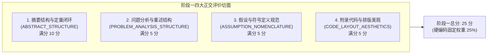
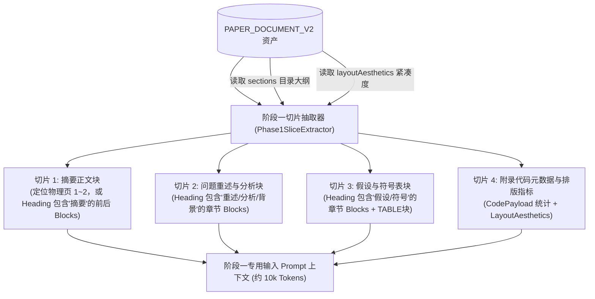

## 阶段一结构规范性评审设计


### 一、定位与免推理原则

在数学建模竞赛中，论文的学术规范、结构骨架与形式逻辑构成了整篇作品的“门面与底线”。若在正文复杂的数学推理中夹杂排版与格式评价，不仅会导致提示词庞杂散焦，而且极易出现因公式推理耗费大量 Token 导致格式评价草草了事。

因此，AI评审V3 将结构与规范性评价抽离为完全独立的**阶段一（Phase 1: Structural & Static Review）**。

#### 核心原则：
1. **免深层推理原则（Static Evaluation Without Deep Math Inference）**：
   不推演复杂的微积分方程是否正确，不检验优化求解算法的收敛精度，不深究预测模型的未来数值走势。专注评价结构是否完备、符号是否自洽、代码附录是否存在、排版是否达标。
2. **防教条准则（Anti-Dogmatic Flexibility — 极其关键！）**：
   **严禁大模型要求死板的八股陈述顺序**。例如：不得强制要求“必须先讲背景、再讲现状、最后讲思路”；不得强制要求论文标题必须一字不差叫做“模型的假设与符号说明”。只要参赛论文具备清晰的叙述逻辑与完整要素，无论作者采用总分式、并列式、递进式还是导向式表达，均视为优秀表达。
3. **低成本极速推理（Low-Cost Fast Triage）**：
   仅抽取论文骨架与规范切片（约 8k~12k Tokens），无需输入整篇论文的全部细节，单次轻量调用即可在 5~8 秒内产出确凿的静态规范分。


---


### 二、阶段一四大正交评审切面（Aspects）

阶段一分为 4 个高度正交的独立评价切面：



#### 1. 切面 1：摘要结构与定量闭环（`ABSTRACT_STRUCTURE`，基准满分 10 分）
*   **核心关注点**：
    - **四要素完备度**：是否覆盖“问题背景与目标、建模机理、求解算法/工具、量化成果”；
    - **关键数值报出率（定量闭环）**：是否报出了核心指标、决策参数、最优解数值或预测误差指标（如“最优成本 12.8 万元”、“误差 $MAPE=3.2\%$”），严禁全篇只有“我们成功建立了模型并得出了满意解”等定性空话；
    - **字数与紧凑度**：篇幅是否在 600~1200 字合理区间内，信息密度高。
*   **扣分阶梯**：
    - 全篇无具体数字指标报出（纯定性空话）：扣 4~6 分；
    - 缺失核心要素（完全不提采用了何种算法或模型）：扣 2~3 分；
    - 摘要过短（少于 300 字）或过于冗长（超过一整页）：扣 1~2 分。

#### 2. 切面 2：问题分析与重述结构（`PROBLEM_ANALYSIS_STRUCTURE`，基准满分 5 分）
*   **核心关注点**：
    - **题意理解准确性**：是否切中赛题背景与实际工程/经济诉求；
    - **分析逻辑连贯性**：是否对题目各小问进行了条理清晰的梳理；
    - **【防教条要求】**：作者可以在重述中直接融入分析，也可以先背景后重述，或者画出整体思维导图。形式不限，重点看是否体现出真正的“问题剖析”。
*   **扣分阶梯**：
    - 简单机械照抄赛题原文、无任何分析与思考展开：扣 2~3 分；
    - 遗漏赛题核心问题或曲解题意目标：扣 2~3 分。

#### 3. 切面 3：假设与符号说明规范（`ASSUMPTION_NOMENCLATURE`，基准满分 5 分）
*   **核心关注点**：
    - **假设的适度性与辩护**：假设是否具备合理现实依据，是否说明了简化的合理性（严禁违背常识的荒谬假设）；
    - **符号说明规范（三要素）**：是否具备规范的符号说明表，且符号三要素齐全（**变量名符号、清晰物理意义、国际标准量纲单位**）；
    - **前后一致性**：符号表中定义的变量是否在后续公式中被使用，符号命名是否规范（如避免同一字母代表不同含义）。
*   **扣分阶梯**：
    - 无符号说明表且符号在正文中随意散落：扣 2~3 分；
    - 符号说明缺乏物理量纲/单位：扣 1~2 分；
    - 出现脱离现实常识且未做任何辩护的荒谬假设：扣 2~3 分。

#### 4. 切面 4：附录代码与排版美观（`CODE_LAYOUT_AESTHETICS`，基准满分 5 分）
*   **核心关注点**：
    - **附录代码真实性**：直接消费 `PaperDocumentV2.blocks` 中的 `CODE` 块；核查附录是否有真实代码支撑，代码是否有整块缩进与注释，杜绝仅有 3 行空壳代码或无代码；
    - **排版与三线表消费**：直接读取 `PaperDocumentV2.layoutAesthetics` 中的量化指标（`overallScore`、`pageCompactness`、`typesettingQuality`）；
    - **图表规范**：正文图表是否有规范图名、表名，表格是否尽量采用三线表。
*   **扣分阶梯**：
    - 正文宣称使用了复杂模型但附录完全空白、无任何源码：扣 3~4 分；
    - 排版极度松散混乱（美观度得分低于 60 分）：扣 2~3 分；
    - 图表通篇无标题或编号混乱：扣 1~2 分。


---


### 三、从 `PAPER_DOCUMENT_V2` 的切片抽取逻辑

为了不让阶段一被 200k 全文淹没，服务层采用**“结构索引精确定位抽取算法”**：



#### 精确抽取规则：
1. **摘要切片抽取**：
   - 遍历 `sections`，查找 `title` 包含 `摘要` 或 `Summary` 的节；若大纲中无显式标题，则提取第 1 页全部 `PARAGRAPH` 块（通常前 800 字即为摘要）；
2. **问题分析切片抽取**：
   - 查找 `sections` 中 `title` 匹配 `问题重述|问题分析|背景|问题提出` 的 section，抽取其直属的 `PARAGRAPH` 块；
3. **假设与符号表抽取**：
   - 查找 `sections` 中 `title` 匹配 `假设|符号` 的 section；
   - 抽取该章节内的所有 `PARAGRAPH` 块以及 `TABLE` 块（若符号表被解析为 HTML table，则提取该 HTML 片段）；
4. **排版与代码元数据抽取**：
   - 抽取 `PaperDocumentV2.layoutAesthetics` 字段全量信息；
   - 统计 `blocks` 中 `type == CODE` 的数量、总行数、编程语言分布及首尾代码片段（前 30 行与末尾 30 行），避免把数万行附录代码全部填塞进上下文。


---


### 四、固定系统提示词设计（防教条准则落地）

由于阶段一的标准是普适的，采用固定提示词，并严格落实花括号隔离与 JSON 输出规范：

#### 1. 系统提示词模板（`prompts/phase1-structural-review.st`）

```text
你是全国大学生数学建模竞赛与美赛的资深评审专家，专职负责论文的第一阶段：结构完整性与学术规范性静态审查。

【评审定位与免推理原则】
1. 本阶段仅对论文的形式结构、学术规范、完整性与排版质量进行静态客观评价。
2. 不对深入的微积分推导或高级算法收敛性做数学级验真，重点审查学术态度、要素完备度与基本逻辑。

【核心防教条与防死板陈述准则 —— 必须严格遵守！】
1. 严禁规定死板的叙述顺序！不得强制要求论文必须“先讲A、再讲B、最后讲C”。作者无论是采用总分式、递进式、由浅入深还是并列式的论述体系，只要逻辑清晰、要素齐全，均视为合格与优秀。
2. 严禁对章节标题做字面限制！作者将问题重述与问题分析合并写、或者将符号表放在模型各章节内部，只要易于阅读且前后自洽，不得苛扣分数。
3. 评价尺度以“自洽性、完整性、清晰度、学术诚信”为准绳，鼓励特色表达，杜绝“数模八股文”引导。

【四个独立评价切面与评分准则 (总分 25 分)】
1. 摘要结构与定量闭环 (ABSTRACT_STRUCTURE, 满分 10 分):
   - 四要素：问题、模型、算法、结论是否清晰交代；
   - 定量成果报出：是否报出了具体的数值指标、最优参数或误差水平（严禁通篇空话无数字）；
2. 问题重述与分析结构 (PROBLEM_ANALYSIS_STRUCTURE, 满分 5 分):
   - 是否准确切题，是否体现出参赛者的独立思考与问题拆解，而非机械照抄赛题；
3. 假设与符号说明规范 (ASSUMPTION_NOMENCLATURE, 满分 5 分):
   - 假设是否合理适度、有无违背常识的荒谬简化；
   - 符号表是否定义清晰，是否包含变量名、物理含义及国际标准单位量纲；
4. 附录代码与排版美观 (CODE_LAYOUT_AESTHETICS, 满分 5 分):
   - 正文与附录代码是否真实匹配，有无源码支持；
   - 排版是否紧凑整洁、图表是否有标号与清晰说明。

【输出格式要求】
你必须直接输出符合 JSON 格式的对象，严禁包含任何前缀闲聊或 Markdown 围栏。
输出 JSON 结构规范：
{
  "score": 23.5,
  "aspects": [
    {
      "aspectCode": "ABSTRACT_STRUCTURE",
      "aspectName": "摘要结构与定量闭环",
      "maxScore": 10.0,
      "score": 9.0,
      "reason": "得分详细评语，必须结合具体事实陈述",
      "findingIds": ["F_P1_001"]
    }
  ],
  "findings": [
    {
      "findingId": "F_P1_001",
      "aspectCode": "ABSTRACT_STRUCTURE",
      "type": "STRENGTH",
      "severity": "LOW",
      "statement": "摘要结构规范，清晰给出了问题一的最优定价为 32.4 元等关键量化数值。",
      "blockId": "B0003",
      "physicalPage": 1
    }
  ]
}
```


---


### 五、向下衔接规范：`Phase1StructuralReviewResultDTO` 契约定义

阶段一产出的结构化 DTO 必须无缝对接终态汇聚器（Reducer）：

```java
package com.leetmodel.common.api.dto;

import lombok.AllArgsConstructor;
import lombok.Builder;
import lombok.Data;
import lombok.NoArgsConstructor;

import java.io.Serializable;
import java.math.BigDecimal;
import java.util.List;

/**
 * 阶段一结构性静态规范评价结果契约。
 * 直接交付下游终态汇聚器消费，与阶段二并发结果进行矩阵式映射。
 */
@Data
@Builder
@NoArgsConstructor
@AllArgsConstructor
public class Phase1StructuralReviewResultDTO implements Serializable {
    private static final long serialVersionUID = 1L;

    /**
     * 阶段一总得分 (满分 25.0，精确到小数点后一位)
     * 校验规则: score == sum(aspects.score)
     */
    private BigDecimal score;

    /**
     * 阶段一基准满分 (固定 25.0)
     */
    private BigDecimal maxScore;

    /**
     * 四大静态切面分项打分
     */
    private List<StructuralAspectScore> aspects;

    /**
     * 阶段一提取的静态客观 Findings 证据列表
     */
    private List<StructuralFindingDTO> findings;

    @Data
    @Builder
    @NoArgsConstructor
    @AllArgsConstructor
    public static class StructuralAspectScore implements Serializable {
        private static final long serialVersionUID = 1L;

        /**
         * 切面代码: ABSTRACT_STRUCTURE, PROBLEM_ANALYSIS_STRUCTURE,
         *           ASSUMPTION_NOMENCLATURE, CODE_LAYOUT_AESTHETICS
         */
        private String aspectCode;
        private String aspectName;
        private BigDecimal maxScore;
        private BigDecimal score;
        private String reason;
        private List<String> findingIds;
    }

    @Data
    @Builder
    @NoArgsConstructor
    @AllArgsConstructor
    public static class StructuralFindingDTO implements Serializable {
        private static final long serialVersionUID = 1L;

        private String findingId;
        private String aspectCode;
        /** 类型: STRENGTH, ISSUE */
        private String type;
        /** 严重程度: BLOCKING, HIGH, MEDIUM, LOW */
        private String severity;
        private String statement;
        /** 关联的细粒度 blockId (可空) */
        private String blockId;
        /** 关联物理页码 */
        private Integer physicalPage;
    }
}
```


---


### 六、小结与后续衔接

本设计完成了**任务 2**的所有要求：
1. 锁定了阶段一 4 大正交切面与 25 分基准分权；
2. 制定并落地了防教条、防死板叙事限制的评分尺度与 Prompt 准则；
3. 确立了从 `PAPER_DOCUMENT_V2` 的轻量切片提取算法（将 Token 压缩至 10k 内）；
4. 规范了向下游终态汇聚器传递的标准契约 `Phase1StructuralReviewResultDTO`。
