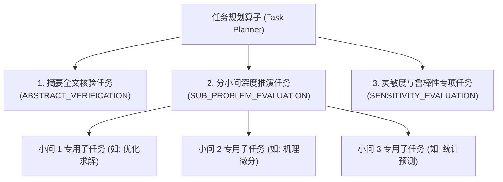
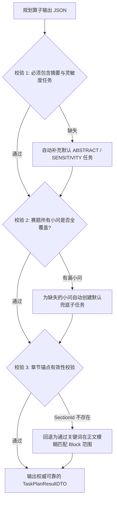

## 阶段二动态任务规划契约设计


### 一、背景与规划算子定位

在 AI评审V3 中，阶段二是真正进行**深度数学推导、算法核验与数值真伪鉴定**的核心引擎。数模论文长达 150k~200k Tokens，如果试图在一个 Prompt 里让模型既评第一问、又评第二问、还评灵敏度和摘要真实性，必然导致长上下文注意力涣散与 Output 截断崩溃。

因此，阶段二采用**“任务分解 -> 独立装配 -> 并发消费”**的分布式思想。

本篇设计的**任务规划算子（Task Planner Operator）**，是阶段二流水线的第一道关卡：
1. **轻量输入**：接收“赛题小问清单与题型定义（`SubProblemCategoryDTO`）”与“论文目录大纲（`SectionIndex`）”；
2. **固定系统 Prompt**：通过确定性语义对齐，将复杂论文拆解为相互正交、指导明确的离散子任务；
3. **向下衔接协议（核心突破！）**：输出携带完备元数据的 `SubTaskPlanDTO`，100% 确定性指导下游进行切片抽取与知识库检索。


---


### 二、子任务类型划分（SubTask Types）

系统将阶段二的子任务划分为三大标准类型：



#### 1. `ABSTRACT_VERIFICATION`（摘要全文对照核验任务，固定 1 个）
*   **目标**：解决数模中极其普遍的“摘要吹嘘、正文无货”问题。
*   **审查内容**：核查摘要中所报出的模型名称、核心算法、最优数值指标，在论文正文和结果表格中是否能找到确凿证据支撑，识别“两张皮”作弊现象。
*   **关联锚点**：覆盖摘要章节与正文全篇核心结果表。

#### 2. `SUB_PROBLEM_EVALUATION`（分小问深度推演任务，N 个，按题目小问数离散化）
*   **目标**：针对赛题的每一个具体小问（问题 1、问题 2...），进行模型建立、公式推导、算法求解与结果分析的纵深审查。
*   **特性**：每个小问独立对应一个子任务，携带该小问专属的 `SubProblemCategoryDTO`（题型代码、核心关注点、方法偏好）。
*   **关联锚点**：精准映射到论文正文中负责解答该小问的对应章节大纲及 Blocks 范围。

#### 3. `SENSITIVITY_EVALUATION`（灵敏度与鲁棒性专项任务，固定 1 个）
*   **目标**：专项审查模型的稳定性、参数扰动分析、误差分析与鲁棒性验证。
*   **审查内容**：核查正文是否仅用一句空话敷衍“经检验模型灵敏度良好”，还是真正绘制了扰动折线图/热力图、计算了扰动比率、并给出了管理或工程决策建议。
*   **关联锚点**：定位至“模型检验”、“灵敏度分析”、“误差分析”或“模型评价”等章节。


---


### 三、规划算子固定提示词设计（Task Planner Prompt）

规划算子不接触论文正文数万字细节，仅接收结构化大纲与题目小问，输入开销仅约 2k Tokens，执行耗时通常低于 3 秒。

#### 系统提示词（`prompts/phase2-task-planner.st`）

```text
你是全国大学生数学建模竞赛评审系统的任务规划算子。
你的唯一职责是：依据“赛题小问清单”和参赛论文的“目录大纲(SectionIndex)”，生成一份离散且可指导下游初始化的子任务清单。

【输入数据】
1. 赛题小问列表：包含各小题题号、题意描述及已判定的题型代码；
2. 论文目录大纲 (SectionIndex)：包含论文全部章节的 sectionId、标题 title、层级 level、标题块 headingBlockId 与物理页码 physicalPage。

【规划拆解规则】
1. 必须生成且仅生成一个 ABSTRACT_VERIFICATION 任务：
   - 考点：全文对照核验摘要真实性，核对摘要提及的方法与数字在正文中是否有真实对应。
2. 必须为赛题的每个有效小问生成独立的 SUB_PROBLEM_EVALUATION 任务：
   - 仔细分析论文的 SectionIndex 章节标题，将论文章节准确映射到对应的小题上；
   - 例如：若章节包含“问题一的求解”、“四、需求预测模型”，应将其关联至对应的小题；
   - 若多个小问被作者合并在同一大章内，允许该大章被多个子任务同时引用；
3. 必须生成一个 SENSITIVITY_EVALUATION 任务：
   - 检索大纲中包含“灵敏度”、“检验”、“误差”、“鲁棒性”、“评价与推广”等标题的章节。

【输出格式要求】
严格输出 JSON，格式如下：
{
  "tasks": [
    {
      "taskId": "TASK_ABSTRACT_VERIFY",
      "taskType": "ABSTRACT_VERIFICATION",
      "taskName": "摘要全文自洽性对照核验",
      "targetQuestionNo": 0,
      "categoryCode": "GENERAL_MODELING",
      "suggestedSectionIds": ["SEC_01", "SEC_SUMMARY"],
      "evaluationObjectives": [
        "核查摘要陈述的模型在正文中是否真实存在",
        "核查摘要报出的具体数值是否与正文结果表格吻合"
      ]
    },
    {
      "taskId": "TASK_Q1_EVAL",
      "taskType": "SUB_PROBLEM_EVALUATION",
      "taskName": "问题一数学建模与求解审查",
      "targetQuestionNo": 1,
      "categoryCode": "OPTIMIZATION",
      "suggestedSectionIds": ["SEC_04"],
      "evaluationObjectives": [
        "审查决策变量、目标函数与约束条件三要素是否完整",
        "核查是否使用了规范的求解器并报告了收敛过程"
      ]
    }
  ]
}
```


---


### 四、核心衔接突破：`SubTaskPlanDTO` 与派发元数据协议

为了让派发出的任务能够 100% 确定性地指导下一步的上下文切片装配（步骤 2.2），`SubTaskPlanDTO` 设计了完备的指导元数据：

```java
package com.leetmodel.common.api.dto;

import lombok.AllArgsConstructor;
import lombok.Builder;
import lombok.Data;
import lombok.NoArgsConstructor;
import java.io.Serializable;
import java.util.List;

/**
 * 阶段二动态任务规划输出契约。
 * 承载了单个评审子任务的全部元数据，作为步骤 2.2 任务初始化的唯一指导依据。
 */
@Data
@Builder
@NoArgsConstructor
@AllArgsConstructor
public class SubTaskPlanDTO implements Serializable {
    private static final long serialVersionUID = 1L;

    /**
     * 唯一任务标识 (例如: TASK_ABSTRACT_VERIFY, TASK_Q1_EVAL, TASK_Q2_EVAL, TASK_SENSITIVITY_EVAL)
     */
    private String taskId;

    /**
     * 任务类型: ABSTRACT_VERIFICATION, SUB_PROBLEM_EVALUATION, SENSITIVITY_EVALUATION
     */
    private String taskType;

    /**
     * 任务中文展示名 (例如: "问题一模型建立与求解核验")
     */
    private String taskName;

    /**
     * 目标小问编号 (1..N，0 代表摘要或全局灵敏度)
     */
    private Integer targetQuestionNo;

    /**
     * 该小题绑定的题型特征标准 (无缝继承任务 1 成果)
     */
    private SubProblemCategoryDTO subProblemCategory;

    /**
     * 推荐关联的论文大纲章节锚点清单
     */
    private List<SectionAnchorDTO> suggestedSectionAnchors;

    /**
     * 该任务的具体考点与评价目标
     * 例如: ["三要素规范性", "求解器收敛验证", "约束条件边界讨论"]
     */
    private List<String> evaluationObjectives;

    /**
     * 下游知识库检索 query 建议
     * 例如: "运筹优化类 整数规划 求解器收敛 踩坑指南"
     */
    private String suggestedKnowledgeQuery;

    @Data
    @Builder
    @NoArgsConstructor
    @AllArgsConstructor
    public static class SectionAnchorDTO implements Serializable {
        private static final long serialVersionUID = 1L;

        /** 章节唯一标识 (对应 PaperDocumentV2.SectionIndex.sectionId) */
        private String sectionId;
        /** 章节标题 */
        private String title;
        /** 章节标题所在的起始 blockId (如 B0024) */
        private String startBlockId;
        /** 章节结束 blockId (下一个同级/上级标题的前一个 Block) */
        private String endBlockId;
        /** 章节起始物理页码 */
        private Integer physicalPage;
        /** 匹配置信度 (0.0 ~ 1.0) */
        private Double matchConfidence;
    }
}
```

#### 规划产物容器契约：`TaskPlanResultDTO`

```java
package com.leetmodel.common.api.dto;

import lombok.AllArgsConstructor;
import lombok.Builder;
import lombok.Data;
import lombok.NoArgsConstructor;
import java.io.Serializable;
import java.util.List;

/**
 * 规划算子全局执行产物。
 */
@Data
@Builder
@NoArgsConstructor
@AllArgsConstructor
public class TaskPlanResultDTO implements Serializable {
    private static final long serialVersionUID = 1L;

    /** 赛题总小问数 */
    private Integer totalQuestions;
    /** 生成的子任务列表 (大小通常为 totalQuestions + 2) */
    private List<SubTaskPlanDTO> tasks;
    /** 规划算子使用的模型执行版本 */
    private String plannerModelVersion;
}
```


---


### 五、规划结果校验与容错保底（Fail-Safe Verification）

大模型的规划输出在进入步骤 2.2 前，必须由服务端 Java 代码执行严格的确定性校验，防止漏题或锚点断裂：



1. **小问覆盖完整性兜底**：
   - 遍历赛题预置的所有 `questionNo`（1 到 N），若 AI 输出遗漏了某个小题（如漏了第 3 问），服务端自动补充生成 `TASK_Q3_EVAL`，并赋予 `GENERAL_MODELING` 默认类型；
2. **章节锚点有效性兜底**：
   - 校验 `suggestedSectionIds` 中的 ID 是否真实存在于 `PaperDocumentV2.sections`；
   - 若 AI 编造了不存在的 ID，系统根据小问序号（如“一、”、“二、”、“问题 1”）自动在 `SectionIndex` 中做前缀搜索修复；
3. **Block 范围计算**：
   - 服务端根据章节锚点的 `headingBlockId`，自动向后扫描直到遇到下一个同级或高级 `HEADING` 块，精确计算出该章节闭包内的 `startBlockId` 与 `endBlockId`。


---


### 六、小结与后续衔接

本设计完成了**任务 3**的所有目标：
1. 明确了阶段二三大子任务类型及其分工；
2. 完成了任务规划算子的固定系统 Prompt 与轻量输入构建；
3. 确立了向下游无缝传递的强类型元数据契约 `SubTaskPlanDTO` 与 `TaskPlanResultDTO`；
4. 建立了服务端对漏题、锚点失效的确定性兜底与容错算法。
