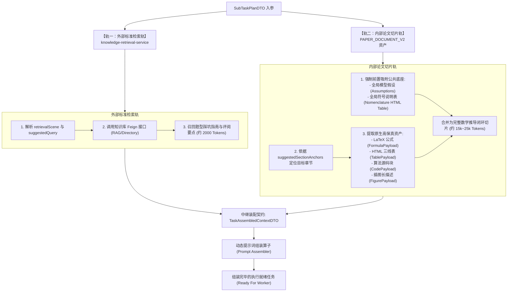

## 上下文切片装配与知识库联动机制


### 一、背景与装配流水线定位

在 AI评审V3 中，任务规划算子输出了一组携带元数据的 `SubTaskPlanDTO`。但这些子任务在生成之初是“离散的规划定义”，不能直接喂给大模型。

如果直接拿规划出的章节去调用大模型，必然陷入两大灾难：
1. **数学依赖割裂**：如果只把“第二问”那几页纸切出来给大模型，由于缺乏前置的**假设边界**与**符号说明定义**，大模型看到的公式全是未定义符号（如未知参数 $\alpha, \beta$），导致产生大量“符号未定义”的虚假负向报错（False Positives）；
2. **无客观标准尺度的瞎猜**：若大模型缺乏外部专家评审细则的约束，容易仅凭泛泛而谈的常识评价，无法指出诸如“遗传算法未绘制收敛曲线”、“未进行灵敏度扰动检验”等数模专业扣分点。

因此，本篇设计的**任务初始化与上下文切片装配机制（Context & Prompt Assembly Engine）**，通过**“双轨内容筛选 + 前置依赖强吸附 + 动态提示词安全装配”**，为每个子任务构建出 25k~35k Tokens 的自洽高信噪比上下文。


---


### 二、双轨内容筛选流水线（Double-Track Pipeline）

每个子任务的上下文由“外部权威标准轨”与“内部论文切片轨”双轨汇聚而成：




---


### 三、轨一：外部标准检索联动机制（RAG Integration）

#### 1. 接口调用与参数契约
服务通过 Spring Cloud OpenFeign 调用 `knowledge-retrieval-service`：

```java
KnowledgeRetrievalRequestDTO request = new KnowledgeRetrievalRequestDTO();
request.setWorkflowVersion(KnowledgeRetrievalService.AI_DIRECTORY_V1); // 或 HYBRID_RETRIEVAL_V1
request.setScene(subTaskPlan.getSubProblemCategory().getRetrievalScene());
request.setQuery(buildRetrievalQuery(subTaskPlan));
request.setTopK(4);
request.setTokenBudget(2500); // 严格控制在 2.5k Tokens 内

Result<KnowledgeRetrievalResultDTO> result = knowledgeRetrievalFeignClient.retrieve(request);
```

#### 2. Query 模板化构建规则
检索 Query 结合题型中文名、典型方法与考点目标生成：
```java
String query = String.format("数模评审 %s %s %s 评阅标准 扣分点 常见错误",
        subTaskPlan.getSubProblemCategory().getCategoryName(),
        String.join(" ", subTaskPlan.getSubProblemCategory().getTypicalMethods()),
        String.join(" ", subTaskPlan.getEvaluationObjectives()));
```

#### 3. 检索内容消费与裁剪
从 `KnowledgeRetrievalResultDTO` 中提取 `citations`，保留其 `title`、`authorityLevel` 与核心段落正文；单篇知识片段如果超过 800 字，按语义做安全截断，确保权威知识总体积在 2,000~2,500 Tokens，为正文数学公式留出最大空间。


---


### 四、轨二：内部论文切片与依赖强吸附算法

这是破解“200k 超长上下文”同时避免“数学符号断裂”的关键算法：

#### 1. 前置依赖强制吸附算法（Mandatory Prefix Attachment）
无论当前评估的是第几小问，装配器必须首先执行公共底座吸附：
1. **模型假设吸附（Assumption Attachment）**：
   - 遍历 `PaperDocumentV2.sections`，定位标题含 `假设` 的章节；
   - 抽取该章节内的全部 `PARAGRAPH` 与 `LIST_ITEM` 块，作为后续公式推导的前提公理；
2. **符号说明表吸附（Nomenclature Table Attachment）**：
   - 定位标题含 `符号` 的章节；
   - 优先抽取其包含的原生 HTML `<table>`（`TablePayload.html`）；若无表格，则抽取符号定义段落；
   - 这使得 Worker 大模型在审查第 3 问的公式 $\min \sum c_{ij} x_{ij}$ 时，能立刻在符号表查到 $c_{ij}$ 是单位运费、$x_{ij}$ 是 0-1 决策变量，彻底消除符号未知幻觉。

#### 2. 目标小题正文 Block 精准切片
根据 `SubTaskPlanDTO.suggestedSectionAnchors` 中的 `startBlockId` 和 `endBlockId`：
1. 从 `PaperDocumentV2.blocks` 中顺序截取属于该小题的所有 Blocks；
2. **原生高保真资产无损保留**：
   - `FORMULA`：保留原生 LaTeX 表达式 `${latex}$` 及编号 `${formulaNo}`；
   - `TABLE`：保留原生 HTML `<table>` 字符串（比纯文本 Markdown 表格更精准保留合并单元格与跨列结构）；
   - `CODE`：若该小题在附录有专属求解代码（或正文有算法片段），抽取其关键源码；
   - `FIGURE`：提取插图的长描述文本（`description`）与美观度评分（`aestheticScore`）；
3. **Token 预算防爆阀**：
   - 单小题正文切片字符数硬性上限限制为 40,000 字符（约 20k Tokens）；若超出上限，优先保留全部公式与表格，对冗长的背景描述段落进行均匀跳步采样。


---


### 五、向下衔接契约：`TaskAssembledContextDTO`

中继装配契约承载了双轨筛选完毕的全部上下文，直接送入 Prompt 组装器：

```java
package com.leetmodel.common.api.dto;

import lombok.AllArgsConstructor;
import lombok.Builder;
import lombok.Data;
import lombok.NoArgsConstructor;

import java.io.Serializable;
import java.util.List;

/**
 * 阶段二任务就绪上下文装配契约。
 * 汇聚了双轨检索（外部权威 RAG + 内部切片与前置吸附）的全部事实资产。
 */
@Data
@Builder
@NoArgsConstructor
@AllArgsConstructor
public class TaskAssembledContextDTO implements Serializable {
    private static final long serialVersionUID = 1L;

    /** 所属子任务规划元数据 */
    private SubTaskPlanDTO taskPlan;

    /** 赛题针对本小问的原文字面要求 */
    private String problemQuestionMarkdown;

    /** 强制前置吸附的公共底座: 模型假设文本块 */
    private List<PaperSliceBlockDTO> attachedAssumptions;

    /** 强制前置吸附的公共底座: 符号说明表 (包含原生 HTML Table) */
    private List<PaperSliceBlockDTO> attachedNomenclature;

    /** 本小问目标章节抽取的原生高保真 Blocks */
    private List<PaperSliceBlockDTO> targetSectionBlocks;

    /** 知识库检索召回的权威评审与踩坑条目 */
    private List<KnowledgeCitationDTO> knowledgeCitations;

    /** 装配后的预估 Token 总量 (控制在 25k~35k 之间) */
    private Integer estimatedTotalTokens;

    @Data
    @Builder
    @NoArgsConstructor
    @AllArgsConstructor
    public static class PaperSliceBlockDTO implements Serializable {
        private static final long serialVersionUID = 1L;

        private String blockId;
        private String blockType; // PARAGRAPH, FORMULA, TABLE, FIGURE, CODE
        private Integer physicalPage;
        private String text;
        /** 原生 LaTeX (若为 FORMULA) */
        private String latex;
        private String formulaNo;
        /** 原生 HTML table (若为 TABLE) */
        private String htmlTable;
        /** 源码内容与语言 (若为 CODE) */
        private String codeContent;
        private String codeLanguage;
        /** 插图长描述 (若为 FIGURE) */
        private String figureDescription;
    }
}
```


---


### 六、动态提示词组装算子（Prompt Assembler）与转义规范

装配器将 `TaskAssembledContextDTO` 渲染为直接可供底层大模型调用的标准 `SystemMessage` 与 `UserMessage`。

严格遵循 `docs/learning/提示词管理.md` 的工业级防御规范：
1. **花括号隔离**：
   - 论文中原生包含大量 LaTeX 公式花括号（如 `\frac{a}{b}`, `x_{ij}`）以及 HTML `<table>` 标签；
   - 模板严禁采用 `{{var}}` 默认插值引擎，必须采用自定义隔离占位符 `[[var]]`，或采用数据与常量拼接模式，杜绝模板引擎变量解析错乱；
2. **反斜杠与转义保护**：
   - LaTeX 中的 `\alpha`、`\sum` 等反斜杠不得二次转义或被正则吞噬，进入 Prompt 前做原生保留；
3. **输出模式与 Schema 注入**：
   - 统一开启 `AiResponseFormat.JSON_OBJECT`，在 Prompt 结尾注入标准输出 JSON Schema 约束。

#### 最终生成的单个子任务 Prompt 上下文轮廓：

```text
====================== [SYSTEM MESSAGE] ======================
你是一名专注数模科学性评阅的资深评卷专家。
你当前专注评审的任务是：[[taskName]]（题型：[[categoryName]]）。

【评审标准与客观尺度】
请结合以下从数模专家库中检索出的权威规则核验该小题：
[[knowledgeCitationsMarkdown]]

【防伪建模与审查抓手】
1. 仔细核对决策变量、目标函数与约束条件是否写出数学标准形式；
2. 核对附录代码是否真实支持该算法，核对三线表中的数值是否真实合理；
3. 严禁拍脑袋给分，发现的优点(STRENGTH)和问题(ISSUE)必须强制关联正文真实的 blockId。

====================== [USER MESSAGE] ======================
【赛题该小问原文字面要求】
[[problemQuestionMarkdown]]

【前置强依赖公理与符号（公共底座）】
--- 模型基本假设 ---
[[attachedAssumptions]]
--- 符号说明表 ---
[[attachedNomenclature]]

【本题正文相关论述与高保真资产】
[[targetSectionBlocksWithLatexAndHtml]]

请严格输出结构化 JSON 评审结果：
```


---


### 七、小结与后续衔接

本设计完成了**任务 4**的所有目标：
1. 建立了“外部标准检索轨”与“内部论文切片轨”的双轨装配流水线；
2. 制定了前置假设与符号说明表的强行自动吸附算法，彻底根治符号割裂与断链问题；
3. 规范了中继装配契约 `TaskAssembledContextDTO`；
4. 确立了单任务 25k~35k Tokens 的安全装配预算与防御性转义规范，使任务进入完全可并发调用的就绪状态。
