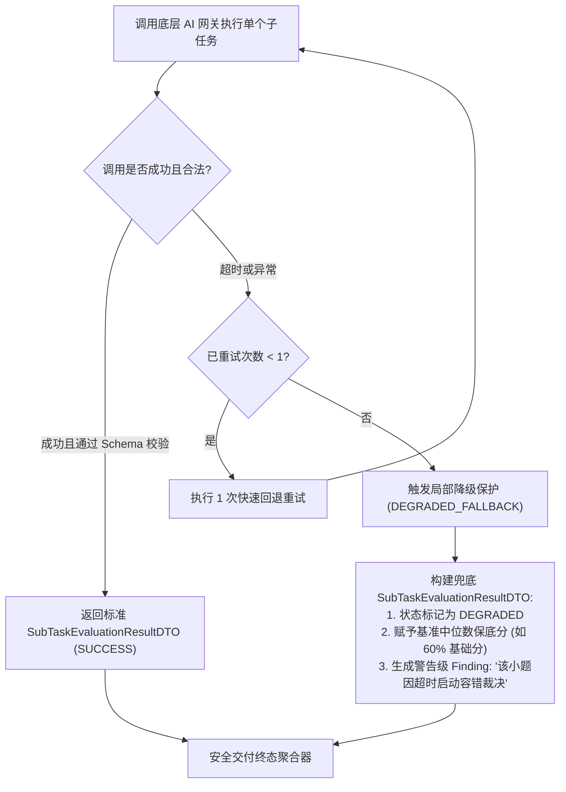

## 阶段二并行消费机制与执行架构


### 一、背景与并发需求

在 AI评审V3 中，经过阶段二步骤 2.1（动态任务规划）与步骤 2.2（双轨上下文装配），各个子任务（如摘要核验、第 1 问优化求解、第 2 问机理推导、第 3 问时序预测、灵敏度专项）已经组装为各自自洽、Token 处于 25k~35k 安全预算的独立任务包。

如果采用传统的串行循环调用：
$$T_{\text{total}} = T_{\text{abstract}} + T_{Q1} + T_{Q2} + T_{Q3} + T_{\text{sensitivity}} \approx 15s \times 5 = 75s \sim 100s$$
单次论文评审耗时将超过 1.5 分钟，不仅破坏用户交互体验，而且底层 HTTP 线程被长时间阻塞，严重制约高并发生产环境的吞吐能力。

因为各个子任务在语义上已经**正交解耦**（各小问的数学推导互不依赖，且均已携带前置符号表与假设），这为**高并发并行模型调用（Parallel Consumption）**提供了天然基础。

本篇正式确立阶段二的**子任务并行消费拓扑、线程池隔离策略、容错熔断降级机制**，并定义下游聚合器消费的强类型结果契约 `SubTaskEvaluationResultDTO`。


---


### 二、并行消费执行拓扑（Parallel Topology）

```mermaid
flowchart TD
    ReadyTasks["装配完毕的子任务列表<br/>List<TaskAssembledContextDTO> (N个任务)"] --> Fork{"并行分发器 (Fork)"}

    subgraph ThreadPool["V3 专有隔离线程池 (reviewSubTaskExecutor)"]
        direction TB
        W1["Worker 1: 摘要自洽核验"]
        W2["Worker 2: 问题 1 优化求解"]
        W3["Worker 3: 问题 2 机理推导"]
        W4["Worker 4: 问题 3 统计预测"]
        W5["Worker 5: 全局灵敏度专项"]
    end

    Fork -->|提交任务 1| W1
    Fork -->|提交任务 2| W2
    Fork -->|提交任务 3| W3
    Fork -->|提交任务 4| W4
    Fork -->|提交任务 5| W5

    W1 -->|异步 Future| Join{"并发收集与等待 (Join / AllOf)"}
    W2 -->|异步 Future| Join
    W3 -->|异步 Future (带单任务降级)| Join
    W4 -->|异步 Future| Join
    W5 -->|异步 Future| Join

    Join --> ReducerIn["输出: List<SubTaskEvaluationResultDTO><br/>(交付下游终态汇聚器)"]
```

#### 核心拓扑特性：
1. **并发耗时压缩**：
   5 个子任务同时并发执行，总阶段耗时取决于“最慢的单小题推理耗时”，整体耗时直接从 90s 压降至 **15s ~ 25s**，效率提升 300% 以上；
2. **完全解耦推进**：
   每个 Worker 独立负责自己的上下文，独立与 `ai-gateway-service` 建立 HTTP 请求，彼此之间无任何共享可变状态。


---


### 三、线程池隔离策略与容量规划

为了防止 AI 评审的高并发请求耗尽系统的全局公共线程池，必须建立专门的**隔离线程池（ThreadPoolBulkhead）**：

```java
@Bean(name = "reviewSubTaskExecutor")
public ExecutorService reviewSubTaskExecutor(ReviewWorkerProperties properties) {
    ThreadFactory factory = new CustomizableThreadFactory("review-subtask-worker-");
    return new ThreadPoolExecutor(
            properties.getSubTaskCorePoolSize(),    // 默认 16
            properties.getSubTaskMaxPoolSize(),     // 默认 32
            60L, TimeUnit.SECONDS,
            new LinkedBlockingQueue<>(100),         // 有界队列 100
            factory,
            new ThreadPoolExecutor.CallerRunsPolicy() // 满载回退由主调度线程执行，形成背压
    );
}
```

#### 超时与并发参数配置（`ReviewWorkerProperties`）：

| 配置项 | 推荐默认值 | 作用与约束 |
|:---|:---|:---|
| `sub-task-core-pool-size` | `16` | 保证至少能同时并发处理 3~4 篇论文的完整子任务（每篇 4~5 个小题） |
| `sub-task-max-pool-size` | `32` | 峰值最大扩展线程数 |
| `sub-task-single-timeout-seconds` | `75s` | 单个小问调用的硬性超时门阀，超时后触发单任务自动重试或降级 |
| `sub-task-phase2-timeout-seconds` | `120s` | 阶段二整体等待聚合超时，保障整个评审过程具有严格的有界时延 |


---


### 四、单任务失败隔离与熔断降级机制（Fault Isolation & Fallback）

数模论文评审严禁因为某一个小问偶发超时或大模型格式解析偶发失败，导致整篇 20 页论文的评审彻底失败重跑。系统确立**“单小题局部降级，全局平稳交付”**的弹性防线：



#### 降级规则细节：
1. **重试预算控制**：单子任务仅允许重试 1 次，防止雪崩；
2. **兜底分值策略**：若某小问最终仍执行失败，系统不赋予 0 分（防止将无辜论文直接打死），也不赋予满分，而是赋予该小题满分的 $60\%$ 作为中位保守保底分，并在 Finding 中清晰写明“由于该章节数学推理极其复杂，系统已采用容错保底规则综合评定，建议参考人工复核”；
3. **整体完好度统计**：若一篇论文中有超过 2 个小问触发降级，则在最终评价的元数据中标记 `partialDegraded = true`，通知上层调度系统记录异常审计日志。


---


### 五、向下衔接契约：`SubTaskEvaluationResultDTO`

每个并行 Worker 返回强类型结构化结果，供下游聚合器进行维度投影：

```java
package com.leetmodel.common.api.dto;

import lombok.AllArgsConstructor;
import lombok.Builder;
import lombok.Data;
import lombok.NoArgsConstructor;

import java.io.Serializable;
import java.math.BigDecimal;
import java.util.List;

/**
 * 阶段二单任务执行结果契约。
 * 由各个并发 Worker 产出，必须具备完全的可合并性与自洽性。
 */
@Data
@Builder
@NoArgsConstructor
@AllArgsConstructor
public class SubTaskEvaluationResultDTO implements Serializable {
    private static final long serialVersionUID = 1L;

    /** 任务标识 (如 TASK_Q1_EVAL) */
    private String taskId;

    /** 任务类型: ABSTRACT_VERIFICATION, SUB_PROBLEM_EVALUATION, SENSITIVITY_EVALUATION */
    private String taskType;

    /** 对应小问编号 (1..N，0 为全篇/摘要) */
    private Integer targetQuestionNo;

    /** 执行状态: SUCCESS, DEGRADED */
    private String executionStatus;

    /** 该任务总得分 (精确到小数点后一位) */
    private BigDecimal score;

    /** 该任务基准满分 */
    private BigDecimal maxScore;

    /** 核心评价总结 */
    private String evaluationSummary;

    /** 细分考察维度分项得分 (如: 模型构建分、求解算法分、结果自洽分) */
    private List<SubTaskAspectScoreDTO> aspectScores;

    /** 捕获的客观证据观测点 (Observations) */
    private List<SubTaskObservationDTO> observations;

    /** 产生的优缺点评审项 (Findings) */
    private List<SubTaskFindingDTO> findings;

    @Data
    @Builder
    @NoArgsConstructor
    @AllArgsConstructor
    public static class SubTaskAspectScoreDTO implements Serializable {
        private static final long serialVersionUID = 1L;

        private String aspectCode; // 例如: FORMULATION, ALGORITHM, RESULT_ANALYSIS
        private String aspectName;
        private BigDecimal maxScore;
        private BigDecimal score;
        private String deductionReason;
    }

    @Data
    @Builder
    @NoArgsConstructor
    @AllArgsConstructor
    public static class SubTaskObservationDTO implements Serializable {
        private static final long serialVersionUID = 1L;

        private String observationId;
        private String blockId;        // 绑定的细粒度 blockId (如 B0032)
        private Integer physicalPage;  // 物理页码
        private String observationType;// FORMULA, TABLE, CODE, TEXT
        private String summary;        // 证据摘要
    }

    @Data
    @Builder
    @NoArgsConstructor
    @AllArgsConstructor
    public static class SubTaskFindingDTO implements Serializable {
        private static final long serialVersionUID = 1L;

        private String findingId;      // 唯一命名空间 ID (如 F_Q1_001)
        private String taskId;
        private Integer questionNo;
        private String type;           // STRENGTH, ISSUE
        private String severity;       // BLOCKING, HIGH, MEDIUM, LOW
        private String statement;      // 事实评价陈述
        private String scoreImpact;    // 得分影响说明 (如 "-3.0 分")
        private String blockId;        // 精确锚定 blockId
        private Integer physicalPage;  // 物理页码
        private List<String> observationIds; // 关联的证据观察点 ID
    }
}
```


---


### 六、小结与后续衔接

本设计完成了**任务 5**的所有目标：
1. 设计了阶段二子任务并行消费拓扑，将全流程时延从 90s 压降至 20s 级别；
2. 制定了隔离线程池容量规划与两级超时（单任务 75s、阶段 120s）门阀；
3. 确立了单小题失败隔离与保守中位数保底降级机制，彻底消除单点雪崩风险；
4. 规范了强类型的 `SubTaskEvaluationResultDTO` 产出契约，为下一步终态维度聚合器（任务 6）提供了确定性的输入。
