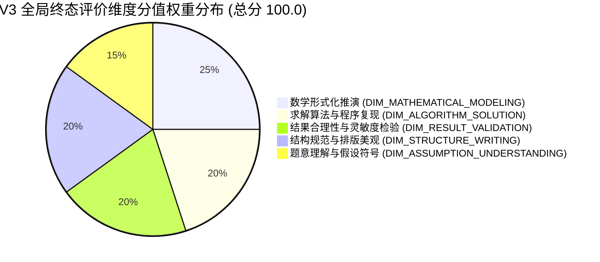
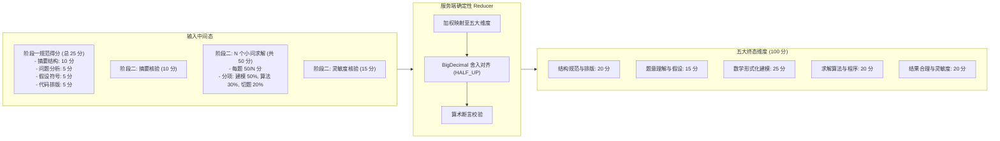
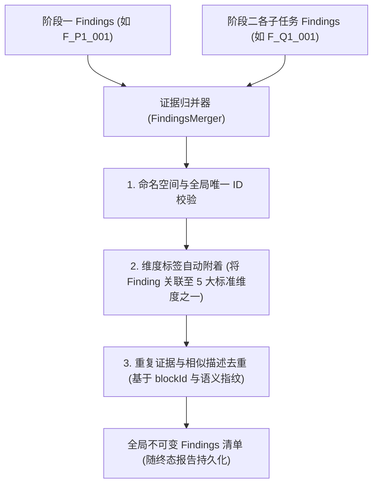

## 终态评价维度与权重合成算法


### 一、背景与合成器（Reducer）定位

在 AI评审V3 中，经过阶段一（静态规范性审查，4 大切面）与阶段二（动态任务并行审查，包括摘要核验、N 个小问模型求解、灵敏度专项），系统产出了一组离散的、具有明确事实证据的中间打分对象。

然而，在面向学生参赛者、指导教师以及全平台排行榜交付时，**用户不能看到碎片化的零散分数，而必须获得统一、标准、跨题目可比的全局综合评分体系**。

如果让大模型在最后再调用一次去“感性合并总分”，不仅徒增 15s 延迟与长文本 Token 消耗，而且不可避免地会再次引入大模型总分算术漂移的致命缺陷。

因此，V3 采用**“完全由服务端 Java 代码执行的确定性汇聚合成器（Deterministic Scoring Reducer）”**：
1. **零大模型调用**：汇聚过程耗时仅需数毫秒，纯内存数学映射；
2. **五大标准化终态维度**：固化全局统一维度量表（总分 100.0 分）；
3. **硬编码权重与确定性算术断言**：全链路采用 `BigDecimal` 精确计算，强制满足 `totalScore == sum(dimensionScore)`。


---


### 二、五大全局统一标准化评价维度定义（满分 100 分）

结合数模竞赛官方四大原则（假设合理性、建模创造性、结果正确性、表述清晰性）及工业界评审实践，V3 确立以下**五大终态维度（Global Standard Dimensions）**：



| 维度代码 (`dimensionCode`) | 维度中文名 | 满分权重 | 核心考查内涵 | 对应证据项 (Findings) 来源 |
|:---|:---|:---:|:---|:---|
| `DIM_MATHEMATICAL_MODELING` | 数学形式化建模推导 | **25 分** | 决策变量、目标函数、约束方程、微分/动力学方程等标准形式的严密性；拒绝伪建模与纯调包 | 阶段二各小问的 `FORMULATION` 考点证据 |
| `DIM_ALGORITHM_SOLUTION` | 求解算法与程序复现 | **20 分** | 算法与模型规模匹配度、精确求解器/启发式算法收敛性；附录源码真实性与算法匹配 | 阶段二各小问的 `ALGORITHM` 考点 + 阶段一附录代码证据 |
| `DIM_RESULT_VALIDATION` | 结果合理性与灵敏度检验 | **20 分** | 求解结果现实常识自洽性；表格数据与摘要一致性；参数扰动灵敏度分析与误差检验 | 阶段二 `ABSTRACT_VERIFICATION` + `SENSITIVITY_EVALUATION` |
| `DIM_STRUCTURE_WRITING` | 结构规范与排版可读性 | **20 分** | 论文整体排版紧凑度、学术语言表达规范性；三线表与插图美观度、参考文献与附录完整度 | 阶段一 `ABSTRACT_STRUCTURE` + `CODE_LAYOUT_AESTHETICS` + `LayoutAesthetics` |
| `DIM_ASSUMPTION_UNDERSTANDING` | 题意理解与假设符号规范 | **15 分** | 对赛题核心背景与目标的理解准确度；假设的合理性与辩护；符号说明表的三要素（名/义/量纲）规范性 | 阶段一 `PROBLEM_ANALYSIS_STRUCTURE` + `ASSUMPTION_NOMENCLATURE` + 各小问切题度 |


---


### 三、阶段一与阶段二得分向五大维度的投影映射算法

系统的总体得分池由**阶段一（25% 基准贡献）**与**阶段二（75% 基准贡献）**严格锁定：



#### 映射公式细则：

1. **`DIM_STRUCTURE_WRITING`（满分 20 分）**：
   $$\text{Score}_{D1} = \text{Score}_{P1.\text{ABSTRACT\_STRUCTURE}} \times 1.5 + \text{Score}_{P1.\text{CODE\_LAYOUT\_AESTHETICS}} \times 1.0$$
   （即阶段一摘要结构分 $10 \times 1.5 = 15$ 分 + 代码排版分 $5 \times 1.0 = 5$ 分，满分合计 20 分）。

2. **`DIM_ASSUMPTION_UNDERSTANDING`（满分 15 分）**：
   $$\text{Score}_{D2} = \text{Score}_{P1.\text{PROBLEM\_ANALYSIS\_STRUCTURE}} \times 1.0 + \text{Score}_{P1.\text{ASSUMPTION\_NOMENCLATURE}} \times 1.0 + \sum_{i=1}^N \text{Score}_{Q_i.\text{UNDERSTANDING}}$$
   （阶段一问题分析 5 分 + 假设符号 5 分 + 各小问切题度累计 5 分，满分合计 15 分）。

3. **`DIM_MATHEMATICAL_MODELING`（满分 25 分）**：
   $$\text{Score}_{D3} = \sum_{i=1}^N \text{Score}_{Q_i.\text{FORMULATION}} \times \frac{25}{\sum \text{Max}_{Q_i.\text{FORMULATION}}}$$
   （完全由阶段二 N 个小问的数学建模分按权重聚合映射，满分 25 分）。

4. **`DIM_ALGORITHM_SOLUTION`（满分 20 分）**：
   $$\text{Score}_{D4} = \sum_{i=1}^N \text{Score}_{Q_i.\text{ALGORITHM}} \times \frac{20}{\sum \text{Max}_{Q_i.\text{ALGORITHM}}}$$
   （完全由阶段二 N 个小问的求解算法与附录代码分映射，满分 20 分）。

5. **`DIM_RESULT_VALIDATION`（满分 20 分）**：
   $$\text{Score}_{D5} = \text{Score}_{P2.\text{ABSTRACT\_VERIFY}} \times 0.5 + \text{Score}_{P2.\text{SENSITIVITY}} \times 1.0$$
   （阶段二摘要全文核验 $10 \times 0.5 = 5$ 分 + 灵敏度专项 $15 \times 1.0 = 15$ 分，满分合计 20 分）。


---


### 四、确定性算术断言与防漂移保证（Arithmetic Guarantees）

为了杜绝浮点数精度漂移以及大模型感性总分不一致的问题，Reducer 必须强制执行以下断言：

```java
public FinalReviewScoreDTO computeAndAssertScores(
        Phase1StructuralReviewResultDTO phase1,
        List<SubTaskEvaluationResultDTO> phase2Results) {

    // 1. 各维度映射计算 (统一使用 BigDecimal 保持 2 位精度)
    BigDecimal d1 = computeStructureWriting(phase1);
    BigDecimal d2 = computeAssumptionUnderstanding(phase1, phase2Results);
    BigDecimal d3 = computeMathematicalModeling(phase2Results);
    BigDecimal d4 = computeAlgorithmSolution(phase2Results);
    BigDecimal d5 = computeResultValidation(phase2Results);

    // 2. 精度舍入到小数点后 1 位 (HALF_UP)
    d1 = d1.setScale(1, RoundingMode.HALF_UP);
    d2 = d2.setScale(1, RoundingMode.HALF_UP);
    d3 = d3.setScale(1, RoundingMode.HALF_UP);
    d4 = d4.setScale(1, RoundingMode.HALF_UP);
    d5 = d5.setScale(1, RoundingMode.HALF_UP);

    // 3. 服务端权威求和
    BigDecimal totalScore = d1.add(d2).add(d3).add(d4).add(d5);

    // 4. 边界范围安全断言
    assertInRange(d1, BigDecimal.ZERO, BigDecimal.valueOf(20.0), "DIM_STRUCTURE_WRITING");
    assertInRange(d2, BigDecimal.ZERO, BigDecimal.valueOf(15.0), "DIM_ASSUMPTION_UNDERSTANDING");
    assertInRange(d3, BigDecimal.ZERO, BigDecimal.valueOf(25.0), "DIM_MATHEMATICAL_MODELING");
    assertInRange(d4, BigDecimal.ZERO, BigDecimal.valueOf(20.0), "DIM_ALGORITHM_SOLUTION");
    assertInRange(d5, BigDecimal.ZERO, BigDecimal.valueOf(20.0), "DIM_RESULT_VALIDATION");
    assertInRange(totalScore, BigDecimal.ZERO, BigDecimal.valueOf(100.0), "TOTAL_SCORE");

    // 5. 绝对一致性断言: total == sum(dimensions)
    BigDecimal sum = d1.add(d2).add(d3).add(d4).add(d5);
    if (totalScore.compareTo(sum) != 0) {
        throw new IllegalStateException("总分与分项之和算术断言失败: " + totalScore + " != " + sum);
    }

    return buildFinalReviewScoreDTO(totalScore, List.of(d1, d2, d3, d4, d5));
}
```


---


### 五、Findings 证据归并与去重协议

终态聚合器同时负责将阶段一与阶段二的所有 Findings 进行归并与命名空间统一：



1. **维度附着规则**：
   - 属于格式、排版、美观的 Finding $\to$ 标记所属 `DIM_STRUCTURE_WRITING`；
   - 属于公式、机理推导的 Finding $\to$ 标记所属 `DIM_MATHEMATICAL_MODELING`；
   - 属于代码、求解器的 Finding $\to$ 标记所属 `DIM_ALGORITHM_SOLUTION`；
   - 属于结果数值、灵敏度的 Finding $\to$ 标记所属 `DIM_RESULT_VALIDATION`；
   - 属于假设、符号、题意的 Finding $\to$ 标记所属 `DIM_ASSUMPTION_UNDERSTANDING`。
2. **前端高亮消费直连**：
   每个 Finding 中的 `blockId` 与 `physicalPage` 保持不变，前端可直接点击 Finding 跳转到 PDF 对应物理页与段落/公式块高亮展示。


---


### 六、小结与后续衔接

本设计完成了**任务 6**的所有目标：
1. 确立了面向用户和榜单的五大统一标准化终态评价维度（满分 100 分）；
2. 制定了阶段一（25%）与阶段二（75%）向五大维度的确定性加权投影算法；
3. 固化了纯 Java 内存 Reducer 算法与 `BigDecimal` 严格算术断言，彻底杜绝总分漂移；
4. 完成了全阶段 Findings 证据的归并、去重与维度映射协议。
