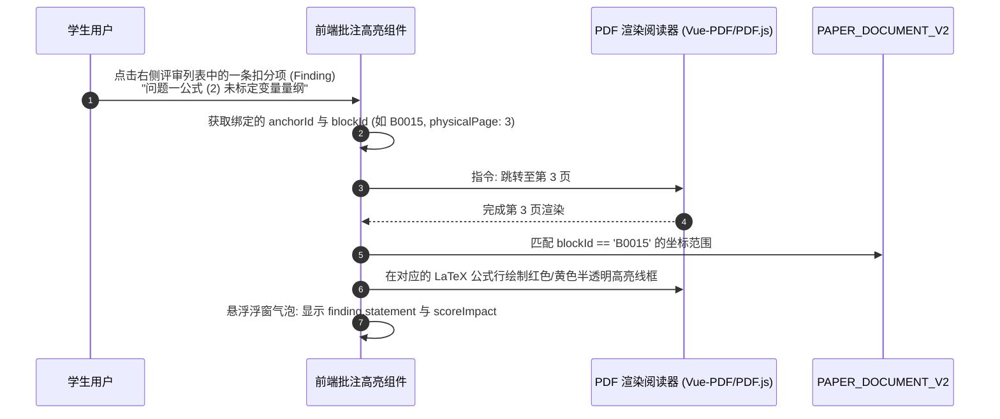

## 数据契约与产物 Schema 设计


### 一、背景与数据生命周期定位

在 AI评审V3 中，全流程经过了阶段一静态规范审查、阶段二动态任务规划、双轨上下文装配、并行 Worker 推理以及终态维度汇聚。整条链路产出了极为丰富的高价值数据资产：
1. **阶段一静态结构快照**（`Phase1StructuralReviewResultDTO`）；
2. **阶段二动态任务规划定义**（`TaskPlanResultDTO`）；
3. **阶段二各子任务并发执行原始明细**（`List<SubTaskEvaluationResultDTO>`）；
4. **终态全局综合评审产物**（`DeepEvidenceReviewV3Output`）；
5. **细粒度段落/公式行高亮批注锚点**（`FineGrainedAnchor`）。

为了满足**“业务主链轻量消费、全量证据可审计复核、前端交互高精度批注跳转、与历史版本（V1/V2）零冲突向前兼容”**的生产级要求，本篇正式制定 V3 的数据库物理表结构、终态产物 JSON Schema 以及前端交互 Anchor 规范。


---


### 二、数据库物理表结构设计（`review_v3_result`）

在 `ai-review-service` 数据库中新增 V3 独立结果表 `review_v3_result`，保持单表职责单一与历史版本物理隔离：

```sql
-- Flyway: V9__add_deep_evidence_review_v3.sql

-- 1. 注册 V3 评审版本元数据
INSERT INTO `review_version`
(`id`, `version_code`, `name`, `description`, `process_summary`, `final_contract_version`, `status`)
VALUES
(3, 'DEEP_EVIDENCE_REVIEW_V3', 'V3 深度证据化 AI 评审',
 '基于第二代结构化解析 PAPER_DOCUMENT_V2 与双阶段流水线的深度科学评审',
 '消费原生 LaTeX/HTML表格/代码，阶段一静态规范审查 + 阶段二动态小题并发推导，五维量表与服务端确定性求和',
 'DEEP_EVIDENCE_REVIEW_V3', 'ENABLED');

-- 2. 创建 V3 评审结果持久化表
CREATE TABLE `review_v3_result` (
  `id` BIGINT NOT NULL COMMENT '结果唯一雪花 ID',
  `task_id` BIGINT NOT NULL COMMENT '评审调度任务 ID',
  `submission_id` BIGINT NOT NULL COMMENT '参赛提交 ID',
  `team_id` BIGINT NOT NULL COMMENT '参赛队伍 ID',
  `problem_id` BIGINT NOT NULL COMMENT '赛题 ID',
  `parse_artifact_id` BIGINT NOT NULL COMMENT '引用的 PAPER_DOCUMENT_V2 产物 ID',
  `workflow_version` VARCHAR(40) NOT NULL COMMENT '工作流版本: DEEP_EVIDENCE_REVIEW_V3',
  `result_schema_version` VARCHAR(40) NOT NULL COMMENT '契约版本: DEEP_EVIDENCE_REVIEW_V3',
  `scoring_rule_version` VARCHAR(40) NOT NULL COMMENT '评分量表版本: MODELING_TRAINING_RUBRIC_V3',
  `score` DECIMAL(5,2) NOT NULL COMMENT '全局最终总得分 (0.00~100.00)',
  `phase1_score` DECIMAL(5,2) NOT NULL COMMENT '阶段一规范性得分 (0.00~25.00)',
  `phase2_score` DECIMAL(5,2) NOT NULL COMMENT '阶段二内容推演得分 (0.00~75.00)',
  `phase1_json` JSON NULL COMMENT '阶段一静态审查结构化快照',
  `task_plan_json` JSON NULL COMMENT '阶段二动态任务规划快照',
  `phase2_json` JSON NULL COMMENT '阶段二并发子任务原始执行明细列表快照',
  `result_json` JSON NOT NULL COMMENT '终态全局交付结构 DeepEvidenceReviewV3Output',
  `model_name` VARCHAR(100) NULL COMMENT '主力模型名称',
  `ai_call_id` VARCHAR(64) NULL COMMENT '链路追踪 callId',
  `create_time` DATETIME NOT NULL DEFAULT CURRENT_TIMESTAMP COMMENT '创建时间',
  `update_time` DATETIME NOT NULL DEFAULT CURRENT_TIMESTAMP ON UPDATE CURRENT_TIMESTAMP COMMENT '更新时间',
  `deleted` TINYINT NOT NULL DEFAULT 0 COMMENT '逻辑删除标记 (0正常 1删除)',
  PRIMARY KEY (`id`),
  UNIQUE INDEX `uk_v3_task_id` (`task_id`),
  INDEX `idx_v3_submission_id` (`submission_id`),
  INDEX `idx_v3_team_create_time` (`team_id`, `create_time`),
  INDEX `idx_v3_parse_artifact` (`parse_artifact_id`)
) ENGINE=InnoDB DEFAULT CHARSET=utf8mb4 COMMENT='V3 深度证据化评审结果表';
```

#### 字段分工与大字段存储策略：
1. **`result_json`（热点高频消费）**：
   存储标准化的终态对象 `DeepEvidenceReviewV3Output`，供 Web 前端论文评审报告页直接反序列化渲染，体积约 15KB~30KB；
2. **中间态快照（冷数据/审计/排障复核）**：
   - `phase1_json`：阶段一切面打分与静态 Findings；
   - `task_plan_json`：规划算子生成的子任务规划元数据；
   - `phase2_json`：各个并发 Worker 的原始完整打分与推理片段；
   - 供后台管理端治理、模型评估评测（`ai-evaluation-service`）以及评卷争议仲裁时查看完整思维链与局部证据。


---


### 三、终态交付产物 Schema（`DeepEvidenceReviewV3Output`）

终态交付产物是存储在 `result_json` 中、并被 `ReviewVO.resultJson` 承载的标准强类型契约：

```java
package com.leetmodel.common.api.dto;

import lombok.AllArgsConstructor;
import lombok.Builder;
import lombok.Data;
import lombok.NoArgsConstructor;

import java.io.Serializable;
import java.math.BigDecimal;
import java.util.List;

/**
 * V3 终态全局评审交付产物契约。
 */
@Data
@Builder
@NoArgsConstructor
@AllArgsConstructor
public class DeepEvidenceReviewV3Output implements Serializable {
    private static final long serialVersionUID = 1L;

    /** 全局总分 (0.0~100.0) */
    private BigDecimal score;

    /** 分数性质: 固定为 "PLATFORM_TRAINING_SCORE" */
    private String scoreNature;

    /** 工作流与契约版本: "DEEP_EVIDENCE_REVIEW_V3" */
    private String workflowVersion;

    /** 全局综合评审评语总结 */
    private String overallAssessment;

    /** 评分量表元数据 */
    private ScoringRuleMeta scoringRule;

    /** 五大统一标准化评价维度得分 */
    private List<V3ScoringDimension> dimensions;

    /** 全局合并后的结构化 Findings 清单 (优点与扣分项) */
    private List<V3Finding> findings;

    /** 捕获的客观论文证据观测点 (LaTeX公式、表格行、代码块、图表) */
    private List<V3Observation> observations;

    /** 赛题小问覆盖度与解答情况核验 */
    private List<V3RequirementCoverage> requirementCoverage;

    /** 阶段二各子任务执行概览 */
    private List<V3SubTaskSummary> subTaskSummaries;

    /** 细粒度批注锚点列表 (供前端 PDF 划线高亮) */
    private List<FineGrainedAnchor> anchors;

    @Data
    @Builder
    @NoArgsConstructor
    @AllArgsConstructor
    public static class ScoringRuleMeta implements Serializable {
        private static final long serialVersionUID = 1L;
        private String version;      // "MODELING_TRAINING_RUBRIC_V3"
        private String description;
    }

    @Data
    @Builder
    @NoArgsConstructor
    @AllArgsConstructor
    public static class V3ScoringDimension implements Serializable {
        private static final long serialVersionUID = 1L;
        private String dimensionCode; // DIM_MATHEMATICAL_MODELING, DIM_ALGORITHM_SOLUTION, etc.
        private String dimensionName;
        private BigDecimal maxScore;  // 25.0, 20.0, 20.0, 20.0, 15.0
        private BigDecimal score;     // 实际得分
        private String reason;        // 维度综合评价
        private List<String> positiveFindingIds;
        private List<String> deductionFindingIds;
    }

    @Data
    @Builder
    @NoArgsConstructor
    @AllArgsConstructor
    public static class V3Finding implements Serializable {
        private static final long serialVersionUID = 1L;
        private String findingId;     // F_P1_001, F_Q1_001, etc.
        private String dimensionCode; // 关联的五大终态维度
        private String type;          // STRENGTH, ISSUE
        private String severity;      // BLOCKING, HIGH, MEDIUM, LOW
        private String statement;     // 事实论述
        private String scoreImpact;   // "-3.0 分", "+2.0 分"
        private String blockId;       // 绑定的精准 blockId (如 B0018)
        private Integer physicalPage; // 物理页码
        private List<String> observationIds;
    }

    @Data
    @Builder
    @NoArgsConstructor
    @AllArgsConstructor
    public static class V3Observation implements Serializable {
        private static final long serialVersionUID = 1L;
        private String observationId;
        private String blockId;
        private Integer physicalPage;
        private String type;          // FORMULA, TABLE, CODE, FIGURE, PARAGRAPH
        private String summary;
        private String rawSnippet;    // LaTeX 源码、HTML 标签或代码行片段
    }

    @Data
    @Builder
    @NoArgsConstructor
    @AllArgsConstructor
    public static class V3RequirementCoverage implements Serializable {
        private static final long serialVersionUID = 1L;
        private String requirementId; // REQ_01, REQ_02
        private Integer questionNo;   // 1, 2, 3...
        private String questionTitle;
        private String status;        // COMPLETED, PARTIAL, MISSING
        private String explanation;
        private List<String> evidenceBlockIds;
    }

    @Data
    @Builder
    @NoArgsConstructor
    @AllArgsConstructor
    public static class V3SubTaskSummary implements Serializable {
        private static final long serialVersionUID = 1L;
        private String taskId;
        private String taskName;
        private Integer questionNo;
        private BigDecimal score;
        private BigDecimal maxScore;
        private String status;        // SUCCESS, DEGRADED
    }

    @Data
    @Builder
    @NoArgsConstructor
    @AllArgsConstructor
    public static class FineGrainedAnchor implements Serializable {
        private static final long serialVersionUID = 1L;
        private String anchorId;      // ANC_001
        private String blockId;       // B0025
        private Integer physicalPage; // 物理页码
        private String anchorType;    // FORMULA_LINE, TABLE_CELL, CODE_SNIPPET, TEXT_PARAGRAPH
        private String highlightText; // 需要高亮的文本/公式片段
        private String findingId;     // 关联的 FindingId
    }
}
```


---


### 四、细粒度批注 Anchor 规范与前端交互协议

在以往版本中，批注只能粗糙指向“第 3 页”，无法精确到段落或公式。
V3 借助 `PAPER_DOCUMENT_V2` 的原生原子块与细粒度 `blockId`，实现了**交互级批注协议**：



#### 锚点类型定义：
- `FORMULA_LINE`：锚定具体单行或多行 LaTeX 公式（例如 `B0015`）；
- `TABLE_CELL`：锚定三线表中的关键数据单元格；
- `CODE_SNIPPET`：锚定附录源码中的具体算法行；
- `TEXT_PARAGRAPH`：锚定正文段落或假设说明列表。


---


### 五、向后兼容性与服务契约对齐

1. **与 `ReviewVO` 的兼容**：
   `ReviewVO.resultJson` 存储 `DeepEvidenceReviewV3Output` 序列化后的字符串。前端根据 `ReviewVO.workflowVersion == 'DEEP_EVIDENCE_REVIEW_V3'` 动态渲染第三代富文本五维报告卡与公式级批注界面，与旧版 V1/V2 完美并存；
2. **与 RocketMQ 消息契约兼容**：
   评审完成后发送的 `ReviewCompletedPayload` 保持完全一致：
   `{ taskId, submissionId, teamId, problemId, workflowVersion: "DEEP_EVIDENCE_REVIEW_V3", finishedAt }`；
   下游 `ranking-service` 消费该消息并拉取 `score` 更新榜单，无需任何侵入修改；
3. **与 `ai-suggestion-service` 兼容**：
   下游建议服务通过 `ReviewEvidenceProjector` 提取 V3 的 `findings` 与 `blockId`，为学生生成公式级的修改与改进指导。


---


### 六、小结与后续衔接

本设计完成了**任务 7**的所有目标：
1. 完成了 `review_v3_result` 数据库物理表结构与 Flyway 脚本规划；
2. 设计了规范且详尽的终态交付 JSON Schema `DeepEvidenceReviewV3Output`；
3. 规范了高精度交互式批注 `FineGrainedAnchor` 协议；
4. 确立了大字段存储分层策略与全局向后兼容保障。
