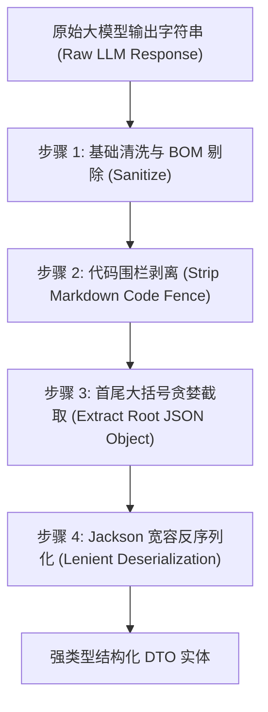

## 提示词工程与防御性解析规范


### 一、规范背景与工程红线

在 AI评审V3 系统的实现中，系统涉及大量的复杂数模文本、原生 LaTeX 数学公式（大量包含 `\frac{a}{b}`, `\sum_{i=1}^n` 等反斜杠与花括号）、原生 HTML `<table>` 标签以及附录编程源码。

在与底层大模型（无论是 OpenAI、DeepSeek、Claude 还是本地部署模型）交互的过程中，提示词管理与输入输出解析是故障率最高的高危环节：
1. **模板花括号冲突陷阱**：LangChain4j 默认的 `{{var}}` 模板定界符与 LaTeX 的 `{}` 以及 JSON 示例的花括号剧烈冲突，导致变量替换崩溃或变量漏替换；
2. **反斜杠与正则陷阱**：LaTeX 公式中海量的 `\`（如 `\alpha`）在 Java 字符串与正则替换（`Matcher.replaceAll`）中会被当成转义符甚至非法转义崩溃；
3. **大模型输出 Markdown 围栏与废话污染**：大模型经常在 JSON 前后输出“好的，这是评审结果：”或者包裹 ` ```json ` 围栏，直接反序列化会导致 `JsonParseException`；
4. **不可见控制字符与 BOM 污染**：模型输出中常混杂 `\uFEFF`（BOM）以及非法控制字符，破坏 JSON 结构。

为了彻底终结上述事故，本规范严格落地 `docs/learning/提示词管理.md` 中的最佳工程实践，制定 V3 全套提示词工程架构与防御性输入输出解析规范。


---


### 二、提示词模板体系与变量定界符隔离

#### 1. 全套 Prompt 模板资产清单（位于 `prompts/` 目录）

| 模板文件名 | 阶段/职责 | 角色定位 | 核心变量定界符 |
|:---|:---|:---|:---|
| `phase1-structural-review.st` | 阶段一：结构规范性静态审查 | `SystemMessage` | 静态无变量，UserMessage 注入切片数据 |
| `phase2-task-planner.st` | 阶段二：动态任务规划算子 | `SystemMessage` | 静态无变量，UserMessage 注入小问清单和大纲 |
| `phase2-subtask-evaluation.st` | 阶段二：分小问深度推演通用模板 | `SystemMessage` + `UserMessage` | `[[taskName]]`, `[[questionNo]]`, `[[categoryName]]` 等 |
| `phase2-abstract-verification.st` | 阶段二：摘要全文自洽性专项模板 | `SystemMessage` + `UserMessage` | `[[abstractContent]]`, `[[paperResultsSummaryTables]]` |
| `phase2-sensitivity-evaluation.st` | 阶段二：全局灵敏度与鲁棒性专项 | `SystemMessage` + `UserMessage` | `[[sensitivityBlocksWithFiguresAndTables]]` |

#### 2. 自定义定界符规范（强制使用 `[[` 与 `]]`）
*   **【强制】**：所有动态提示词模板，一律使用 `[[` 与 `]]` 作为占位符定界符（例如 `[[taskName]]`）；
*   **【强制】**：**严禁在动态模板中使用 `{{` 与 `}}` 作为变量**！彻底消除模板引擎将原生 LaTeX `\frac{x}{y}` 误当作变量解析的灾难。


---


### 三、输入侧防御性预处理与反斜杠保护

在将 `PAPER_DOCUMENT_V2` 与题面文本注入 UserMessage 之前，必须执行严格的输入清洗与防注入保护：

```java
public final class PromptInputSanitizer {
    private PromptInputSanitizer() {}

    /**
     * 清洗不可见控制字符与 BOM，保留合法空白字符 (\n, \r, \t)。
     */
    public static String sanitize(String input) {
        if (input == null) return "";
        return input.replace("\uFEFF", "")                  // 剔除零宽无断空格与 BOM
                    .replaceAll("[\\p{Cntrl}&&[^\\n\\r\\t]]", "") // 剔除非法控制字符
                    .trim();
    }

    /**
     * 将文本中的 LaTeX 反斜杠与美元符号进行正则安全转义，供模板安全插值。
     */
    public static String escapeForTemplate(String value) {
        if (value == null) return "";
        // 利用 Matcher.quoteReplacement 消除 $ 与 \ 的正则替换语义
        return Matcher.quoteReplacement(sanitize(value));
    }

    /**
     * 使用自定义 [[ ]] 定界符进行安全替换，绝不触发花括号冲突。
     */
    public static String renderTemplate(String template, Map<String, String> variables) {
        String rendered = template;
        for (Map.Entry<String, String> entry : variables.entrySet()) {
            String placeholder = "[[" + entry.getKey() + "]]";
            rendered = rendered.replace(placeholder, entry.getValue() == null ? "" : entry.getValue());
        }
        return rendered;
    }
}
```


---


### 四、输出侧防御性提取与容错清洗器（Robust Output Parser）

大模型返回的原始字符串绝不能直接调用 `objectMapper.readValue()`！必须经过三层安全剥离流水线：



#### 生产级鲁棒解析器实现（`V3OutputParser`）：

```java
public final class V3OutputParser {
    private static final Pattern CODE_FENCE_PATTERN =
            Pattern.compile("```(?:json)?\\s*([\\s\\S]*?)\\s*```", Pattern.CASE_INSENSITIVE);

    private V3OutputParser() {}

    /**
     * 从大模型可能夹杂闲聊与 Markdown 围栏的输出中，提取纯净的 JSON 文本。
     */
    public static String extractJson(String rawOutput) {
        if (rawOutput == null || rawOutput.isBlank()) {
            throw new IllegalArgumentException("模型输出为空，无法解析结构化结果");
        }
        String text = PromptInputSanitizer.sanitize(rawOutput);

        // 1. 优先尝试剥离 ```json ... ``` 围栏
        Matcher matcher = CODE_FENCE_PATTERN.matcher(text);
        if (matcher.find()) {
            text = matcher.group(1).trim();
        }

        // 2. 截取首个 '{' 到最后一个 '}' 之间的闭包内容 (防前后闲聊废话)
        int firstBrace = text.indexOf('{');
        int lastBrace = text.lastIndexOf('}');
        if (firstBrace >= 0 && lastBrace > firstBrace) {
            text = text.substring(firstBrace, lastBrace + 1).trim();
        }

        return text;
    }

    /**
     * 宽容反序列化：忽略未知字段，支持容错。
     */
    public static <T> T parse(ObjectMapper objectMapper, String rawOutput, Class<T> targetClass)
            throws Exception {
        String cleanJson = extractJson(rawOutput);
        return objectMapper.readValue(cleanJson, targetClass);
    }
}
```


---


### 五、LaTeX 反斜杠与 JSON 双重转义自查防线

| 环节 | 正确状态 | 典型反模式（严禁） |
|:---|:---|:---|
| **Java 内存对象 $\to$ JSON** | 由 Jackson 自动完成 `\` 变 `\\` | 手工拼字符串 `\"\\frac...\"`（极易错漏） |
| **JSON 文本 $\to$ 模板变量** | 保持原始文本作为变量值注入 | 注入前再执行一次 `toJson`（造成双重转义） |
| **模板渲染 $\to$ HTTP Body** | 由 HTTP 客户端库统一转义为标准 JSON 请求体 | 手写拼接 HTTP 报文 |
| **模型输出 $\to$ 客户端** | 经过 `extractJson` 清洗后执行一次反序列化 | 强行对带有 Markdown 围栏的原串进行解析 |


---


### 六、小结与后续衔接

本设计完成了**任务 8**的所有目标：
1. 在 `prompts/` 目录下沉淀了 5 套涵盖规划、阶段一、阶段二各专项的完整 Prompt 模板；
2. 彻底落实了花括号隔离（`[[ ]]` 占位符）、反斜杠安全转义与数据/指令隔离；
3. 制定了代码围栏剥离、首尾截取与非法控制字符清洗的标准防御解析器 `V3OutputParser`；
4. 形成了全链路防范“JSON 地狱”与转义错乱的工业级工程防线。
