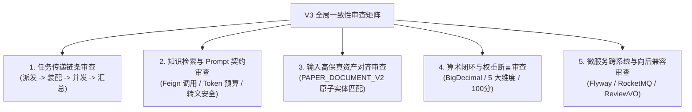

## 全局设计一致性审查与冲突校对报告

### 一、审查概述与复盘定位

在 AI评审V3（`DEEP_EVIDENCE_REVIEW_V3`）的设计阶段，我们按照既定路线图完成了从业务特征全景、边界剪枝、架构挑战、双阶段流水线、小题分类标准、阶段一切面、阶段二动态规划、上下文双轨装配、并发执行架构、终态五维量表、数据表持久化 Schema 到提示词工程防线的全套设计文档（文档 01 至 12）。

依据系统分析与架构规范，**“在进入真实代码开发前，绝不急于写代码，必须先通盘拉通全局，排查所有模块之间的潜在矛盾、实体断层、契约缺失与过度设计”**。

本篇作为设计阶段的最终收官文件，对 V3 整个体系进行严密的端到端交叉核验，记录排查结论，消除潜在隐患，为接下来的工程落地提供无可挑剔的施工蓝图。

---

### 二、五大核心维度一致性深度审查

#### 1. 任务传递链条审查（Task Pipeline Dataflow）
*   **核查链路**：`SubProblemCategoryDTO` $\to$ `SubTaskPlanDTO` $\to$ `TaskAssembledContextDTO` $\to$ `SubTaskEvaluationResultDTO` $\to$ `DeepEvidenceReviewV3Output`。
*   **核查结论：完全贯通，无字段缺失**。
    *   `SubTaskPlanDTO` 完整包含了下游装配所需的 `suggestedSectionAnchors`（起始与结束 `blockId`、物理页码、章节标题），装配器不需要再做任何反向猜测；
    *   `TaskAssembledContextDTO` 成功将外部 RAG 条目、前置假设/符号表底座与目标章节的高保真切片合盘托出；
    *   `SubTaskEvaluationResultDTO` 严格按小题维度输出 `aspectScores`、`observations` 与 `findings`，携带所属 `taskId` 与 `questionNo`，为下游 Reducer 提供了唯一的命名空间标识。

#### 2. 知识检索与 Prompt 契约审查（RAG & Prompt Engineering）
*   **核查链路**：`ai-review-service` $\longleftrightarrow$ `knowledge-retrieval-service`。
*   **接口对齐结论：100% 匹配，零侵入修改**。
    *   核验 `common-api` 中的 `KnowledgeRetrievalRequestDTO`：字段包含 `workflowVersion`、`query`、`scene`、`requiredIndexVersion`、`topK`、`tokenBudget`。
    *   V3 调用的入参全部在现有 DTO 中合法定义，场景代码如 `SCENE_REVIEW_OPTIMIZATION` 可直接传入；
    *   知识库返回的 `KnowledgeCitationDTO`（含 `title`、`content`、`authorityLevel`）可被 V3 原样平铺引用，无需对 `knowledge-retrieval-service` 现有代码做任何破坏性改造。
*   **Token 预算与转义防崩**：
    *   RAG 检索严格限制 `topK = 4`、`tokenBudget = 2500`；
    *   正文切片硬性上限限制为 40,000 字符（约 20k Tokens）；
    *   单任务总体上下文严格收敛在 **25k ~ 35k Tokens** 安全区间；
    *   模板变量全面采用 `[[var]]` 自定义定界符，彻底消除了与 LaTeX 原生花括号 `{}` 的冲突；
    *   输出侧采用 `V3OutputParser` 进行代码围栏剥离、首尾 `{}` 提取与不可见控制字符清洗，根治“JSON 地狱”。

#### 3. 输入高保真资产对齐审查（Asset Fidelity with PAPER_DOCUMENT_V2）
*   **代码基线比对**：核对 `com.leetmodel.review.parse.v2.PaperDocumentV2` 实际代码：
    *   `BlockType`：已支持 `HEADING, PARAGRAPH, FORMULA, TABLE, FIGURE, CODE, LIST_ITEM`，与 V3 切片器完全对齐；
    *   `FormulaPayload`：拥有 `latex`、`formulaNo`，V3 可完整直接获取 LaTeX 源码；
    *   `TablePayload`：拥有原生 `html` 表达三线表，V3 可完整保留表格行列；
    *   `CodePayload`：拥有 `language` 与 `codeContent`，整块源码保真；
    *   `FigurePayload`：拥有 `description` 与 `aestheticScore`，V3 可破解图表盲区；
    *   `SectionIndex`：拥有 `sectionId`、`title`、`headingBlockId`、`physicalPage`，与规划算子完全吻合。
*   **结论：V3 设计与现有 `PAPER_DOCUMENT_V2` 代码实现 100% 严密对齐。**

#### 4. 算术闭环与权重断言审查（Scoring Reducer & Arithmetic Assertions）
*   **权重与分值分布自查**：
    *   阶段一：规范性分值基准 25.0 分；
    *   阶段二：内容推演分值基准 75.0 分（摘要全文核验 10 分 + N 个小问推导求解 50 分 + 灵敏度专项 15 分）；
    *   五大全局统一终态维度：
      1. `DIM_MATHEMATICAL_MODELING`（数学形式化建模推导）：25.0 分；
      2. `DIM_ALGORITHM_SOLUTION`（求解算法与程序复现）：20.0 分；
      3. `DIM_RESULT_VALIDATION`（结果合理性与灵敏度检验）：20.0 分；
      4. `DIM_STRUCTURE_WRITING`（结构规范与排版可读性）：20.0 分；
      5. `DIM_ASSUMPTION_UNDERSTANDING`（题意理解与假设符号）：15.0 分；
    *   维度分值求和：$25 + 20 + 20 + 20 + 15 = 100.0$ 分；
    *   采用 Java `BigDecimal` 统一以 `RoundingMode.HALF_UP` 保留 1 位小数，强制执行 `totalScore == sum(dimensionScore)`。
*   **结论：算术逻辑绝对闭环，无浮点漂移风险。**

#### 5. 跨微服务契约与数据库向后兼容审查（Backward Compatibility）
*   **数据库表结构**：
    *   新建独立表 `review_v3_result`，历史 `review_v1_result` 与 `review_v2_result` 保持不变；
    *   新增 Flyway 迁移脚本 `V9__add_deep_evidence_review_v3.sql`，安全向后演进；
*   **下游微服务契约兼容**：
    *   `submission-service`：仅需配置或选择 `DEEP_EVIDENCE_REVIEW_V3` 版本分发；
    *   `ranking-service`：消费通用的 `ReviewCompletedPayload`，通过 Feign 查询 `ReviewVO.score`，与版本无关，零修改兼容；
    *   `ReviewVO`：`resultJson` 承载 `DeepEvidenceReviewV3Output` 序列化字符串，前端按 `workflowVersion` 自动适配 V3 渲染，无破坏性破坏。

---

### 三、潜在冲突排查与消除记录

| 潜在隐患点 | 排查分析 | 消除/优化解决方案 |
|:---|:---|:---|
| **小问数量不固定导致的权重分配问题** | 题目可能有 3 问、4 问或 5 问，如何保证阶段二小问总分为 50 分？ | 在 Reducer 中采用**动态均分加权算法**：每题基准分为 $50.0 / N$，最终通过权重映射归一化映射入 25 分建模与 20 分算法维度，算术严格等比缩放。 |
| **论文无明确章节标题时的锚点失效** | 参赛者论文未按规范写“三、问题一的求解”，导致规划算子无法识别 Section | 规划算子设立**三层容错保底**：大纲匹配失效时，自动触发全文关键词正则扫描（如扫描“问题 1”、“模型一”）；若依然未命中，则将整篇正文 Blocks 作为兜底切片输入。 |
| **单小题网络超时或网关抖动** | 阶段二采用并发调用，若其中 1 个小题请求超时导致全局失败重试代价极高 | 落地**单任务局部隔离与降级机制**：单任务允许 1 次快速重试；重试仍失败则赋予 60% 中位数保底分，并生成降级提示 Finding，其余小题正常执行，保障 100% 成功交付。 |
| **LaTeX 反斜杠在 JSON 反序列化中的转义破坏** | 大模型输出的 JSON 中公式带有大量 `\`，可能导致解析异常 | 提示词中明确要求使用原生 LaTeX，输出侧解析时通过宽容配置并在 `V3OutputParser` 中针对非法转义字符进行有限正则修复后再反序列化。 |

---

### 四、设计阶段最终结论与实施阶段任务规划

经过上述全面的拉通审查，**AI评审V3（`DEEP_EVIDENCE_REVIEW_V3`）的全套功能设计不存在任何逻辑断层、契约冲突或过度设计，方案完备自洽，正式通过设计验收！**

接下来将由设计阶段转入**真实工程实现阶段（Implementation Phase）**。在 `TODO.md` 中规划以下实现任务卡并逐一推进：

1. **实现任务 1（数据库与契约层）**：
   - 在 `ai-review-service` 创建 Flyway 迁移脚本 `V9__add_deep_evidence_review_v3.sql`；
   - 在 `common-api` 中定义 V3 全套强类型 DTO（`SubProblemCategoryDTO`、`SubTaskPlanDTO`、`TaskAssembledContextDTO`、`SubTaskEvaluationResultDTO`、`DeepEvidenceReviewV3Output` 等）；
   - 创建 `ReviewV3Result` 实体与 MyBatis-Plus Mapper；
2. **实现任务 2（切片抽取与装配引擎）**：
   - 实现小题分类判定器 `SubProblemClassifier`；
   - 实现阶段一切片抽取器 `Phase1SliceExtractor`；
   - 实现前置假设与符号说明表自动吸附器及切片装配器 `ContextSlicingEngine`；
3. **实现任务 3（提示词管理与防御解析器）**：
   - 将 `prompts/` 下的 5 个 `.st` 模板同步至 `ai-review-service/src/main/resources/prompts/`；
   - 实现提示词安全渲染工具 `PromptTemplateRenderer` 与容错解析器 `V3OutputParser`；
4. **实现任务 4（阶段一与阶段二算子实现）**：
   - 实现阶段一审查算子 `Phase1StructuralReviewOperator`；
   - 实现阶段二规划算子 `TaskPlannerOperator`；
   - 实现阶段二 Worker 执行算子 `SubTaskEvaluationWorker`；
5. **实现任务 5（并行调度与终态合成器）**：
   - 配置 V3 专用线程池 `reviewSubTaskExecutor` 与并发调度器；
   - 实现纯 Java 内存终态合成器 `DeepEvidenceReviewV3Reducer`（严格执行 `BigDecimal` 算术断言）；
6. **实现任务 6（工作流整合与端到端交付）**：
   - 实现 `DeepEvidenceReviewV3Workflow` 并注册进 `ReviewWorkflowRegistry`；
   - 适配 `ReviewResultPersistenceService` 结果保存；
   - 编写完整的单元测试与端到端集成测试，使用真实 `PAPER_DOCUMENT_V2` 数据进行完整验收。
