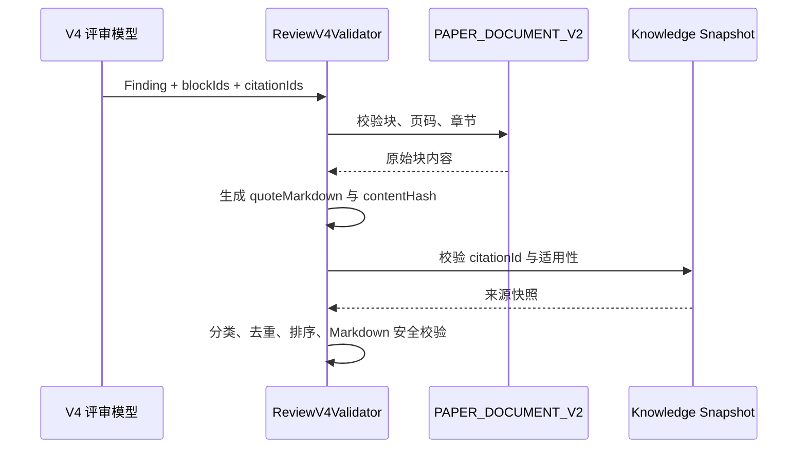

## Prompt 与确定性校验

> 设计状态：已确认设计，尚未实现。

### 一、Prompt 版本

V4 新增独立 Prompt：

- `phase1-structural-review-v4.st`
- `phase2-task-planner-v4.st`
- `phase2-subtask-evaluation-v4.st`
- `phase2-abstract-verification-v4.st`
- `phase2-sensitivity-evaluation-v4.st`

动态变量继续使用 `[[...]]`，禁止使用 `{{...}}`。

### 二、输出要求

模型只负责：

- 提出候选优点和问题；
- 说明原因、影响和关联维度；
- 返回真实输入中存在的 `blockId`；
- 返回候选知识引用 ID；
- 使用 Markdown 编写解释字段。

模型不负责：

- 复制原文作为 `quoteMarkdown`；
- 生成页码、图片 URL、块哈希和知识来源元数据；
- 决定最终排序；
- 计算总分；
- 输出隐藏思考链。

Prompt 可以要求模型执行内部核对步骤，但只交付结论、理由和证据标识，不要求展示逐步思维过程。

### 三、详细解释最小结构

每个候选 Finding 必须包含：

1. 一句明确结论；
2. 至少一句原因；
3. 至少一句影响；
4. 至少一个真实 `blockId`；
5. `STRENGTH` 说明保留价值，`ISSUE` 说明风险边界。

禁止以下输出：

- “模型较好”“建议完善”“内容不够深入”等无对象、无原因的空话；
- 没有论文依据的算法优劣断言；
- 把某种建模方法描述为唯一正确答案；
- 大段复述 Prompt 或资料库原文。

### 四、服务端证据补全

### 五、确定性校验

保存前必须验证：

- 总分等于五维分数之和；
- Finding ID 唯一；
- `findingType`、`priority`、`importance`、类别和维度属于版本枚举；
- 每条 Finding 至少有一个有效论文证据；
- `evidenceQuotes` 与锁定解析块内容哈希一致；
- `knowledgeBasisIds` 属于本次锁定检索快照；
- `ISSUE` 的优先级顺序合法；
- Markdown 不包含模型生成的外部图片和危险 HTML；
- 长字段未超过版本化上限；
- 问题和亮点至少各自满足当前论文真实证据；若确实没有可靠问题或亮点，允许该组为空，不伪造。

### 六、异常处理

- 单条 Finding 引用无效时丢弃单条，不直接丢弃整份报告。
- 关键问题全部无效时，任务失败为“缺少可验证评审问题”，不得交付空壳低分。
- Markdown 语法局部错误不影响 JSON 解析，前端按原始文本降级。
- 知识服务不可用时，评审仍可基于论文证据完成，但 `knowledgeBasis` 标记为不可用，不伪造来源。
