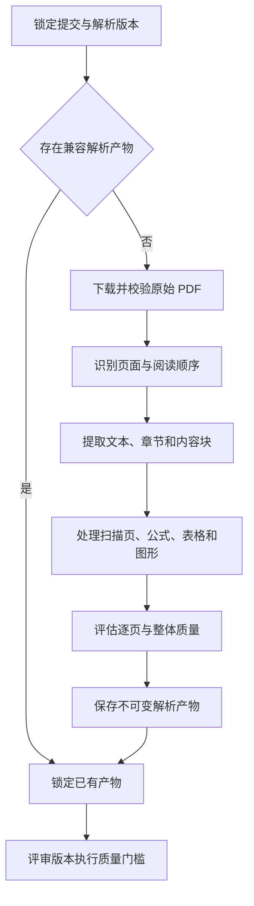

## 执行流程

新证据化评审任务创建时同时锁定解析工作流版本。历史论文的建议准备也可以携带明确版本发起“确保解析产物”请求。ai-review-service 先按提交快照和文件摘要查找兼容解析产物；没有可复用产物时创建解析任务，下载原始 PDF，检查文件可读性，按物理页顺序提取内容并保存质量信息。

具体解析版本可以组合 PDFBox 文本层、版面规则、OCR 和多模态模型。使用哪些步骤、按何顺序执行、何时局部降级以及输出哪些结构均属于解析工作流版本，不由评审运行时临时决定。

本期仍不建设独立解析微服务。解析是 ai-review-service 的版本化子流程，建议场景只是对历史数据请求兼容补齐；当出现更多不依赖评审的直接消费者、独立扩缩容或权限隔离需求时再重新评估服务拆分。
