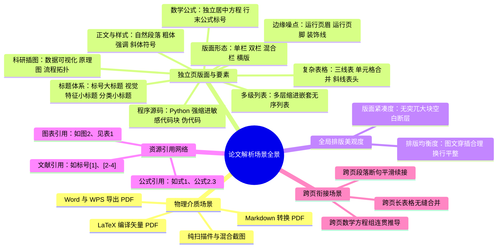

## 数模论文场景全景

### 一、文档定位

本文档系统归纳通用学术与数学建模论文中出现的排版形态、复杂内容要素、资源引用链与视觉排版特征，为问题推导与方案设计提供客观场景基准。

本版本明确不做特定赛事的承诺书、编号页等特殊页面判读，将 MVP 边界严格收敛在通用论文的结构化内容解析与高精度定位上。

---

### 二、场景维度概览

论文解析的复杂度集中在物理介质、单页要素提取、排版视觉美观与跨页逻辑衔接四大维度：

---

### 三、物理介质与生成源场景

| 介质类型 | 内部流特征 | 典型出现场合 | 解析难点 |
|---------|-----------|-------------|---------|
| **LaTeX 编译** | 字符与坐标规整，数学符号丰富 | 美赛与高水平数模论文 | 连字符智能拼接，公式字符需重组为 LaTeX 语义 |
| **Word / WPS 导出** | 样式多变，标签多缺失，公式多为嵌入对象 | 国内数模常见形态 | 文本框浮动脱离主文字流，公式易退化为位图 |
| **Markdown 导出** | 结构清晰，表格规范 | 跨专业队伍偏好 | 较少多级复杂分式，排版规整，解析难度低 |
| **纯扫描或混合截图** | 页面全为位图，或正文贴入公式表格截图 | 历史归档或紧急拼贴 | 纯文本层缺失，需结合视觉理解恢复内容 |

---

### 四、独立页要素与排版场景

#### 1. 版面形态与边缘噪点
- **版面形态**：单栏标准排版；双栏学术排版；混合通栏大图大表；横向旋转页面。
- **边缘噪点**：页面顶部的运行页眉、水平分割线；页面底部的印刷页号与装饰线。

#### 2. 灵活多变的标题体系与层级
- **大标题（目录骨架）**：具有明确大号字与标号，如“一、模型建立”、“2. Model Formulation”，对应论文目录与主干框架。
- **小节与分类标题**：如“2.1 符号假设”、“2.1.1 约束条件”。
- **非标视觉小标题**：无任何数字或序号，作者完全依靠“首行缩进 + 粗体字 + 上下独立边距”表达标题语义，例如独立一行的“**模型假设：**”或“**参数定义：**”。

#### 3. 正文段落、富文本样式与多级列表
- **自然段落**：行间文字流畅论述。
- **粗体与斜体**：文中用于强调概念、变量定义或专有名词的加粗（Bold）与斜体（Italic）排版。
- **多级嵌套列表**：依靠多层视觉缩进区分从属关系的无序列表（圆点、方块、破折号）与多层有序列表。

#### 4. 数学公式与公式标号
- **行内公式**：嵌入自然语言句子中的数学符号，如 $\lambda \in [0, 1]$。
- **独立居中公式与标号**：水平居中对齐，行末通常带有明确的编号，如 `(1)`、`(2.3)`。
- **多行方程组**：联立大括号、矩阵运算过程。

#### 5. 复杂表格结构
- **学术三线表**：顶线、栏目线与底线，无竖向边框。
- **单元格合并**：跨多列（Colspan）或跨多行（Rowspan）的复杂表头与数据合并单元格。
- **斜线表头**：单元格内部被一条或两条对角线分割为多个分类区域，如左下角代表“时间”、右上角代表“指标”。

#### 6. 科研插图分类与多模态理解
- **数据可视化图**：散点图、折线图、曲面图、热力图、箱线图。表达数据分布与收敛趋势。
- **原理说明图**：物理受力简图、空间几何构型图。表达模型机理。
- **流程拓扑图**：算法步骤框图、系统网络架构图。表达求解流向。
- **图题（Caption）**：位于图片正下方的图序号与标题，如“图 1 算法收敛过程”。

#### 7. 程序源码与 Python 缩进敏感代码
- **伪代码**：带 Algorithm 标识的算法逻辑框架。
- **Python 源代码**：数学建模主力语言，其执行逻辑高度依赖严格缩进。缩进层级一旦混乱，代码逻辑彻底失真。

#### 8. 全局排版视觉美观度印象
在数学建模评奖中，版面美观直接影响最终评价。下游 AI 评审脱离原始 PDF 无法感知排版视觉，必须在解析阶段前置量化：
- **版面充实度与紧凑度**：页面文字与图表是否充实，是否存在因大图排不下导致前页留下半页甚至大半页突兀空白的排版硬伤。
- **排版均匀度**：段落间距是否舒适、图文穿插是否均匀、换行是否整齐。

---

### 五、文内资源引用网络场景

| 资源类型 | 文中典型引用表述 | 被引用目标对象 | 语义意图 |
|---------|----------------|--------------|---------|
| **公式引用** | `由式(1)可知`、`代入公式(3.2)` | 独立居中公式块编号 `(1)` | 说明推导依据与变量代入关系 |
| **插图引用** | `如图2所示`、`见Figure 3(a)` | 对应插图编号 `图 2` | 指引查看数据趋势与算法流程 |
| **表格引用** | `如表1所列`、`见Table 4` | 对应表格编号 `表 1` | 指引查看实验数据与参数对比 |
| **文献引用** | `参见文献[1]`、`[2, 5-8]` | 文末参考文献列表条目 `[1]` | 证明模型来源与理论出处 |

---

### 六、连续页衔接场景

1. **跨页段落断句拼接**：页末未完结句子与次页首行平滑拼接。
2. **跨页长表格无缝合并**：连续跨页长表合并，剔除次页重复表头。
3. **跨页数学公式连贯**：复杂定理推导或多步联立方程跨页截断，保持方程组整体数学语义。
4. **双栏跨页自然流转**：前页左栏底流向右栏顶；前页右栏底流向次页左栏顶，保持自然阅读流。

---

### 七、场景总结矩阵

| 场景分类 | 主要表现形态 | 提取与重组目标 |
|---------|------------|--------------|
| **版面形态** | 单栏、双栏、混合跨栏、横向旋转 | 恢复自然阅读流向，剥离页眉页脚 |
| **灵活标题** | 标号标题、加粗小标题、分类行 | 区分目录大标题与文段小标题 |
| **富文本与列表** | 粗体、斜体、多级缩进无序列表 | 保留 Markdown 样式与嵌套层级 |
| **复杂表格** | 三线表、合并单元格、斜线表头 | 结构化保留二维矩阵、跨行跨列与对角分区 |
| **敏感代码** | Python 源码、伪代码框 | 严格保真空格与制表符缩进，防止代码逻辑破坏 |
| **科研插图** | 数据图、原理图、流程图及图题 | 生成语义描述，前置打分插图视觉美观度 |
| **全局排版** | 页面填充度、空白断崖、排版协调性 | 前置生成全局排版美观度印象分 |
| **引用网络** | 公式引用、图引用、表引用、文献引用 | 结构化识别引用关系，区分不同资源类型 |
| **跨页衔接** | 跨页断句、跨页长表格、跨页推导 | 消除物理翻页断裂，输出连贯全局内容流 |
