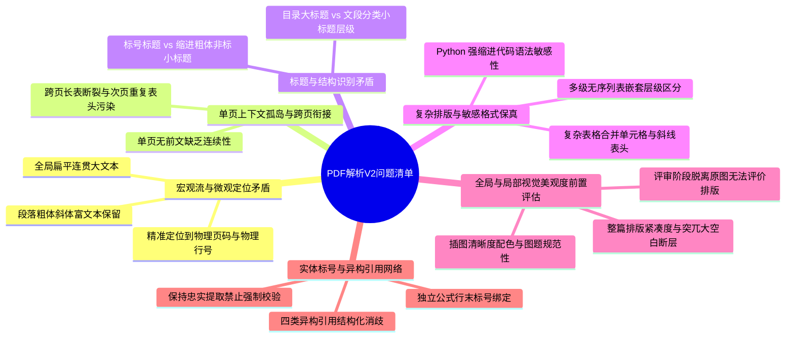

## 问题清单

### 一、文档定位

本文档系统推导第二代通用 PDF 论文解析（PAPER_PARSE_V2）面临的主要工程矛盾与技术挑战，为后续的假设剪枝（03）与解决方案（04）提供客观问题靶点。

根据 MVP 控制原则，本版本仅针对数模论文主要痛点展开推导，不随意扩展边缘旁支。

---

### 二、全景问题结构

---

### 三、主要问题详细剖析

#### 问题一：全篇扁平连贯与微观三级定位（页码/段落/行号）的矛盾
- 矛盾本质：下游大模型评审需要无翻页硬回车的连贯长文本；业务端 AI 建议则需要精准定位到物理页码、段落乃至物理行号（Page $\rightarrow$ Paragraph $\rightarrow$ Line）。
- 解决目标：如何在向大模型提供连贯段落的同时，底层分毫不差地保留各语句在现实 PDF 中的物理页与行号切片。

#### 问题二：非标标题识别与标题层级划分
- 矛盾本质：
  1. 论文标题不仅有“一、”、“1.1”等带序号的标准标题，很多作者直接通过“首行缩进 + 粗体 + 独立占行”表达小标题（如“**参数定义：**”），传统基于正则标号的解析器会完全漏判为普通段落。
  2. 标题存在明显的逻辑层级差异：有的是对应目录的大纲骨架（大标题），有的仅是文段内部的分类小标题或临时提示。
- 解决目标：如何通过视觉排版特征准确捕获非标标题，并建立大标题与文段小标题的层次映射。

#### 问题三：富文本样式（粗体/斜体）与物理行保真
- 矛盾本质：论文中大量使用粗体强调变量、斜体表达数学概念。若直接提取纯文本，富文本信息与视觉换行均会丢失。
- 解决目标：如何在保留物理换行结构的同时，提取文字内的粗体与斜体标记。

#### 问题四：复杂表格的合并单元格与斜线表头结构保真
- 矛盾本质：数学建模表格常包含跨行（rowspan）、跨列（colspan）以及斜线表头（单个单元格被对角线分割为多维度标签）。普通扁平文本提取会把行列结构彻底打散为杂乱字符。
- 解决目标：如何以结构化数据精确还原合并单元格与对角线拆分表头。

#### 问题五：Python 强缩进敏感代码与多级列表层级保真
- 矛盾本质：
  1. 数模附录中以 Python 代码为主，Python 对缩进极度敏感，四个空格与两个空格或缩进丢失会导致逻辑彻底改变。
  2. 正文中多级无序列表完全依靠缩进表达从属关系，若缩进被抹平，条目层级关系全部坍塌。
- 解决目标：如何在提取代码与列表时，严格保持原始空格与缩进层级，杜绝智能折叠破坏语法。

#### 问题六：单页无状态提取导致的跨页断层与长表表头污染
- 矛盾本质：
  1. 单页独立提取缺乏全局前文，相邻页交界处的段落首尾连续性难以判定；
  2. 跨页长表在次页重复绘制表头，混入数据矩阵污染统计。
- 解决目标：建立轻量边界特征声明与双向闭环仲裁状态机，自动识别长表并剥离重复表头。

#### 问题七：全局排版美观度与局部插图美观度的前置评估
- 矛盾本质：
  1. 数模比赛中排版美观度直接影响评审打分（如全篇排版是否饱满紧凑，是否存在因插入大图大表导致上一页留下大半页突兀空白的严重排版瑕疵）。
  2. **下游 AI 评审仅接触结构化文本，不会重新调阅原始 PDF 图像**。若不把美观评价放在解析层前置完成，评审环节将彻底丧失对论文视觉排版的评判能力。
- 解决目标：如何在解析阶段对插图进行语义描述与美观打分，并对整篇论文的排版紧凑度与美观度给出量化评估。

#### 问题八：独立公式标号提取与四类引用的忠实网络构建
- 矛盾本质：正文广泛引用公式、图表与文献，且用户提交的论文可能本身存在跳号、断链或风格混杂等不严谨瑕疵。
- 解决目标：如何准确提取公式行末标号，并在不做强制有效性拦截的前提下，忠实提取四类资源引用，为下游 AI 评审评判行文严谨性提供客观依据。

---

### 四、问题总结表

| 编号 | 主要问题 | 关键技术矛盾 | 待解决目标 |
|:---:|---------|-------------|-----------|
| **1** | **三级定位与扁平化** | 宏观连贯文本 vs 微观行号追溯 | 建立双轨映射，兼顾大模型阅读与高精度行定位 |
| **2** | **非标标题与层级划分** | 正则标号依赖 vs 视觉排版标题识别 | 依据加粗与边距捕获小标题，区分大纲与分类标题 |
| **3** | **富文本与行结构保真** | 纯文本平铺 vs 粗体斜体与换行保留 | 提取 Markdown 格式标签与物理行数组 |
| **4** | **复杂表格结构保留** | 平面文本 vs 合并单元格与斜线表头 | 结构化保留二维矩阵、跨行跨列与对角分区 |
| **5** | **代码缩进与列表层级** | 空间折叠 vs Python 缩进语法强敏感 | 严格保留空格缩进，区分多级列表嵌套 |
| **6** | **跨页断句与长表切除** | 单页孤岛 vs 跨页段落缝合与长表去重 | 双向仲裁状态机与表格列签名比对 |
| **7** | **全局与局部排版美观** | 评审脱离图像 vs 视觉排版瑕疵感知 | 解析层前置量化插图质量与全局排版充实度 |
| **8** | **公式标号与引用网络** | 文本混杂引用 vs 忠实结构化引用提取 | 绑定公式编号，结构化区分四类资源引用 |
