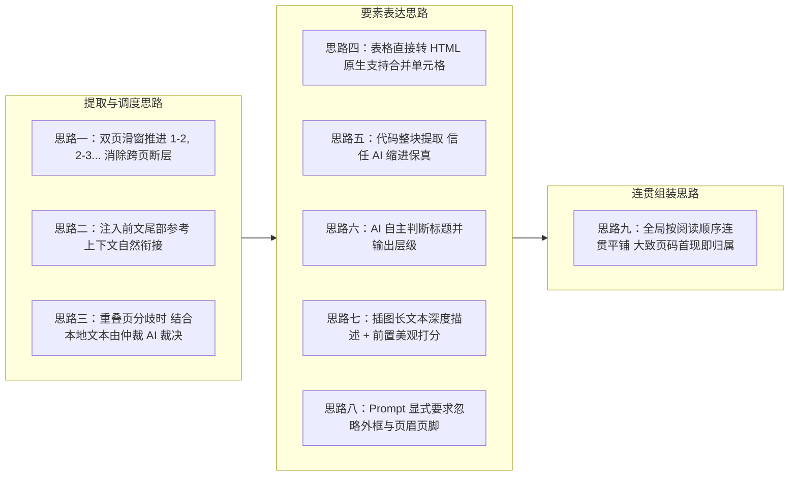

## 解决方案设计

### 一、设计定位与分工思路

本文档针对《02-问题清单.md》确立的主要矛盾，在《03-假设前提.md》准则约束下，给出第二代 PDF 解析功能（PAPER_PARSE_V2）的**宏观解决思路与粗粒度概念设计**。

本阶段不展开具体的数据载荷字段或代码实现细节，仅确立解决各主要问题的技术方向与宏观策略。

---

### 二、主要解决思路

#### 思路一：双页滑动窗口调度（解决跨页断裂）
- 抛弃单页孤立提取与复杂的纯文本拼接逻辑，将单次视觉识别窗口扩大为连续的 2 个物理页（Page $i$, Page $i+1$），步长为 1 个物理页依次向前滑动（1-2, 2-3, 3-4...）。
- 让跨页断句与跨页表格直接落在单次调用的视觉视野内，实现翻页处天然连贯。

#### 思路二：全局大纲与局部末尾的双重前文参考注入（解决上下文孤岛）
- 在处理窗口 $(i, i+1)$ 时，动态拼接两部分极高语义价值的前文参考注入提示词：
  1. **全局内容大纲（Outline Context）**：将前序窗口已提取出的全部标题列表（篇章大标题、小节标题）汇总传入。标题文本量极小但代表核心脉络，让模型对全文结构拥有宏观认知，精准定位当前页所处的章节上下文；
  2. **局部末尾文本（Tail Text Context）**：直接取上一次滑窗解析输出的末尾段落文本，让模型感知微观行文交界。
- 宏观大纲与微观末尾双重加持，保证模型在提取新页面时，既不会迷失篇章层级，又能实现句子与标点的天然无缝接续。

#### 思路三：重叠页分流验证与插图独立融合（解决解析一致性）
- **文本要素常规校验**：针对段落、表格、代码、标题等确定性文本层，若两次解析语义一致直接采纳；若出现明显内容分歧，结合本地程序（PDFBox）纯文本基准，调用轻量仲裁 AI 裁决定稿。
  - **重要仲裁提示**：程序本地提取的纯文本无法区分上标与下标引用（例如会将上标文献标号直接识别为平铺普通文本）。在仲裁输入中明确告知仲裁 AI：涉及上标下标引用格式分歧时，以视觉模型的排版感知为准。
- **插图要素独立融合策略**：
  - 严禁将图片等抽象非文本内容纳入常规冲突检测，防止因大模型描述词差异误触发文本仲裁；
  - 两次解析命中同一张图时：美观评分统一采用 [0, 100] 分制，直接计算两次数值的算术平均值（$Score = (S_1 + S_2) / 2$）；
  - 描述文本直接优先选取信息量更充实、字数更多的详尽版本。

#### 思路四：表格直接转换为原生 HTML（解决复杂表格与合并单元格）
- 不在后端设计复杂的二维网格坐标算法，直接要求 AI 将表格输出为原生 HTML `<table>` 格式。
- 利用 HTML 原生对 `colspan`、`rowspan` 与斜线表头的排版表现力，轻量且高保真地承载复杂学术表格。

#### 思路五：代码整块提取与信任 AI 缩进（解决代码敏感语法）
- 代码直接作为完整文本块保存，不拆碎，不做行级语法二次修改。
- 依靠现代视觉模型的排版保真能力原样保留前导空格与制表符，信任 AI 输出。

#### 思路六：AI 自主识别标题与输出层级（解决非标标题）
- 不设置死板的标号正则，通过视觉排版特征（加粗、独立占行、前后间距）由 AI 自主判断标题。
- 让 AI 自主输出标题层级（一级篇章、二级小节、三级文段小标题），便于下游掌握篇章逻辑。

#### 思路七：插图深度长描述与前置美观量化（解决评审脱离图像）
- 放宽插图描述长度限制，全方位记录图表趋势、坐标轴与模型机理。
- 考虑到下游 AI 评审只接触文本而不调阅原图，在具备视觉感知的解析阶段前置生成标准化 [0, 100] 分制的插图美观分与全篇排版紧凑度分。

#### 思路八：全篇页面普通化，不做特殊页分类逻辑
- 对“摘要页”、“目录页”等特殊排版页面不做独立的页面类型检测与分类处理，全篇从第一页到最后一页均作为普通正文页面一视同仁地平铺提取。
- 摘要直接作为普通标题与段落输出，目录直接作为普通列表或文本输出，避免引入复杂的页面分类器与分支调度。

#### 思路八：Prompt 显式指令忽略边缘噪点（解决外框与页眉页脚）
- 不在后端手写复杂的几何切除算法，直接在提示词中明确指示 AI 忽略外围装饰框线、运行页眉、页脚及印刷页码，从源头获取纯净正文。

#### 思路九：大致物理页定位与首现归属（解决连贯平铺与定位）
- 不做行号精确定位，仅保留从 1 开始递增的真实物理页码。
- 跨页内容首次出现在哪一页即归属在哪一页；主要目标是保证解析后全部内容按人类正确阅读顺序连贯展开并平铺。

---

#### 思路十：滑窗分块独立存储与断点容错降级
- 每次双页滑窗调用完成，立即将该窗口解析切片持久化至分块表，赋予有序递增的 `windowIndex`。
- 若长文档解析中途中断，支持断点恢复续传，仅重试失败窗口，杜绝全篇重来。
- 窗口多次重试失败支持局部降级为 PDFBox 纯文本兜底，保证任务平滑闭环，极大便利结构化日志与排障追溯。

---

### 三、宏观解决思路与问题对应矩阵

| 主要问题 | 宏观解决思路（Idea） | 预期技术方向 |
|---------|---------------------|------------|
| **跨页断裂与翻页断层** | **双页滑窗 + 全局大纲与尾部参考注入** | 滑动窗口步长推进与动态上下文注入 |
| **单页解析一致性** | **重叠验证 + PDFBox 参考 + 仲裁 AI 裁决** | 两次解析差异对比与基准文本仲裁机制 |
| **复杂表格与合并单元格** | **直接输出原生 HTML `<table>` 格式** | 依赖 HTML 标准标签表达高维矩阵与合并单元格 |
| **Python 代码缩进敏感** | **整块文本原样保留，选择相信 AI** | 提示词约束原样前导空格，不做底层二次干预 |
| **非标小标题识别** | **视觉特征捕获 + AI 自主输出层级** | 依靠加粗与间距识别，自主输出章/节/小标题层级 |
| **图表理解与排版感知** | **长文本全方位描述 + 美观度前置量化** | 固化图表内容分析与版面紧凑度评分供评审直接使用 |
| **摘要/目录等特殊页面** | **全篇页面普通化，不做特殊页分类** | 全流程无分支调度，摘要/目录直接平铺提取 |
| **外框与页眉页脚干扰** | **Prompt 显式要求 AI 识别时主动忽略** | 从识别入口彻底过滤非正文噪点 |
| **大模型连贯与定位矛盾** | **全局按顺序平铺，大致页号首现归属** | 统一真实物理页数，消除行号微观开销 |

---

### 四、推进说明

本篇文档作为粗粒度方案概念，仅勾勒解决方向。接下来必须先推进《05-端到端执行流程与架构梳理.md》，理清端到端的组件拓扑、滑窗推进时序与状态生命周期，然后再依次深入到数据结构、提示词体系等细节设计中。
