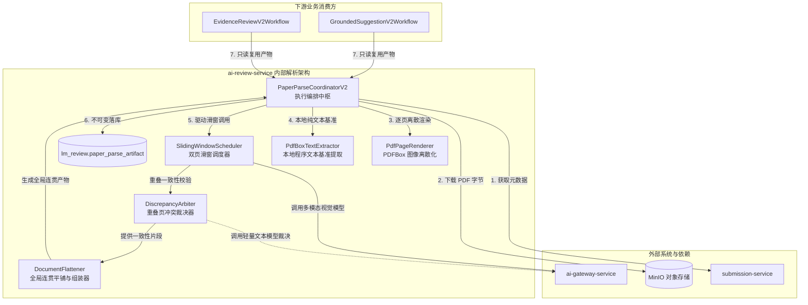
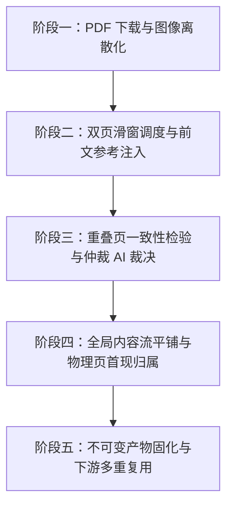
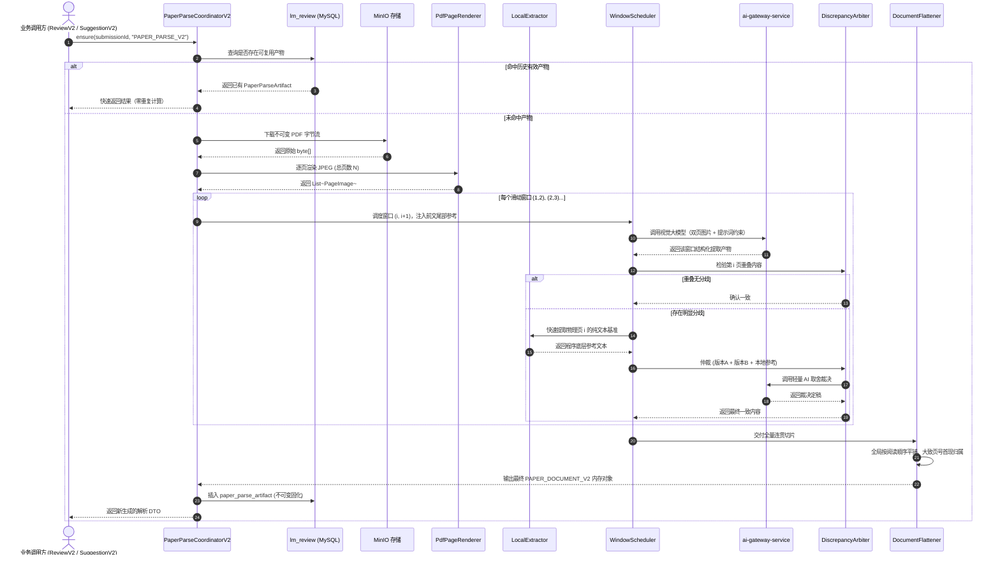

## 执行流程与架构梳理

### 一、文档定位与架构目标

本文档确立第二代 PDF 解析功能（PAPER_PARSE_V2）的**系统架构拓扑、组件职责划分与端到端运行时流水线**。

按照“先梳理执行流程与架构，再设计数据结构与提示词细节”的原则，本文档明确系统从接收不可变 PDF 字节流开始，经过离散渲染、滑窗提取、重叠仲裁、平铺组装，直至最终不可变落库的全生命周期执行流。

---

### 二、系统架构拓扑与交互边界

解析功能完整归属于 `ai-review-service` 内部，对外只通过内部 Feign 契约提供不可变结果查询与确保能力：

#### 内部组件职责

| 组件名称 | 主要职责 |
|---------|---------|
| `PaperParseCoordinatorV2` | 编排中枢：复用检查、下载 PDF、驱动流水线推进、最终产物固化 |
| `PdfPageRenderer` | 离散化渲染器：基于 PDFBox 将 PDF 渲染为自适应高保真单页 JPEG 图像序列 |
| `LocalExtractor` | 客观基准提取器：使用 PDFBox 快速提取单页纯文本层，供重叠页分歧仲裁时作为中立客观参考 |
| `WindowScheduler` | 滑窗调度器：按 (1,2), (2,3)... 推进滑动窗口，组装双页图片并注入前文参考上下文 |
| `DiscrepancyArbiter` | 差异仲裁器：比对两次解析结果的一致性，出现明显冲突时结合本地文本调用仲裁 AI 做单次裁定 |
| `DocumentFlattener` | 平铺组装器：消除翻页硬回车，按人类自然阅读顺序全局平铺，完成大致物理页号首现归属 |

---

### 三、端到端五阶段执行流水线

#### 阶段一：PDF 下载与图像离散化
1. **防重检查**：先按 `(submissionId, workflowVersion, schemaVersion, SUCCESS)` 查库，命中直接返回，零 IO 损耗。
2. **下载与校验**：从 MinIO 下载 PDF 字节流，计算 `contentSha256`，校验文件非空与未加密。
3. **逐页离散渲染**：通过 PDFBox 将每一物理页渲染为独立 JPEG 位图，得到长度为 $N$ 的页面图像序列。

#### 阶段二：双页滑窗调度与前文参考注入
1. **生成滑窗序列**：全篇所有页面统一视为普通正文页，固定步长为 1 生成滑动窗口 $(1, 2) \rightarrow (2, 3) \rightarrow ... \rightarrow (N-1, N)$，不对摘要页、目录页做任何跳过或分支处理。总窗口数为 $N-1$（单页文档特殊处理为单窗口）。
2. **前文双重参考动态注入（全局大纲 + 局部末尾输出）**：
   - 处理首个窗口 $(1, 2)$ 时无前文参考；
   - 处理后续窗口 $(i, i+1)$ 时，提取系统动态拼装两部分高价值参考注入提示词：
     1. **全局内容大纲**：截至当前已识别出的全量标题层级列表（章、节、小标题），文本量极小但赋予模型宏观篇章全局认知；
     2. **局部末尾文本**：直接取上一次滑窗解析输出的末尾文本，提供微观句子与段落交界的直接接续依据；
3. **模型多模态调用与分块独立存储**：
   - 请求 AI 网关视觉模型，要求忽略外框与页眉页脚，表格转 HTML，代码整块保留，行内公式保留 $...$，图表标题自适应位置，消除分栏自然平铺；
   - 窗口解析成功立即将切片写入 `paper_parse_chunk_artifact` 表，赋予 `window_index` 有序序号，实现分块解耦存储与断点恢复。

#### 阶段三：重叠页一致性检验与解耦分流处理
对于中间第 $2 \sim N-1$ 页，系统将文本要素与非文本插图进行清晰解耦分流处理：
1. **插图独立融合流（Figure Isolation & Averaging）**：
   - 彻底将插图等非文本内容排除在常规冲突判定之外，避免因描述词不完全一致拖慢流程；
   - 匹配到同一张插图时：美观度打分统一为 [0, 100] 分制，直接计算两次数值的算术平均值（$Score = (S_1 + S_2) / 2$），描述内容优先采纳描述更详尽、信息量更全的版本。
2. **文本要素一致路径（Text Fast-Path）**：
   - 针对段落、标题、表格、代码等，若语义与结构一致，直接采纳合并。
3. **文本要素仲裁路径（Text Arbitration-Path）**：
   - 若文本要素存在实质分歧（如段落漏提或表格结构截然不同）：
   - 调用 `LocalExtractor` 毫秒级提取该物理页的 PDFBox 本地纯文本层作为中立客观基准；
   - 调用轻量文本 AI 任务，输入版本 A、版本 B 与本地客观参考，单次裁定最终采纳内容。
   - **仲裁提示注入**：由于本地 PDFBox 文本提取无法区分上标与下标引用，提示词中明确提醒仲裁 AI：“本地程序文本无法区分上标，若涉及上标引用排版差异，以视觉模型为准”。

#### 阶段四：全局内容流平铺与物理页首现归属
1. **自然阅读流平铺**：按人类正常从上至下的阅读顺序，将所有识别块串联为一个全局连贯的内容流，段落连接处保持语义通畅。
2. **大致物理页号首现归属**：所有块均标注 `physicalPage`（真实物理页数从 1 递增）。跨页内容（长段落、跨页代码、跨页长表）**首次出现在哪一页，大致页号就归属在哪一页**。
3. **视觉美观度汇总**：提取全篇排版紧凑度（是否存在大空白断层）与插图美观评分，固化为结构化评价。

#### 阶段五：不可变产物固化与下游多重复用
1. **落库固化**：将组装完成的产物序列化为 `document_json`，连同质量报告写入 MySQL `paper_parse_artifact` 表，置状态为 `SUCCESS`。
2. **下游消费**：`EvidenceReviewV2Workflow` 与 `GroundedSuggestionV2Workflow` 通过 Feign 契约只读读取，一次解析，全平台终身共享复用。

---

### 四、端到端运行时时序图

---

### 五、异常处理与降级状态机

| 异常场景 | 触发时机 | 处理策略与状态变化 | 对业务的影响 |
|---------|---------|------------------|------------|
| **PDF 文件损坏或空文件** | 阶段一 下载与载入 | 校验失败，产物表直接记录 `status = FAILED`，抛出不可重试业务异常 | 阻断下游评审，提示用户重新上传有效 PDF |
| **PDF 加密受限** | 阶段一 载入 PDFBox | 检测到 `isEncrypted() == true`，记录 `FAILED` 并抛出加密错误码 | 明确告知用户文档受口令保护，拒绝静默绕过 |
| **单次滑窗调用超时** | 阶段二 网关调用 | 针对当前窗口重试最多 2 次，重试仍失败则标记任务失败 | 保护系统资源，防止单次超时拖死整个线程 |
| **重叠页仲裁分歧** | 阶段三 仲裁裁决 | 若仲裁 AI 调用偶发失败，兜底直接采纳前序窗口提取的内容（Fail-Safe 策略） | 保证主干流程平滑闭环，绝不因局部小分歧卡死全流程 |

---

### 六、架构梳理总结与后续衔接

通过本篇对**“系统架构拓扑”**、**“五阶段流水线”**与**“端到端运行时序”**的彻底梳理，第二代解析的骨干运行脉络已经完全清晰。

在此架构骨架下，接下来的任务序列将按部就班深入到细节规范制定中：
1. **06-数据契约与产物Schema设计**：定义 `PAPER_DOCUMENT_V2` 的数据结构载荷（HTML 表格、整块代码、大致页号映射）；
2. **07-提示词体系与输出规范**：定义双页输入、忽略外框与页眉页脚、HTML 表格与长图描述的 Prompt 指令；
3. **08-上下文管理与滑窗调度机制**：深化 1-2, 2-3 推进与前文参考注入机制；
4. **09-重叠冲突检测与仲裁机制**：细化本地文本提取参考与仲裁 AI 的接口契约。
