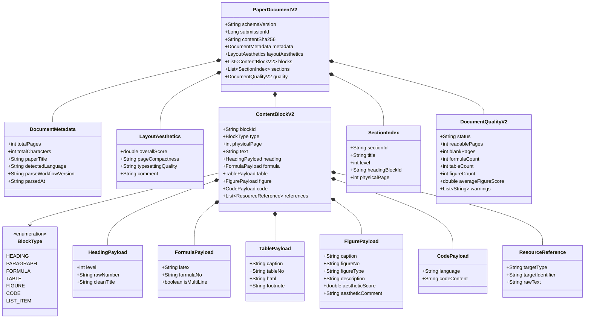
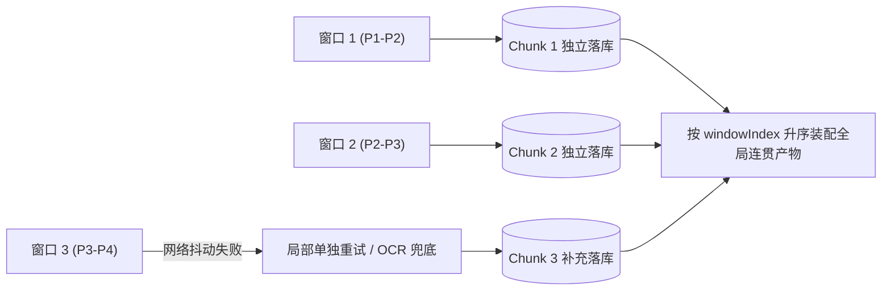

## 数据契约与产物Schema设计


### 一、设计目标与建模准则

本文档正式确立第二代 PDF 解析（PAPER_PARSE_V2）产出数据的程序结构与数据契约，产物 Schema 编码为 `PAPER_DOCUMENT_V2`。

数据模型严格遵循前序确立的假设与极简方案，贯彻以下建模准则：
1. **全局线性扁平化**：内容块按照人类自然阅读顺序组成一维有序序列，相邻页面文本平滑连贯，消除翻页硬断裂。
2. **大致物理页号首现归属**：不记录微观物理行号，统一使用从 1 连续递增的真实物理页数（physicalPage）；跨页元素首次出现在哪一页，大致页号即归属在哪一页。
3. **HTML 表格原生表达**：表格直接以原生 HTML `<table>` 格式存储，原生承载多列多行合并与斜线表头。
4. **代码整块保真**：程序源码作为完整文本块保存，原样保留前导空格与制表符缩进，不进行过细的行语法拆解。
5. **插图长描述与美观量化**：放宽插图描述长度，插图美观度与全局排版紧凑度统一量化为 `[0, 100]` 标准分制。
6. **引用事实纯提取**：结构化记录文中四类资源引用，不做强制存在性检查，保留作者行文原始瑕疵。


---


### 二、全景数据模型类图

`PAPER_DOCUMENT_V2` 由元数据、全局排版美观度、一维内容块流、章节目录索引与质量报告构成：




---


### 三、核心内容块模型（ContentBlockV2）与专有载荷

每一个内容块拥有全局有序递增的唯一标识 `blockId`（如 B1, B2, B3...）。

#### 1. 通用基础字段

| 字段名 | 类型 | 必填 | 语义说明 |
|-------|------|------|---------|
| `blockId` | String | 是 | 全局唯一块标识，从 B1 开始按自然阅读流顺序递增 |
| `type` | BlockType | 是 | 块类型枚举，决定非空专属载荷 |
| `physicalPage` | int | 是 | 真实物理页码，从 1 连续递增；跨页元素首次出现在哪页即标为哪页 |
| `text` | String | 是 | 纯文本表达或用于下游 LLM 快速阅读的标准文本 |
| `references` | List\<ResourceReference\> | 否 | 该块内包含的文内资源引用列表，无引用时为空数组 |

#### 2. 各类型专有载荷定义

##### A. 标题块（HEADING）
- 载荷对象：`heading`
- 字段说明：
  - `level`（int）：标题层级，由 AI 依据排版视觉特征自主输出（如 1 级大标题、2 级小节、3 级文段分类小标题）。
  - `rawNumber`（String）：提取出的原始编号，如 `"一、"`、`"1.2"`，非标小标题无编号时为空。
  - `cleanTitle`（String）：剥离了编号后的纯净标题文本。

##### B. 正文段落块（PARAGRAPH）
- 载荷说明：段落由基础 `text` 字段承载，支持以下行内富文本与科学表达：
  - 行内公式：以标准 LaTeX 语法 `$公式代码$` 嵌入在正文字符串之间（如 `设权重 $\\alpha \\in [0, 1]$`），行内公式不单独设块；
  - 富文本样式：以 Markdown 标准保留粗体（`**加粗**`）与斜体（`*斜体*`）。

##### C. 独立公式块（FORMULA）
- 载荷对象：`formula`
- 字段说明：
  - `latex`（String）：标准 LaTeX 公式源代码，多行方程组使用 `aligned` 等标准环境包裹。
  - `formulaNo`（String）：公式行末提取出的标号，如 `"(1)"`、`"(3.2)"`，无标号时为空。
  - `isMultiLine`（boolean）：是否为多行方程组。

##### D. 结构化表格块（TABLE）
- 载荷对象：`table`
- 字段说明：
  - `caption`（String）：表格标题文本，如 `"表 1 模拟参数基准值"`。
  - `captionPosition`（String）：标题物理位置，`TOP`（表上方，学术标准）或 `BOTTOM`（部分排版置于表下方）。
  - `tableNo`（String）：表格编号，如 `"表 1"`。
  - `html`（String）：原生 HTML 格式表格代码，完整保留 `<table>`、`<tr>`、`<th>`、`<td>` 标签以及 `colspan`、`rowspan` 合并属性，完美呈现斜线表头与复杂网格。
  - `footnote`（String）：表格底部的说明备注，无备注时为空。

##### E. 科研插图块（FIGURE）
- 载荷对象：`figure`
- 字段说明：
  - `caption`（String）：插图主图题文本，如 `"图 2 算法收敛性能对比"`。
  - `captionPosition`（String）：图题物理位置，`BOTTOM`（图下方，常见规范）或 `TOP`（图上方）。
  - `figureNo`（String）：图编号，如 `"图 2"`。
  - `figureType`（String）：图表类别枚举，包含 `DATA_VISUALIZATION`、`ILLUSTRATION`、`FLOWCHART`、`SYSTEM_TOPOLOGY`、`OTHER`。
  - `description`（String）：全方位深入的图表长文本描述，记录数据走势、极值、坐标轴单位、图例及算法机理。
  - `aestheticScore`（double）：插图视觉美观度前置量化评分，取值范围 `[0, 100]`。
  - `aestheticComment`（String）：美观度定性评语，记录清晰度、色彩搭配及标注规范性。
  - `subFigures`（List<SubFigure>）：组合子图列表。当多个图共用一个大标题时，记录各自子图编号（如 `"(a)"`）、小标题与独立分部说明。

##### F. 程序源码块（CODE）
- 载荷对象：`code`
- 字段说明：
  - `language`（String）：编程语言标识，如 `"python"`、`"matlab"`、`"pseudo"`。
  - `codeContent`（String）：整块程序源代码，原汁原味保留前导空格与制表符缩进。

##### G. 资源引用对象（ResourceReference）
- 字段说明：
  - `targetType`（String）：被引用资源类型，枚举包括 `FORMULA`、`FIGURE`、`TABLE`、`CITATION`。
  - `targetIdentifier`（String）：目标标号标识，如 `"(1)"`、`"图 2"`、`"表 1"`、`"[3]"`。
  - `rawText`（String）：文中的原始引用字面量，如 `"由式(1)可知"`、`"如图2所示"`。
  - `isSuperscript`（boolean）：是否为上标引用（如正文中出现的上标文献号 `文献^[1]`）。注意：视觉大模型能准确感知上标，但程序底层 OCR 无法区分上标而会扁平化为普通文本，该字段用于仲裁时明确视觉优势。


---


### 四、全局排版美观度与质量报告模型

#### 1. 全局排版美观度（LayoutAesthetics）
针对整篇论文物理版面的前置视觉印象评价：
- `overallScore`（double）：全局排版美观度总评分，范围 `[0, 100]`。
- `pageCompactness`（String）：版面紧凑饱满度，分为 `HIGH`、`MEDIUM`、`LOW`，用于评价是否存在由于插入大图导致前页留下半页以上突兀空白的断层硬伤。
- `typesettingQuality`（String）：换行与图文穿插均匀度，分为 `EXCELLENT`、`GOOD`、`ACCEPTABLE`。
- `comment`（String）：综合排版评价。

#### 2. 文档质量报告（DocumentQualityV2）
- `status`（String）：解析终态，`SUCCESS` 或 `FAILED`。
- `readablePages`（int）：成功提取内容的物理页数。
- `blankPages`（int）：提取为空白的物理页数。
- `formulaCount`（int）：全篇提取的独立公式块总数。
- `tableCount`（int）：全篇提取的表格总数。
- `figureCount`（int）：全篇提取的插图总数。
- `averageFigureScore`（double）：全篇插图平均美观度得分。
- `warnings`（List\<String\>）：解析告警列表。


---


### 五、产物 JSON Schema 完整范例

不可变落库字段 `paper_parse_artifact.document_json` 存储的标准格式样例：

```json
{
  "schemaVersion": "PAPER_DOCUMENT_V2",
  "submissionId": 1024,
  "contentSha256": "e3b0c44298fc1c149afbf4c8996fb92427ae41e4649b934ca495991b7852b855",
  "metadata": {
    "totalPages": 25,
    "totalCharacters": 38500,
    "paperTitle": "基于改进粒子群算法的无人机物流航迹动态规划",
    "detectedLanguage": "ZH",
    "parseWorkflowVersion": "PAPER_PARSE_V2",
    "parsedAt": "2026-09-05T10:00:00Z"
  },
  "layoutAesthetics": {
    "overallScore": 88.5,
    "pageCompactness": "HIGH",
    "typesettingQuality": "EXCELLENT",
    "comment": "全篇排版充实饱满，图文穿插合理，各页无因大图导致的突兀大空白断崖，边距与换行规整。"
  },
  "blocks": [
    {
      "blockId": "B1",
      "type": "HEADING",
      "physicalPage": 1,
      "text": "一、问题重述",
      "heading": {
        "level": 1,
        "rawNumber": "一、",
        "cleanTitle": "问题重述"
      }
    },
    {
      "blockId": "B2",
      "type": "PARAGRAPH",
      "physicalPage": 1,
      "text": "无人机在复杂低空空域执行物流配送任务时，面临动态风场与能量限制等诸多约束。数学模型定义由式(1)给出，实验数据如表1所示。",
      "references": [
        { "targetType": "FORMULA", "targetIdentifier": "(1)", "rawText": "式(1)" },
        { "targetType": "TABLE", "targetIdentifier": "表 1", "rawText": "表1" }
      ]
    },
    {
      "blockId": "B3",
      "type": "FORMULA",
      "physicalPage": 2,
      "text": "$$\\min J = \\int_{0}^{T} (w_1 \\|v(t)\\|^2 + w_2 \\|u(t)\\|^2) dt \\quad (1)$$",
      "formula": {
        "latex": "\\min J = \\int_{0}^{T} (w_1 \\|v(t)\\|^2 + w_2 \\|u(t)\\|^2) dt",
        "formulaNo": "(1)",
        "isMultiLine": false
      }
    },
    {
      "blockId": "B4",
      "type": "TABLE",
      "physicalPage": 3,
      "text": "表格：表 1 无人机物理参数设定",
      "table": {
        "caption": "表 1 无人机物理参数设定",
        "tableNo": "表 1",
        "html": "<table border=\"1\"><thead><tr><th rowspan=\"2\">型号</th><th colspan=\"2\">动力参数</th></tr><tr><th>最大速度(m/s)</th><th>额定载荷(kg)</th></tr></thead><tbody><tr><td>UAV-A</td><td>25.0</td><td>5.0</td></tr></tbody></table>",
        "footnote": "注：数据引自某工业八旋翼无人机实测手册。"
      }
    },
    {
      "blockId": "B5",
      "type": "FIGURE",
      "physicalPage": 4,
      "text": "插图：图 1 算法迭代收敛曲线",
      "figure": {
        "caption": "图 1 遗传算法与粒子群算法收敛速度对比",
        "figureNo": "图 1",
        "figureType": "DATA_VISUALIZATION",
        "description": "该图展示了在相同测试函数下两算法的适应度下降趋势。粒子群算法在第 45 代收敛于全局最优解 0.012，收敛速度明显优于遗传算法。",
        "aestheticScore": 92.0,
        "aestheticComment": "矢量曲线平滑清晰，双曲线对比色彩分明，坐标轴标注具有明确物理单位，图例合理无遮挡。"
      }
    },
    {
      "blockId": "B6",
      "type": "CODE",
      "physicalPage": 5,
      "text": "代码清单：主航迹规划函数",
      "code": {
        "language": "python",
        "codeContent": "def optimize_path(start, end, obstacles):\n    path = []\n    for obs in obstacles:\n        if distance(path, obs) < safety_margin:\n            path = avoid(obs)\n    return path"
      }
    }
  ],
  "sections": [
    {
      "sectionId": "SEC-1",
      "title": "一、问题重述",
      "level": 1,
      "headingBlockId": "B1",
      "physicalPage": 1
    }
  ],
  "quality": {
    "status": "SUCCESS",
    "readablePages": 25,
    "blankPages": 0,
    "formulaCount": 12,
    "tableCount": 4,
    "figureCount": 5,
    "averageFigureScore": 89.5,
    "warnings": []
  }
}
```


---


### 五、滑窗分块解耦存储与断点恢复模型（PaperParseChunkArtifact）

为防止长文档解析中途失败导致整体成果丢失，系统确立**分块解耦独立存储机制**。每个双页滑窗调用完成后，立即进行有序持久化。



#### 1. 中间分块存储结构（paper_parse_chunk_artifact 表）

| 字段名 | 类型 | 约束 | 语义说明 |
|-------|------|------|---------|
| `id` | BIGINT | PRIMARY KEY | 雪花唯一主键 |
| `submission_id` | BIGINT | NOT NULL | 提交记录 ID |
| `workflow_version` | VARCHAR(40) | NOT NULL | 解析工作流版本，固定为 `PAPER_PARSE_V2` |
| `window_index` | INT | NOT NULL | 滑窗执行序号（1, 2, 3...），保证全局物理顺序可恢复 |
| `start_page` | INT | NOT NULL | 窗口起始物理页码 |
| `end_page` | INT | NOT NULL | 窗口结束物理页码 |
| `status` | VARCHAR(20) | NOT NULL | 状态：`SUCCESS`、`DEGRADED_OCR`、`FAILED` |
| `chunk_json` | JSON | NULL | 该窗口解析输出的结构化块列表 |
| `attempt_no` | INT | NOT NULL | 重试轮次编号，初始为 1 |
| `error_message` | VARCHAR(500) | NULL | 失败原因说明 |

- 联合唯一索引：`uk_submission_window (submission_id, workflow_version, window_index)`。

#### 2. 断点恢复与顺序恢复保证
1. **断点恢复（Resume from Breakpoint）**：若某窗口调用失败，整个解析任务触发重试时，调度器先查询数据库中已存在的 `SUCCESS` 分块，直接复用已成功数据，仅针对失败窗口进行重试调用。
2. **确定性顺序恢复**：最终全篇平铺组装时，SQL 显式执行 `ORDER BY window_index ASC`，严格按物理滑窗先后恢复排版顺序，彻底解耦异步并发与顺序维护。

#### 3. 降级兜底机制
1. **OCR 局部兜底**：若某窗口经过多次重试依然遭遇网关超时或格式损坏，该窗口自动触发降级，调用本地 PDFBox 提取该两页纯文本存入 `chunk_json`，状态记为 `DEGRADED_OCR`。
2. **全局容错保障**：确保全篇文档解析任务依然能够顺利闭环固化，并在最终质量报告中记录 `DEGRADED_OCR_PRESENT` 告警，极大便利了日志追踪与问题定位。


---


### 六、Java 数据结构定义（Record 规范草案）

对应在 `ai-review-service` 模块中的不可变实体类定义：

```java
package com.leetmodel.review.parse.v2;

import java.util.List;

public record PaperDocumentV2(
        String schemaVersion,
        Long submissionId,
        String contentSha256,
        DocumentMetadata metadata,
        LayoutAesthetics layoutAesthetics,
        List<ContentBlockV2> blocks,
        List<SectionIndex> sections,
        DocumentQualityV2 quality
) {
    public record DocumentMetadata(
            int totalPages,
            int totalCharacters,
            String paperTitle,
            String detectedLanguage,
            String parseWorkflowVersion,
            String parsedAt
    ) {}

    public record LayoutAesthetics(
            double overallScore,
            String pageCompactness,
            String typesettingQuality,
            String comment
    ) {}

    public record ContentBlockV2(
            String blockId,
            BlockType type,
            int physicalPage,
            String text,
            HeadingPayload heading,
            FormulaPayload formula,
            TablePayload table,
            FigurePayload figure,
            CodePayload code,
            List<ResourceReference> references
    ) {}

    public enum BlockType {
        HEADING, PARAGRAPH, FORMULA, TABLE, FIGURE, CODE, LIST_ITEM
    }

    public record HeadingPayload(int level, String rawNumber, String cleanTitle) {}
    public record FormulaPayload(String latex, String formulaNo, boolean isMultiLine) {}
    public record TablePayload(String caption, String captionPosition, String tableNo, String html, String footnote) {}
    public record FigurePayload(String caption, String captionPosition, String figureNo, String figureType,
                                String description, double aestheticScore, String aestheticComment,
                                List<SubFigure> subFigures) {}
    public record SubFigure(String subNo, String subCaption, String subDescription) {}
    public record CodePayload(String language, String codeContent) {}
    public record ResourceReference(String targetType, String targetIdentifier, String rawText, boolean isSuperscript) {}

    public record SectionIndex(
            String sectionId,
            String title,
            int level,
            String headingBlockId,
            int physicalPage
    ) {}

    public record DocumentQualityV2(
            String status,
            int readablePages,
            int blankPages,
            int formulaCount,
            int tableCount,
            int figureCount,
            double averageFigureScore,
            List<String> warnings
    ) {}
}
```


---


### 七、下游服务消费指引

1. **AI 评审服务（EvidenceReviewV2Workflow）**：
   - 篇章逻辑消费：直接读取 `blocks` 顺序列表，获得自然展开、无翻页生硬回车的全局连贯文本流；
   - 排版与视觉美观度打分：直接读取 `layoutAesthetics.overallScore` 与各插图的 `figure.aestheticScore`，作为论文“格式规范与排版呈现”维度的确定性依据；
   - 证据定位核验：模型指控的证据事实，直接通过 `physicalPage` 锚定真实物理页码。
2. **论文改进建议服务（GroundedSuggestionV2Workflow）**：
   - 定位给建议：依据 `block.physicalPage` 明确告知用户“建议修改物理第 X 页关于某模型的论述”；
   - 引用断链诊断：基于 `references` 列表比对文内提到的图表是否真实存在，分析作者引用规范性并提供针对性修改建议。
