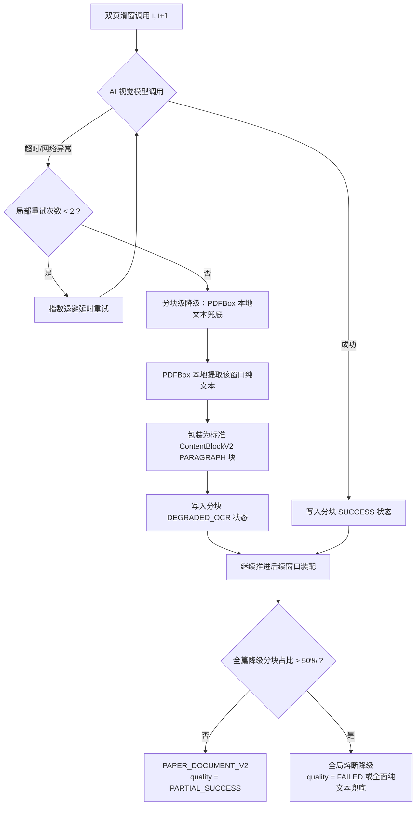
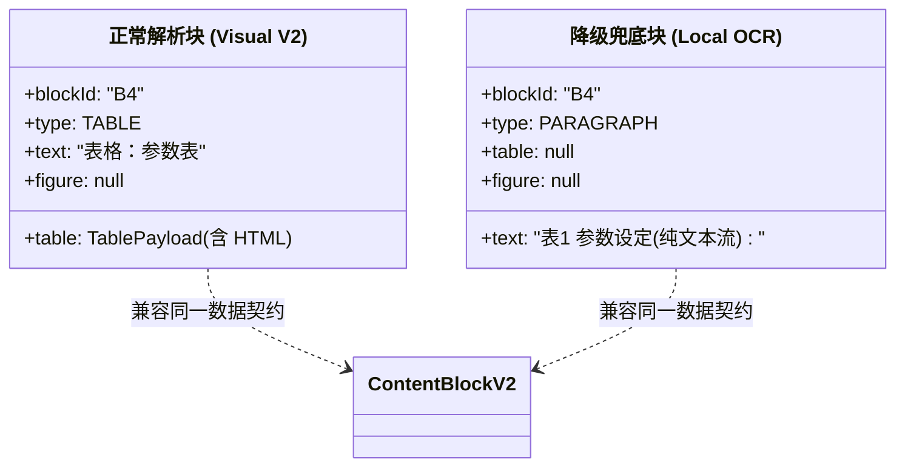
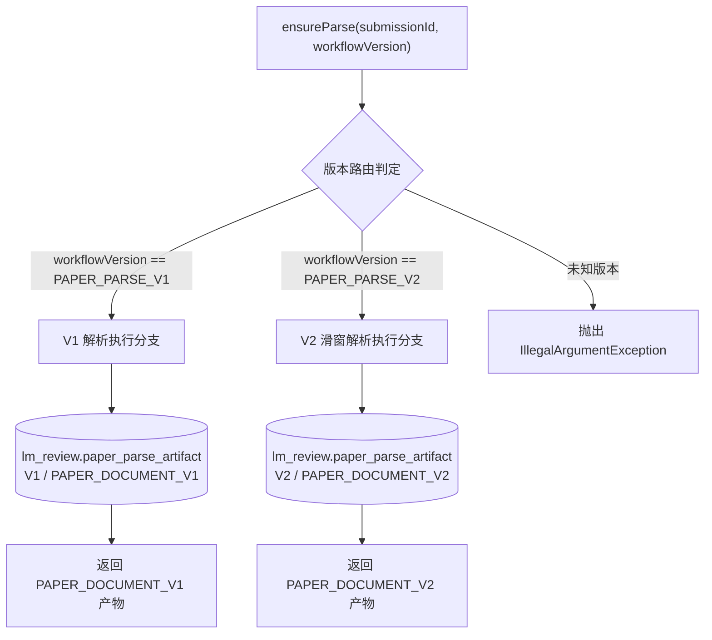

## 降级容错与版本兼容设计

### 一、设计目标与兼容性核心原则

本文档确立第二代 PDF 解析（PAPER_PARSE_V2）在面对网络抖动、模型服务异常及极端文件损坏时的**多级降级重试流水线**，以及与历史版本、下游微服务的**契约兼容性保障机制**。

为彻底防止“解析降级后结构不匹配导致下游系统崩溃”的隐患，系统确立以下最高兼容性原则：

> **核心兼容原则：Schema 结构不可变，降级只降级质量，不降级数据契约（Schema-Invariant Degradation）。**
>
> 无论解析过程触发了重试、局部 OCR 兜底、还是全篇降级，**解析器对外交付的输出对象始终严格保持为 `PAPER_DOCUMENT_V2`**。绝不允许因降级而返回非法的旧版数据结构，彻底杜绝下游反序列化异常或空指针崩溃。

---

### 二、三级容错与降级状态机

系统构建三级递进式容错防御体系：

#### 1. 一级：窗口级局部重试（Window-Level Retry）
- **触发条件**：单次双页滑窗请求遭遇 AI 网关 504 超时、HTTP 429 限流或瞬间网络抖动。
- **重试策略**：仅对当前失败的滑动窗口执行重试，最多重试 2 次，重试间隔采用退避机制（1秒、3秒）。
- **状态维护**：失败重试自增分块表中的 `attempt_no`，绝不影响前序已经解析成功的任何窗口。

#### 2. 二级：分块级本地 OCR 兜底（Chunk-Level OCR Fallback）
- **触发条件**：当前窗口重试 2 次后依然失败，或因特定页面图片超大被模型拒识。
- **兜底动作**：
  1. 调度器自动捕获异常，阻断失败向外蔓延；
  2. 立即调用本地 `PdfBoxTextExtractor` 抽取该窗口对应的物理页纯文本；
  3. 将抽取的纯文本转换为标准的 `ContentBlockV2`（`type = PARAGRAPH`，`text = 提取纯文本`，`physicalPage = 窗口起始页`）；
  4. 将该分块写入 `paper_parse_chunk_artifact`，状态标记为 `DEGRADED_OCR`；
  5. 流水线平滑推进至下一个窗口，全篇任务不中断。

#### 3. 三级：全篇熔断与降级保护（Document-Level Fallback）
- **触发条件**：外部模型供应商出现不可逆持续故障，全篇超过半数的分块均触发了降级。
- **熔断策略**：系统在组装最终产物时，将 `DocumentQualityV2.status` 标记为 `PARTIAL_SUCCESS`，并在 warnings 中显式注入 `DEGRADED_LOCAL_OCR_PRESENT` 告警，说明全篇缺少高精度的图表与公式载荷，但保证文本主干完整。

---

### 三、数据契约兼容性保障机制

为了保证下游服务在面对降级产物时完全免疫，数据结构采取字段宽容与安全退化设计：

#### 1. 结构与字段的退化规则

| 要素类型 | 正常 V2 产物形态 | 降级为本地纯文本时的形态 | 兼容性保证手段 |
|---------|----------------|------------------------|--------------|
| **正文段落** | 包含 Markdown 富文本及引用事实 | 纯文本段落字符串 | `text` 字段始终存在，下游大模型直接读取无障碍 |
| **复杂表格** | `TablePayload` 包含原生 HTML 代码 | 退化为 `PARAGRAPH`，`text` 包含制表符或空格文本 | `table` 载荷为 null，下游以基础 `text` 为准，不报空指针 |
| **独立公式** | `FormulaPayload` 包含标准 LaTeX 源码 | 退化为 `PARAGRAPH`，`text` 包含平铺公式字符 | `formula` 载荷为 null，不中断下游文本流 |
| **科研插图** | `FigurePayload` 包含长描述与美观分 | 仅保留插图下方识别到的图题文本 | `figure` 载荷为 null，美观评分缺省，避免伪造分数 |

#### 2. 下游消费方的防崩契约范式
`EvidenceReviewV2Workflow` 与 `GroundedSuggestionV2Workflow` 在消费 `PAPER_DOCUMENT_V2` 时遵守以下安全规范：
1. **载荷判空防御**：在尝试读取 `block.table()`、`block.figure()` 等专用对象前，必须进行非空检查；若为 null，直接回退读取 `block.text()`。
2. **质量报告感知**：下游评审模型在组装输入前检查 `quality.warnings`：
   - 若包含 `DEGRADED_LOCAL_OCR_PRESENT`，系统在评审 Prompt 中自适应追加提示：“本次论文部分页面由本地基础纯文本降级解析，图表与公式视觉载荷已弱化，针对排版美观维度的打分请输出 UNVERIFIABLE”。
   - 杜绝评审模型因“看不到图片描述”而给出不公正的低分。

---

### 四、历史版本（V1 与 V2）双轨并存与平滑迁移

LeetModel 系统中存在已落库的 `PAPER_DOCUMENT_V1` 历史数据，必须确保新老版本在生命周期中互不污染、平滑共存。

#### 1. 物理存储层隔离
- `paper_parse_artifact` 表结构完全天然支持多版本共存：
  - 复用联合索引为 `(submission_id, workflow_version, schema_version, status, create_time)`；
  - 同一个提交记录，如果曾用 V1 解析过，表中存有一条 `workflow_version = PAPER_PARSE_V1, schema_version = PAPER_DOCUMENT_V1` 的记录；
  - 当触发 V2 解析时，系统插入一条全新的 `workflow_version = PAPER_PARSE_V2, schema_version = PAPER_DOCUMENT_V2` 记录；
  - **绝不覆盖、修改或删除历史 V1 记录**，保证历史评审回溯完全幂等。

#### 2. 服务端多态路由
在 `PaperParseService` 内部，按 `workflowVersion` 字段实施多态调度：
- 严格校验传入的 `workflowVersion`；
- 旧接口若请求 `PAPER_PARSE_V1`，继续调用 `PaperParseV1Parser`，保持历史行为 100% 确定；
- 新接口请求 `PAPER_PARSE_V2`，触发新的滑窗与降级流程。

#### 3. 下游建议服务的平滑升级
- 针对历史上仅有 V1 评审和 V1 解析的旧论文，`ai-suggestion-service` 可按需调用 `ensureParse(submissionId, "PAPER_PARSE_V2")` 补齐 V2 解析产物；
- 补齐过程生成全新的 V2 记录，与历史 V1 结果并存，彻底消除版本升级时的断层风险。

---

### 五、总结

通过确立“**Schema 结构不可变**”、“**分块级本地文本兜底**”与“**多版本物理隔离路由**”，V2 解析具备了极高的工程韧性：
1. 局部网络故障或特定页面解析失败不会击垮全局任务；
2. 降级后的数据与正常数据统一遵从 `PAPER_DOCUMENT_V2` 规范，下游消费方永远不会遭遇反序列化或格式崩溃；
3. 历史数据与新版本数据和平共处，支持平滑迭代。
