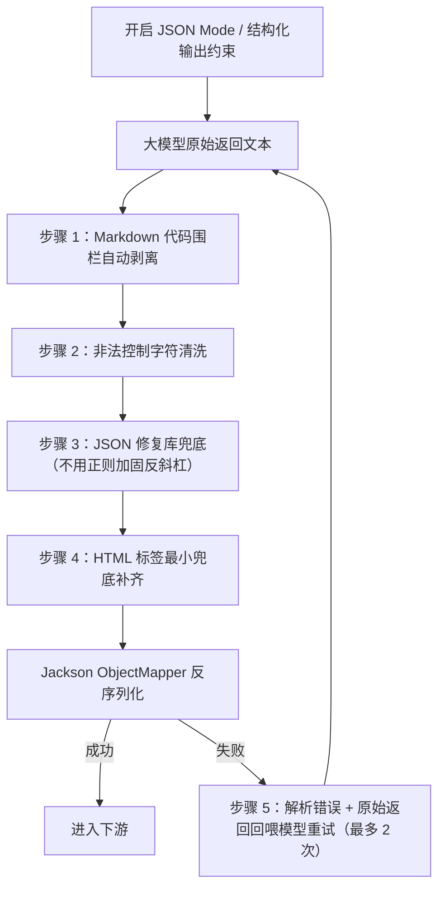

## 提示词设计与输出规范

### 一、文档定位与设计目标

本文档确立第二代 PDF 解析（PAPER_PARSE_V2）中面向 AI 视觉多模态大模型的**提示词工程规范、Markdown 语法模板、占位符标准、反斜杠转义防崩准则与输出示例**。

根据整体架构，系统提示词与用户提示词统一采用清晰严谨的 **Markdown 语法** 编写，通过层级标题、无序列表、粗体强调与引用块划分各个指令维度，便于大模型结构化理解与执行。

具体的提示词源文件统一存放在本目录下的 [prompts/](prompts/) 文件夹中：
- [paper-parse-v2-system.md](prompts/paper-parse-v2-system.md)：系统提示词源文件
- [paper-parse-v2-user.md](prompts/paper-parse-v2-user.md)：用户提示词模板源文件
- [paper-parse-v2-arbiter.md](prompts/paper-parse-v2-arbiter.md)：仲裁提示词源文件

关于 Java 后端在 LangChain4j 框架下针对提示词模板渲染、网络传输转义与 JSON 解析防崩的详细底层工程最佳实践，可参考知识库文档 [提示词管理.md](/home/dorian/repo/LeetModel/docs/learning/提示词管理.md:1)。

---

### 二、模板占位符标准（`[PLACEHOLDER]` 规范）

在动态组装用户提示词（User Prompt）时，系统统一采用方括号包裹的大写标识符作为标准占位符：

| 占位符名称 | 数据来源 | 语义说明 |
|-----------|---------|---------|
| `[START_PHYSICAL_PAGE]` | 当前滑窗调度器 | 当前窗口起始真实物理页码（整数，从 1 开始） |
| `[END_PHYSICAL_PAGE]` | 当前滑窗调度器 | 当前窗口结束真实物理页码（整数，通常为 start + 1） |
| `[WINDOW_INDEX]` | 当前滑窗调度器 | 当前滑动窗口序号（1, 2, 3...） |
| `[OUTLINE_CONTEXT]` | 上下文管理器缓存 | 截至当前已识别出的全局章节大纲列表，无则填充“（暂无前文大纲）” |
| `[TAIL_CONTEXT]` | 上一次滑窗产物尾部 | 上一次窗口解析输出的最后一段文字（约 300 至 500 字），无则填充“（首页起始，无前文）” |

---

> 💡 **提示词工程与模型缓存（Prompt Caching）关键设计**：
> 1. **系统提示词纯静态化**：系统提示词中去除了所有动态变量占位符，保持全任务 100% 静态不可变。这样可以充分触发 DeepSeek、OpenAI、Claude 等模型服务商的 Prompt Cache（提示词前缀缓存）机制，使得原本高达数千 Token 的系统人设与格式规范享受高达 50%~90% 的请求折扣并大幅削减首字延迟（TTFT）！
> 2. **blockId 职责划分**：大模型单次滑窗输出的 DTO（`WindowChunkDTO`）不包含 `blockId`，因为大模型无法预知全篇全局的编号流水；全局唯一的 `blockId`（如 `B1`, `B2`...）由后端在阶段四进行全局连贯平铺组装时统一编号赋予。

---

### 三、系统提示词规范（System Prompt）

系统提示词固化存放于 `resources/prompts/paper-parse-v2-system.st`，采用纯 Markdown 语法编写：

> ⚠️ **模板工程注意事项**：
> 1. `.st` 为 StringTemplate 模板，其默认表达式分隔符是 `<` 与 `>`，而本文提示词正文大量出现 `<table>`、`<tr>`、`<th>`、`<td>`、`<thead>`、`<tbody>`，会被模板引擎误判为表达式，导致渲染报错或内容错乱。必须在初始化 StringTemplateGroup 时把分隔符改为不会出现在正文中的符号（例如 `«` `»`），或对尖括号做模板转义。
> 2. 提示词中所有双反斜杠必须经过“文件读取 → 模板渲染 → 请求组装”整条链路后仍是**两个反斜杠字符**。上线前请打印渲染后的最终字符串核对，确认模型实际收到的是两个反斜杠字符而非一个，否则会系统性制造“转义少了”的 bug。

> 📄 **系统提示词全文**已独立存放于 [`prompts/paper-parse-v2-system.md`](prompts/paper-parse-v2-system.md)，本节不再内嵌全文，核心要点（角色设定、核心任务、处理准则、特殊字符与转义死律、JSON 格式定义、输出示例、自检清单）以该文件为准。

---

### 四、动态用户提示词规范（User Prompt）

动态组装的用户提示词同样采用标准 Markdown 语法编写：

> 📄 **动态用户提示词模板全文**已独立存放于 [`prompts/paper-parse-v2-user.md`](prompts/paper-parse-v2-user.md)，本节不再内嵌全文。

---

### 五、后端反序列化防崩、修复与重试机制

> ⚠️ **核心认知**：任何“事后正则修补”都无法可靠还原已被错误转义的 LaTeX 内容，只能作为兜底；真正的正确性保障来自“约束模型输出”（JSON Mode / 结构化输出）+ “解析失败重试闭环”。因此本节不再承诺“100% 安全加载”。

`PaperParseService` 采用“前置约束 → 兜底清洗 → 失败重试”三层机制：

- **前置约束（首选，治本）**：优先开启模型 API 的 JSON Mode / Structured Output（如 OpenAI 系 `response_format`，或各家的 function/tool calling 等价能力），从源头约束模型输出合法 JSON，大幅降低非法转义概率。

- **步骤 1：代码围栏自动剥离**：使用正则截取首个 `{` 到最后一个 `}` 之间的纯净报文，剥离外部可能附带的 Markdown 代码块围栏。

- **步骤 2：非法控制字符过滤**：仅在“结构空白”层面移除 JSON 中非法的控制字符，即移除 `\u0000~\u0008`、`\u000b`、`\u000c`、`\u000e~\u001f`，**明确保留** `\t`(U+0009)、`\n`(U+000A)、`\r`(U+000D) 三种合法的 JSON 结构空白（注意与字符串值内部需转义的换行/制表区分：字符串值内部出现字面换行/制表属于非法 JSON，交由“步骤 5：重试闭环”处理，而非在此静默删除）。

- **步骤 3：JSON 修复库兜底（替代原“单反斜杠智能加固”）**：废弃“用正则把单反斜杠补齐为双反斜杠”的做法。该正则在 LaTeX 场景下必然出错——`\frac`、`\begin`、`\nabla`、`\times`、`\text`、`\underbrace` 等命令的单反斜杠会被误判为合法转义 `\f` `\b` `\n` `\t` `\u`，导致内容被“不报错地静默篡改”（比崩溃更隐蔽）。改用成熟的 JSON 修复库（如 jsonrepair 等）做兜底，并明确其定位：**只能兜底，无法 100% 还原 LaTeX 语义**。

- **步骤 4：HTML 标签补齐**：仅对 `html` 字段中缺失闭合的 `</table>` 标签做最小兜底补全，不做更激进的 HTML 重构。

- **步骤 5：解析失败重试闭环（比清洗更重要）**：Jackson 反序列化失败时不吞掉错误，而是把**具体的解析错误信息 + 原始返回文本**回喂给模型（或一个修复模型）重新生成，最多重试 2 次。这比任何事后正则都可靠，因为模型能确切知道自己错在哪里。
