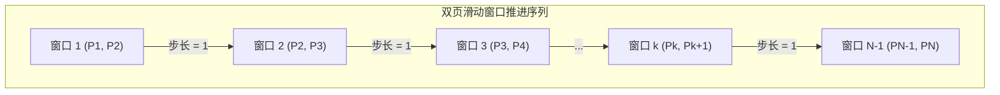
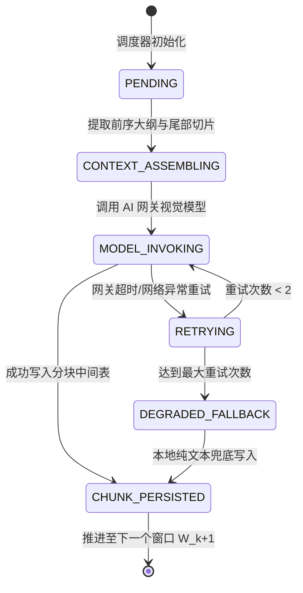
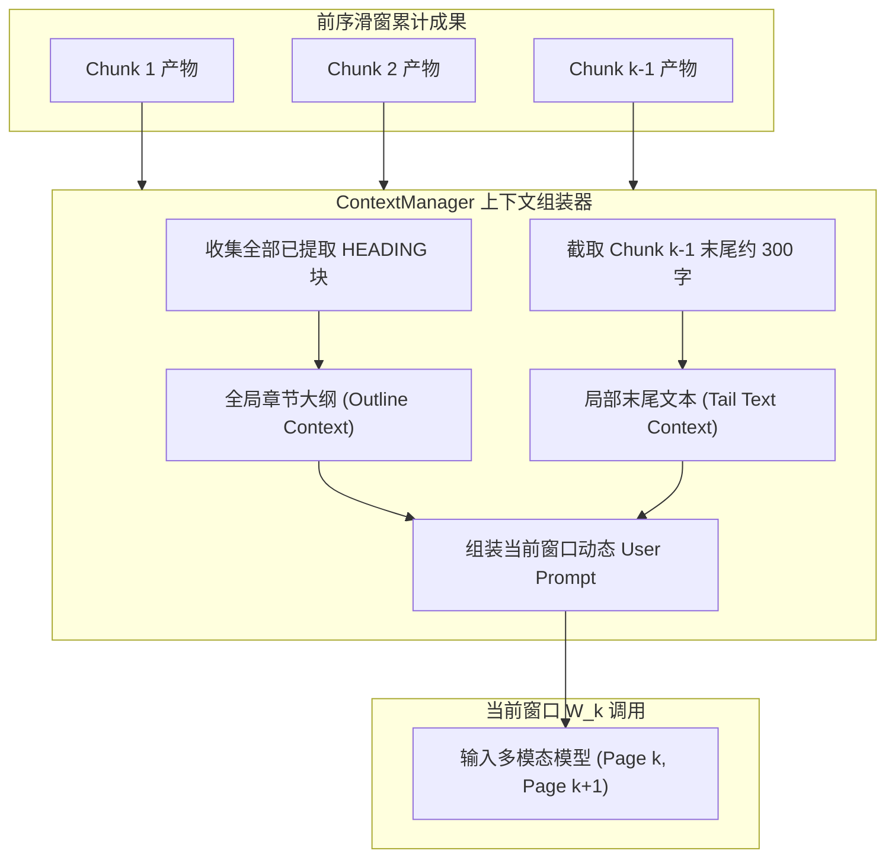
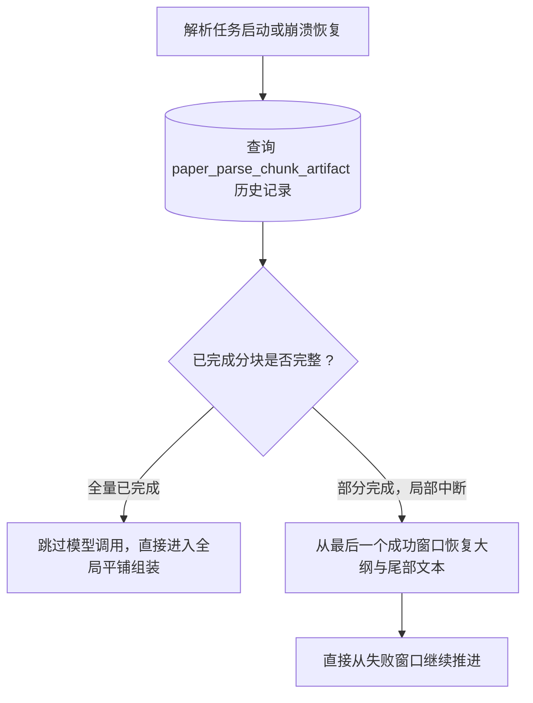

## 上下文管理与滑窗调度


### 一、设计目标与调度约束

本文档确立第二代 PDF 解析（PAPER_PARSE_V2）中**双页滑窗推进控制器、动态上下文装配算法与断点续传机制**。

双页滑窗机制的设计目标是在保证翻页连贯性的同时，实现资源可控与高韧性容错：
1. **消除翻页盲区**：通过连续两页视野与双向接续声明，确保跨页句子与长表格天然连贯；
2. **双重上下文注入**：为每一次滑窗调用动态装配“全局大纲”与“微观尾部文本”，赋予模型宏观篇章大局观与微观句子平滑衔接能力；
3. **断点状态可恢复**：依赖分块独立存储，解析任务中断重启时，能从断点快速恢复前文上下文并继续推进，杜绝重复计算；
4. **内存与并发安全**：图像按需加载与释放，避免全量高分辨率图片驻留内存导致 OOM。


---


### 二、双页滑窗推进模型与时序流转

对于总物理页数为 $N$ 的论文，系统建立如下滑动窗口序列：



#### 1. 窗口推进数学模型与页数边界判定
对于总物理页数为 $N$ 的输入文档，系统依据页数分流处理：

##### A. 异常边界：总页数 $N = 0$（空文档）
- 前置校验直接阻断，记录任务状态为 `FAILED`，抛出 `PDF_EMPTY_NO_PAGES` 错误码，不进入任何渲染与模型调用流程。

##### B. 特殊边界：总页数 $N = 1$（单页文档特化流）
- **退化为单窗口**：总窗口数固定为 1，仅执行单次窗口调用 $W_1 = (\text{Page } 1)$；
- **单图输入**：多模态请求仅附带第 1 页单张图像，占位符 `[START_PHYSICAL_PAGE]` 与 `[END_PHYSICAL_PAGE]` 均设为 1；
- **免除前文上下文**：由于不存在前驱页面，大纲与尾部参考均为空；
- **跳过重叠验证与仲裁**：单页文档不存在重叠物理页，直接跳过重叠检验与仲裁 AI，单次提取即全篇终态；
- **直接组装交付**：直接交付组装器生成全局连贯产物。

##### C. 常规多页：总页数 $N \ge 2$（标准双页滑窗流）
- **窗口定义**：$W_k = (\text{Page } k, \text{Page } k+1)$，其中 $k \in [1, N-1]$；
- **滑窗总数**：固定为 $N - 1$ 个窗口；
- **重叠覆盖特性**：
  - 首尾物理页（第 1 页与第 $N$ 页）各被覆盖 1 次；
  - 中间各页（第 $2 \sim N-1$ 页）均被相邻两个滑窗覆盖 2 次。

#### 2. 窗口生命周期状态流转
每一个滑动窗口 $W_k$ 经历明确的状态流转：




---


### 三、双重前文上下文动态管理机制

为每个滑窗 $W_k$ 调用的动态 User Prompt 装配高价值前文参考：



#### 1. 全局内容大纲管理（Outline Context）
- **数据来源**：遍历当前已成功入库的所有前序分块（Chunk 1 至 Chunk $k-1$），提取其中所有 `type = HEADING` 的内容块；
- **格式化规范**：按层级缩进格式化为结构化大纲文本，注入 `[OUTLINE_CONTEXT]`：
  ```text
  - 一、问题重述与背景分析 (第 1 页)
    - 1.1 实际场景描述 (第 1 页)
    - 1.2 关键约束条件 (第 2 页)
  - 二、模型假设与符号定义 (第 3 页)
    - 2.1 基础假设 (第 3 页)
  ```
- **架构收益**：字数通常仅数十至上百字，Token 极低，但赋予模型强大的全局大局观，杜绝子章节从属层级误判。

#### 2. 局部末尾文本切片管理（Tail Text Context）
- **数据来源**：取紧邻的上一个分块 Chunk $k-1$ 中最后一个非空文本块（通常是段落末尾、表格标题或代码末尾）；
- **提取与截断规范**：
  - 截取该块末尾约 300 至 500 个字符；
  - 格式化注入 `[TAIL_CONTEXT]`，示例如下：
    ```text
    ...通过上述公式推导可知，无人机在穿越障碍物群时，航迹偏移角与侧向风速具有显著非线性关联，其动态约束由
    ```
- **架构收益**：模型在看到第 $k$ 页顶部时，立即明白当前首句承接上述内容，自然消除翻页处的语意重叠或断裂。


---


### 四、滑窗推进控制器伪代码算法

调度器以算法伪代码形式描述逻辑执行流，避免绑定具体实现代码细节：

```text
ALGORITHM: SlidingWindowScheduler(submissionId, pageImages, workflowVersion)
INPUT: 
    submissionId    -- 论文提交记录唯一标识
    pageImages      -- PDFBox 渲染得到的逐页位图列表，长度为 N
    workflowVersion -- 固定为 "PAPER_PARSE_V2"
OUTPUT:
    completedChunks -- 按物理顺序排列的成功分块列表

BEGIN
    IF Length(pageImages) == 0 THEN
        RAISE EXCEPTION "PDF_EMPTY_NO_PAGES";
    END IF

    -- 1. 单页 PDF 特殊流（N = 1）
    IF Length(pageImages) == 1 THEN
        chunk <- InvokeSinglePageWindow(submissionId, pageImages[0]);
        SaveChunk(chunk);
        RETURN [chunk];
    END IF

    -- 2. 常规多页滑窗流（N >= 2）
    completedChunks <- EmptyList();
    globalOutline   <- EmptyOutline();
    lastTailText    <- "";

    FOR k FROM 1 TO Length(pageImages) - 1 DO
        windowIndex <- k;
        startPage   <- k;
        endPage     <- k + 1;

        -- 检查数据库是否已有成功分块（断点续传支持）
        existingChunk <- FindExistingChunk(submissionId, windowIndex);
        IF existingChunk IS NOT NULL AND existingChunk.status == "SUCCESS" THEN
            completedChunks.Append(existingChunk);
            globalOutline.AppendHeadings(existingChunk.headings);
            lastTailText <- existingChunk.tailText;
            CONTINUE;
        END IF

        -- 动态装配 User Prompt（注入当前大纲与尾部参考）
        userPrompt <- BuildUserPrompt(windowIndex, startPage, endPage, globalOutline, lastTailText);

        -- 获取当前窗口双页图像并调用多模态模型（含重试与降级）
        chunk <- InvokeWindowWithRetry(submissionId, windowIndex, pageImages[startPage-1], pageImages[endPage-1], userPrompt);

        -- 独立落库持久化
        SaveOrUpdateChunk(chunk);
        completedChunks.Append(chunk);

        -- 迭代更新前文参考供下一个窗口使用
        globalOutline.AppendHeadings(chunk.headings);
        lastTailText <- chunk.tailText;
    END FOR

    RETURN completedChunks;
END
```


---


### 五、断点恢复与异常续传机制

长论文（例如 30 页以上）在滑窗执行过程中可能遭遇偶发故障：



1. **零重复开销**：当任务重试重新拉起时，已成功分块（Chunk 1 至 Chunk 10）完全复用数据库已落盘 JSON，零 API 调用开销；
2. **上下文即时重建**：调度器从 Chunk 10 产物中秒级重建 `[OUTLINE_CONTEXT]` 与 `[TAIL_CONTEXT]`，无缝向窗口 11 注入前文，保证整体连贯性丝毫不受重试影响。


---


### 六、内存与网关防护机制

1. **自适应图像内存回收**：
   - 滑窗推进过程中，仅在处理当前窗口 $(k, k+1)$ 时将对应页面位图编码为临时 JPEG 数据流；
   - 窗口执行完毕立即解除引用，协助 JVM 垃圾回收，杜绝 30 页高清位图全部驻留内存导致 Heap 耗尽。
2. **网关速率保护**：
   - 滑窗按序单线程步进推进（由于相邻窗口强依赖前序尾部文本参考），天然形成受控请求节拍（每 2 至 4 秒一个请求）；
   - 彻底消除了瞬时并发打崩 AI 网关或触发服务商 Rate Limit 429 的风险。
