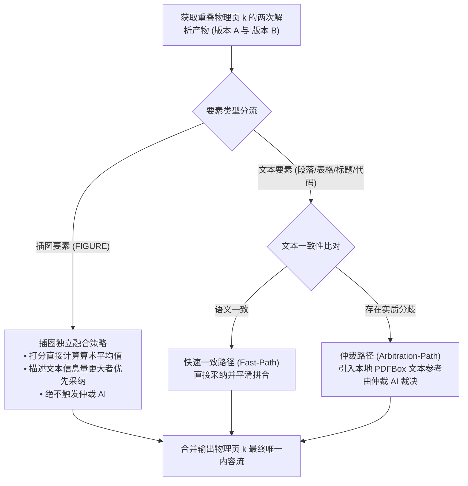
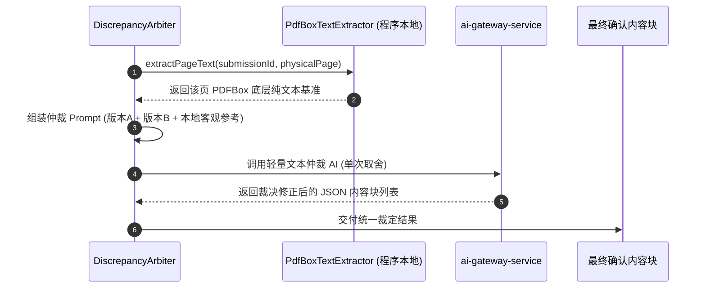

## 重叠冲突检测与仲裁机制


### 一、文档定位与仲裁目标

本文档确立第二代 PDF 解析（PAPER_PARSE_V2）中**双页滑窗重叠页一致性比对、插图解耦融合以及基于本地程序文本参考的仲裁 AI 裁决机制**。

在滑动窗口推进过程中，除首尾页外的所有中间物理页（第 $2 \sim N-1$ 页）均被相邻两个滑窗覆盖解析两次（如第 2 页在窗口 1 的后半段与窗口 2 的前半段分别被提取）。

仲裁机制的设计目标是：
1. **防止反复多遍检测**：利用重叠页自然形成的双重视野做一次性交叉校验，不增加额外的重检轮次；
2. **插图与文本解耦分流**：彻底将图片的自然语言描述差异排除在常规文本冲突判定之外，避免非确定性描述误触发重度仲裁；
3. **引入客观程序文本作为基准**：发生文本分歧时，以 PDFBox 本地抽取的底层纯文本为事实依据，由轻量仲裁 AI 一次性取舍定稿。


---


### 二、核心解耦原则：插图独立融合与文本冲突隔离

大模型对同一张科研插图的两次自然语言描述在词汇、句式上极难字面完全一致，美观打分也存在细微浮动。系统确立以下解耦分流架构：



#### 1. 插图独立融合策略（Figure Isolated Merging）
- **匹配机制**：依据 `figureNo`（如“图 1”）或主图题 `caption` 比对，确认属于同一张插图；
- **美观评分算术平均**：两次提取给出的 `[0, 100]` 分制美观得分，直接计算其算术平均值：
  $$Score_{final} = \frac{Score_A + Score_B}{2}$$
- **长描述择优采纳**：对比两次生成的文字描述，优先采纳字数更充实、对数据趋势与坐标单位记录更详尽的版本；
- **隔离效果**：**插图要素的描述差异坚决不计入冲突计数，绝不触发后续仲裁 AI 流程**。


---


### 三、文本要素一致性检测算法

文本要素（`PARAGRAPH`、`HEADING`、`TABLE`、`CODE`）具有确定性的逻辑事实，系统采用轻量比对规则判定是否一致：

#### 1. 结构与数量比对
- 比对版本 A 与版本 B 在物理页 $k$ 中的内容块数量与类型序列；
- 若出现块类型严重错位（例如版本 A 识别为大表格，版本 B 识别为普通段落），标记为结构冲突；
- 若表格行数差异较大，标记为表格冲突。

#### 2. 文本语义重合度比对
- 针对段落文本，计算两者的字符重合度与 Jaccard 词元相似度；
- **阈值规则**：若相似度 $\ge 0.85$，判定为同一段落的无差异表达，走快速一致路径；
- **一致路径处理规则**：直接采纳窗口后者的输出切片（即版本 B），因为版本 B 的视野向后延伸，更有利于与后续页面保持接续。


---


### 四、分歧仲裁流水线与本地文本基准参考

当文本要素检测出实质分歧时（相似度 $< 0.85$ 或结构严重冲突），触发单次闭环仲裁流程：



#### 1. 本地程序纯文本基准（PDFBox Reference）
- 发生冲突时，系统调用本地 `PdfBoxTextExtractor` 毫秒级提取该物理页的文本层数据；
- **客观基准价值**：该文本由 PDF 二进制字符指令直接解码生成，代表该页绝对真实的字符事实，不包含大模型的视觉幻觉；
- **重要局限性提示（必须注入提示词）**：
  > **上标/下标限制**：本地程序纯文本提取天然无法区分字符大小与上下标位置，会把上标文献标号（如 `^[1]`）直接压平为普通文本 `[1]`。在将程序文本作为参考提供给仲裁 AI 时，必须明确提醒模型区别对待。


---


### 五、仲裁 AI 提示词设计规范

仲裁 AI 采用极简、中立、决策导向的指令设计，固化于 `resources/prompts/paper-parse-v2-arbiter.st`：

> 📄 **仲裁 AI 提示词全文**已独立存放于 [`prompts/paper-parse-v2-arbiter.md`](prompts/paper-parse-v2-arbiter.md)，本节不再内嵌全文。


---


### 六、仲裁器核心执行伪代码

```text
ALGORITHM: ArbitrateOverlapPage(chunkA, chunkB, physicalPage, submissionId)
INPUT:
    chunkA       -- 前序窗口提取的物理页切片
    chunkB       -- 后续窗口提取的物理页切片
    physicalPage -- 当前重叠物理页码
    submissionId -- 论文提交标识
OUTPUT:
    finalBlocks  -- 经过仲裁或快速一致性合并后的该页最终内容块列表

BEGIN
    -- 1. 插图要素独立融合流（排除出常规冲突判定）
    figureBlocks <- MergeFiguresWithAveraging(chunkA.figures, chunkB.figures);

    -- 2. 文本要素一致性快速比对
    textDifference <- CompareTextElements(chunkA.textBlocks, chunkB.textBlocks);

    IF textDifference.isConsistent() THEN
        -- 快速一致路径：直接采纳后者切片（视野延伸更优）
        finalTextBlocks <- chunkB.textBlocks;
    ELSE
        -- 3. 分歧仲裁路径：引入本地程序文本基准
        localTextReference <- PdfBoxTextExtractor.extract(submissionId, physicalPage);

        -- 组装仲裁 Prompt 并调用轻量文本 AI
        arbiterPrompt <- BuildArbiterPrompt(chunkA, chunkB, localTextReference, physicalPage);
        finalTextBlocks <- InvokeArbitrationAI(arbiterPrompt);

        -- 降级容错：若仲裁 AI 调用失败，回退直接采纳版本 A
        IF finalTextBlocks IS NULL THEN
            finalTextBlocks <- chunkA.textBlocks;
        END IF
    END IF

    -- 4. 组合合并文本块与已均值融合的插图块
    finalBlocks <- CombineOrdered(finalTextBlocks, figureBlocks);
    RETURN finalBlocks;
END
```


---


### 七、单页与首尾页边界特化处理

| 页面所处位置 | 是否触发重叠检验 | 处理机制 |
|------------|:--------------:|---------|
| **第 1 页（首页）** | 否 | 仅在窗口 $(1, 2)$ 提取 1 次，直接采纳，无重叠验证 |
| **第 N 页（末页）** | 否 | 仅在窗口 $(N-1, N)$ 提取 1 次，直接采纳，无重叠验证 |
| **第 $2 \sim N-1$ 页（中间页）** | **是** | 触发插图均值融合与文本一致性比对，按需执行单次仲裁 |
| **单页文档（$N = 1$）** | 否 | 仅执行单页窗口 $W_1 = (1, 1)$，直接输出，完全跳过重叠仲裁流程 |


---


### 八、总结

通过确立**“插图独立均值融合”**、**“一致性快速放行”**与**“程序底层文本参考辅助单次仲裁”**机制，第二代 PDF 解析的质量闭环得以彻底完成：
1. 彻底根除了单页解析对同一页内容产生不可控分歧的隐患；
2. 避免了把图片自然语言描述的差异当作文本冲突处理的架构误区；
3. 将客观程序文本作为真值锚点，由 AI 进行最终取舍，实现了兼顾极高质量与确定性时延的优雅平衡。
