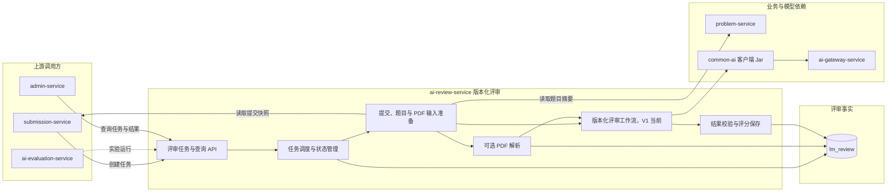

## AI 评审服务

ai-review-service 负责将用户提交的 PDF 论文交给指定版本的 AI 评审工作流，最终产生可查询的评审分数。

当前后端 Maven 模块目录、artifactId 和 Spring 服务名均已统一为 `ai-review-service`。Java 包名仍使用 `com.leetmodel.review`，包名调整不属于本次服务命名统一范围。

> 分层定位：AI 业务能力层。当前职责边界是后续逐项梳理的起点；V1 已实现事实与后续目标设计必须明确区分。

### 整体结构与工作流程

submission-service 创建正式评审任务，ai-review-service 锁定版本后自行调度输入准备、可选 PDF 解析和评审工作流。业务 Prompt、流程和结果校验留在本服务，所有模型调用通过 `common-ai` 进入 ai-gateway-service。ai-evaluation-service 可调用已实现的隔离实验接口，指定评审版本并取得结构化结果；该路径不创建正式评审任务或日志。

### 职责边界

#### 负责

- 根据提交标识获取唯一的原始 PDF。
- 创建评审任务并锁定工作流版本。
- 按工作流版本执行自定义评审过程。
- 在需要时执行 PDF 解析并保存解析产物。
- 校验并保存 `[0,100]` 范围的最终评分。
- 维护评审任务状态、失败信息和重试过程。
- 向 ai-evaluation-service 提供评审结果和评价所需的关联信息。

#### 不负责

- 不拥有提交记录和原始 PDF。
- 不拥有题目、赛事、队伍和用户主数据。
- 不直接管理模型供应商、密钥、价格和路由。
- 不负责管理端页面聚合和 AI 成本看板。
- 不定义 AI 质量评价指标，不执行 AI 裁判。
- 不使用 AI 质量评价结果覆盖原始评审结果。

### 数据与协作边界

ai-review-service 独占 `lm_review` 数据库，拥有评审任务、最终评分、版本专属结果和解析产物。

- submission-service 提供提交摘要和 PDF 文件对象路径。
- problem-service 提供题目和赛事摘要。
- ai-review-service 通过 common-ai 访问 ai-gateway-service。
- ai-evaluation-service 通过内部契约获取评审结果并执行质量评价。
- admin-service 通过内部接口分别读取评审数据和质量评价数据。

### 功能清单

| 功能 | 功能说明 | 文档安排 |
|------|----------|----------|
| 评审任务创建 | 根据提交标识创建评审任务，锁定原始 PDF 和评审版本 | 由 AI 评审概述说明公共语义 |
| 评审任务调度 | 异步执行评审工作流程，维护排队、执行、完成和失败状态 | 后续按需建立功能文档 |
| 评审版本选择 | 为新任务选择完整工作流程版本，不影响已创建任务 | 由 AI 评审概述说明 |
| 粗略评审 | Prompt 与 PDF 页面图像一次性交给多模态模型，直接生成统一 JSON | `AI评审/V1基础评审/` |
| 适中评审 | 在质量、稳定性、成本和响应时间之间取得平衡 | `AI评审/v2.md` |
| 过度评审 | 使用更完整的工作流程追求最高评审质量 | `AI评审/v3.md` |
| PDF 解析 | 为需要结构化论文内容的评审版本提供可选解析能力 | [PDF解析/](PDF解析/) |
| 评审结果校验 | 检查版本输出是否完整，并保证最终评分在 `[0,100]` 范围内 | 各评审版本文档分别说明 |
| 评审结果查询 | 查询任务进度、失败信息、论文评分和版本详细结果 | 后续按需建立功能文档 |
| 失败重试 | 对可恢复的失败任务重新执行，保留原失败信息 | 后续按需建立功能文档 |
| 实验评审 | 按 ai-evaluation-service 指定的提交、版本和轮次产生隔离的评审结果 | 已提供内部实验契约 |
| 评价数据提供 | 向 ai-evaluation-service 提供评审结果、执行状态和调用关联标识 | 由跨服务边界说明 |

### 文档结构

当前目录按三个层级组织。

#### 服务概述

本 README 说明 ai-review-service 的整体职责、服务边界、数据归属和文档导航。

#### 功能概述

功能概述文档定义一组相关功能的共同目标、输入输出、整体流程和公共边界。

| 文档 | 职责 |
|------|------|
| [AI评审/](AI评审/) | 概述 AI 评审功能，定义所有评审版本共享的输入、输出和整体流程 |

#### 功能设计

功能设计文档描述一个可独立理解的具体功能或评审版本，只保留功能级流程、规则和关键取舍。

| 文档 | 职责 |
|------|------|
| [PDF解析/](PDF解析/) | 定义可被评审版本选择使用的 PDF 解析能力 |
| `AI评审/V1基础评审/README.md` | 粗略评审版本独立目录，导航流程、Prompt、数据日志与异常设计 |
| `AI评审/v2.md` | 适中评审版本，追求各项指标综合最优，待版本一确认后设计 |
| `AI评审/v3.md` | 过度评审版本，追求最高质量并接受最高成本，待版本二确认后设计 |

待设计的版本只在本页说明命名和顺序，不提前创建空文件。

### 编写规则

- 一份文档只聚焦一个主题。
- AI 评审的公共语义只在 `AI评审/` 功能目录定义，具体版本不重复展开。
- 评审版本必须使用独立文档，放在 `AI评审/` 功能目录并按 `v数字.md` 命名。
- 所有版本使用相同公共输入并收敛为统一最终得分；版本专属过程 JSON、流程与 Prompt 写入对应版本文档。
- 公共版本、任务和执行日志进入公共控制表；版本结果和中间产物进入版本独立表。
- 文档只说明数据是否共享和归属哪个功能，不预先定义表、字段和索引。
- Flyway SQL、Controller、DTO、VO、业务代码和测试是实现细节的事实来源。
- 当前优先完成面向用户的 V1 基础评审。后续评审版本、排行榜、admin 和质量评价按当前项目任务顺序逐轮推进。
