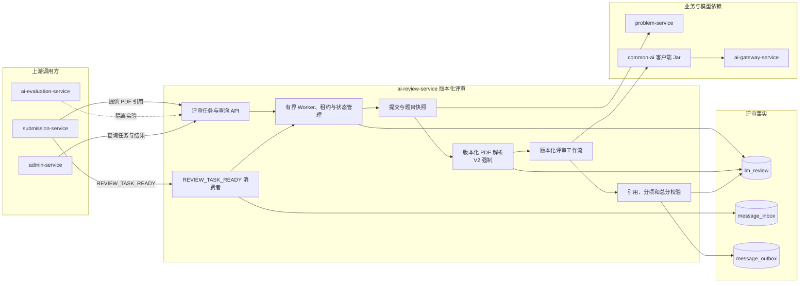

## AI 评审服务

ai-review-service 负责将用户某一版本的 PDF 论文交给指定 AI 评审工作流，产生可查询的评分与版本专属评审内容。

当前 `BASIC_REVIEW_V1` 与 `EVIDENCE_REVIEW_V2` 均已实现。V2 新增强制 PDF 解析、完整题目要求、评分说明、要求覆盖状态和可定位评审发现，使用独立工作流和结果表，不覆盖 V1 的代码、数据或历史展示。

> 分层定位：AI 业务能力层。本页会明确标记“当前实现”与“目标设计”，不用设计文档伪装运行事实。

### 整体结构与工作流

V1 仍按历史语义将 PDF 页面图像直接交给模型，不产生可复用解析产物。V2 先锁定题目和 PDF，必须成功产生通过质量门的版本化解析产物，再执行题目要求对齐、证据定位、分项评分和结果校验。

`REVIEW_TASK_READY` 链路已在 MQ2 实现。消费者只在短事务中写 Inbox 并按 `(submission_id, workflow_version)` 幂等创建 review_task，随后立即 ACK；PDF 解析和 AI 工作流由独立的有界 Worker 执行。MQ3 已将版本化结果、任务完成状态和 `REVIEW_COMPLETED` Outbox 纳入同一 fencing 事务。

### 职责边界

#### 负责

- 根据提交标识获取唯一的原始 PDF，锁定题目与论文快照。
- 创建评审任务，锁定不可变工作流、Prompt、模型执行配置和解析版本。
- 拥有并执行版本化 PDF 解析；对需要解析的评审版本将它作为强制前置环节。
- 按工作流版本产生评分、评分说明、要求覆盖和稳定发现标识。
- 校验页码、引用、分项计算和 `[0,100]` 最终总分。
- 保留历史版本、任务、解析产物、评审结果和重试轮次。
- 消费 `REVIEW_TASK_READY`、维护消费 Inbox，并可靠生产不含分数与结果正文的 `REVIEW_COMPLETED`。
- 使用任务租约、heartbeat 和稳定 AI 幂等键恢复崩溃任务，不在 MQ 消费线程执行评审。

#### 不负责

- 不拥有提交记录、原始 PDF、题目、赛事、队伍和用户主数据。
- 不在评审阶段生成“如何改”的完整修改方案；评审只说明“哪里好 / 哪里有问题 / 为什么影响分数”。
- 不使用知识检索结果冒充赛事官方标准。V2 的分数是明示标记的平台训练评分。
- 不直接管理模型供应商、密钥、价格、路由或 AI 评价统计口径。

### 数据与协作边界

ai-review-service 独占 `lm_review` 数据库，拥有评审版本、任务、最终评分、版本专属结果、解析工作流版本、解析产物、Inbox、Outbox、任务租约和 attempt。建议服务优先读取某次已完成评审锁定的解析产物；对历史 V1 论文可按明确版本请求补齐。建议服务不自行解析、不选择“当前最新”解析结果。

### 功能清单

| 功能 | 当前状态 | 目标设计 |
|------|----------|----------|
| 基础评审 | 已实现 `BASIC_REVIEW_V1` | 保留历史语义和可读性，不覆盖 |
| 证据化评审 | 已实现 | `EVIDENCE_REVIEW_V2` 输出评分说明、要求覆盖、优点与问题发现 |
| PDF解析V1 | 已实现 `PAPER_PARSE_V1` | 基础单块文本提取，供 EVIDENCE_REVIEW_V2 稳定运行 |
| PDF解析V2 | 已实现 `PAPER_PARSE_V2` | 双页滑窗调度、重叠页仲裁、HTML表格、整块代码、长图描述与全局平铺组装 |
| 评审结果校验 | V1/V2 均已实现 | V2 服务端汇总六项总分并校验发现、证据、页码和 blockId |
| 评审结果查询 | 已实现 | 根据版本返回可展示的评分说明和发现，历史 V1 不伪造 V2 字段 |
| 隔离评审 | REVIEW 实验入口已存在 | V2 已进入版本目录；V2 专属数据集与质量基线仍需后续评价任务 |
| 深度证据评审V3 | 设计中 | 基于 PAPER_DOCUMENT_V2 的多阶段漏斗式评审与扣分项裁决 |
| RocketMQ 任务接入 | 已实现 | 消费 `REVIEW_TASK_READY`，Inbox 与 review_task 同事务落库，重复投递只创建一个任务 |
| 崩溃恢复 | 已实现 | 并发 2 的有界 Worker、逐任务 token heartbeat、过期租约恢复、attempt 分类和 AI UNKNOWN 保护 |
| 完成事件 | 已实现 | 评审结果、任务完成状态与 `REVIEW_COMPLETED` Outbox 同事务提交 |

### 文档导航

| 文档 | 内容 |
|------|------|
| [评审任务与生命周期/](评审任务与生命周期/) | 所有评审版本共享的任务调度、租约控制、公共控制表与生命周期 |
| [AI评审V1/](AI评审V1/) | 当前基础评审实现（BASIC_REVIEW_V1）与多模态历史契约 |
| [AI评审V2/](AI评审V2/) | 当前证据化评审实现（EVIDENCE_REVIEW_V2）、题目覆盖、评分说明与结构化发现 |
| [AI评审V3/](AI评审V3/) | 第三代深度证据评审（DEEP_EVIDENCE_REVIEW_V3）功能设计推进 |
| [PDF解析V1/](PDF解析V1/) | 初代 PAPER_PARSE_V1 执行流程、结构化产物与版本规则 |
| [PDF解析V2/](PDF解析V2/) | 第二代 PAPER_PARSE_V2 版面分析、细粒度分块与全量场景设计 |

### 编写与演进规则

- 任何已发布的 AI 功能调整都必须创建新工作流版本，可复用旧代码，但不得改变旧版本语义。
- 公共版本、任务和执行日志进公共控制数据；版本结果和中间产物保留明确的 schema 版本。
- 文档中的表名和 DTO 是设计建议；实现后以 Flyway、Controller、DTO、业务代码和测试为事实源。
