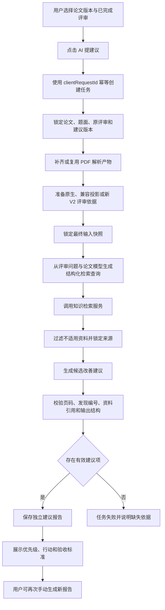

## 业务流程

### 参与者与入口

有权用户在论文提交历史中选择一个已经完成任意版本评审的论文版本，查看所选评审后点击“AI 提建议”。同一论文版本已有成功建议时，页面仍提供“再次生成”，但必须明确这会创建新的 AI 任务和报告。

### 前置条件

- 当前用户仍有权访问论文，并有权使用建议功能。
- 论文提交、队伍和题目关联一致。
- 用户选定的评审任务已经完成且结果可读。
- 建议工作流绑定的知识检索版本可以执行。

论文解析产物和可用评审依据不是用户点击前的硬性门槛，而是任务的 `PREPARING` 阶段。这保证历史 `BASIC_REVIEW_V1` 论文也能进入新式建议流程。

### 历史评审准备规则

1. 若已存在与论文文件摘要、解析工作流和产物 schema 一致的解析产物，锁定并复用。
2. 若不存在，由 ai-review-service 为该历史论文新建解析任务；建议服务只请求与等待，不自行解析。
3. 若所选评审已有稳定发现，直接锁定为 `evidenceReviewTaskId`。
4. 若历史评审有结构化维度评语、优点、问题或建议，使用已发布的 `LEGACY_REVIEW_EVIDENCE_V1` 确定性投影。投影只为原字段分配稳定编号和类别，不改写、补造或重新评分。
5. 若历史结果真实只有分数、没有任何可用说明，创建新的 `EVIDENCE_REVIEW_V2` 任务并等待完成。原评审仍作为 `eligibilityReviewTaskId` 保留，新评审作为 `evidenceReviewTaskId`；页面必须告知用户系统补做了新版本评审。

上述准备产物都是新的不可变事实，不得回写或替换原评审结果。

### 主流程

### 页面结果

建议页面首先展示本次报告使用的论文版本、评审版本、建议版本和生成时间，再展示“优先修改的三件事”。完整列表按优先级排序，每项可以展开查看论文页码、评审理由、参考资料、修改动作和验收标准。

同一论文版本的历史报告按生成时间倒序展示。报告之间不自动合并，也不宣称后一次一定优于前一次。
