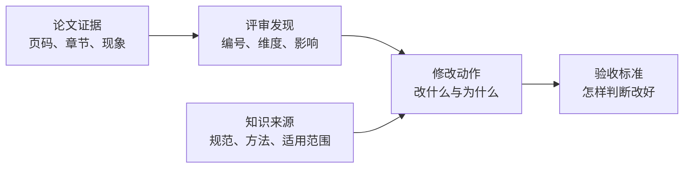

## 输入输出与依据链

### 输入快照

一次建议任务锁定以下输入：

- 论文提交标识、文件摘要和所属题目标识。
- 本次题面内容版本或稳定摘要。
- 解析产物标识、`paperParsingWorkflowVersion` 和解析 schema。
- 用于解锁功能的 `eligibilityReviewTaskId`、它的工作流版本和结果 schema。
- 实际提供建议依据的 `evidenceReviewTaskId` 或历史评语投影标识，以及 `reviewEvidenceProjectionVersion`。原生证据评审时两个 reviewTaskId 可相同，且投影版本为空。
- 建议工作流版本、Prompt 版本和模型执行配置版本。
- 检索工作流版本，以及运行后返回的索引、目录和知识源版本。

建议执行过程中任何默认版本发生切换都不能改变已创建任务。

### 报告结构

报告包含整体修改策略、当前最优先事项和建议项列表。每项建议至少表达：

- 稳定建议编号、类别和优先级。
- 当前问题及其对题目完成、模型可信度或表达质量的影响。
- 目标页码、章节或论文板块。
- 一至多个具体修改动作。
- 一至多个可观察的验收标准。
- 论文证据、评审发现引用和知识来源引用。

建议不是简单的“问题 + 一句话动作”。例如“补充模型检验”必须继续说明应检验哪个模型、采用什么与题型匹配的方法、使用什么结果判断通过，以及当前论文为什么缺少这项证据。

### 三段依据链

#### 论文依据

论文依据使用物理 PDF 页码，从 1 开始，不使用正文印刷页码代替。可以附带章节标题、解析块标识和简短原文摘录或事实观察。页码必须存在于本次解析产物，块标识必须属于该页。

#### 评审依据

每项建议至少引用一个锁定评审依据快照中的发现编号。发现可来自原生证据化评审、对历史结构化评语的确定性投影，或因旧结果只有分数而新建的 V2 评审。引用同时带出原评审标识、原字段路径或原生发现、影响维度和评分说明，不能只复制一个分数。

评审没有提出的问题可以由建议工作流补充候选，但在成为正式建议前必须通过论文证据和知识来源重新建立完整依据链。

#### 知识依据

每项建议至少引用一个本次检索运行实际返回且通过适用性校验的来源。来源快照保留标题、稳定路径、章节、片段标识、内容哈希、层级、支撑结论和实际索引或目录版本。

知识引用说明“为什么这种修改方法合理”，不冒充论文事实。相似度分数不展示为权威度，也不能替代来源层级。

### 确定性校验

保存结果前必须完成：

1. 页码、章节和解析块引用存在。
2. 评审发现编号属于锁定的原生评审或不可变历史评语投影，且可回指原字段。
3. 知识片段属于锁定的 `retrievalRunId`，且资料适用于当前题目。
4. 问题、影响、动作和验收标准均为非空结构化内容。
5. 不同建议项不存在相同依据和相同行动的实质重复。
6. 优先级顺序合法，P0 与 P1 没有被低优先级项遮蔽。

模型声称某个引用存在不构成校验通过。服务端只信任本次输入快照中的真实标识。
