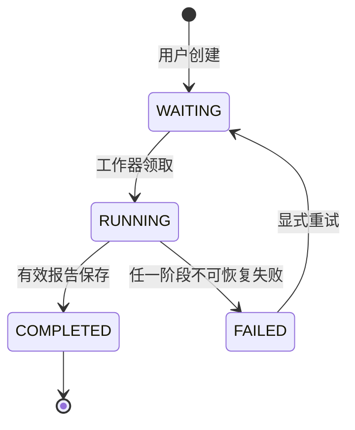

## 任务与多次生成

### 多次生成语义

同一论文版本、同一评审任务和同一建议工作流可以拥有多份建议任务与报告。每次用户明确点击“生成建议”或“再次生成”都代表新的业务意图，系统不得返回历史成功任务代替新生成。

多份报告分别保存，不覆盖、不合并、不自动选出“最佳报告”。页面以生成时间和报告标识区分，并展示各自使用的版本快照。

### 请求幂等

前端每次明确生成动作创建新的 `clientRequestId`。由于网络超时、按钮重复提交或页面刷新而重发同一 ID 时，服务返回原任务，不产生第二次 AI 调用。

幂等只防止一次用户动作被重复执行，不把 `submissionId`、`reviewTaskId` 或 `workflowVersion` 当成唯一业务请求。现有 `IMPROVEMENT_V1` 的单任务约束保留用于解释历史；`GROUNDED_SUGGESTION_V2` 已使用 `requestedByUserId + clientRequestId` 唯一约束实现动作级幂等。

### 状态与阶段

任务公共状态保持 `WAITING`、`RUNNING`、`COMPLETED` 和 `FAILED`。`PREPARING`、`PARSING`、`PREPARING_REVIEW`、`RETRIEVING`、`GENERATING`、`VALIDATING` 作为 `currentStage` 表达执行位置，不扩张成一组新的公共状态。

### 重试与重新生成

失败重试在原任务中增加执行轮次，保留旧轮次失败、解析、评审准备、检索运行和 AI 调用事实。已成功的解析产物、评审依据投影或新 V2 评审可按兼容规则复用；重试不跟随当前默认配置变化。

用户希望使用当前新版本或重新获得一份报告时，应执行“再次生成”创建新任务。系统不能把“重试”偷偷变成升级版本运行。

### 历史解释

建议报告至少展示建议工作流、用于解锁的原评审、实际评审依据或投影版本、解析版本、检索工作流、实际知识版本和生成时间。版本停用后历史报告仍可读取；源知识索引被切换或重建后，报告保存的引用快照仍用于解释当时依据。
