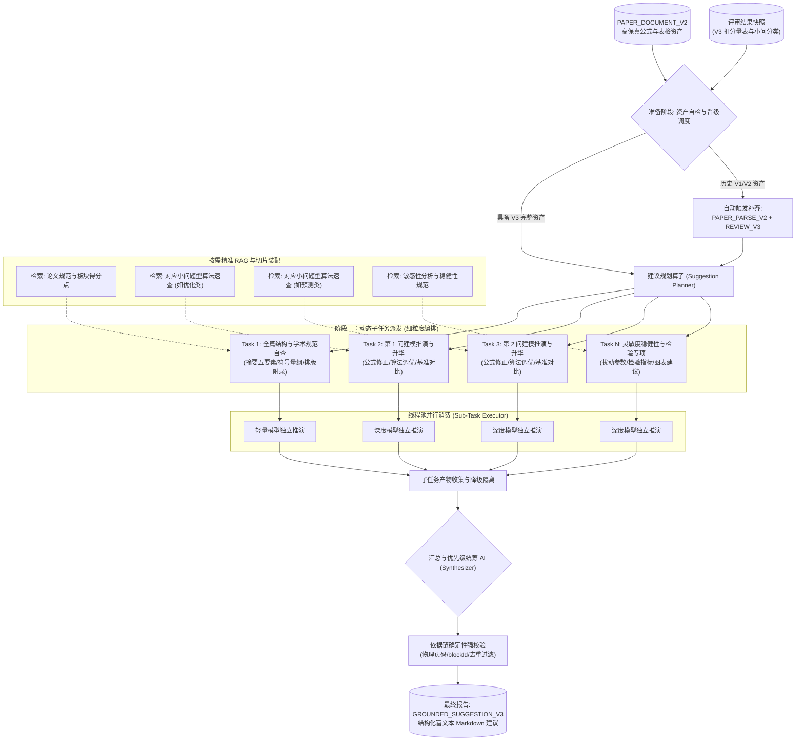
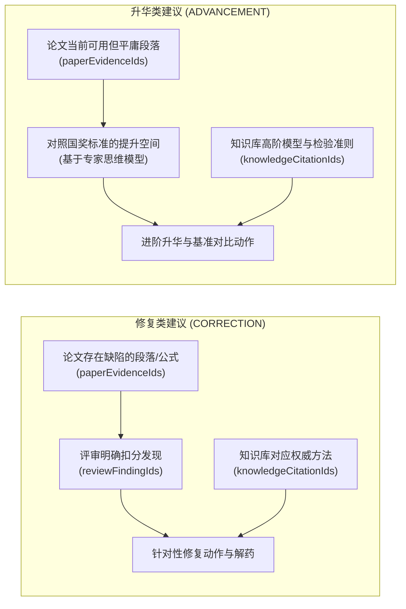
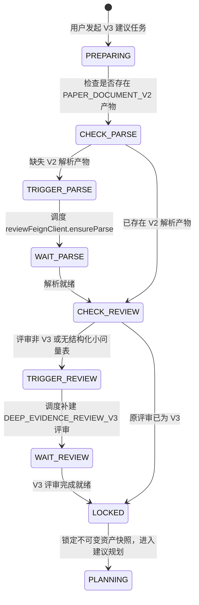

# AI 论文建议 V3 动态流水线与双轨依据架构设计

> 本文档规范第三代 AI 论文建议（`GROUNDED_SUGGESTION_V3`）的端到端架构、动态任务规划、局部上下文装配、按需精准 RAG、子任务并发消费、汇总 AI 统筹排序与历史版本自动晋级机制。

---

## 一、架构背景与设计原则

在 `GROUNDED_SUGGESTION_V2` 中，系统采用单一大 Prompt 试图一次性处理全篇 20 万字符的超长上下文，导致大模型注意力涣散、输出 Token 受限，建议往往沦为泛泛而谈的宏观套话。同时，V2 强制每条建议必须绑定评审 `reviewFindingId`，导致系统无法针对“没有原则性错误但方法平庸”的模型提出进阶升华建议。

`GROUNDED_SUGGESTION_V3` 紧密围绕 [数模专家评委认知框架与双向提示词设计规范](../../数模专家评委认知框架与双向提示词设计规范.md) 进行系统性重构，确立以下四大核心原则：
1. **动态任务规划取代单一大 Prompt**：由建议任务规划算子根据赛题小问清单与论文大纲，动态拆解出全篇结构自查、各小题深度推演、敏感性稳健性等离散子任务。
2. **改错与升华双轨并进**：
   - 修复类（`CORRECTION`）：靶向治疗评审扣分项，提供公式与代码级解药。
   - 升华类（`ADVANCEMENT`）：主动对齐国奖标准，为无错但平庸的模型指出补充基准对比、正则化、松弛算法与残差检验的进阶路径。
3. **按需精准 RAG 与上下文切片装配**：每个子任务独立向知识库检索与自身题型（优化/预测/评价/机理）紧密匹配的方法论，仅携带本小问的题面切片、正文公式与扣分项，在充裕的 Token 预算下专注纵深推演。
4. **汇总 AI（Synthesizer）统筹全局**：所有子任务输出由汇总 AI 进行全局视野去重、跨小问冲突核验与 P0~P3 科学优先级编排。

---

## 二、端到端动态流水线拓扑

---

## 三、双轨依据机制设计

为了终结“建议沦为评审复读机”的弊端，V3 引入双轨依据链契约：

### 3.1 修复类（CORRECTION）
- **触发条件**：评审 V3 在该板块或小问中存在明确的扣分项（`findings` 中类型为 `ISSUE`，扣分 > 0）。
- **依据链构成**：
  - 论文依据：必须引用真实的 `paperEvidenceIds`（物理页码与 blockId）。
  - 评审依据：必须引用本次锁定的 `reviewFindingIds`。
  - 知识依据：必须引用针对该缺陷检索到的 `knowledgeCitationIds`。
- **目标**：开出手术刀级具体药方，消除失分点。

### 3.2 升华类（ADVANCEMENT）
- **触发条件**：
  - 论文在某小问中虽未被扣分，但采用的模型属于简单通用模板（如基础多元线性回归、标准未调优的遗传算法）；
  - 论文缺少关键的基准模型对比（Baseline Comparison）；
  - 论文缺少时间序列平稳性检验、残差白噪声检验或正交灵敏度扰动。
- **依据链构成**：
  - 论文依据：必须引用真实的 `paperEvidenceIds`。
  - 评审依据：允许为空数组 `[]`，解除对评审评语的强硬绑定。
  - 知识依据：必须引用知识库中的高分标准、算法改进方法或专业统计检验指标。
- **目标**：指导队伍从“及格/平庸”迈向“全国一等奖/卓越”。

---

## 四、历史版本自动晋级机制（策略 1）

当用户对历史提交（仅具备 `BASIC_REVIEW_V1` 或 `EVIDENCE_REVIEW_V2`）发起 V3 建议任务时，系统不执行功能降级，而是执行**全量自动晋级补齐**：

1. **解析补齐**：若提交记录无 `PAPER_PARSE_V2`，自动调用 `ai-review-service` 生成高保真解析产物。
2. **评审晋级**：若提交记录只有历史评审，系统保留原评审作为资格凭证（`eligibilityReviewTaskId`），同时在后台自动为该提交补建 `DEEP_EVIDENCE_REVIEW_V3` 任务作为证据凭证（`evidenceReviewTaskId`）。
3. **状态等待与租约续期**：在等待补建完成期间，建议任务处于 `PREPARING_REVIEW` 阶段，Worker 维持心跳续租，等待外部事件或轮询就绪后再推进建议流水线。

---

## 五、子任务并行消费与汇总 AI 排序机制

### 5.1 子任务并发调度
建议规划算子输出任务清单后，主线程通过局部切片装配器提取各子任务所需上下文：
- 每个子任务只注入自己的小题题面切片、Section 正文、扣分量表和定向 RAG 引用。
- 使用独立的线程池 `suggestionSubTaskExecutor` 进行并行消费，执行时间由全局超时门限守护（单个子任务默认超时 90s）。
- 若某个非核心子任务推演失败，启动**局部降级隔离**，保留其余子任务结果，并在最终汇总中进行标注，防止全盘失败。

### 5.2 汇总与优先级统筹 AI（Synthesizer）
所有子任务的 Markdown 富文本产物汇聚后，交给专门的汇总 AI：
1. **全局去重与冲突审查**：消除阶段一全篇自查与阶段二分小问推演之间的重复建议；核查跨小问参数与符号建议是否存在矛盾。
2. **整体修改策略提炼（Overall Strategy）**：站在专家组长高度，给出本轮修改的核心路线与战略重点。
3. **优先级编排（Top Priorities）**：
   - `P0（阻断性硬伤）`：漏答题目要求、模型机理严重违背物理常识、求解荒谬。
   - `P1（核心失分与关键升华）`：未交代约束方程、算法无收敛依据、关键模型缺少对比基准与核心检验。
   - `P2（进阶优化与方法完善）`：参数灵敏度扰动步长优化、模型假设适用边界论证。
   - `P3（学术表达与排版）`：三线表重构、图表物理量纲标注文档规范。
   - 首页突出展示的 3 项最值得修改事项，默认优先推荐 P0/P1 改错，无硬伤时由高质量升华建议递补。
