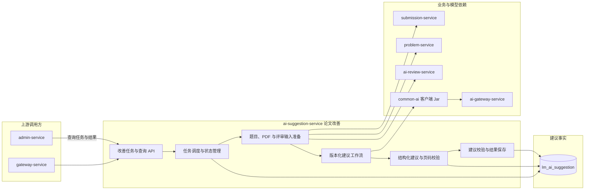

## AI 论文改善服务

ai-suggestion-service 负责根据用户提交的论文 PDF 和可选的已有评审结果，生成面向论文修改的具体建议。

当前 Maven 运行模块、正式任务入口、异步工作流、数据库迁移、前端入口和管理端只读聚合均已落地。

> 分层定位：AI 业务能力层。`IMPROVEMENT_V1` 是当前正式业务工作流；版本查询与隔离实验尚未实现，因此它暂不属于评价平台可选版本。

### 整体结构与工作流程

当前流程是队伍成员针对最终提交幂等创建改善任务。服务读取提交 PDF、题目和已完成评审结果，由 `IMPROVEMENT_V1` 生成按优先级排序的结构化建议并校验页码，最后保存任务结果。业务编排归 ai-suggestion-service，模型访问统一经过 `common-ai` 和 ai-gateway-service。ai-evaluation-service 尚未接入本服务。

### 职责边界

#### 负责

- 创建并执行论文改善建议任务。
- 组合题目、PDF、AI 评审结果和必要上下文。
- 生成论文整体、章节、模型、求解、验证和写作方面的改善建议。
- 保存建议结果、任务状态和生成版本。
- 向 ai-evaluation-service 提供建议结果和评价关联信息。

#### 不负责

- 不修改或覆盖用户原始 PDF。
- 不代替 ai-review-service 产生论文评分。
- 不定义自身输出的质量评价综合口径。
- 不管理模型供应商和调用密钥。

### 数据与协作边界

ai-suggestion-service 独占 `lm_ai_suggestion` 数据库，拥有改善建议任务、生成版本和建议结果。原始 PDF 由 submission-service 拥有，题目由 problem-service 拥有，评审结果由 ai-review-service 拥有，模型调用通过 ai-gateway-service 完成。

### 功能清单

| 功能 | 状态 | 功能说明 |
|------|------|----------|
| 改善任务创建 | 已实现 | 根据最终提交和已完成评审幂等创建正式建议任务 |
| 输入准备 | 已实现 | 获取题目、原始 PDF 文本和已有评审结果并校验来源一致性 |
| 结构化改善建议 | 已实现 | 输出总结及 1–20 项按优先级排序、可带页码的建议 |
| 任务进度与重试 | 已实现 | 异步领取、失败留痕、显式重试和超时运行任务恢复 |
| 建议结果查询 | 已实现 | 按任务、提交和队伍查询，前端展示优先级、分类、依据与行动 |
| 管理端只读聚合 | 已实现 | 内部接口提供任务数量和最近任务摘要 |
| 建议版本目录 | 未实现 | 当前仅有代码常量 `IMPROVEMENT_V1`，尚无可查询版本契约 |
| 隔离建议实验 | 未实现 | 尚无不会写正式建议任务的实验入口 |
| 建议质量评价 | 未实现 | ai-evaluation-service 尚未接入 SUGGESTION |

### 文档规则

后续针对需要深入设计的功能建立独立目录；当前不为未实现的版本目录、隔离实验或质量评价创建空文档。
