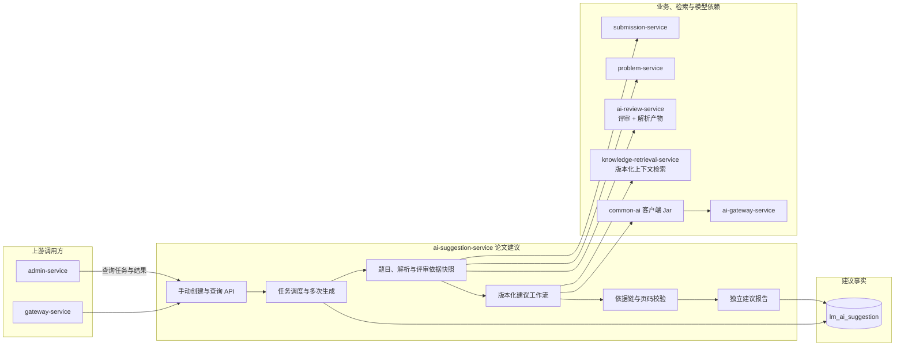

## AI 论文建议服务

ai-suggestion-service 负责将题目要求、某一论文版本的结构化解析与已完成评审、知识检索返回的参考上下文组合为可定位、可执行、可验收的数学建模论文修改建议。

当前 Maven 运行模块、正式任务入口、异步工作流、数据库迁移和前端入口均已落地。公共创建入口使用 `GROUNDED_SUGGESTION_V2`；历史 `IMPROVEMENT_V1` 继续可读，代码和结果不被覆盖。

> 分层定位：AI 业务能力层。S12 已完成 V2 运行实现，隔离评价与生产版本切换不在本次范围。

### 整体结构与工作流

目标流程是具备论文访问权限和建议功能权限的用户，对任何“存在已完成且兼容评审”的论文版本手动发起建议。同一论文版本和同一评审可以多次发起，每次产生独立任务、输入快照和报告；仅同一用户操作的重复请求由 `clientRequestId` 幂等去重。

### 职责边界

#### 负责

- 创建、执行并保留多次论文建议任务。
- 锁定题目快照、论文版本、用于解锁的已完成评审、实际评审依据、PDF 解析产物和检索运行快照。
- 编排历史论文的解析补齐和评审依据准备；具体解析与新评审仍由 ai-review-service 执行。
- 从问题覆盖、假设、数据、建模、求解、结果、验证、稳健性、表达与规范等数学建模维度生成建议。
- 对每条建议保存问题、影响、修改动作、验收方式以及论文 / 评审 / 知识依据链。
- 校验页码、评审发现标识和检索引用确实存在，不让模型自由伪造依据。

#### 不负责

- 不修改或覆盖用户原始 PDF、评审结果和历史建议报告。
- 不代替 ai-review-service 解析论文或产生评分。
- 不直接读取知识库文件、Elasticsearch 或实现自己的 RAG。
- 不管理模型供应商、调用密钥或知识索引生命周期。

### 数据与协作边界

ai-suggestion-service 独占 `lm_ai_suggestion` 数据库，拥有建议版本目录、手动生成任务、输入快照引用、历史评语兼容投影、建议条目和报告。原始 PDF 归 submission-service，题目归 problem-service，评审与 PDF 解析产物归 ai-review-service，检索运行与引用快照归 knowledge-retrieval-service，模型调用通过 ai-gateway-service 完成。兼容投影只引用原评语字段，不成为第二份评审结果。

### 功能清单

| 功能 | 当前状态 | 目标设计 |
|------|----------|----------|
| 建议任务创建 | V2 已实现 | 任意已完成评审的论文版本可手动创建，同版本支持多次生成；动作级请求幂等 |
| 输入准备 | V2 已实现 | 补齐并锁定解析；V1 评语确定性投影，只有分数时补建 V2 评审 |
| 知识上下文 | V2 已实现 | 正式建议固定调用 `VECTOR_RAG_V1`；目录与混合版本保留实验实现，达到门槛后再发布新建议版本 |
| 证据化建议 | V2 已实现 | 每项校验论文 blockId/页码、评审 findingId 和知识 citationId |
| 任务进度与重试 | V2 已实现 | 展示准备、解析、评审准备、检索、生成和校验阶段；重试复用锁定快照 |
| 版本目录 | 已实现 | Flyway 发布 `GROUNDED_SUGGESTION_V2`，并保留 `IMPROVEMENT_V1` 可读 |
| 隔离实验与质量评价 | 尚未实现 | 后续通过新版本接入，不修改已发布版本 |

### 文档导航

| 文档 | 内容 |
|------|------|
| [AI提建议/README.md](AI提建议/README.md) | 目标、适用条件、当前版本与 V2 边界 |
| [AI提建议/01-业务流程.md](AI提建议/01-业务流程.md) | 用户手动生成、输入锁定和执行流程 |
| [AI提建议/02-建议范围与优先级.md](AI提建议/02-建议范围与优先级.md) | 数学建模建议维度、优先级和数量边界 |
| [AI提建议/03-输入输出与依据链.md](AI提建议/03-输入输出与依据链.md) | 报告结构、三类依据和校验规则 |
| [AI提建议/04-任务与多次生成.md](AI提建议/04-任务与多次生成.md) | 任务状态、幂等、重试与多份报告 |
| [AI提建议/05-异常与取舍.md](AI提建议/05-异常与取舍.md) | 无可靠资料、版本不兼容和失败处理 |
