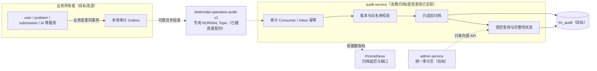

# 操作审计服务

> 设计状态：公共审计契约、专用 RocketMQ 资源、audit-service Maven 模块、`lm_audit` Flyway V1、严格消费者/幂等归档和受信内部只读查询已建立；业务生产者与统一前端仍是后续实现。本文确定服务边界；跨服务完整设计见 [操作审计架构](../../02-架构设计/操作审计架构.md)。

## 服务定位与整体流程

audit-service 是操作审计的中央归档与查询服务。它接收各业务所有者通过可靠消息提交的语义审计事件，完成契约校验、幂等追加、完整性监测和受控查询，但不判断业务操作是否应该成功。

图中业务生产者仍为目标设计；当前 audit-service 已启动专用 RocketMQ 消费、严格校验、异步归档和受信内部查询，查询结果具有明确的最终一致性窗口。

## 职责边界

### 负责

- 消费版本化操作审计事件，校验 schema、操作目录、字段白名单和大小限制。
- 通过 Inbox 与唯一约束承受 RocketMQ 至少一次投递，只追加不可变审计记录。
- 提供按时间、服务、操作、操作者、目标、结果、`operationId` 和 `traceId` 的内部查询。
- 识别归档积压、非法契约、DLQ、阶段缺失和非授权更新/删除风险并输出低基数指标。
- 管理审计数据的在线保留、归档、备份、导出权限和完整性策略。
- 对审计查询、导出、保留策略和权限变更记录新的审计事件。

### 不负责

- 不同步参与业务事务，不作为业务操作成功的前置远程依赖。
- 不拥有用户、题目、提交、AI 任务、消息任务或生产配置等业务事实。
- 不替业务服务判断操作语义、权限规则、前后差异或最终结果。
- 不执行暂停、恢复、回滚、重试或 DLQ 重放，不根据审计记录自动重做外部副作用。
- 不接收运行日志、Trace、Prometheus 指标、AI Prompt/回答或完整业务实体快照。
- 不把 `ai_call_log`、领域状态历史和运行日志迁移成中央人员操作审计。

## 数据与配置所有权

audit-service 目标上独占 `lm_audit`，核心事实是只追加的 `operation_audit_event`。常用调查字段使用结构化列，操作专属差异使用带 schema version、长度上限和字段白名单的摘要。表不提供普通更新、逻辑删除或业务回写能力。

服务拥有审计 schema 支持矩阵、操作目录投影视图、保留/归档策略、查询权限和告警 deadline 配置。业务服务仍拥有操作目录中每个编码的产生规则与差异计算；公共契约只定义稳定信封和基础字段，不吸收领域规则。

## 上下游与协作边界

| 协作方 | 方向 | 边界 |
|--------|------|------|
| 各业务所有者 | RocketMQ → audit-service | 在本地事务写审计 Outbox；不通过同步 Feign 双写中央库 |
| RocketMQ | 输入 | 使用独立 `leetmodel-operation-audit-v1` NORMAL Topic 和稳定消费组，不复用非权威遥测投影 |
| admin-service | 查询调用方 | 负责管理员鉴权和页面聚合；只读内部 API，不直连 `lm_audit` |
| Prometheus | 指标采集方 | 只采集归档延迟、失败、DLQ、未完整阶段等低基数信号，不保存审计详情 |
| SkyWalking | 调查关联 | 审计保存可选 `swTraceId` 供精确跳转；SkyWalking 不作为审计事实源 |

当 audit-service 或 Broker 暂时不可用时，业务所有者保留本地 Outbox 并退避重试。超过严重水位后，权限提升、生产切换、人工重放等高风险新操作 fail-closed，普通低风险业务继续运行。

## 功能清单

| 功能 | 状态 | 说明 |
|------|------|------|
| 专用 schema 与 Flyway V1 | 已实现 | `lm_audit` 建立 Inbox、只追加归档表及调查索引 |
| 审计事件消费与幂等归档 | 已实现 | 专用 Consumer 严格校验，Inbox 去重后在短事务中只追加保存，重复消息幂等 ACK |
| 操作阶段时间线 | 基础已实现 | 归档表保存 `operationId` 阶段事件；受信内部查询按固定排序和上限分页 |
| 操作者与目标调查 | 已实现基础 | 内部只读查询支持时间、服务、操作、风险、操作者、目标、结果和 Trace 精确过滤；统一管理页代理受 admin 角色保护 |
| 完整性与管道监测 | 基础已实现 | 输出 Inbox 处理中、非法消息、失败、DLQ 及超 deadline 未完成操作的低基数指标 |
| 保留、归档与备份 | 已实现配置基线 | 在线保留、归档开关、备份要求和策略版本外置配置；自动删除不启用 |
| 审计导出治理 | 目标 | 导出自身受权限控制并产生审计，不提供默认批量下载 |

## 文档索引

| 文档 | 内容摘要 |
|------|----------|
| [操作审计架构](../../02-架构设计/操作审计架构.md) | 事件契约、一致性、中央存储、故障和验收的跨服务最终设计 |
| [可观测性与系统保障](../../02-架构设计/可观测性与系统保障.md) | 审计与 Metrics、Trace、日志和业务事实的协作边界 |
| [日志系统](../../02-架构设计/日志系统.md) | 运行日志不替代操作审计的采集、脱敏和保留规则 |
