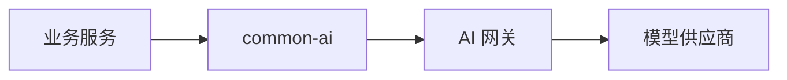

## AI 调用模块

---

### 一、定位

`common-ai` 是供 Java 业务服务依赖的公共 Jar，不是独立部署单元。它向业务服务提供统一的 AI 网关客户端和调用契约，屏蔽网络协议与公共接入细节。

业务服务通过 `common-ai` 调用 AI 网关，不直接持有模型供应商密钥，也不直接依赖供应商 SDK。

---

### 二、职责

`common-ai` 只承担客户端侧公共能力：

- 统一同步调用和流式调用入口
- 定义场景编码、请求、响应、用量和错误契约
- 透传业务标识、Trace ID、幂等键、工作流版本和 Prompt 版本
- 透传评审步骤、执行轮次、实验批次和策略运行等可选关联标识
- 透传质量批次、质量任务、质量策略、质量 rubric 和指标集版本
- 支持结构化输出约束的传递
- 使用有序内容块表达文本、图像、音频、文件引用和工具结果
- 声明请求必需的模态、流式、工具和结构化输出能力
- 将 AI 网关错误转换为统一异常
- 提供 Mock 客户端和测试替身

`common-ai` 不承担以下能力：

- 不保存模型供应商密钥
- 不直接调用模型供应商
- 不选择具体供应商和模型
- 不管理 Prompt
- 不编排 AI 工作流
- 不实现业务知识库和 RAG 管道
- 不统计全局 Token 和成本

---

### 三、调用关系

业务服务负责构造 Prompt、组织工作流和解释模型结果。`common-ai` 负责把标准调用请求可靠地发送给 AI 网关。AI 网关负责模型路由、供应商调用和统一治理。

---

### 四、核心契约

| 契约 | 作用 |
|------|------|
| AI 调用请求 | 携带场景、Prompt、模型参数、输出约束、工作流与业务追踪信息 |
| AI 调用响应 | 返回内容、模型信息、用量、耗时和调用记录标识 |
| 流式事件 | 统一表达内容增量、完成、异常和用量结算 |
| AI 错误 | 区分参数错误、限流、超时、供应商故障和网关故障 |
| Mock 客户端 | 在业务单元测试中返回固定结果，不产生真实模型费用 |

业务请求必须携带场景编码。场景编码表达业务用途，例如论文评审、改进建议和题目推荐，不绑定供应商或模型。

业务请求不传递供应商名称、模型标识和供应商特有参数。业务只声明输入内容和必需能力，具体模型由 AI 网关的场景路由决定。当候选模型不满足必需能力时，客户端获得明确的能力不匹配错误，不静默丢弃多模态内容。

响应中的用量使用可扩展分项表达标准输入、缓存输入、输出、推理和多模态用量。未返回的用量与数值为零必须可以区分。统一响应可返回预估成本和成本状态，但不将后续账单对账作为同步请求的前置条件。

---

### 五、稳定性边界

AI 网关负责供应商级重试、熔断和主备切换。`common-ai` 不重复实现供应商治理，避免同一次调用在客户端和网关两层叠加重试，造成调用放大与成本失控。

客户端只处理业务服务到 AI 网关之间的网络异常。带有幂等键的非流式请求可以进行一次短重试，其他请求直接返回统一错误，由业务工作流决定是否重新执行。

---

### 六、依赖边界

`common-ai` 可以被 assistant、review、suggestion 和其他 AI 业务服务依赖。AI 网关不依赖业务服务，也不依赖业务 Prompt。

供应商适配实现只存在于 AI 网关中，不能通过 `common-ai` 传递到业务服务，避免供应商 SDK 污染全部业务模块。

---

### 七、决策记录

| 决策 | 备选方案 | 结论与原因 |
|------|---------|-----------|
| `common-ai` 作为公共 Jar | 独立部署 `common-ai` | 公共模块只提供客户端契约，独立运行能力由 AI 网关承担 |
| 业务服务只调用 AI 网关 | 业务服务直接调用供应商 | 集中密钥、成本、路由和稳定性治理 |
| Prompt 留在业务服务 | Prompt 集中放入公共模块 | Prompt 属于业务规则，需要与工作流独立演进 |
| 供应商 SDK 留在 AI 网关 | 公共 Jar 集成全部供应商 SDK | 避免依赖膨胀和供应商实现泄漏 |
| RAG 不进入公共模块 | `common-ai` 统一实现 RAG | 知识来源、检索规则和质量标准具有业务语义 |
