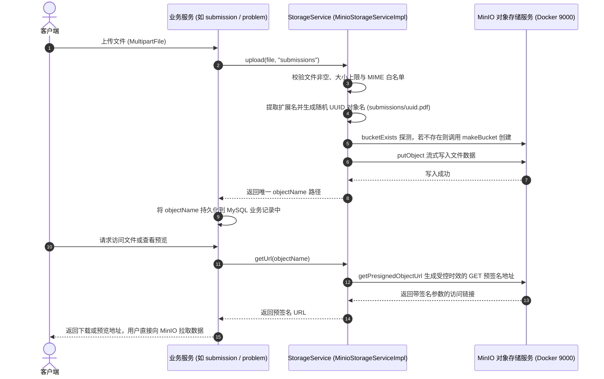

## 对象存储服务

### 一、目标与定位

在用户头像上传、赛事题目附件发布、论文作品提交以及 AI 论文解析与建议生成的业务链路上，均依赖对象存储能力。`common-core` 提供与底层供应商解耦的文件存储抽象 `StorageService`，并基于 MinIO 实现私有化对象存储方案。

核心职责包括：

1. 抽象统一的文件存储接口 `StorageService`，杜绝业务模块与具体 SDK 强绑定。
2. 基于 MinIO SDK 提供文件上传、流式下载、预签名临时访问链接生成与文件删除。
3. 约束文件重命名规则、MIME 类型白名单与路径目录划分。
4. 提供基于配置项的条件自动装配机制，无存储需求的服务零开销跳过。

---

### 二、存储交互时序与组件结构

---

### 三、核心设计细节

#### 3.1 StorageService 接口抽象

接口定义四个标准操作契约，使得后续若切换为阿里云 OSS、腾讯云 COS 或 AWS S3 时，只需增加新实现类，业务层完全无感知：

- `upload(MultipartFile file)`：默认上传至通用 `files` 目录。
- `upload(MultipartFile file, String prefix)`：按指定业务子目录上传，返回完整的 `objectName`。
- `download(String objectName)`：根据对象名读取输入流，用于后台任务处理（如 AI 评审下载 PDF 原文）。
- `getUrl(String objectName)`：获取带签名的临时访问 URL（Presigned URL），前端可直接拉取，不消耗业务服务带宽。
- `delete(String objectName)`：根据对象名物理删除文件。

#### 3.2 MinioStorageServiceImpl 实现规则

1. **防重命名与路径防穿透**：
   上传文件统一采用 `{prefix}/{UUID}.{扩展名}` 的模式存储。禁止直接使用前端上传的原始文件名作为存储键，避免同名文件覆盖，同时杜绝包含 `../` 的恶意路径遍历攻击。
2. **MIME 白名单与体积约束**：
   内置 `ALLOWED_CONTENT_TYPES` 白名单，覆盖常见图片（JPEG、PNG、GIF、WebP）、文档（PDF、DOCX、XLSX）及文本（TXT、Markdown）。在读取流前先行校验，防止可执行脚本或恶意可疑文件被注入存储桶。
3. **存储桶自适应探测**：
   在首次执行写入时自动检查目标 Bucket 是否存在；若未初始化则自动调用 `makeBucket` 创建，避免因运维人员漏建存储桶导致业务初次上传失败。
4. **预签名访问控制**：
   存储桶在生产配置下默认保持私有（Private）。外部读取必须通过 `getPresignedObjectUrl` 生成具备有限有效期（默认 7 天）的访问链接，过期后自动失效。

#### 3.3 条件自动装配机制

为避免无存储需求的服务（如 `ranking-service`、`gateway-service`）被强迫加载 MinIO 依赖：

1. `MinioConfig` 与 `MinioStorageServiceImpl` 均标注 `@ConditionalOnProperty(prefix = "minio", name = "enabled", havingValue = "true")`。
2. 仅当具体服务的 `application.yml` 中显式配置 `minio.enabled=true` 时，Spring 容器才会装配 `MinioClient` 和 `StorageService`。
3. 未开启该配置项的服务在启动时完全跳过该部分组件，保证启动速度与资源纯净度。

---

### 四、边界与设计取舍

1. **对象路径与真实 URL 分离**：业务数据库中只持久化相对的对象路径 `objectName`（例如 `papers/abcd.pdf`），绝不直接保存完整的绝对网络 URL。外部请求时动态生成预签名链接返回，确保 MinIO 外部域名、端口或 CDN 配置变更时无需修改数据库历史数据。
2. **分片大文件上传职责边界**：`StorageService` 负责标准单文件（通常 50MB 以内）的直接上传。超大论文作品（如 200MB 以上的分片分块上传与合并）由 `submission-service` 自行维护专用分片存储逻辑，不把复杂分片状态强行塞入通用底层接口。
