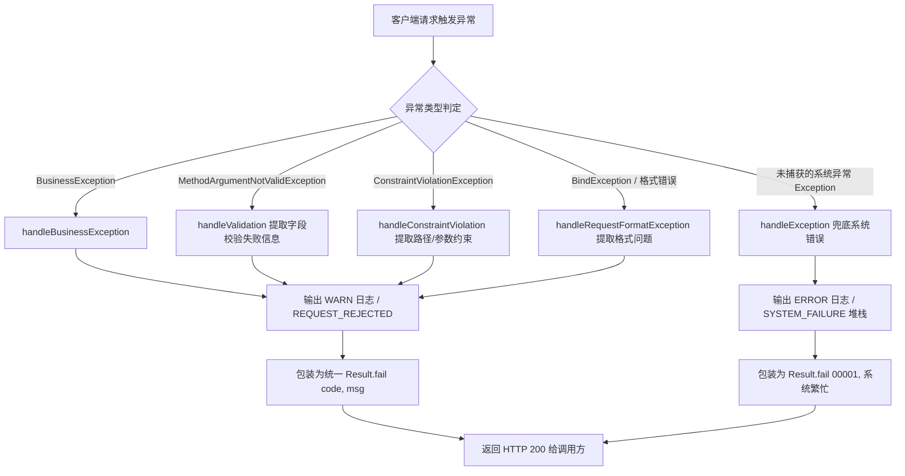

## 异常体系与全局拦截

### 一、目标与定位

`common-core` 提供全平台统一的错误码契约、业务异常抽象与全局异常处理器，确保微服务在处理异常时语义一致、日志规范且不向外泄露内部堆栈或数据库细节。

核心职责包括：

1. 制定分段式错误码规范与契约接口 `ErrorCode`。
2. 定义核心业务异常基类 `BusinessException`。
3. 实现统一的 `@RestControllerAdvice` 全局异常处理器 `GlobalExceptionHandler`。
4. 规范参数校验错误、请求格式异常与兜底未捕获异常的响应转换规则。

---

### 二、总体架构与异常流向

---

### 三、核心设计细节

#### 3.1 错误码规范与分段设计

错误码通过统一接口 `ErrorCode` 进行约定：

- `getCode()`：获取整型错误编码。
- `getMessage()`：获取默认错误提示文本。

系统按万位对错误码进行严格号段划分，保证跨服务排障时通过首位数字即可快速定位所属领域：

| 号段 | 归属领域 | 说明 |
|------|----------|------|
| `0xxxx` | 通用与系统级 | 框架、参数校验、网络与公共基础设施错误 |
| `1xxxx` | 用户与权限模块 | 登录态、账号状态、RBAC 角色等错误 |
| `2xxxx` | 团队模块 | 组队生命周期、成员名额、队长转移等错误 |
| `3xxxx` | 题目模块 | 赛事关联、题面附件、题目状态等错误 |
| `4xxxx` | 提交模块 | 作品提交流程、PDF 存储与版本锁定等错误 |
| `5xxxx` | 评审与建议模块 | AI 评审工作流、租约抢占与改进建议等错误 |
| `6xxxx` | 榜单模块 | 排行榜计算与快照查询等错误 |

`ErrorCodeEnum` 是 `common-core` 维护的基础枚举，覆盖核心系统级错误：

- `SUCCESS(0, "操作成功")`：通用成功状态。
- `SYSTEM_ERROR(1, "系统未知错误")`：系统兜底未知异常。
- `PARAM_INVALID(400, "参数错误")`：入参校验失败或格式错误。
- `UNAUTHORIZED(401, "未登录或登录已过期")`：身份认证缺失。
- `FORBIDDEN(403, "无权限操作")`：角色或权限不足。
- `NOT_FOUND(404, "资源不存在")`：目标实体未找到。
- `TOO_MANY_REQUESTS(429, "请求过于频繁")`：触发流控限制。

各业务微服务在自身内部创建特定领域的错误码枚举，实现 `ErrorCode` 接口并采用对应万位号段即可。

#### 3.2 BusinessException 业务异常设计

`BusinessException` 是系统唯一推荐在业务逻辑中主动抛出的运行时异常基类：

1. **携带结构化信息**：包含 `code` 与 `message` 字段，杜绝直接抛出裸 `RuntimeException`。
2. **支持消息重写**：支持传入动态参数格式化错误提示，覆盖枚举默认的通用文本。
3. **提供断言语法糖**：内置 `BusinessException.throwIf(boolean condition, ErrorCode errorCode)` 静态方法，避免在业务代码中充斥繁琐的 `if-throw` 代码块。

#### 3.3 GlobalExceptionHandler 拦截体系

`GlobalExceptionHandler` 直接位于 `com.leetmodel.common.core.exception` 包中，与 `BusinessException` 和 `ErrorCode` 形成同包高内聚，不设置孤立的单类子包。

通过 `@RestControllerAdvice` 注解声明，按照方法匹配优先级对异常进行分流处理：

1. **业务异常拦截**：
   捕获 `BusinessException`，日志记录事件码 `REQUEST_REJECTED` 与业务错误码，日志级别为 `WARN`，不打印多余的执行堆栈，最终返回 `Result.fail(e.getCode(), e.getMessage())`。
2. **字段参数校验拦截**：
   捕获 Spring 验证框架的 `MethodArgumentNotValidException`，从 `BindingResult` 中遍历所有 `FieldError`，将失败字段与错误描述拼接为分号分隔的字符串，返回错误码 `00400`。
3. **路径与单参数约束拦截**：
   捕获 `@PathVariable` 或 `@RequestParam` 触发的 `ConstraintViolationException`，提取去重后的违规提示返回 `00400`。
4. **请求解析与格式错误拦截**：
   合并拦截 `MethodArgumentTypeMismatchException`、`MissingServletRequestParameterException` 以及 `HttpMessageNotReadableException`，屏蔽底层反序列化异常细节，统一转为标准参数错误 `00400`。
5. **未受检异常兜底拦截**：
   捕获顶层基类 `Exception`，日志级别提升为 `ERROR`，记录事件码 `SYSTEM_FAILURE` 并输出完整异常堆栈。向前端返回 `Result.fail(ErrorCodeEnum.SYSTEM_ERROR)`，绝不将 SQL 报错、空指针堆栈等敏感实现暴露给外部。

---

### 四、边界与设计取舍

1. **分级日志策略**：业务校验失败和普通传参错误属于可预期的业务防御，使用 `WARN` 级别且不打印堆栈，防止无效堆栈日志占满存储空间；只有系统级未知异常才输出带堆栈的 `ERROR` 日志。
2. **安全隔离**：即使数据库连接超时或执行报底层 SQL 语法异常，全局异常处理器也会在最外层抹平细节，返回安全中立的系统错误提示，防止潜在攻击者探测内部表结构或驱动版本。
