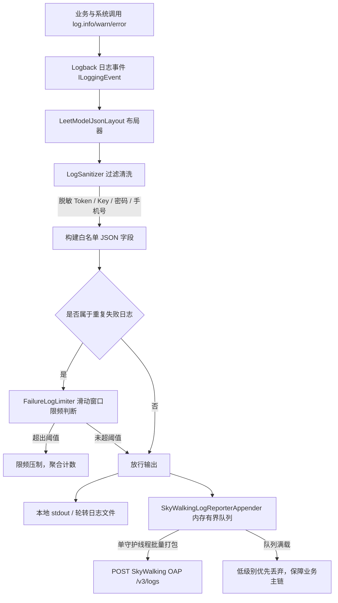

## 结构化日志与指标上报

### 一、目标与定位

`common-core` 提供生产级安全结构化日志与集中遥测基线，解决传统纯文本日志格式杂乱、难以检索、敏感信息泄露以及日志风暴拖垮系统的风险。

核心职责包括：

1. 实现 `leetmodel.log.v1` 白名单规范的结构化 JSON 日志布局。
2. 敏感凭证、密码、个人信息的运行时不可逆脱敏防护。
3. 相同故障突发时的滑动窗口日志限频机制。
4. 异步有界队列投递至 SkyWalking OAP 日志接收端点。
5. 规范 Prometheus 低基数指标标签策略与健康探针分组。

---

### 二、总体架构与日志流向

---

### 三、核心设计细节

#### 3.1 LeetModelJsonLayout 结构化布局

采用统一版本模式 `leetmodel.log.v1`，抛弃自由拼装格式，严格约束输出字段集合：

- **元数据字段**：`timestamp`（ISO-8601 标准时间）、`service`（服务名）、`environment`（环境标识）、`thread`（线程名称）、`level`（日志等级）。
- **链路字段**：`traceId`、`operationId`、`eventId` 等由 `CorrelationContext` 自动带出。
- **事件与错误字段**：`eventCode`（大写下划线稳定枚举事件码）、`failureCategory`、`errorCode`。
- **异常栈保护**：异常堆栈最大截断为 64 帧，且仅保留类名、方法名与行号位置，不打印可能夹带请求明文的异常原文本。

#### 3.2 LogSanitizer 不可逆脱敏器

日志输出前必须经过不可逆清洗，防止运维或日志采集系统暴露敏感信息：

1. **凭证脱敏**：匹配 `Authorization: Bearer <token>`、`X-Relay-Token`、`accessKey`、`secretKey` 等头部或参数，统一脱敏为掩码。
2. **个人信息脱敏**：对中国大陆 11 位手机号保留前后若干位，中间替换为星号；对邮箱地址只显示首字符与域名。
3. **控制字符清理**：消除换行符与非法不可见字符，防止日志伪造注入攻击。

#### 3.3 FailureLogLimiter 故障日志限频

在大规模故障场景（如数据库宕机或外部网络抖动）下，每秒可能产生数万条相同的异常日志，迅速占满服务器磁盘并产生 IO 瓶颈：

1. 限流器基于滑动窗口机制，按 `(eventCode, errorCode)` 组合作为限频键。
2. 当同一错误在窗口内出现频率超过配置上限时，暂时压制后续重复日志的控制台与文件写入。
3. 窗口重置或恢复正常时，输出一条合并统计日志，报告在被压制期间该错误的累计发生次数。

#### 3.4 SkyWalkingLogReporterAppender 异步上报

支持将结构化安全日志集中汇聚到 SkyWalking OAP 遥测后端：

1. **非阻塞投递**：业务线程仅将日志对象推入有界内存队列（默认上限 1024 条），避免远程 HTTP/gRPC 调用延迟拖慢业务响应。
2. **批处理消费**：后台守护线程按批次（如每批 50 条或间隔 500 毫秒）读取并调用 OAP `/v3/logs` 端点。
3. **背压与降级**：当远程 OAP 服务不可用或队列写满时，优先丢弃 DEBUG 与 INFO 级别日志，严格保护 ERROR 级别日志并记录丢弃指标，绝不阻断业务执行。

#### 3.5 指标与健康策略配置

通过 `ObservabilityHealthAutoConfiguration` 与 `MetricPolicyAutoConfiguration` 规范生产观测：

1. **健康检查三级分组**：
   - `liveness`：仅包含进程存活探针，不校验远程依赖，防止因外力抖动导致 K8s 误杀容器。
   - `readiness`：包含数据库与核心存储就绪探针，未就绪时不导入外部流量。
   - `degraded`：包含缓存、MQ、降级模式探针，供运维告警和排障感知。
2. **Prometheus 低基数约束**：全局配置 `MetricTagPolicy`，强制去除包含用户 ID、题目 ID、URL 动态参数的高基数标签，仅保留路由模板与服务名，保护 Prometheus 内存安全。

---

### 四、边界与设计取舍

1. **日志不充当审计凭证**：日志作为运维诊断与链路排障的辅助手段，可以容忍极端负载下的丢弃与限流；不可丢失的重要业务行为必须写入业务数据库的审计表或专用审计消息队列，不能依赖日志做对账。
2. **业务内容不入公共日志**：Prompt 完整内容、论文原始 PDF 文本、AI 大模型生成的完整回答等大文本，严禁打入公共日志字段，避免产生过大存储开销与知识产权合规风险。
