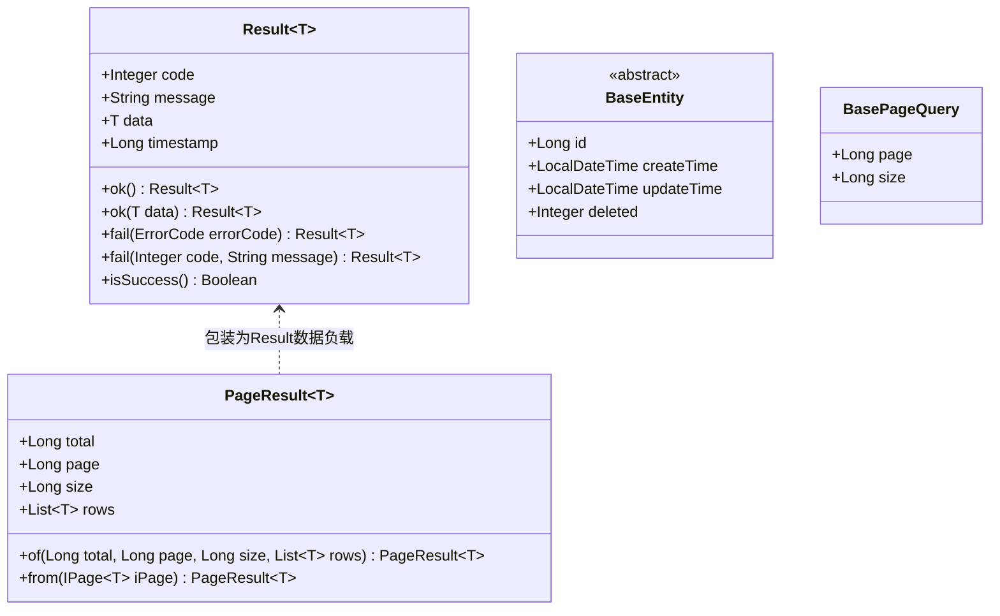

## 统一响应与数据契约

### 一、目标与定位

`common-core` 提供全平台统一的数据载体、序列化规则、数据库基础实体和统一响应结构，避免各个微服务重复定义响应结构或在数据序列化上产生分歧。

核心职责包括：

1. 统一接口响应体 `Result` 与分页响应 `PageResult`。
2. 统一分页查询基类 `BasePageQuery` 与持久化实体基类 `BaseEntity`。
3. 统一 Jackson 时间与时区全局序列化策略。
4. 统一 MyBatis-Plus 分页拦截与时间戳自动填充机制。

---

### 二、总体组件结构

---

### 三、核心设计细节

#### 3.1 Result 统一响应结构

所有对外 HTTP 接口与微服务间 Feign 接口均返回统一的 `Result<T>` 泛型包装对象。

包含以下固定字段：

- `code`：状态码，整型。数值 0 代表业务执行成功，非 0 代表特定业务或系统错误。
- `message`：提示消息，字符串。成功时为操作提示，失败时为错误描述。
- `data`：响应数据载荷，泛型对象。操作成功时携带具体业务数据，失败时通常为 null。
- `timestamp`：响应生成的时间戳，毫秒值，便于日志检索与时间线对齐。

关于 `isSuccess` 方法的处理：

代码中提供 `isSuccess()` 语法糖方法，供服务调用方快速判断响应状态。该方法标注了 `@JsonIgnore`，防止 Jackson 序列化时生成多余的 `success` 字段，保证网络传输体严格保持四个标准字段。

#### 3.2 PageResult 分页响应

分页列表查询使用 `PageResult<T>` 进行二次包装，作为 `Result<PageResult<T>>` 的数据载荷输出。

包含以下固定字段：

- `total`：符合查询条件的总记录数。
- `page`：当前页码，从 1 开始。
- `size`：当前每页数量。
- `rows`：当前页的数据记录集合。

模块内提供静态方法 `from(IPage<T> iPage)`，能够直接将 MyBatis-Plus 的分页对象无缝转换为领域 `PageResult`，阻断持久层特定框架对象向传输层外溢。

#### 3.3 BasePageQuery 分页请求基类

所有支持分页的查询入参 DTO 均继承 `BasePageQuery`（位于 `com.leetmodel.common.core.bean` 包）。

- `page`：页码，默认值为 1，最小约束为 1。
- `size`：每页大小，默认值为 10，最大约束为 100，防止调用端单次拉取海量数据导致内存溢出。

#### 3.4 BaseEntity 实体抽象基类

所有映射数据库表的领域持久化实体均继承 `BaseEntity`（位于 `com.leetmodel.common.core.bean` 包），统一承载公共运维字段：

- `id`：主键 ID，采用 64 位雪花算法生成，对应数据库无符号 bigint。
- `createTime`：数据创建时间，在记录插入时由系统自动填充。
- `updateTime`：数据最后更新时间，在记录插入和更新时由系统自动填充。
- `deleted`：逻辑删除标记，数值 0 代表正常，数值 1 代表已删除。

#### 3.5 MyBatis-Plus 自动装配规范

`MybatisPlusConfig` 统一配置分页行为与审计填充：

1. **分页拦截器**：注册 `PaginationInnerInterceptor(DbType.MYSQL)`，拦截执行器动态生成带 `LIMIT` 与 `OFFSET` 的方言 SQL。
2. **自动填充器**：实现 `MetaObjectHandler`，在执行新增操作时自动填充 `createTime` 与 `updateTime`，在执行更新操作时仅当字段未被显式修改时自动刷新 `updateTime`。
3. **装配条件保护**：配置类标注 `@ConditionalOnClass(MybatisPlusInterceptor.class)`。对于不包含数据库依赖的网关服务或轻量组件，跳过相关自动装配，防止类加载阶段报错。

#### 3.6 Jackson 全局序列化规范

`JacksonConfig` 统一全系统 JSON 编解码标准：

1. **时间格式化**：`LocalDateTime` 统一格式化为 `yyyy-MM-dd HH:mm:ss`；`LocalDate` 统一为 `yyyy-MM-dd`；`LocalTime` 统一为 `HH:mm:ss`。
2. **全局时区**：统一绑定为 `Asia/Shanghai`，消除容器环境与宿主机时区不一致导致的计算偏差。
3. **定制器机制**：通过实现 `Jackson2ObjectMapperBuilderCustomizer` 向容器追加规则，而不是直接覆盖容器的 `ObjectMapper`，从而保留 Spring Boot 官方默认的其他反序列化特性。

---

### 四、边界与设计取舍

1. **不使用 HTTP 状态码表达业务错误**：除未认证和权限拒绝由网关或安全拦截器映射到 401 与 403 外，正常业务逻辑执行结果均返回 HTTP 200，具体业务失败通过 `code` 和 `message` 表达。这样设计能够防止上层调用链路误判为网络故障并触发无意义的网关重试。
2. **实体与传输对象严格分离**：`BaseEntity` 仅服务于微服务内部 Mapper 和数据库映射，严禁直接作为 Controller 返回对象输出给前端或作为 Feign 接口入参，所有外部暴露均通过 DTO 或 VO 转换。
